# Project 01 — Evidence Acquisition & Integrity

**Status:** 🟡 Four labs done with real evidence · re-run of the container integrity test, hash values for the before/after images and chain-of-custody entries shown as a simulated walkthrough (marked *(sim)*)
**Track:** Lab Foundation

## Objective
Show that evidence can be acquired, verified and handled in a way that would stand up in court: hashes prove integrity, any change is detectable, acquisition captures system changes, and independent tools agree on the result.

## Labs
| Lab | Question | Tools | Evidence |
|---|---|---|---|
| 1 | Does a one-word edit change a file's hash? | WinHex | Real |
| 2 | What happens to a container's integrity when it is modified? | md5sum, mount, ExifTool | Real (with corrections) + redo *(sim)* |
| 3 | Can disk imaging capture software installed on a system? | FTK Imager, OSForensics, VMware | Real |
| 4 | Do two independent tools agree on an evidence image's hash? | FTK Imager, Autopsy | Real |

## Environment
| Item | Value |
|---|---|
| Case ID | `CB-01-0001` |
| Windows workstation | FTK Imager 3.1.2.0, WinHex, OSForensics, Autopsy 4.21.0 |
| Linux workstation | Kali Linux, coreutils (`md5sum`, `sha256sum`), ExifTool 12.70 |

---

# Lab 1 — Hash sensitivity (WinHex)

**Method:** compute the SHA-1 of a Word document, change one word in its title, save, and compute the SHA-1 again.

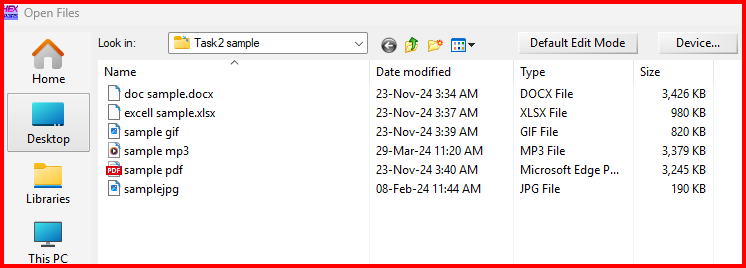
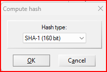

| Stage | Title in document | SHA-1 of `doc sample.docx` |
|---|---|---|
| Before | "Digital Forensics **Investigation** Report" | `7514C185355377DD82125C8CA40A882A768AA643` |
| After | "Digital Forensics Report" | `FE7188BA5A12514CB144F210A05D851B10277004` |

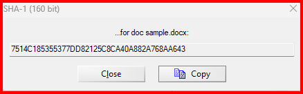
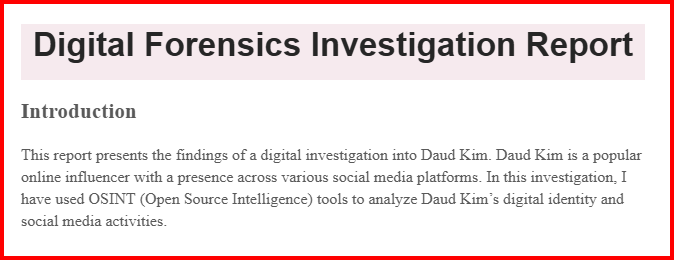
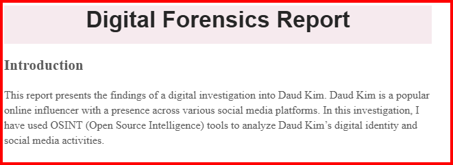
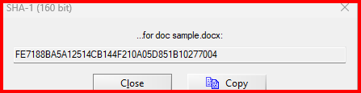

**Result:** removing one word produced a completely different hash. This is the avalanche property: any change, however small, is detectable, which is why evidence is hashed at acquisition and re-hashed before and after analysis.

> For new work, use **SHA-256** (with MD5 kept only for compatibility). SHA-1 is still fine for detecting accidental change but is no longer collision-resistant.

---

# Lab 2 — Container integrity (`.eve` file)

## What was done (real)
```bash
echo "Hello, this is a new line in the file." >> hello.txt
md5sum ~/Desktop/C1Prj02.eve > before_checksum.txt
cp hello.txt C1Prj02.eve
md5sum ~/Desktop/C1Prj02.eve > after_checksum.txt
exiftool C1Prj02.eve > metadata.txt
```
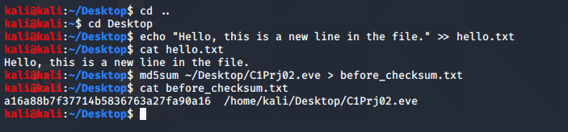
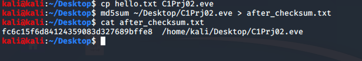
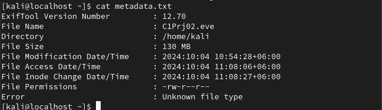

| Stage | MD5 of `C1Prj02.eve` |
|---|---|
| Before | `a16a88b7f37714b5836763a27fa90a16` |
| After | `fc6c15f6d84124359083d327689bffe8` |

| ExifTool field | Value |
|---|---|
| File size | 130 MB |
| Modify | 2024-10-04 10:54:28 +06:00 |
| Access | 2024-10-04 11:08:06 +06:00 |
| Inode change | 2024-10-04 11:08:27 +06:00 |
| Permissions | -rw-r--r-- |
| Error | **Unknown file type** |

## What the evidence actually shows
1. **The file was overwritten, not modified.** `cp hello.txt C1Prj02.eve` replaces the whole 130 MB container with the 39-byte text file. The hash changed because the original evidence was destroyed, not because a file was added inside it.
2. **The metadata belongs to a different copy.** ExifTool read `/home/kali/C1Prj02.eve` (on another host prompt, `kali@localhost`) with a size of 130 MB, so it was run on an untouched copy, not on the overwritten Desktop file.
3. **The container format was never identified.** ExifTool reports "Unknown file type", so the claim that the file was "corrupt" is untested. The next step is `file C1Prj02.eve` and `xxd C1Prj02.eve | head` to read its signature.
4. **Only MD5 was used.**

## Correct procedure (Simulated Walkthrough)
> ⚠️ **Simulated data** below *(sim)*: hash values are placeholders until the procedure is re-run.

```bash
# 1. Identify and hash the original, then work only on a copy
file C1Prj02.eve; xxd C1Prj02.eve | head -n 4
{ md5sum C1Prj02.eve; sha256sum C1Prj02.eve; } | tee evidence/01_original.txt
cp --preserve=all C1Prj02.eve working_copy.eve

# 2. Read-only mount of the original (expect: hash unchanged)
sudo mount -o loop,ro,noexec,noload C1Prj02.eve /mnt/eve_ro && sudo umount /mnt/eve_ro
sha256sum C1Prj02.eve | tee evidence/02_after_ro_mount.txt

# 3. Read-write change on the working copy only (expect: hash changes)
sudo mount -o loop working_copy.eve /mnt/eve_rw
echo "tamper test" | sudo tee /mnt/eve_rw/hello.txt
sudo umount /mnt/eve_rw
sha256sum working_copy.eve | tee evidence/03_after_rw_change.txt
stat C1Prj02.eve working_copy.eve > evidence/04_stat.txt
```
Script: [`scripts/integrity-test.sh`](scripts/integrity-test.sh)

| Stage | File | SHA-256 | Changed? |
|---|---|---|---|
| Original | C1Prj02.eve | `SIM-SHA256-ORIGINAL` | — |
| After read-only mount | C1Prj02.eve | `SIM-SHA256-ORIGINAL` | No *(sim)* |
| After read-write change | working_copy.eve | `SIM-SHA256-MODIFIED` | Yes *(sim)* |

> `noload` stops ext3/ext4 from replaying the journal on mount, which would otherwise write to the image even when mounted `ro`.

---

# Lab 3 — Detecting software installation through imaging

**Method:** image the J: volume with FTK Imager, examine it in OSForensics, install VMware Workstation 16 Pro to `J:\VMware 16 Pro`, image the volume again and compare.

| Step | Detail |
|---|---|
| Image 1 (before) | Source `J:\` → `D:\Image\14` |
| Install | VMware Workstation 16 Pro → `J:\VMware 16 Pro\` |
| Image 2 (after) | Source `J:\` → `F:\New folder (2)\14 -2`, started 13 Dec 2024 ~20:11 |

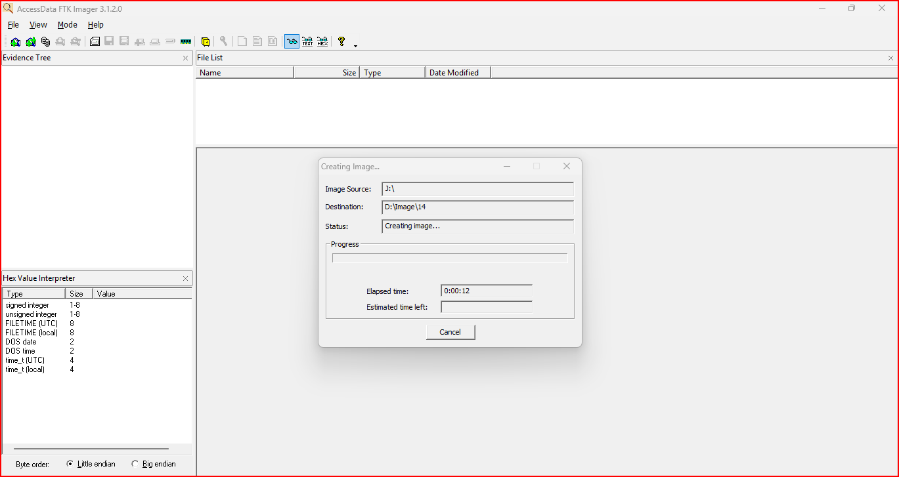
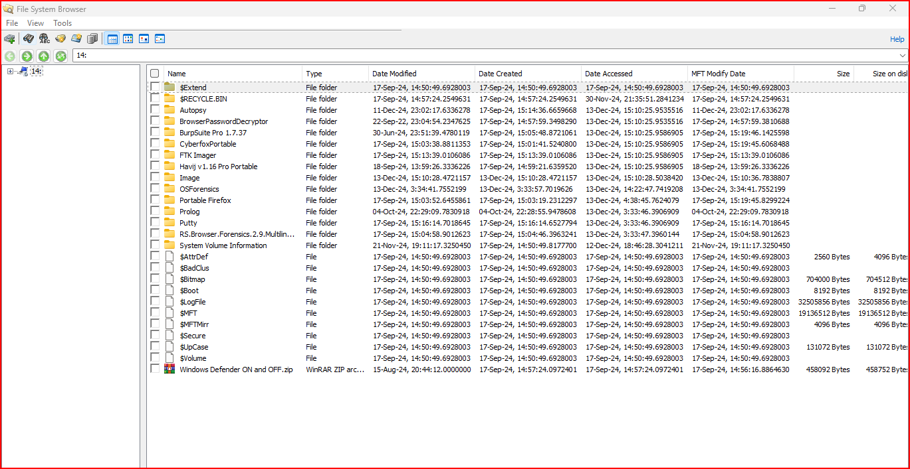
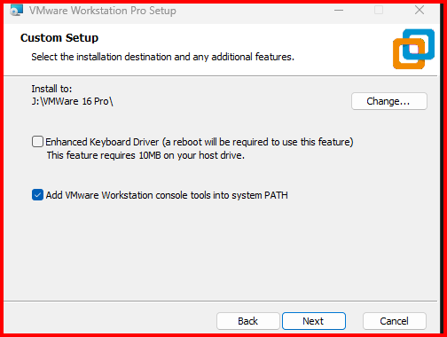
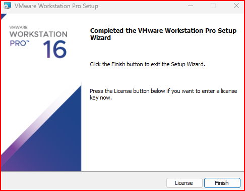
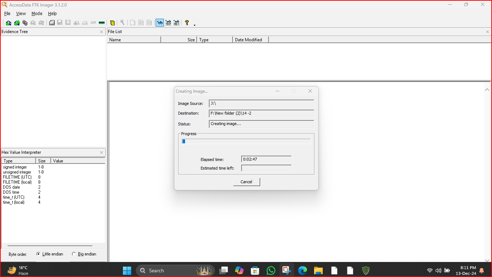
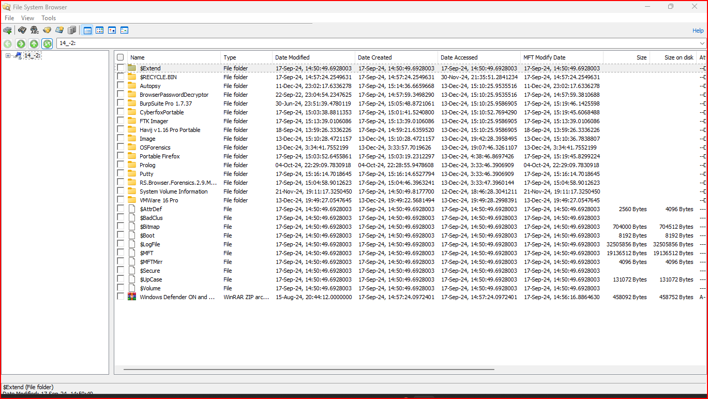
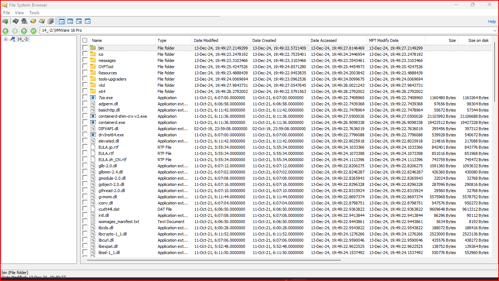

**Result:** the second image contains a new folder `VMware 16 Pro` with subfolders `bin`, `ico`, `messages`, `OVFTool`, `Resources`, `tools-upgraders`, `vkd` and `x64`, all created **13 Dec 2024 between 19:49:22 and 19:49:28**. The six-second creation window is the footprint of a single installer run. The program files themselves carry 2021 modification dates (the vendor's build dates), which shows why **Created** time, not Modified, dates an installation.

**Evidence that should be added for a complete VM-detection case**
| Artefact | Location | What it proves |
|---|---|---|
| Uninstall key | `SOFTWARE\WOW6432Node\Microsoft\Windows\CurrentVersion\Uninstall\{VMware…}` | Install date and version |
| Services | `SYSTEM\CurrentControlSet\Services\VMAuthdService`, `VMnetDHCP`, `VMware NAT Service` | VMware services registered |
| Virtual adapters | VMnet1 / VMnet8 network adapters | Host-only and NAT networks exist |
| VM files | `*.vmx`, `*.vmdk`, `*.nvram`, `vmware.log` | Actual virtual machines created or run |
| Prefetch | `VMWARE.EXE-*.pf` | VMware was executed |

**Hashes of the two images** *(sim)*
| Image | MD5 | SHA-1 | Verified |
|---|---|---|---|
| `D:\Image\14` | `SIM-MD5-BEFORE` | `SIM-SHA1-BEFORE` | ✅ *(sim)* |
| `F:\New folder (2)\14 -2` | `SIM-MD5-AFTER` | `SIM-SHA1-AFTER` | ✅ *(sim)* |

**Method notes**
- This was a **logical** image of the J: volume. A physical image of the whole disk also captures unallocated space and partition structures.
- Forensic tools (FTK Imager, OSForensics, Autopsy) were stored on the volume being imaged, so their own files appear in the evidence. In a real case, run tools from external media and write images to a separate drive.

---

# Lab 4 — Dual-tool verification (Operation Redbridge E01)
The image `Operation Redbridge 2024 AXA-3.E01` was opened in **FTK Imager** and in **Autopsy**, and both tools independently computed its hashes.

| Field | Value |
|---|---|
| Case / exhibit | Op Redbridge 2024 / AXA/3 |
| Examiner | A. Adam Adamson |
| Notes | "Imaged with Tableau 1234a" (hardware write-blocker) |
| Acquired with | ADI 4.3.0.18 on Win 201x |
| Acquire date | 15 Feb 2024 19:32:38 |
| Sectors | 4,171,754 × 512 bytes |
| **MD5** | `ffb786b6aef1ebc8b6a261f749d9ecb0` |
| **SHA-1** | `c14d0cc6b41226a448df03a8456405218b4e930f` |
| FTK Imager result | Match |
| Autopsy result | Same MD5 and SHA-1 |

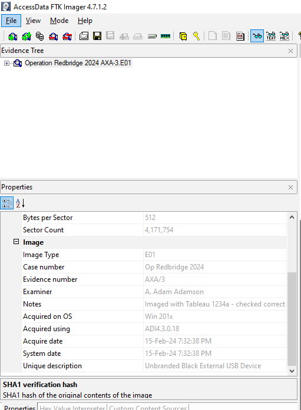
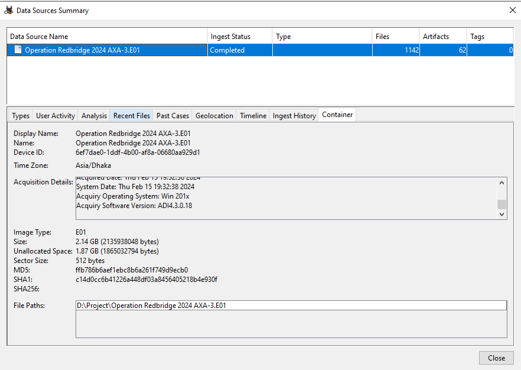
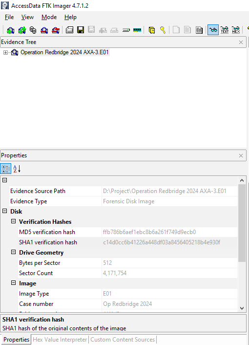

**Result:** two independent tools produce identical hashes, which is stronger evidence of integrity than one tool verifying itself.

**Discrepancy found:** the E01 header records acquisition on **15 Feb 2024**, but the case notes say the drive was seized on **16 Feb 2024**. One of the dates is wrong (workstation clock or recording error) and must be explained in the chain of custody.

## Chain of custody — AXA/3 (example)
Template: [`../../templates/chain-of-custody.md`](../../templates/chain-of-custody.md)

| # | Date / time | Released by | Received by | Action | Hash verified |
|---|---|---|---|---|---|
| 1 | 16 Feb 2024 (case notes) | DC Ahmed | Exhibits officer *(sim)* | Seizure from suspect's sofa, bagged and sealed | — |
| 2 | 15 Feb 2024 19:32 (E01 header) | Exhibits officer *(sim)* | A. Adam Adamson, CFU | Imaged with Tableau write-blocker | MD5/SHA-1 recorded |
| 3 | *(sim)* | CFU evidence store | Analyst (CB-01) | Working copy issued | ✅ FTK + Autopsy match |

> Entry 2 predates entry 1: this is the discrepancy above and must be resolved before the evidence is relied on.

---

## Problems Encountered
| Problem | What happened | Fix | Lesson |
|---|---|---|---|
| Evidence overwritten | `cp hello.txt C1Prj02.eve` replaced the container | Work on a copy; mount the original read-only | Never write to original evidence |
| Inconsistent file name | Report used `C1Prj01.eve` and `C1Prj02.eve` | Single name throughout | Evidence identifiers must be consistent |
| Before and after hashes mixed up | Text said the after-hash equalled the before-hash | Took values from the screenshots | Copy values from tool output, never retype |
| Metadata from a different copy | ExifTool run on `/home/kali` copy | Record the full path and host for every command | Know exactly which file each result describes |
| "Corrupt" without proof | No signature check | `file` / `xxd` first | Identify the format before judging it |
| Tools on the imaged volume | Analyst tools became part of the evidence | Use external media for tools and output | Minimise the examiner's footprint |
| No hashes for the Lab 3 images | Images not verified | Verify every image after creation | An image without a hash is not evidence |

## Findings
| # | Finding | Confidence |
|---|---|---|
| 1 | A one-word change alters the SHA-1 completely | High |
| 2 | The `.eve` hash changed because the file was overwritten, not because content was added | High |
| 3 | Imaging before and after installation captures the VMware folder created on 13 Dec 2024 19:49 | High |
| 4 | FTK Imager and Autopsy agree on the Redbridge E01 hashes | High |
| 5 | Redbridge acquisition date precedes the recorded seizure date | High |

## Deliverables
- [x] Hash sensitivity lab
- [x] Container integrity lab with corrected interpretation
- [x] Before/after imaging lab
- [x] Dual-tool verification
- [x] Chain-of-custody example
- [ ] Re-run Lab 2 with `scripts/integrity-test.sh` and replace *(sim)* hashes
- [ ] Hash the two Lab 3 images and add registry/service evidence of VMware

## Key Learnings
1. Hash at acquisition, verify with a second tool, and re-hash before and after analysis.
2. Mount read-only, work on copies, and keep the examiner's tools off the evidence.
3. Created timestamps date an installation; Modified timestamps often date the vendor's build.
4. Record date/time discrepancies in the chain of custody instead of ignoring them.
