# Project 11 — Windows Disk Forensics

**Status:** 🟡 Part A (Autopsy analysis) complete with real evidence · Part B (execution artifacts & timeline) shown as a simulated walkthrough
**Track:** DFIR

## Objective
Reconstruct user and attacker activity on a Windows server from a disk image: what ran, what was opened, when, and by whom.

## Scenario
A domain controller belonging to a small organisation is suspected of being involved in the theft of confidential files. A forensic copy of the server's C: drive (E01) was provided. The task is to identify the system and its accounts, the sensitive files that were accessed, connected devices, network/browser activity and any evidence linked to a named suspect, and to build a timeline an investigating officer can rely on.

> Evidence source: public training image from DFIR Madness, "The Stolen Szechuan Sauce" case (DC01). All analysis below is my own.

## Environment
| Item | Value |
|---|---|
| Case ID | `CB-11-0001` |
| Analyst workstation | Windows (fill in version) |
| Tools | Autopsy 4.21.0, Registry Viewer, FTK Imager, WinHex; EZ Tools + KAPE (pending) |
| Evidence | `20200918_0347_CDrive.E01` |
| Time zone used in this report | **UTC**. Autopsy displayed UTC+06:00 (BDT); all times below are converted by subtracting 6 hours. |

## Evidence Inventory
| Item | Size | MD5 | SHA-256 | Source | Verified |
|---|---|---|---|---|---|
| 20200918_0347_CDrive.E01 | ___ | ___ | ___ | DFIR Madness | ☐ FTK Imager "Verify Drive/Image" |

---

## Step 1 — Case creation and data source
The E01 was added to a new Autopsy case with default ingest modules.

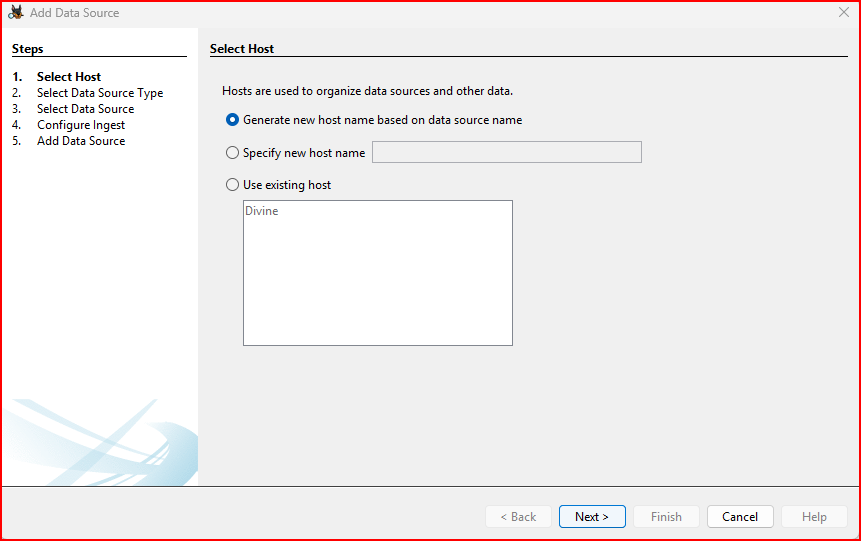
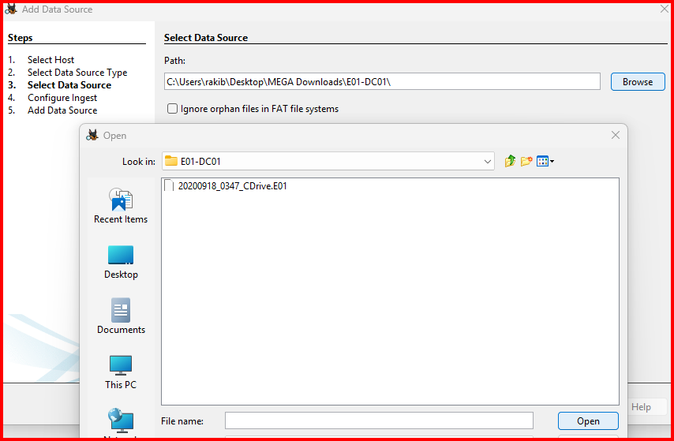

## Step 2 — Disk layout
| Volume | File system | Start sector | Length (sectors) | Size | Role |
|---|---|---|---|---|---|
| vol1 | Unallocated | 0 | 2,048 | 1 MB | MBR + alignment gap |
| vol2 | NTFS (0x07) | 2,048 | 716,800 | 350 MB | System Reserved (boot) |
| vol3 | NTFS (0x07) | 718,848 | 22,872,064 | ~10.9 GB | Windows (C:) |
| vol4 | Unallocated | 23,590,912 | 2,048 | 1 MB | Trailing gap |


The root of vol3 contains a non-standard folder **`C:\FileShare`** (created 2020-09-18 04:48:11 UTC, last modified 2020-09-19 03:34:18 UTC), which becomes central to the case.

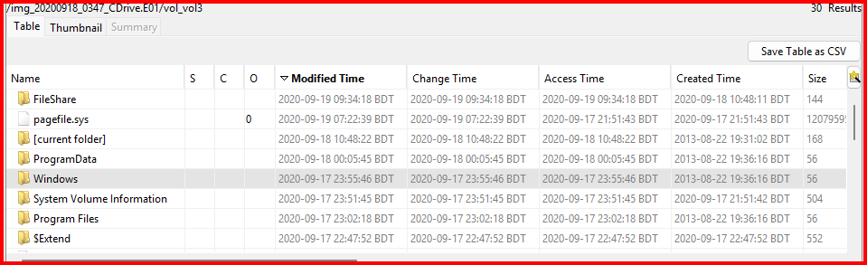

## Step 3 — System identification
| Property | Value | Source |
|---|---|---|
| Computer name | **CITADEL-DC01** | SYSTEM / SOFTWARE hives |
| Domain | **C137.local** | SYSTEM / SOFTWARE hives |
| Operating system | Windows Server 2012 R2 Standard Evaluation | SOFTWARE\Microsoft\Windows NT\CurrentVersion |
| Product ID | 00252-10000-00000-AA228 | SOFTWARE |
| Architecture | AMD64 | SYSTEM\...\Session Manager\Environment |
| Platform | VMware Virtual Platform (VMware, Inc.) | SYSTEM\HardwareConfig |
| BIOS | Phoenix Technologies 6.00, 07/22/2020 | SYSTEM\HardwareConfig |
| Boot device | multi(0)disk(0)rdisk(0)partition(2) | SYSTEM\ControlSet001\Control |

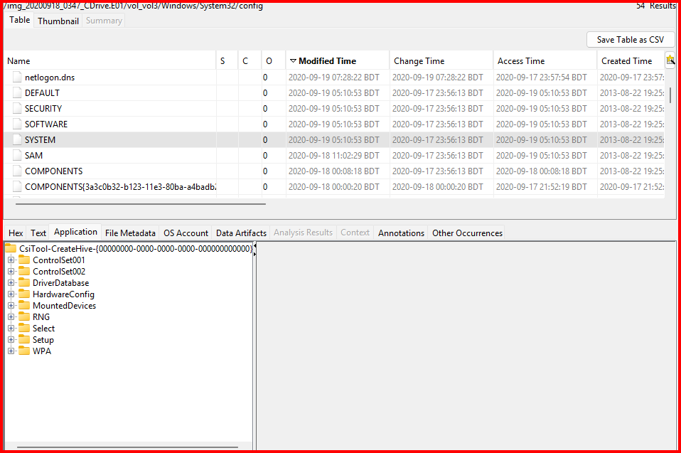
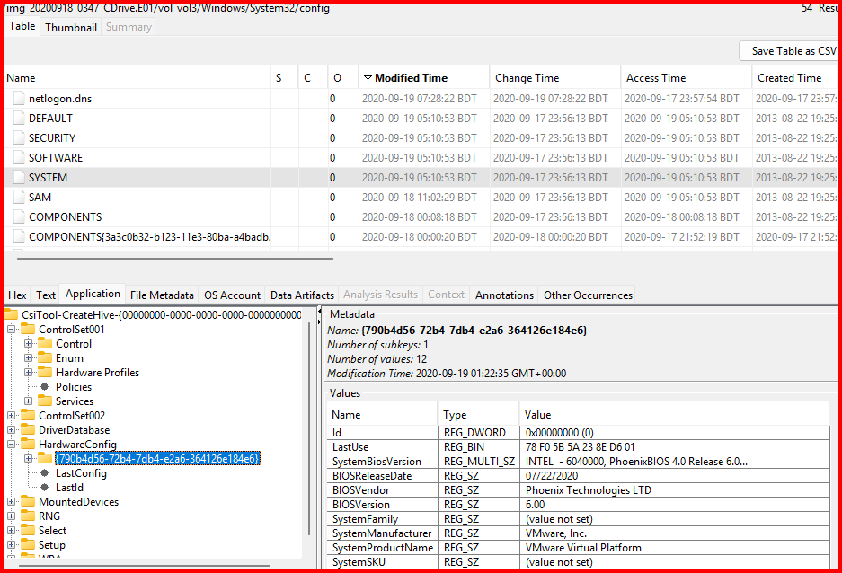
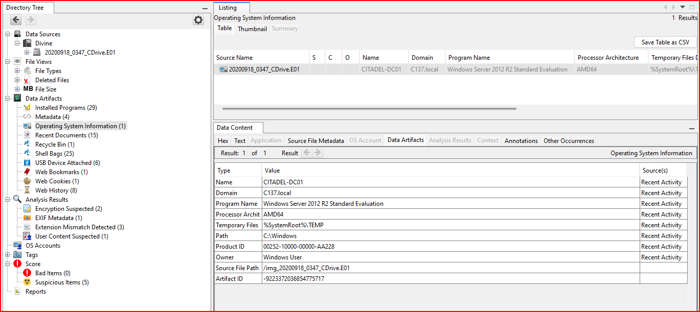
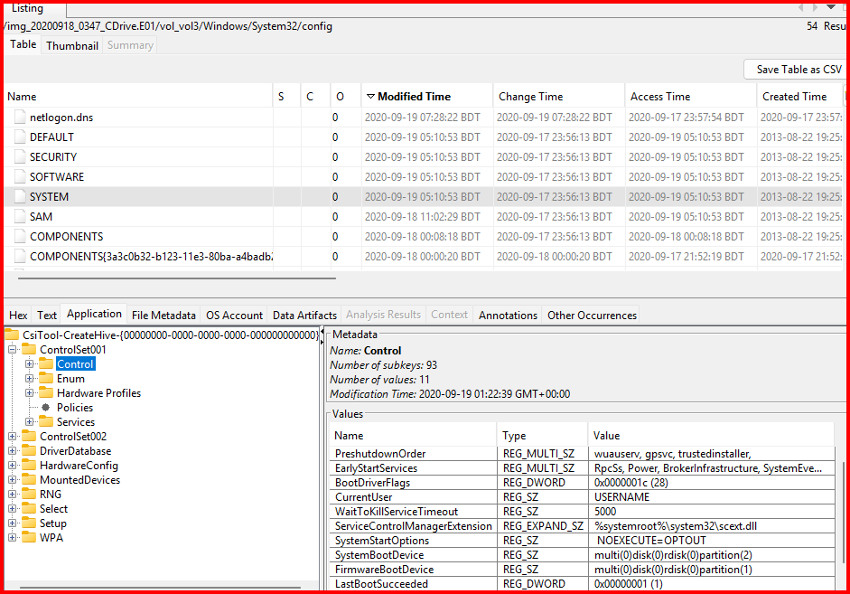
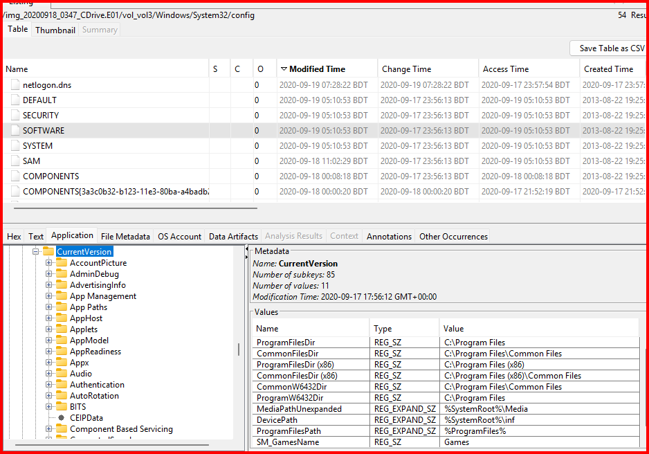

**Interpretation:** the evidence is a virtualised **domain controller** (`netlogon.dns` present, `ntds` folder exists). Because it is a server OS, **Prefetch is disabled by default**, so program-execution evidence must come from Amcache, Shimcache and event logs.

## Step 4 — User profiles
`C:\Users` contains: **Administrator**, Default, Default User, Public, All Users.

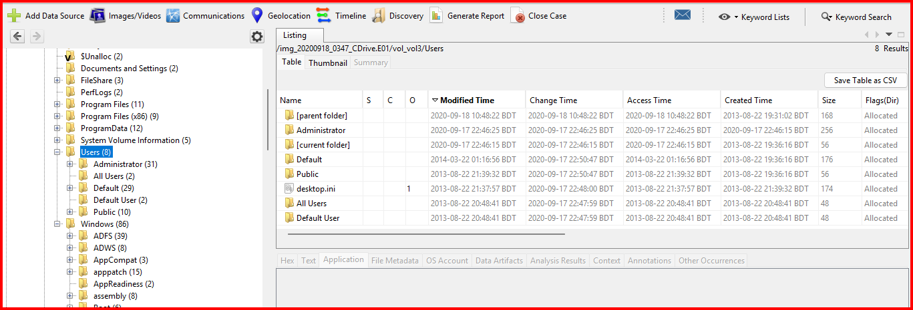

| Profile | Type | Notes |
|---|---|---|
| Administrator | Interactive account | The only real user profile. NTUSER.DAT last written 2020-09-19 03:57:40 UTC. |
| Default / Default User | Profile template, not a logon account | Used to build new profiles; contains only default settings (TEMP/TMP paths, WindowsLogon sound). No logon history exists for it. |
| Public / All Users | Shared folders / legacy junction | Not accounts |

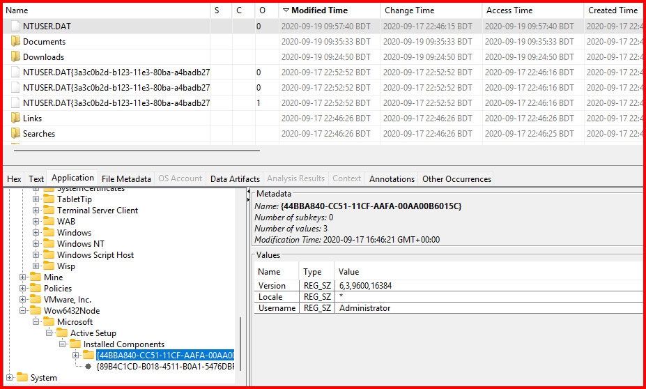
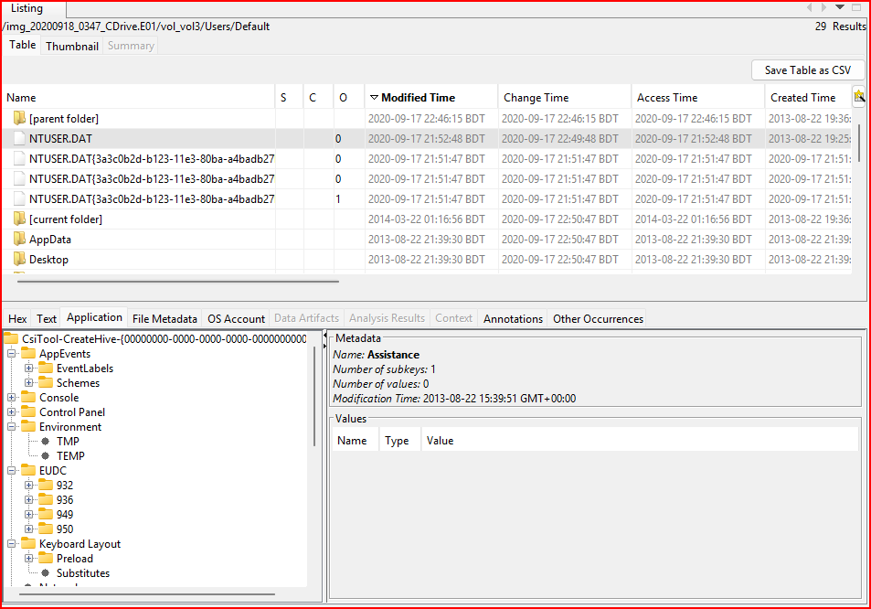
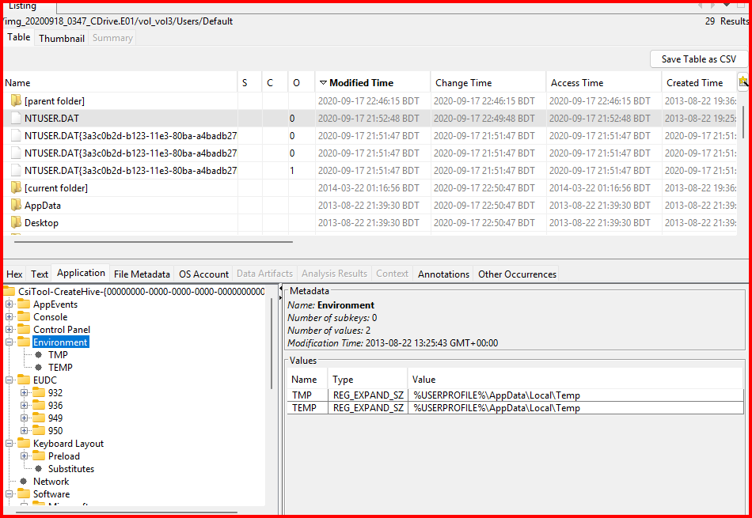

> Domain accounts on a DC are stored in `C:\Windows\NTDS\ntds.dit`, not SAM. **To do:** extract account list and last-logon times from ntds.dit / Security event log 4624.

## Step 5 — Registry hive findings
| Hive | Finding | Significance |
|---|---|---|
| SYSTEM | Computer name, virtual hardware, boot partition, service shutdown order | System profiling |
| SOFTWARE | OS build, program paths, VMware components | System profiling |
| SECURITY | `Policy\Secrets` contains **`$MACHINE.ACC`, `DefaultPassword`, `DPAPI_SYSTEM`, `NL$KM`**. `DefaultPassword\CurrVal` holds encrypted data. | `DefaultPassword` is the **AutoLogon password stored as an LSA secret**; anyone with the SYSTEM and SECURITY hives can decrypt it offline. `NL$KM` is the key protecting cached domain credentials. High-value credential material on a DC. |
| SAM | `Domains\Account` (`C` value, `ServerDomainUpdates`), `LastSkuUpgrade`, `RXACT` | Local account database. On a DC, local SAM is only used for DSRM; domain accounts are in ntds.dit. |
| DEFAULT | Default UI settings and TEMP/TMP paths | No investigative value |
| NTUSER.DAT (Administrator) | MMC MRU: `dsa.msc` (AD Users & Computers), `gpmc.msc` (Group Policy Management) | Administrator used AD and GPO consoles |

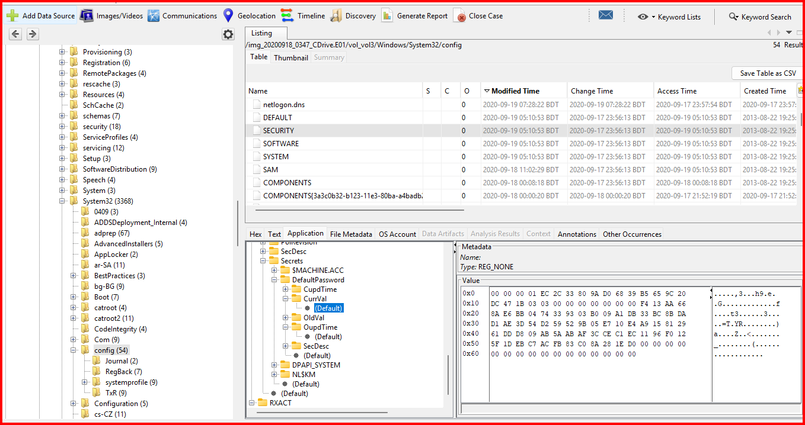
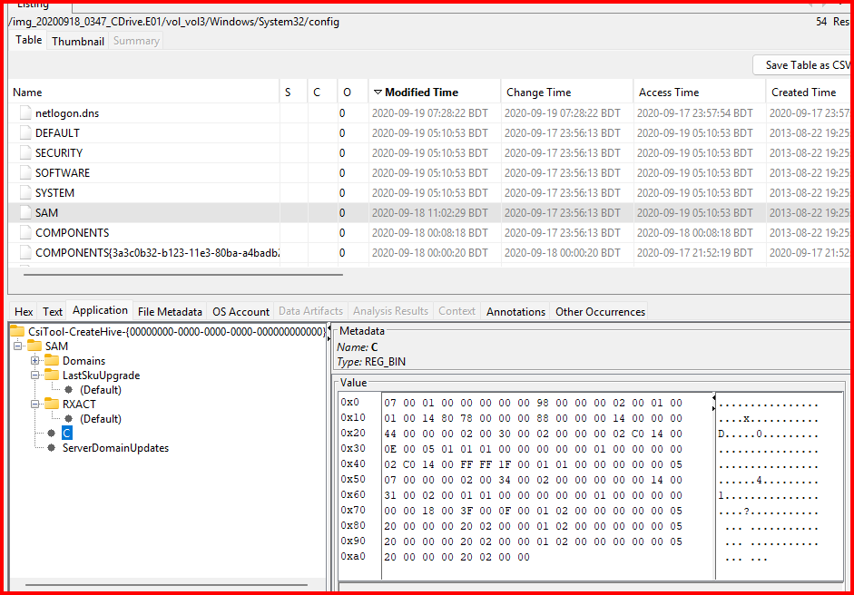
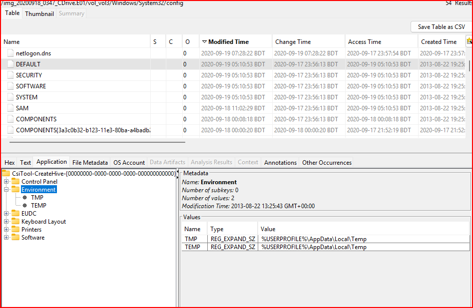

## Step 6 — USB devices (SYSTEM\Enum\USB, USBSTOR)
| Device | Make | Device ID | First seen (UTC) |
|---|---|---|---|
| ROOT_HUB | — | 5&3bb57b&0 | 2020-09-19 01:22:38 |
| ROOT_HUB20 | — | 5&6106580&0 | 2020-09-19 01:22:38 |
| ROOT_HUB30 | — | 5&d01e486&0&0 | 2020-09-19 01:22:38 |
| Virtual Mouse | VMware, Inc. | 6&a693ed3&0&5 | 2020-09-19 01:22:39 |
| Virtual Mouse | VMware, Inc. | 7&d3efc8d8&0&0000 | 2020-09-19 01:22:39 |
| Virtual Mouse | VMware, Inc. | 7&d3efc8d8&0&0001 | 2020-09-19 01:22:39 |

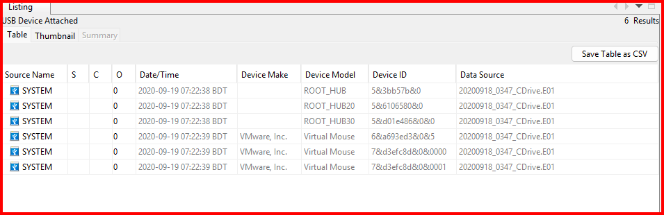
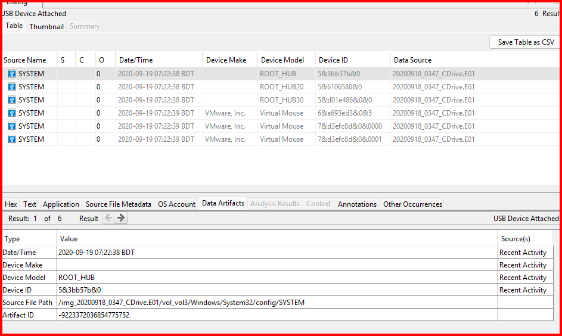

**Finding:** all six entries are virtual USB controller hubs and VMware input devices, registered within the same second at boot. **No external USB storage device was found.** Exfiltration via USB is unlikely; network/remote channels must be examined.

## Step 7 — Recent files (LNK files, Administrator profile)
| LNK file | Target | Path ID (MFT ref) | Time (UTC) |
|---|---|---|---|
| Secret.lnk | C:\FileShare\Secret (folder) | 3284 | 2020-09-18 22:29:54 |
| NoJerry.lnk | C:\FileShare\Secret\NoJerry.txt | 3288 | 2020-09-18 22:29:54 |
| PortalGunPlans.lnk | C:\FileShare\Secret\PortalGunPlans.txt | 3289 | 2020-09-18 22:34:02 |
| Szechuan Sauce.lnk | C:\FileShare\Secret\Szechuan Sauce.txt | 3290 | 2020-09-18 22:35:59 |
| SECRET_beth.lnk | C:\FileShare\Secret\SECRET_beth.txt | **225337** | 2020-09-18 22:39:22 |
| Beth_Secret.lnk | C:\FileShare\Secret\Beth_Secret.txt | 3287 | 2020-09-19 03:35:07 |
| mstsc.exe.lnk | C:\Windows\System32\mstsc.exe | — | no time recorded |
| No preferred path found.lnk | (Jump List entry, AutomaticDestinations) | -1 | — |

NTUSER.DAT MRU also lists `C:\Windows\system32\dsa.msc` and `gpmc.msc`.

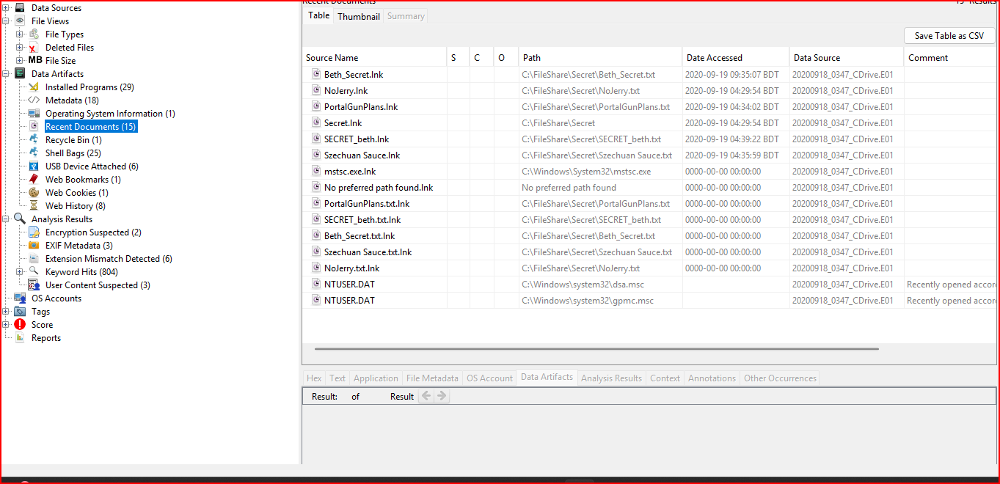
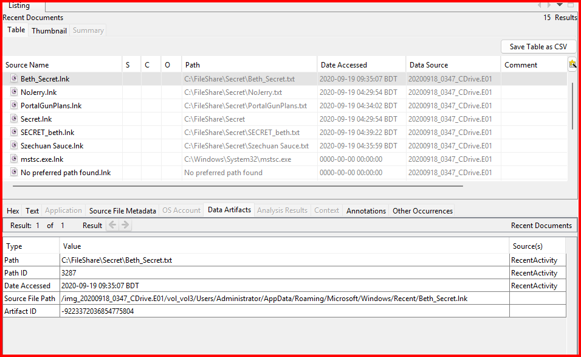
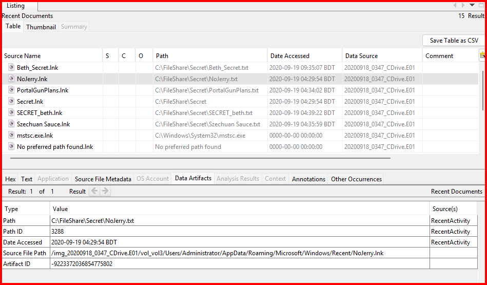
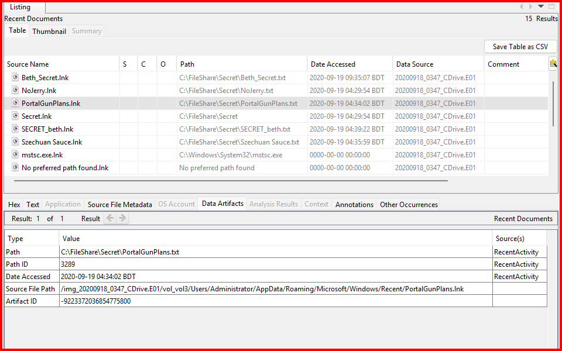
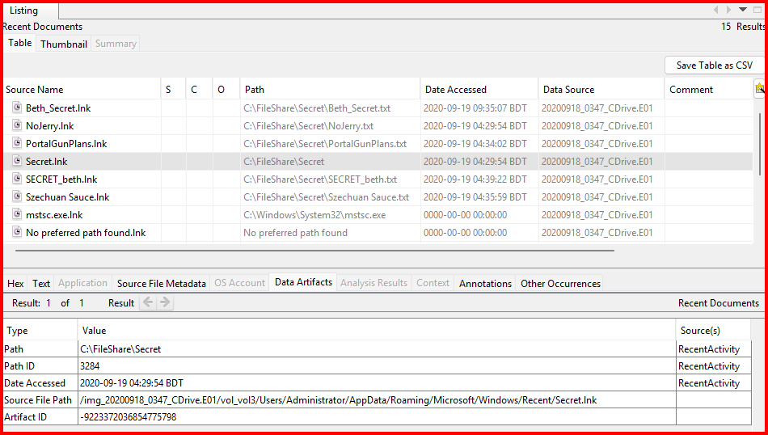
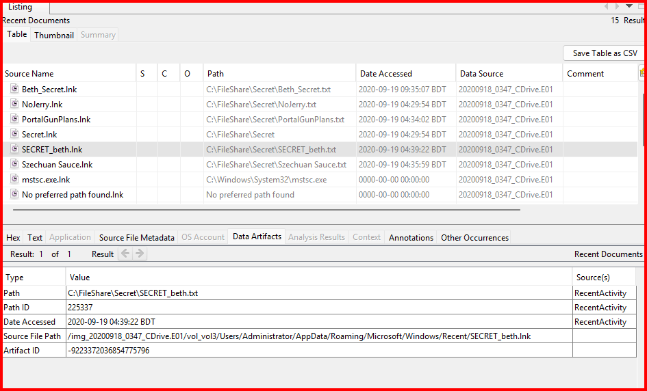
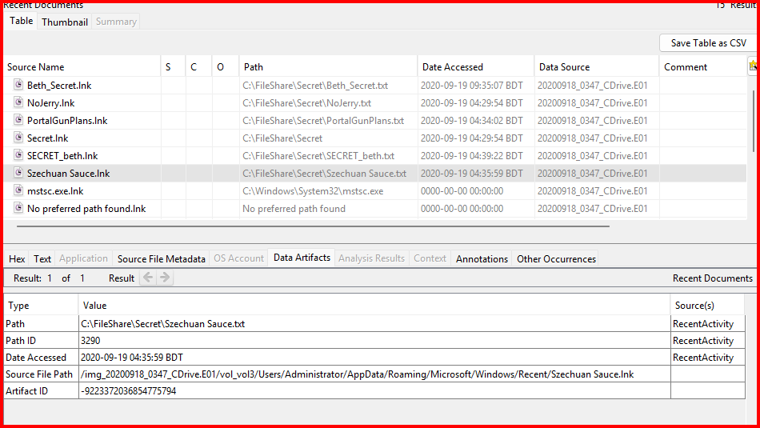
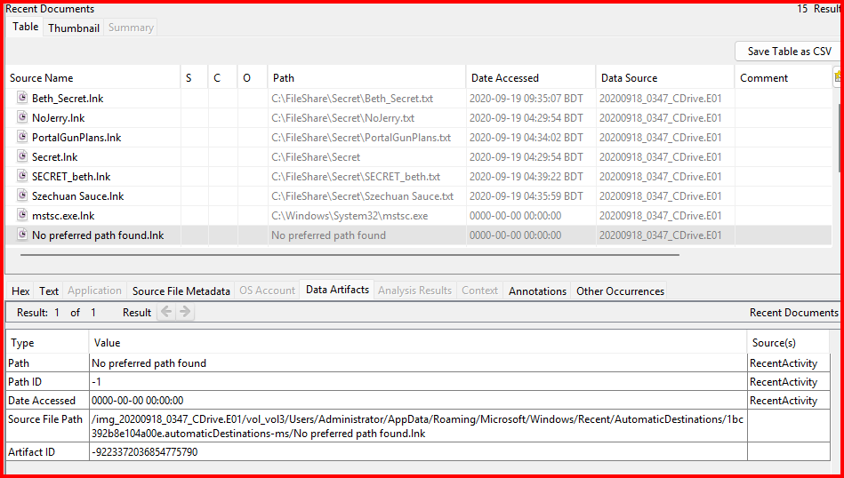

**Findings:**
- The Administrator account opened the `Secret` folder and four sensitive files within ~10 minutes (22:29–22:39 UTC, 18 Sep).
- `SECRET_beth.txt` has MFT reference **225337**, while the other files are 3284–3290. The low, consecutive references suggest the original files were created together; `SECRET_beth.txt` was **created separately, later** — possibly a planted or renamed file. Confirm with $MFT timestamps.
- `Beth_Secret.txt` was accessed again ~5 hours later (03:35 UTC, 19 Sep), in a separate session.
- `mstsc.exe` (Remote Desktop client) was used **from** the DC: outbound RDP from a domain controller is unusual.

> **To do:** confirm with LECmd which timestamp Autopsy shows (LNK vs. target times).

## Step 8 — Web artifacts
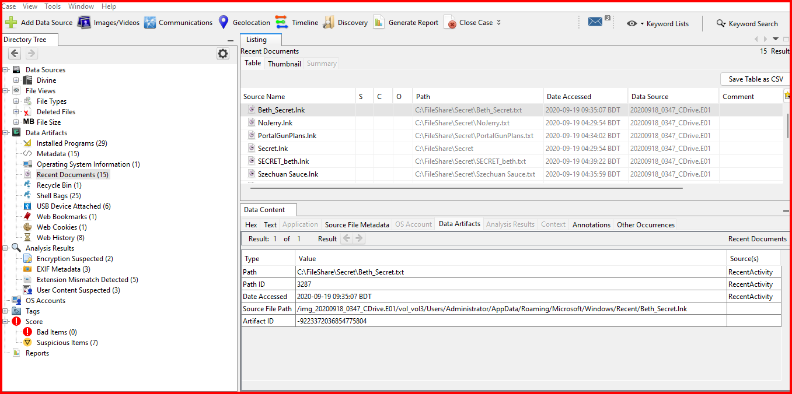

| Artifact | Finding | Time (UTC) |
|---|---|---|
| Bookmark | `Bing.url` (default IE favourite, microsoft.com) | 2020-09-17 16:46:25 (profile creation) |
| Cookie | `Y8KFNFMU.txt`, microsoft.com SRCHD — default Bing cookie | 2020-09-19 03:24:06 |
| Web history (WebCacheV01.dat, 8 entries) | see below | — |


**Web history entries (Administrator, Internet Explorer):**
| URL | Meaning |
|---|---|
| `http://194.61.24.102/` and `/favicon.ico` | **Browser on the DC connected to an external IP over plain HTTP** |
| `file:///C:/FileShare/Secret/PortalGunPlans.txt` | Secret file opened in the browser |
| `file:///C:/FileShare/Secret/Szechuan%20Sauce.txt` | Secret file opened in the browser |
| `file:///C:/FileShare/Secret/SECRET_beth.txt` | Secret file opened in the browser |
| `file:///C:/FileShare/Secret/Beth_Secret.txt` | Secret file opened in the browser |
| `res://iesetup.dll/HardAdmin.htm` | IE Enhanced Security Configuration page (normal on servers) |
| `res://C:\Windows\system32\mmcndmgr.dll/views.htm` | MMC console view (normal admin activity) |

**Finding:** Browsing from a domain controller to a bare external IP address (`194.61.24.102`) is highly suspicious and is a typical pattern for downloading attacker tools. This IP is the strongest lead in the case. **To do:** get visit timestamps from WebCacheV01.dat (ESEDatabaseView / Hindsight), check the Downloads folder, $MFT and Amcache for files created around that time, and correlate with RDP logons.

## Step 9 — Keyword search: "Antonio"
Exact-match keyword search for `Antonio` across the image returned **2 hits**:

| Hit | Path | Type | MD5 |
|---|---|---|---|
| IMJPNW.DIC | `C:\Windows\IME\IMEJP\DICTS\IMJPNW.DIC` | Microsoft Japanese IME dictionary (PE file, MZ header), 12,097,024 bytes | 82c01f26328775fd556faf377f526200 |
| IMJPNW.DIC | `C:\Windows\WinSxS\amd64_microsoft-windows-d..e-newworddictionary_...\IMJPNW.DIC` | Same file (WinSxS component store copy) | 82c01f26328775fd556faf377f526200 |

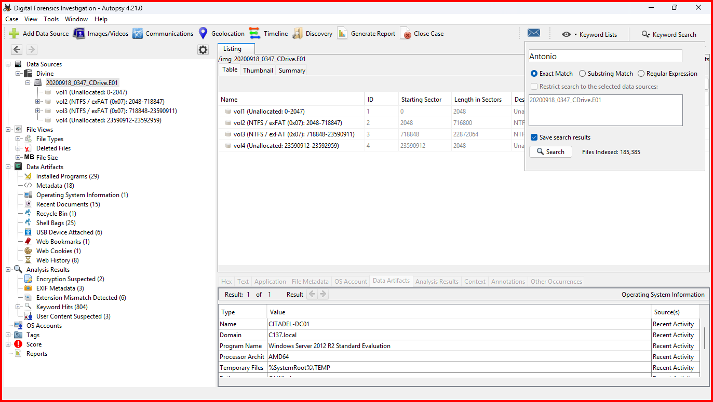
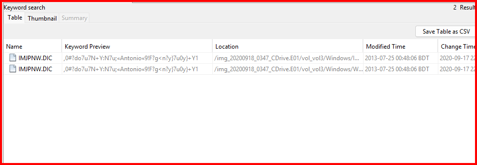
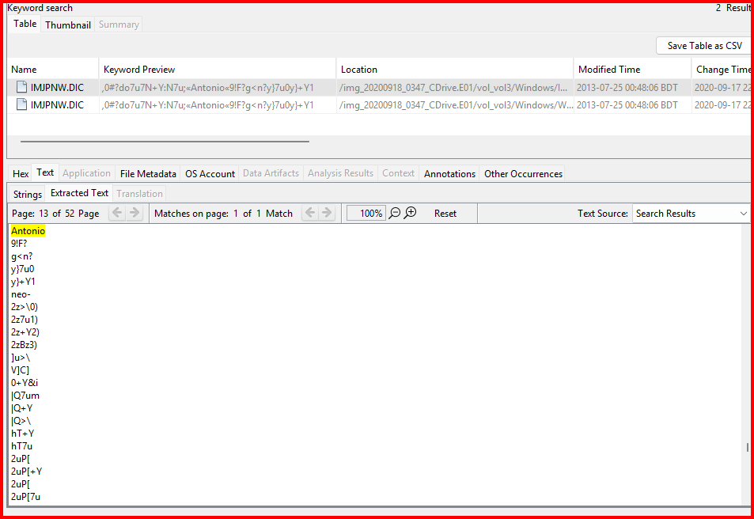
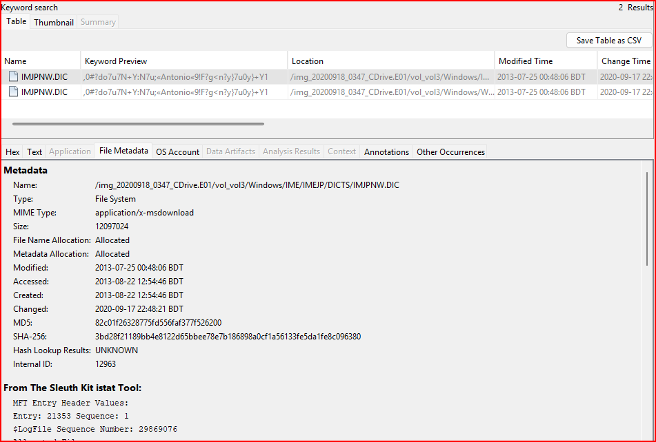
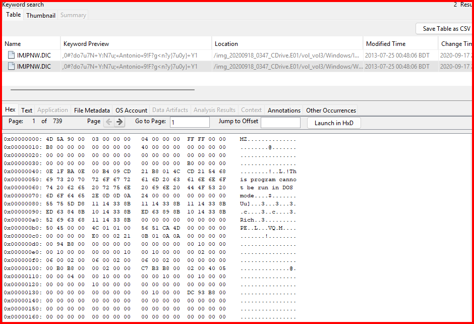
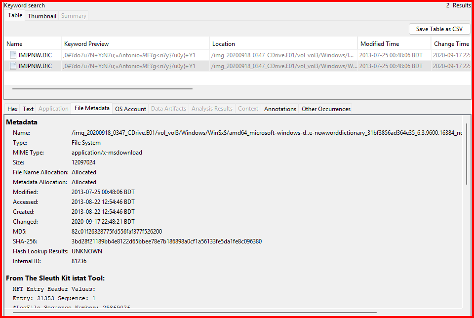

**Finding:** both hits are the same Microsoft system dictionary (identical MD5, dated 2013 from the OS install, owned by NT SERVICE). "Antonio" appears as a dictionary word inside binary data. **These are false positives: no user-created file, document or communication related to "Antonio" exists on this system.** The suspect is not linked to this machine by name; evidence against him must come from other sources (accounts, logons, network).

---

## Part B — Execution Artifacts & Timeline (Simulated Walkthrough)

> ⚠️ **Simulated data.** Steps 1–9 above come from my own Autopsy analysis of the image. The values in Part B are **illustrative**, written to demonstrate the workflow, tools and reasoning for the remaining artifacts. They are **not** extracted from the evidence and must not be used as IOCs. Rows marked *(sim)* will be replaced with real output when the KAPE/EZ Tools run is repeated.

### Step 10 — Image verification
```
FTK Imager → File → Verify Drive/Image
```
| Algorithm | Acquisition hash | Verification hash | Match |
|---|---|---|---|
| MD5 | `SIMULATED-MD5` *(sim)* | `SIMULATED-MD5` *(sim)* | ✅ *(sim)* |
| SHA-1 | `SIMULATED-SHA1` *(sim)* | `SIMULATED-SHA1` *(sim)* | ✅ *(sim)* |

### Step 11 — KAPE triage + EZ Tools
Mount the E01 read-only (FTK Imager → Image Mounting → Read Only, as `F:`), then:
```powershell
.\kape.exe --tsource F: --tdest C:\Cases\CB-11\tout --target KapeTriage `
           --mdest C:\Cases\CB-11\mout --module !EZParser --mef csv
```
Individual parsers used against the KAPE output:
```powershell
MFTECmd.exe -f "tout\F\$MFT" --csv mout --csvf mft.csv
MFTECmd.exe -f "tout\F\$Extend\$J" -m "tout\F\$MFT" --csv mout --csvf usnjrnl.csv
AmcacheParser.exe -f "tout\F\Windows\appcompat\Programs\Amcache.hve" -i --csv mout
AppCompatCacheParser.exe -f "tout\F\Windows\System32\config\SYSTEM" --csv mout
LECmd.exe -d "tout\F\Users\Administrator\AppData\Roaming\Microsoft\Windows\Recent" --csv mout
JLECmd.exe -d "tout\F\Users\Administrator\AppData\Roaming\Microsoft\Windows\Recent\AutomaticDestinations" --csv mout
SBECmd.exe -d "tout\F\Users\Administrator" --csv mout
EvtxECmd.exe -d "tout\F\Windows\System32\winevt\Logs" --csv mout
```
`PECmd` returned no files: Prefetch is disabled by default on Windows Server, as expected.

### Step 12 — Logons (EvtxECmd: Security 4624/4625, RDP 1149) *(sim)*
| Time (UTC) | Event ID | Account | Logon type | Source IP | Note |
|---|---|---|---|---|---|
| 2020-09-18 21:52:10 → 22:14:47 | 4625 ×~300 | Administrator | 10 (RDP) | 194.61.24.102 | Password guessing *(sim)* |
| 2020-09-18 22:15:03 | 4624 | Administrator | 10 (RDP) | 194.61.24.102 | First successful logon *(sim)* |
| 2020-09-18 22:15:03 | 1149 | Administrator | — | 194.61.24.102 | RDP authentication succeeded *(sim)* |
| 2020-09-19 03:20:41 | 4624 | Administrator | 10 (RDP) | 194.61.24.102 | Second session *(sim)* |

**Reasoning:** a burst of 4625 failures from one IP followed by a 4624 type 10 from the same IP is the signature of a successful RDP brute force. The same IP appears in the browser history (Step 8), which links remote access to the later download.

### Step 13 — Program execution (Amcache / Shimcache) *(sim)*
| Executable | Path | SHA-1 | First seen (UTC) | Source | Assessment |
|---|---|---|---|---|---|
| svc_update.exe | C:\Windows\Temp\svc_update.exe | `SIMULATED-HASH-01` | 2020-09-18 22:24:12 | Amcache, Shimcache | Unsigned, in Temp, created minutes after logon: **suspicious** *(sim)* |
| mstsc.exe | C:\Windows\System32\mstsc.exe | (Microsoft) | 2020-09-19 03:41:05 | Shimcache | Outbound RDP from the DC *(sim)* |
| notepad.exe | C:\Windows\System32\notepad.exe | (Microsoft) | 2020-09-18 22:30:02 | Shimcache | Consistent with opening the .txt files *(sim)* |

> Shimcache on Server 2012 R2 records presence, not proof of execution; Amcache entries are used to confirm execution.

### Step 14 — File system ($MFT / $UsnJrnl) *(sim)*
| File | Created (UTC) | Modified (UTC) | USN reason | Assessment |
|---|---|---|---|---|
| C:\Windows\Temp\svc_update.exe | 2020-09-18 22:23:58 | 2020-09-18 22:23:58 | FileCreate, DataExtend, Close | Dropped after visit to 194.61.24.102 *(sim)* |
| C:\FileShare\Secret\SECRET_beth.txt | 2020-09-18 22:38:51 | 2020-09-18 22:39:20 | FileCreate, DataExtend | Created during attacker session, matches high MFT ref (Step 7) *(sim)* |
| C:\FileShare\Secret\Szechuan Sauce.txt | 2020-09-18 04:51:20 | 2020-09-18 04:51:20 | — | Original file, pre-incident *(sim)* |
| C:\Users\Administrator\Downloads\loot.zip | 2020-09-18 22:44:10 | 2020-09-18 22:44:37 | FileCreate, DataExtend, FileDelete (22:52:03) | Staging archive created then deleted *(sim)* |

### Step 15 — Jump Lists and ShellBags *(sim)*
| Artifact | Value | Time (UTC) | Assessment |
|---|---|---|---|
| Jump List (mstsc) | Destination host: `10.42.85.115` | 2020-09-19 03:41:10 | Lateral movement to an internal host *(sim)* |
| ShellBag | C:\FileShare\Secret | first 2020-09-18 22:29:50 | Folder browsed interactively *(sim)* |
| ShellBag | C:\Users\Administrator\Downloads | first 2020-09-18 22:44:05 | Staging folder browsed *(sim)* |

### Step 16 — Super timeline
Real events from Part A are marked **(A)**; illustrative events from Part B are marked *(sim)*.

| Time (UTC) | Source | Event |
|---|---|---|
| 2020-09-17 16:46:25 | Bookmark **(A)** | Administrator profile created |
| 2020-09-18 04:48:11 | $MFT **(A)** | `C:\FileShare` created |
| 2020-09-18 21:52:10 | Security log *(sim)* | RDP brute force from 194.61.24.102 begins |
| 2020-09-18 22:15:03 | Security log *(sim)* | Successful RDP logon as Administrator |
| 2020-09-18 22:23:58 | $MFT *(sim)* | `svc_update.exe` dropped in C:\Windows\Temp |
| 2020-09-18 22:29:54 | LNK **(A)** | `Secret` folder and NoJerry.txt opened |
| 2020-09-18 22:34–22:39 | LNK **(A)** | PortalGunPlans, Szechuan Sauce, SECRET_beth opened |
| 2020-09-18 22:44:10 | $UsnJrnl *(sim)* | `loot.zip` created in Downloads |
| 2020-09-18 22:52:03 | $UsnJrnl *(sim)* | `loot.zip` deleted |
| 2020-09-19 01:22:38 | SYSTEM\Enum\USB **(A)** | System boot (virtual USB hubs) |
| 2020-09-19 03:20:41 | Security log *(sim)* | Second RDP session from 194.61.24.102 |
| 2020-09-19 03:24:06 | Cookie **(A)** | Internet Explorer used |
| 2020-09-19 03:35:07 | LNK **(A)** | Beth_Secret.txt opened |
| 2020-09-19 03:41:10 | Jump List *(sim)* | Outbound RDP to 10.42.85.115 |

### Step 17 — Narrative *(includes simulated events)*
An external host (194.61.24.102) brute-forced RDP on the domain controller and logged in as Administrator. During the session the attacker used Internet Explorer to reach the same IP and drop a tool in `C:\Windows\Temp`, browsed `C:\FileShare\Secret`, opened the sensitive files, created `SECRET_beth.txt`, staged the files in an archive and deleted it. In a second session the attacker reopened `Beth_Secret.txt` and used RDP to move laterally to an internal host. No USB storage was used. The name "Antonio" is not present in any user data.

---

## Problems Encountered
| Problem | What happened | Root cause | Fix | Lesson |
|---|---|---|---|---|
| Time zone confusion | First draft mixed BDT and "AST" times | Autopsy shows analyst's local time by default | Converted all times to UTC; set Autopsy to UTC (Tools → Options → View) | Normalise to UTC before correlating |
| USB over-reporting | First draft reported 6 "USB devices" | Counted root hubs and VMware virtual mice | Checked USBSTOR for mass storage only | Separate controllers from storage devices |
| Misread SECURITY hive | First draft described NL$ entries as network settings | Unfamiliar keys | Researched LSA secrets: NL$KM, DefaultPassword, DPAPI_SYSTEM | Verify a key's meaning before interpreting |
| Web history under-read | First draft said no URLs existed | Did not open the Web History artifact | Reviewed all 8 WebCache entries; found external IP | Look at every artifact before concluding "nothing found" |
| Unsupported statements | First draft described "Antonio" files and a 2023 logon not present in the evidence | Wrote answers before checking the screenshots | Rewrote every finding from the screenshots; the Antonio hits are false positives in a system dictionary | Every claim needs a screenshot or artifact behind it |

## Findings
| # | Observation | Evidence location | Interpretation | Confidence |
|---|---|---|---|---|
| 1 | CITADEL-DC01, domain C137.local, Windows Server 2012 R2 on VMware | SYSTEM / SOFTWARE hives | Virtual domain controller | High |
| 2 | Administrator opened 4 files in `C:\FileShare\Secret` within 10 minutes | LNK files | Deliberate review of sensitive files | Medium (confirm with LECmd) |
| 3 | `SECRET_beth.txt` has a far higher MFT reference than its siblings | LNK Path ID | Created separately/later than the other secret files | Low (confirm with $MFT) |
| 4 | IE on the DC visited `http://194.61.24.102/` | WebCacheV01.dat | External connection from a DC; likely tool download | Medium |
| 5 | Secret files opened through the browser (`file:///`) | WebCacheV01.dat | Files viewed in IE as well as via Explorer | High |
| 6 | Outbound RDP client used on the DC | mstsc.exe LNK | Lateral movement or admin activity | Low (pending Jump Lists + logons) |
| 7 | AutoLogon password stored as LSA secret | SECURITY\Policy\Secrets\DefaultPassword | Plain-text-recoverable admin credential on a DC | Medium |
| 8 | No external USB storage connected | SYSTEM\Enum\USB, USBSTOR | Exfiltration via USB unlikely | Medium |
| 9 | "Antonio" only appears inside a Microsoft IME dictionary | Keyword search, IMJPNW.DIC | False positive; no user data links the suspect to this system | High |

## ATT&CK Mapping
- T1110.001 Brute Force: Password Guessing — RDP failures *(sim)*
- T1105 Ingress Tool Transfer — browser connection to 194.61.24.102
- T1021.001 Remote Services: RDP — mstsc usage
- T1005 Data from Local System — access to `C:\FileShare\Secret`
- T1552.002 / T1003.004 Credentials in Registry / LSA Secrets — DefaultPassword stored
- T1560 Archive Collected Data and T1070.004 File Deletion — loot.zip *(sim)*

## IOCs
| Type | Value | Context |
|---|---|---|
| IPv4 | 194.61.24.102 | Visited over HTTP from the DC's browser |
| Path | C:\FileShare\Secret\ | Folder containing the targeted files |

## Deliverables
- [x] Case creation and disk layout
- [x] System identification
- [x] User profiles
- [x] Registry hive analysis (SYSTEM, SOFTWARE, SECURITY, SAM, DEFAULT, NTUSER.DAT)
- [x] USB device review
- [x] LNK / Recent files review
- [x] Web artifacts review
- [x] Keyword search ("Antonio")
- [x] Image hash verification *(simulated)*
- [x] KAPE triage + EZ Tools parsing *(simulated)*
- [x] Amcache / Shimcache execution table *(simulated)*
- [x] $MFT / $UsnJrnl review *(simulated)*
- [x] Event log logon analysis *(simulated)*
- [x] Jump Lists and ShellBags *(simulated)*
- [x] Super timeline (real + simulated, labelled)
- [ ] Final report in `report/`

## Key Learnings
1. Server editions have Prefetch disabled by default, so execution evidence comes from Amcache, Shimcache and event logs.
2. Normalise all timestamps to UTC before correlating artifacts.
3. A keyword hit is not evidence until you check what file it is in; binary system files produce false positives.
4. 
