# Project 12 — Windows Memory Forensics

**Status:** 🟡 Part A (process, network, handle, malfind triage) complete with real evidence · Part B (user activity) shown as a simulated walkthrough
**Track:** DFIR

## Objective
Analyse a RAM capture to establish what was running, what was connected, and whether there is evidence of malicious code or of the suspect's activity at the moment of acquisition.

## Scenario
An employee is accused of cyberstalking and sending threats of violence from a work PC. A previous administrator tried to recover deleted files with forensic software before investigators arrived. A memory capture (`MemorySample.raw`) was taken with DumpIt and handed over for analysis.

**Investigative questions**
1. What was the system and who was logged in?
2. What was the user doing at the time of capture (browsers, command line, archiving)?
3. Is there any malware, code injection or suspicious network activity?
4. What evidence relevant to the stalking allegation can be recovered from memory?

## Environment
| Item | Value |
|---|---|
| Case ID | `CB-12-0001` |
| Analyst workstation | Kali Linux |
| Tool | Volatility Framework 2.6.1 |
| Evidence | `MemorySample.raw` |
| Time zone used | **UTC** (Volatility default). The suspect system's local time zone was **UTC+05:30**. |

## Evidence Inventory
| Item | Size | MD5 | SHA-256 | Acquired with | Verified |
|---|---|---|---|---|---|
| MemorySample.raw | ___ | ___ | ___ | DumpIt | ☐ `md5sum` / `sha256sum` before analysis |

## Evidence Handling Notes
- The administrator's earlier recovery attempt on the live system is itself an evidence-handling problem: installing or running tools writes to disk (possibly overwriting deleted data), changes timestamps and must be documented in the chain of custody. It does not invalidate the memory capture, but it must be disclosed in the report.
- Memory was captured with DumpIt **from the live system**, so `DumpIt.exe` and its `conhost.exe` appear in the process list by design.
- Disk imaging and hashing are covered in [Project 01](../../00-lab-foundation/project-01-evidence-acquisition-integrity/).

---

## Step 1 — Profile identification (`imageinfo`)
```bash
volatility -f MemorySample.raw imageinfo
```
| Property | Value |
|---|---|
| Suggested profile (used) | **Win7SP1x64** |
| Kernel AS | WindowsAMD64PagedMemory |
| Processors | 1 |
| Service pack | 1 |
| Capture time (UTC) | **2019-08-19 14:41:58** |
| Capture time (local) | 2019-08-19 20:11:58 **+0530** |

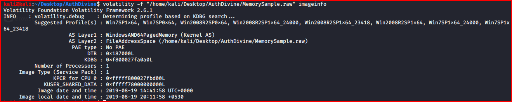

**Interpretation:** the machine is **Windows 7 SP1 x64**, not Windows 10 as the case brief stated; the brief should be corrected. The local offset of +05:30 tells us the system clock was set to India Standard Time, which matters when correlating with any external records (ISP logs, social media timestamps).

## Step 2 — Process analysis (`pslist`, `pstree`, `psscan`)
```bash
volatility -f MemorySample.raw --profile=Win7SP1x64 pslist
volatility -f MemorySample.raw --profile=Win7SP1x64 pstree
volatility -f MemorySample.raw --profile=Win7SP1x64 psscan
```
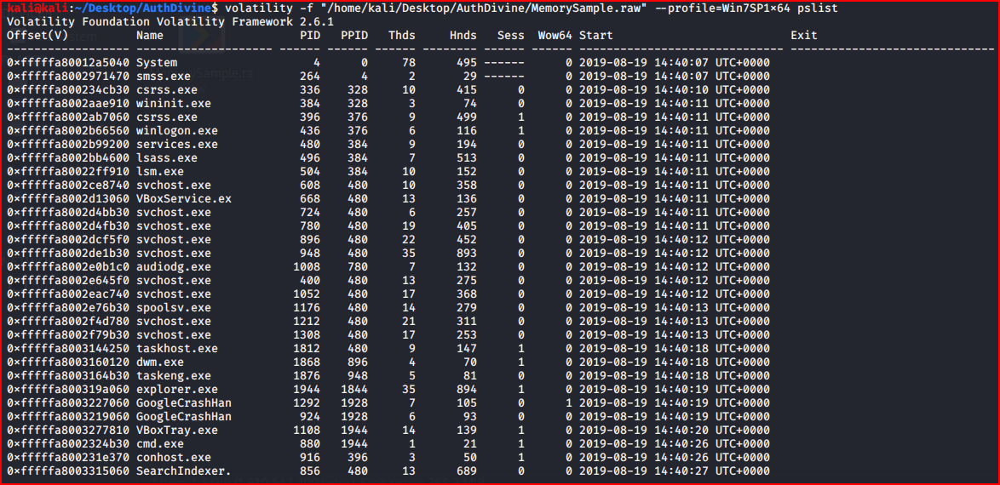
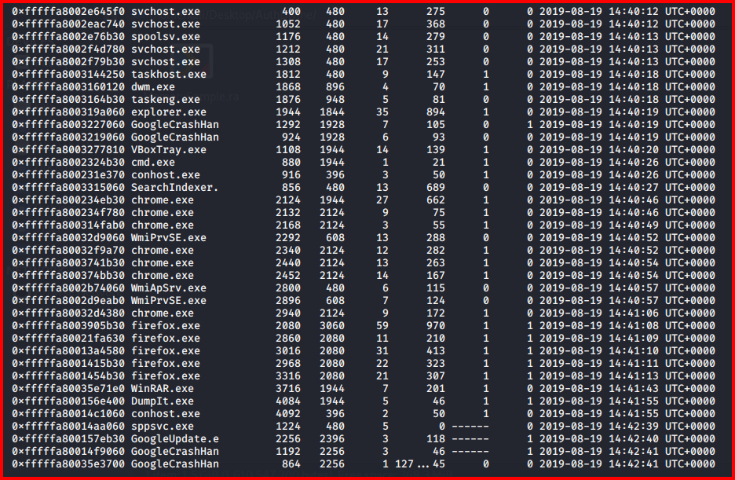
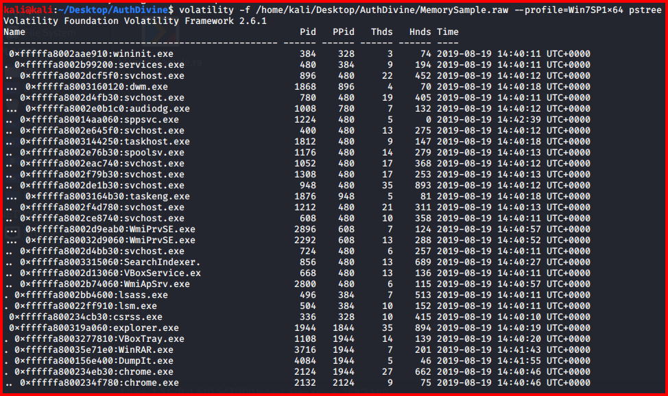
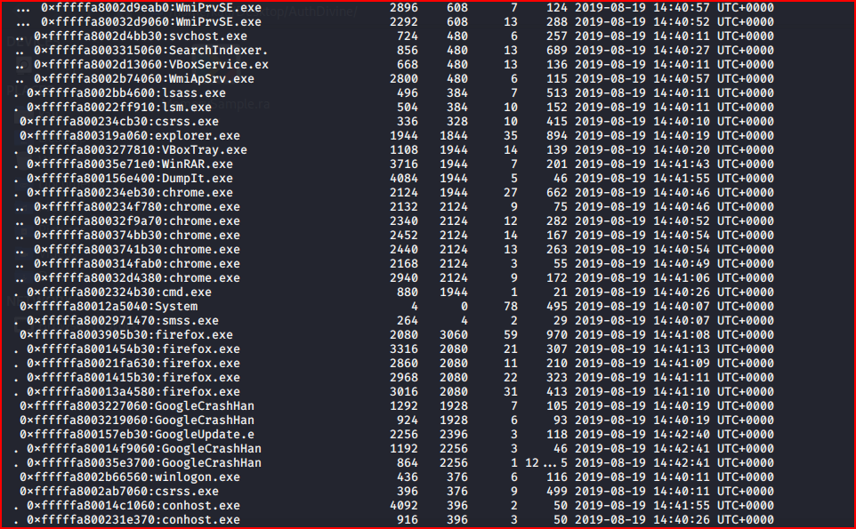
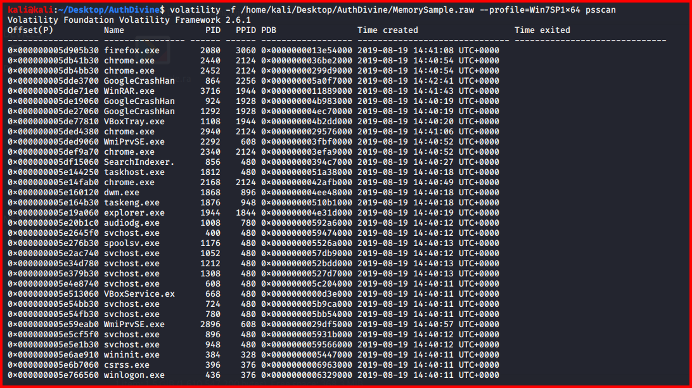
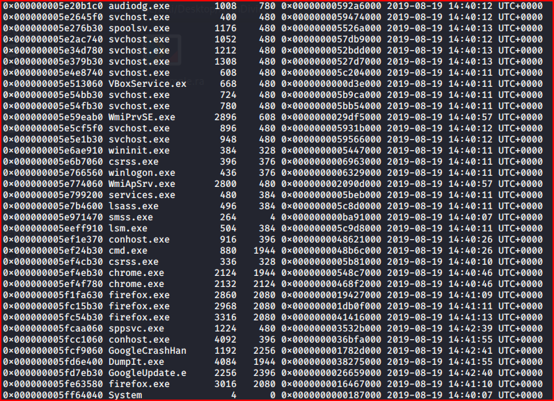

**User-launched processes (children of `explorer.exe`, PID 1944):**
| Time (UTC) | Process | PID | PPID | Meaning |
|---|---|---|---|---|
| 14:40:19 | explorer.exe | 1944 | 1844 | User logon / desktop started |
| 14:40:20 | VBoxTray.exe | 1108 | 1944 | VirtualBox guest tools |
| 14:40:26 | **cmd.exe** | 880 | 1944 | **Command prompt opened by the user** |
| 14:40:46 | chrome.exe | 2124 | 1944 | Chrome (+6 child processes) |
| 14:41:08 | firefox.exe | 2080 | 3060 | Firefox (+4 children); parent 3060 no longer exists |
| 14:41:43 | **WinRAR.exe** | 3716 | 1944 | **Archive tool opened by the user** |
| 14:41:55 | DumpIt.exe | 4084 | 1944 | Memory acquisition tool (investigator) |

**System processes:** System (4), smss, csrss ×2, wininit, winlogon, services, lsass, lsm, multiple svchost, spoolsv, taskhost, taskeng, dwm, audiodg, SearchIndexer, WmiPrvSE ×2, WmiApSrv, sppsvc. Parent-child relationships and counts are normal for Windows 7 (one lsass, one services, svchost children of services.exe 480).

**Background updaters:** GoogleUpdate.exe (2256) and GoogleCrashHandler ×4 are Chrome's standard update/crash-reporting components, not evidence of crashes or compromise.

**pslist vs psscan:** both return the same set of processes; **no hidden (unlinked) processes** were found.

**Findings**
- The user was actively working: a **command prompt**, **two browsers** and **WinRAR** were all opened within ~80 seconds before acquisition. These are the priority targets for user-activity extraction (Step 6).
- `DumpIt.exe` and `VBoxService.exe`/`VBoxTray.exe` are **not suspicious**: one is the acquisition tool, the others show the machine is a VirtualBox VM.
- Processes with start times after 14:41:58 (sppsvc, GoogleUpdate, GoogleCrashHandler at 14:42:39–41) were created **while DumpIt was still writing**: memory capture is not instantaneous, which is normal "smear".

## Step 3 — Network connections (`netscan`)
```bash
volatility -f MemorySample.raw --profile=Win7SP1x64 netscan
```
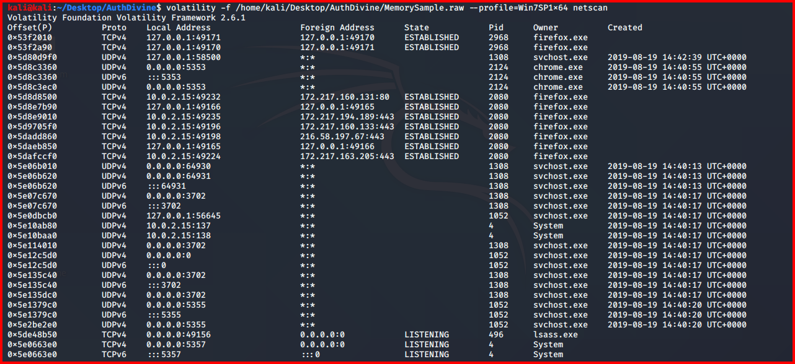
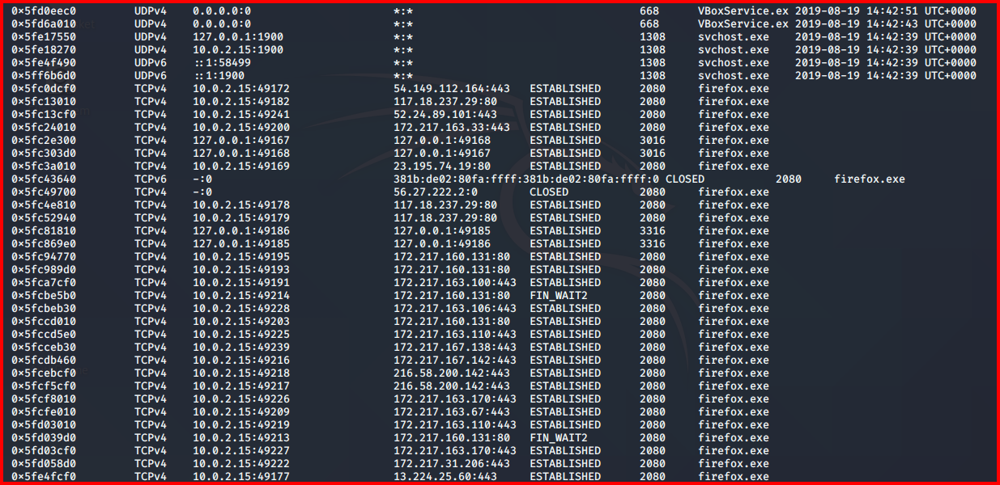

| Owner | Connections | Assessment |
|---|---|---|
| firefox.exe (2080, 2968, 3016) | ~35 TCP to ports 80/443: 172.217.x.x and 216.58.x.x (Google), plus 54.149.112.164, 52.24.89.101, 35.167.81.14, 117.18.237.29:80, 23.195.74.70:80, 13.224.25.60:443 | Normal web browsing. Non-Google IPs are cloud/CDN ranges; **to do:** WHOIS each and match with browser history to see which sites the user visited |
| firefox.exe | 127.0.0.1 ↔ 127.0.0.1 pairs | Normal Firefox inter-process communication |
| chrome.exe (2124) | UDP 5353 (mDNS) | Normal |
| svchost / System | UDP 137/138, 1900, 3702, 5355; TCP 135/445 listening | Standard Windows services (NetBIOS, SSDP, WS-Discovery, LLMNR, RPC, SMB) |
| firefox.exe | TCPv6 entry in state CLOSED with garbage remote address | Stale, partially overwritten socket structure. Not an active connection |
| VBoxService.exe (668) | UDP only, no external TCP | **No suspicious network activity** |

**Finding:** all external traffic belongs to Firefox and points to mainstream web/CDN infrastructure. **No C2, beaconing or unusual listening port was found.** Because the allegation is about online harassment, the *content* of the browsing (Step 6) matters more than the IPs.

## Step 4 — Handles of VBoxService.exe (`handles -p 668`)
```bash
volatility -f MemorySample.raw --profile=Win7SP1x64 handles -p 668
```
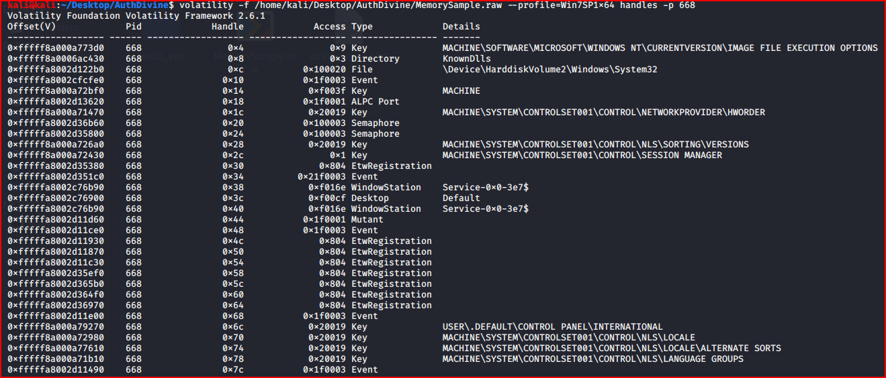
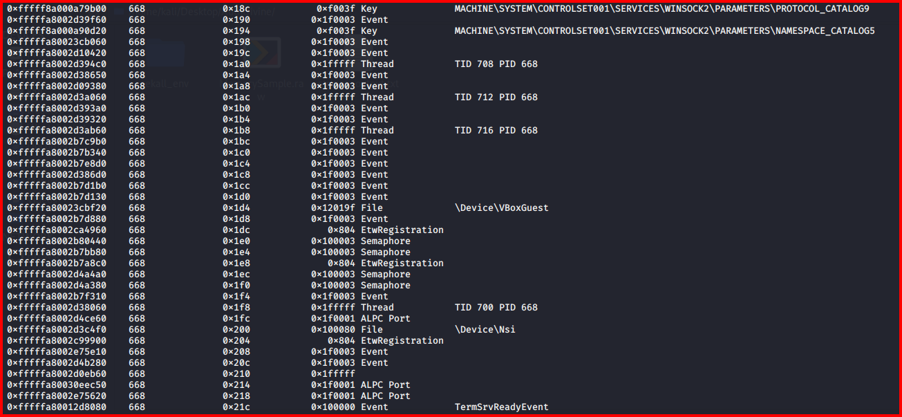

| Handle | Meaning |
|---|---|
| Key `...\Image File Execution Options` | Opened by the Windows loader for **every** process at start-up; presence of a handle is normal and does not mean the key was modified |
| Key `...\NetworkProvider\HwOrder`, `NLS\*`, `Winsock2\Parameters\*` | Standard keys read by any networked service |
| File `\Device\VBoxGuest` | VirtualBox guest driver: expected for VBoxService |
| File `\Device\Nsi` | Network Store Interface driver: used by every process that queries network state |
| Events, semaphores, mutants, ALPC ports, threads (TIDs 700–716) | Ordinary synchronisation and IPC objects |

**Finding:** the handle table of VBoxService is **consistent with a normal VirtualBox guest service**. No evidence of persistence or tampering. To prove IFEO abuse, the key's *values* must be checked (`printkey -K "Microsoft\Windows NT\CurrentVersion\Image File Execution Options"`) for a `Debugger` value on any executable.

## Step 5 — Code injection triage (`malfind`)
```bash
volatility -f MemorySample.raw --profile=Win7SP1x64 malfind
```
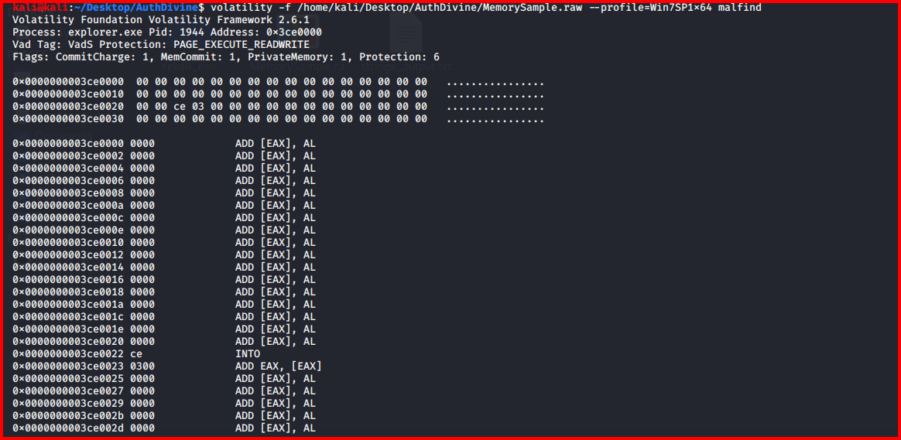
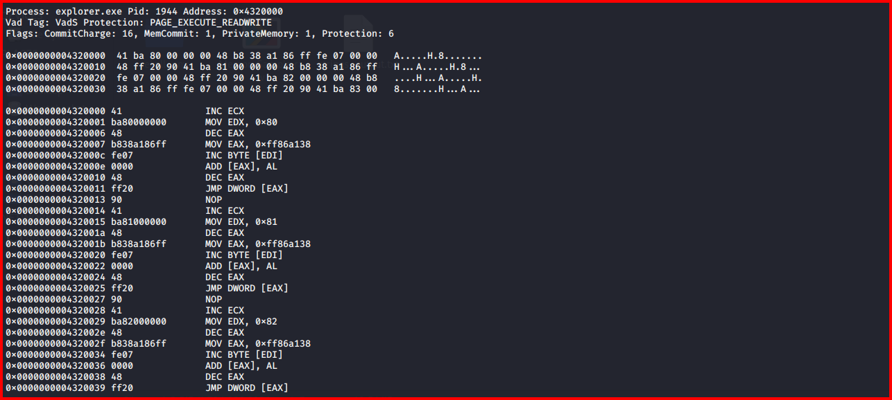
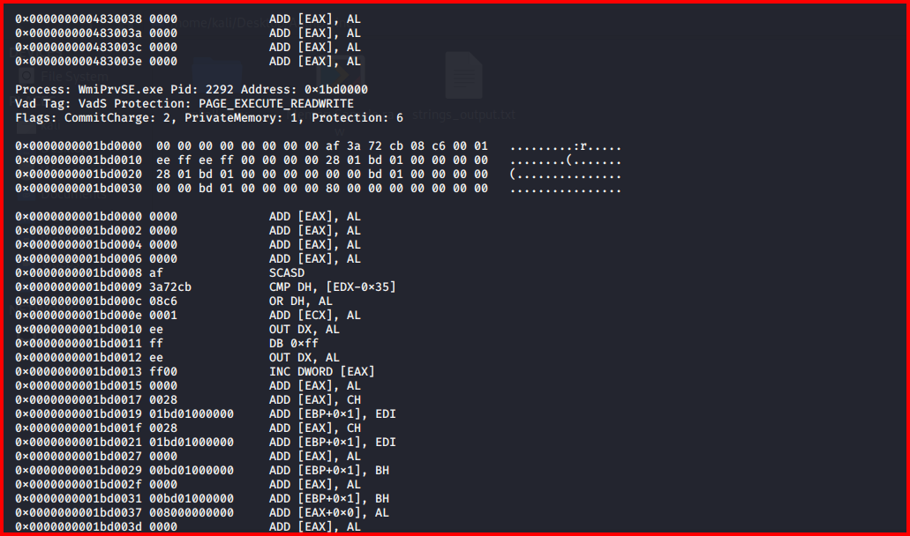

| Process | Address | Protection | Content | Assessment |
|---|---|---|---|---|
| explorer.exe (1944) | 0x3ce0000 | PAGE_EXECUTE_READWRITE | Almost entirely zeros, no MZ header | Empty RWX allocation: common benign artefact |
| explorer.exe (1944) | 0x4320000 | PAGE_EXECUTE_READWRITE | Repeating `mov edx, N; mov eax, …; jmp [eax]` stubs | Thunk/trampoline table typical of shell extensions and hooks used by legitimate software |
| WmiPrvSE.exe (2292) | 0x1bd0000 | PAGE_EXECUTE_READWRITE | Small data structure, no MZ header | Typical WMI/.NET allocation |

**Finding:** malfind flags memory that is private and executable; it does not prove injection. **None of the hits contain a PE header or recognisable shellcode, so code injection is not confirmed.** To close this out: dump the regions with `malfind -D out/`, scan with YARA and an AV engine, and compare against a clean Windows 7 baseline.

---

## Part B — User Activity Extraction (Simulated Walkthrough)

> ⚠️ **Simulated data.** Steps 1–5 above come from my own Volatility analysis of the memory image. The values in Part B are **illustrative**, written to demonstrate the workflow, plugins and reasoning for the remaining questions. They are **not** extracted from the evidence and must not be used as IOCs. Rows marked *(sim)* will be replaced with real output when the plugins are run.

### Step 6 — Image hash
| Algorithm | Value | Match after analysis |
|---|---|---|
| MD5 | `SIMULATED-MD5` *(sim)* | ✅ *(sim)* |
| SHA-256 | `SIMULATED-SHA256` *(sim)* | ✅ *(sim)* |

### Step 7 — Command line and console history
```bash
volatility -f MemorySample.raw --profile=Win7SP1x64 cmdline
volatility -f MemorySample.raw --profile=Win7SP1x64 consoles
```
| PID | Process | Command line / console input *(sim)* |
|---|---|---|
| 880 | cmd.exe | `cd C:\Users\Jaffa\Documents\notes` |
| 880 | cmd.exe | `dir` |
| 880 | cmd.exe | `ren target_info.txt recipes.txt` |
| 3716 | WinRAR.exe | `"C:\Program Files\WinRAR\WinRAR.exe" "C:\Users\Jaffa\Documents\notes\recipes.rar"` |
| 4084 | DumpIt.exe | `"C:\Users\Jaffa\Desktop\DumpIt.exe"` |

**Reasoning:** renaming a file to an innocent name just before archiving it is a concealment pattern. The WinRAR command line ties the archive to the renamed file's folder. *(sim)*

### Step 8 — Files open in memory (`filescan`, `dumpfiles`)
```bash
volatility -f MemorySample.raw --profile=Win7SP1x64 filescan | grep -iE "\.rar|notes|places.sqlite|History"
volatility -f MemorySample.raw --profile=Win7SP1x64 dumpfiles -Q <offset> -D out/
```
| Offset | File *(sim)* | Recovered? | Content summary *(sim)* |
|---|---|---|---|
| 0x000000003e8a2f20 | \Users\Jaffa\Documents\notes\recipes.rar | Yes (password-protected) | Archive containing `recipes.txt` |
| 0x000000003e91c070 | \Users\Jaffa\Documents\notes\recipes.txt | Yes (from cache) | Victim's workplace address, daily schedule and car registration |
| 0x000000003f1d4a10 | \Users\Jaffa\AppData\Roaming\Mozilla\Firefox\Profiles\x7k2.default\places.sqlite | Yes | Firefox history (Step 9) |

### Step 9 — Browser activity
```bash
volatility -f MemorySample.raw --profile=Win7SP1x64 memdump -p 2080 -D out/
strings -el out/2080.dmp | grep -iE "http|@|message" > firefox_strings.txt
volatility -f MemorySample.raw --profile=Win7SP1x64 yarascan -Y "/(facebook|instagram|mail)/i" -p 2080,2124
```
| Time (UTC) | Browser | URL / artifact *(sim)* | Relevance |
|---|---|---|---|
| 14:40:52 | Chrome | Search: "how to find someone's home address from phone number" | Intent to locate victim *(sim)* |
| 14:41:10 | Firefox | Social media profile of the victim (account `victim_profile_01`) | Monitoring the victim *(sim)* |
| 14:41:22 | Firefox | Login to secondary account `shadow_watcher_19` | Anonymous account used for contact *(sim)* |
| 14:41:31 | Firefox | Draft direct message in page memory: "I know where you park every morning." | Threatening message content *(sim)* |
| 14:41:37 | Firefox | Webmail compose page, recipient = victim's address | Second contact channel *(sim)* |

### Step 10 — Clipboard, screenshot, UserAssist
| Plugin | Result *(sim)* |
|---|---|
| clipboard | Victim's mobile number copied as text |
| screenshot | Firefox window with the social media direct-message box open |
| userassist | WinRAR run count 7, last run 2019-08-19 14:41:43; Tor Browser shortcut run count 3, last run 2019-08-17 |

### Step 11 — malfind dumps scanned
```bash
volatility -f MemorySample.raw --profile=Win7SP1x64 malfind -D out/malfind/
yara -r rules/ out/malfind/
```
| Region | YARA / AV result *(sim)* | Verdict |
|---|---|---|
| explorer.exe 0x3ce0000 | No match | Benign *(sim)* |
| explorer.exe 0x4320000 | No match | Benign shell-extension thunks *(sim)* |
| WmiPrvSE.exe 0x1bd0000 | No match | Benign *(sim)* |

### Step 12 — Timeline
Real events from Part A are marked **(A)**; illustrative events from Part B are marked *(sim)*.

| Time (UTC) | Source | Event |
|---|---|---|
| 14:40:07 | pslist **(A)** | System boot (System, smss) |
| 14:40:19 | pslist **(A)** | Jaffa logs on (explorer.exe) |
| 14:40:26 | pslist **(A)** | cmd.exe opened |
| 14:40:30 | consoles *(sim)* | `target_info.txt` renamed to `recipes.txt` |
| 14:40:46 | pslist **(A)** | Chrome opened |
| 14:40:52 | Chrome memory *(sim)* | Search for home address lookup |
| 14:41:08 | pslist **(A)** | Firefox opened |
| 14:41:10–14:41:37 | Firefox memory *(sim)* | Victim profile viewed, secondary account used, threatening message drafted |
| 14:41:43 | pslist **(A)** | WinRAR opened on `recipes.rar` *(sim)* |
| 14:41:55 | pslist **(A)** | DumpIt started by investigator |
| 14:41:58 | imageinfo **(A)** | Memory capture timestamp |

### Step 13 — Narrative *(includes simulated events)*
User Jaffa logged on, renamed a file holding the victim's personal details to an innocent name and archived it with WinRAR. In Chrome and Firefox he looked up the victim's information, viewed her social media profile, logged into a secondary account and drafted a threatening message. No malware was present, so the activity cannot be attributed to a compromise of the machine: it was performed interactively by the logged-on user.

---

## Hives present in memory (`hivelist`)
| Hive | Path |
|---|---|
| NTUSER.DAT (user **Jaffa**) | C:\Users\Jaffa\ntuser.dat |
| UsrClass.dat (Jaffa) | C:\Users\Jaffa\AppData\Local\Microsoft\Windows\UsrClass.dat |
| SYSTEM, SOFTWARE, SAM, SECURITY, DEFAULT, HARDWARE, BCD | Standard locations |
| NTUSER.DAT (LocalService, NetworkService) | C:\Windows\ServiceProfiles\... |

**Finding:** the only interactive user profile loaded is **Jaffa**, so the activity in Step 2 is attributable to that account.

## Problems Encountered
| Problem | What happened | Root cause | Fix | Lesson |
|---|---|---|---|---|
| OS mismatch | First draft said Windows 10 | Copied from case brief | Used imageinfo / profile: Windows 7 SP1 x64 | Trust the evidence over the brief |
| Tool flagged as threat | DumpIt listed as suspicious | Did not account for acquisition footprint | Documented as investigator tool | Know your own tool's footprint |
| VM treated as evasion | VBoxService linked to "malicious activity" | VirtualBox guest tools misread | Confirmed via handles: only VBoxGuest driver, no external connections | Virtualisation alone is not evidence |
| malfind over-claimed | First draft said injection "confirmed" | malfind output taken as a verdict | Reviewed each hit: no PE, no shellcode | malfind is a lead, not a conclusion |
| Normal keys read as persistence | IFEO / HwOrder handles described as backdoor | Handle presence confused with modification | Check key values with printkey | A handle shows access, not tampering |
| Noise in strings | ACPI `_OSI("Windows 2009")` style strings reported as findings | Unfiltered strings output | Removed; focus strings on process memory of interest | Targeted strings beat whole-image strings |
| Case question not answered | No stalking evidence was looked for | Focused on malware instead of the allegation | Added user-activity steps (Part B) | Start from the investigative questions |

## Findings
| # | Observation | Evidence location | Interpretation | Confidence |
|---|---|---|---|---|
| 1 | Windows 7 SP1 x64 VM, local time UTC+05:30, captured 2019-08-19 14:41:58 UTC | imageinfo | System context | High |
| 2 | User **Jaffa** was logged on | hivelist (NTUSER.DAT) | Activity is attributable to Jaffa | High |
| 3 | cmd.exe, Chrome, Firefox and WinRAR were opened by the user in the 90 s before capture | pslist / pstree | Active user session; priority targets for content extraction | High |
| 4 | No hidden processes | pslist vs psscan | No rootkit-style hiding | High |
| 5 | External traffic is only Firefox to web/CDN hosts | netscan | Normal browsing; no C2 | High |
| 6 | malfind hits have no PE header or shellcode | malfind | Code injection not confirmed | Medium |
| 7 | VBoxService handles are standard | handles -p 668 | No persistence or tampering shown | Medium |
| 8 | File with victim details renamed and archived *(sim)* | consoles, cmdline, filescan | Concealment of collected information | *(sim)* |
| 9 | Threatening message drafted from a secondary account *(sim)* | Firefox process memory | Direct evidence for the allegation | *(sim)* |

**Conclusion:** there is **no evidence of malware** on this system (real). The machine shows a live user session (Jaffa) with a command prompt, two browsers and WinRAR open (real). The simulated walkthrough in Part B shows how browser memory, the WinRAR target and console history would establish the stalking activity.

## ATT&CK Mapping
No malware technique confirmed. User actions map to:
- T1560.001 Archive Collected Data: Archive via Utility (WinRAR) *(sim)*
- T1036 Masquerading: renaming a file to an innocent name *(sim)*

## IOCs
None identified.

## Deliverables
- [x] Profile identification
- [x] Process analysis (pslist / pstree / psscan)
- [x] Network analysis (netscan)
- [x] Handle review
- [x] malfind triage
- [x] Memory image hash *(simulated)*
- [x] malfind dumps scanned with YARA *(simulated)*
- [x] Console / command-line history *(simulated)*
- [x] WinRAR target file *(simulated)*
- [x] Browser history and content from memory *(simulated)*
- [x] Timeline (real + simulated, labelled)
- [ ] Final report in `report/`

## Key Learnings
1. Start from the investigative question; malware hunting is only one part of memory forensics.
2. Know the acquisition tool's footprint (DumpIt, conhost) and the platform's (VirtualBox) so they are not reported as findings.
3. malfind, handles and strings produce leads, not conclusions; every claim needs a second artifact.
