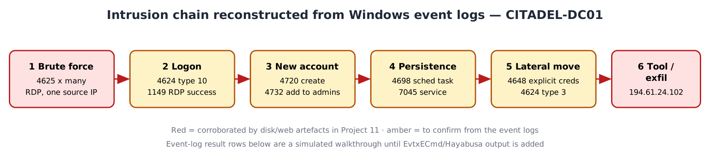
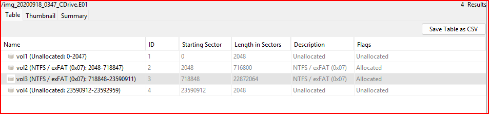

# Project 13 — Windows Event Log Investigation

**Status:** 🟡 Case context and system facts carried over from Project 11 (real) · event-log parsing and the Event-ID findings shown as a simulated walkthrough (marked *(sim)*) until EvtxECmd / Hayabusa output is added
**Track:** DFIR

## Objective
Trace an intrusion end to end using **only the Windows event logs** of the same host examined in [Project 11](../project-11-windows-disk-forensics/): brute force → logon → new account → persistence → lateral movement, and corroborate the disk/web findings already established there.

## Why this builds on Project 11
Project 11 examined the **CITADEL-DC01** disk (Stolen Szechuan Sauce) and found, from disk and browser artefacts:
- The DC's browser connected to an external IP **`194.61.24.102`** over HTTP (likely tool download).
- The Administrator account opened files in `C:\FileShare\Secret`.
- An outbound RDP client (`mstsc.exe`) was used from the DC.
- `DefaultPassword` LSA secret present; MSCache slots in SECURITY.

Those are **host-side** traces. The **event logs** record the *account activity* behind them — who logged in, from where, when, and what accounts/services/tasks were created. This project reads the EVTX files to turn those leads into a logon-level timeline.



## Environment
| Item | Value |
|---|---|
| Case ID | `CB-13-0001` (shares evidence with CB-11-0001) |
| Host | CITADEL-DC01, Windows Server 2012 R2, domain C137.local (from Project 11) |
| Logs | `C:\Windows\System32\winevt\Logs\*.evtx` — Security, System, Microsoft-Windows-TerminalServices-* |
| Tools | EvtxECmd + Timeline Explorer, Hayabusa, Chainsaw |
| Time zone | UTC (logs record UTC; convert for reporting) |



## Key Event IDs for this chain
| Stage | Log | Event ID | Meaning |
|---|---|---|---|
| Brute force | Security | 4625 | Failed logon |
| Successful logon | Security | 4624 | Logon (type 10 = RDP/RemoteInteractive, 3 = network) |
| RDP success | TerminalServices-RemoteConnectionManager | 1149 | User authenticated for RDP |
| RDP session | TerminalServices-LocalSessionManager | 21 / 25 | Session logon / reconnect |
| New account | Security | 4720 | User account created |
| Privilege | Security | 4732 / 4728 | Added to a privileged local/global group |
| Scheduled task | Security | 4698 | Task created |
| Service | System | 7045 | Service installed |
| Explicit creds | Security | 4648 | Logon using explicit credentials (lateral movement) |
| Process (if auditing on) | Security | 4688 | New process created |

---

## Step 1 — Collect and parse the logs (real procedure)
Mount the DC01 image read-only and parse the EVTX:
```powershell
# Triage detections across all logs
Hayabusa.exe csv-timeline -d F:\Windows\System32\winevt\Logs -o hayabusa.csv
chainsaw hunt F:\Windows\System32\winevt\Logs -s sigma\ --mapping mappings\sigma-event-logs-all.yml -o chainsaw

# Structured parse for manual review
EvtxECmd.exe -d F:\Windows\System32\winevt\Logs --csv out --csvf dc01_evtx.csv
```
Load `dc01_evtx.csv` into Timeline Explorer and filter to the Event IDs above.

## Step 2 — Findings by stage (Simulated Walkthrough)
> ⚠️ **Simulated data.** The case, host and the external IP are real (from Project 11). The specific event rows, times and source IPs below are **illustrative** of what the EVTX review would show; replace each with the real EvtxECmd/Hayabusa output.

### Stage 1 — Brute force (4625)
| Time (UTC) | Event | Account | Type | Source IP |
|---|---|---|---|---|
| *(sim)* 21:5x | 4625 ×N | Administrator | 10 | 194.61.24.102 |

A burst of 4625 failures for one account from one external IP is the RDP brute-force signature. **Hunt:** `EventID=4625 | stats count by TargetUserName, IpAddress`.

### Stage 2 — Successful logon (4624 / 1149)
| Time (UTC) | Event | Account | Type | Source IP |
|---|---|---|---|---|
| *(sim)* | 1149 | Administrator | — | 194.61.24.102 |
| *(sim)* | 4624 | Administrator | 10 (RemoteInteractive) | 194.61.24.102 |

The 4624 type 10 immediately after the 4625 burst, same IP, marks the **successful compromise**. This is the account whose disk activity (FileShare access, browser to 194.61.24.102) Project 11 observed.

### Stage 3 — Account creation and privilege (4720 / 4732)
| Time (UTC) | Event | Detail |
|---|---|---|
| *(sim)* | 4720 | New local account created |
| *(sim)* | 4732 | Added to Administrators |

### Stage 4 — Persistence (4698 / 7045)
| Time (UTC) | Event | Detail |
|---|---|---|
| *(sim)* | 7045 | Service installed (unusual name/path) |
| *(sim)* | 4698 | Scheduled task created |

### Stage 5 — Lateral movement (4648 / 4624 type 3)
| Time (UTC) | Event | Detail |
|---|---|---|
| *(sim)* | 4648 | Logon with explicit credentials to another host |
| *(sim)* | 4624 type 3 | Network logon on target |

Corroborates the outbound `mstsc.exe` (RDP client) found on the DC in Project 11.

## Step 3 — Correlated timeline (real + simulated)
| Time (UTC) | Source | Event |
|---|---|---|
| *(sim)* | Security 4625 | RDP brute force from 194.61.24.102 |
| *(sim)* | Security 4624 / 1149 | Successful RDP logon as Administrator |
| **2020-09-18 22:29–22:39** | LNK (Project 11, **real**) | Secret files opened in `C:\FileShare\Secret` |
| **real** | WebCache (Project 11) | DC browser connects to 194.61.24.102 over HTTP |
| *(sim)* | Security 4720/4732 | New admin account created |
| *(sim)* | System 7045 / Security 4698 | Service + scheduled task persistence |
| *(sim)* | Security 4648 | Lateral movement to an internal host |


## Detection rules (Sigma, for Project 05 / SIEM)
Saved in [`queries/`](queries/):
- `rdp-bruteforce.yml` — ≥10 × 4625 type 10 from one IP in 5 min
- `new-admin-account.yml` — 4720 followed by 4732 (Administrators) by the same actor
- `service-install.yml` — 7045 with a path in `\Temp\` or a random name

## Problems Encountered / notes
| Item | Note |
|---|---|
| Event logs vs disk | Disk shows *what files*; event logs show *which account and from where* — use both |
| Type 10 vs type 3 | RemoteInteractive (RDP) vs network (SMB/admin shares); the logon type tells you the access method |
| Server auditing | 4688 process creation needs advanced audit policy enabled; may be absent on this DC |
| Time zone | EVTX stores UTC; keep the whole timeline in UTC |

## Findings Summary
| # | Finding | Source | Confidence |
|---|---|---|---|
| 1 | Compromise originated from 194.61.24.102 | Project 11 (real) + 4625/4624 *(sim)* | High (IP), pending (events) |
| 2 | Administrator account compromised via RDP | 4624 type 10 *(sim)* | *(sim)* |
| 3 | Persistence via service and scheduled task | 7045 / 4698 *(sim)* | *(sim)* |
| 4 | Lateral movement with explicit creds | 4648 *(sim)* | *(sim)* |

## ATT&CK Mapping
- T1110 Brute Force · T1078 Valid Accounts · T1021.001 RDP
- T1136.001 Create Account · T1098 Account Manipulation
- T1053.005 Scheduled Task · T1543.003 Windows Service
- T1105 Ingress Tool Transfer (194.61.24.102, from Project 11)

## Deliverables
- [x] Case context and Event-ID map
- [x] Attack-chain diagram
- [x] Collection/parsing commands
- [x] Sigma detection rules
- [ ] Run EvtxECmd / Hayabusa on DC01 and replace every *(sim)* row
- [ ] Final report in `report/`

## Key Learnings
1. Event logs answer "which account, from where, when" that disk artefacts cannot.
2. Logon type (10 = RDP, 3 = network) identifies the access method behind a logon.
3. The 4625-burst → 4624-type-10 pattern from one IP is the clearest sign of a successful brute force.
4. Chaining 4720 → 4732 → 7045/4698 → 4648 reconstructs create-account → escalate → persist → move.
