# Project 15 — Network Forensics

**Status:** 🟡 Labs 2–4 analysed with real evidence · Lab 1 results and Lab 4 malicious-traffic hunt shown as a simulated walkthrough (marked *(sim)*)
**Track:** DFIR

## Objective
Investigate network evidence of four kinds: flow records, 802.11 wireless captures, IDS alerts and a full packet capture. Answer each investigative question from the evidence and separate normal traffic from malicious traffic.

## Contents
| Lab | Evidence | Question | Status |
|---|---|---|---|
| 1 | Cisco ASA NetFlow (nfcapd) + Argus records | What attack does the flow data show? | Tool problems diagnosed (real) · results *(sim)* |
| 2 | `wifi.pcap` (802.11) | What are the access point's BSSID and SSID? | ✅ Real |
| 3 | Snort `alert` file + rule set | What do two alerts mean, and should they be escalated? | ✅ Real, corrected |
| 4 | `malware.pcap` ("Tom's laptop", coffee-shop Wi-Fi) | Identify the host, its traffic and the malicious connection | Host analysis real · malicious traffic *(sim)* |

> These are public training datasets used in network forensics courses. Values marked *(sim)* are illustrative and use reserved documentation addresses (RFC 5737: 192.0.2.0/24, 198.51.100.0/24, 203.0.113.0/24) and `.example` domains.

## Environment
| Item | Value |
|---|---|
| Case ID | `CB-15-0001` |
| Workstation | Kali Linux |
| Tools | nfdump 1.5.8 (built from source), Argus / ra client, tcpdump, tshark 4.4.5, Snort rule set, Wireshark |

---

# Lab 1 — Flow Record Analysis (nfdump, Argus)

## What happened (real)
nfdump 1.5.8 was built from source, but the binary actually used was a newer system package. Reading the Cisco ASA capture files failed:

```
$ nfdump -R ~/Desktop/150/t1/nfdump-1.5.8/src/cisco-asa-nfcapd
nfdump 1.5.x block type 1 no longer supported. Skip block   (×8)
Summary: total flows: 0 … Blocks skipped: 8
```
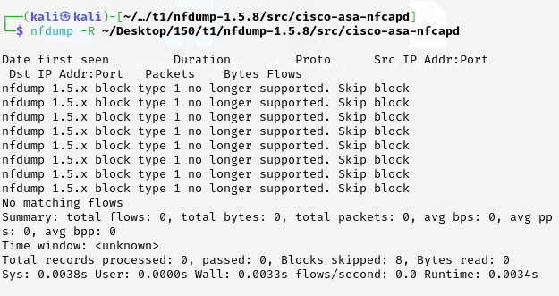
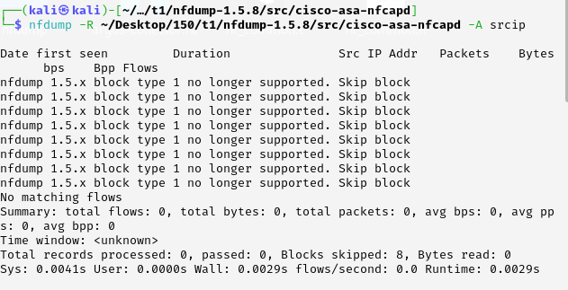

Argus also failed:
```
$ argus -r argus-collector.ra
ArgusError: … open /var/log/argus/argus.out: Permission denied
$ sudo argus -r argus-collector.ra
ArgusAlert: … pcap_open_offline: argus-collector.ra, unknown packet file format
```
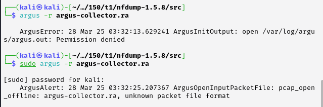

## Diagnosis
| Symptom | Cause | Fix |
|---|---|---|
| `nfdump 1.5.x block type 1 no longer supported` | The files are **not corrupted**. They are in nfdump **1.5.x** format and were read by a newer nfdump (1.6+/1.7), which dropped that block type | Run the 1.5.8 binary that was compiled: `./src/nfdump/nfdump -R cisco-asa-nfcapd` (or `make install` and call it by full path) |
| `argus -r … unknown packet file format` | `argus` is the **sensor**: it reads pcap and writes Argus records. `.ra` files are Argus **records**, read with the **client** `ra` | `ra -r argus-collector.ra` |
| `Permission denied /var/log/argus/argus.out` | The sensor tried to write its default output file | Not needed once `ra` is used |

## Analysis after the fix (Simulated Walkthrough)
> ⚠️ **Simulated data** below *(sim)*.

```bash
NF=./src/nfdump/nfdump
$NF -R cisco-asa-nfcapd -s srcip/bytes -n 10          # top talkers
$NF -R cisco-asa-nfcapd -s dstport/flows -n 10        # top services
$NF -R cisco-asa-nfcapd 'dst port 22' -A srcip        # SSH attempts by source
ra -r argus-collector.ra -s stime saddr daddr dport pkts bytes - 'tcp and dst port 22'
```

**Top destination ports by flow count** *(sim)*
| Port | Flows | Note |
|---|---|---|
| 22 | 4,812 | Unusually high for an edge firewall |
| 443 | 3,107 | Normal web |
| 80 | 1,264 | Normal web |
| 3389 | 611 | RDP from outside |

**Single source dominating SSH flows** *(sim)*
| Src IP | Dst IP | Flows | Avg bytes/flow | Duration |
|---|---|---|---|---|
| 203.0.113.45 | 192.0.2.10 (DMZ SSH) | 4,688 | 312 | 00:41 |

**Interpretation** *(sim)*: thousands of short SSH flows with ~300 bytes each from one source in 41 minutes is the flow signature of **SSH brute force**. Argus records confirm the last two flows from 203.0.113.45 lasted >10 minutes with several kilobytes transferred: a **successful login** is likely and the DMZ host should be examined.

---

# Lab 2 — WiFi Forensics (real)

**Question:** what is the access point's MAC address (BSSID) and network name (SSID)?

Beacon frames (802.11 management, subtype 8) are broadcast by the access point and contain both values.

```bash
tcpdump -nne -r wifi.pcap 'wlan[0] = 0x80'
```
```
BSSID:00:23:69:61:00:d0 DA:ff:ff:ff:ff:ff:ff SA:00:23:69:61:00:d0 Beacon (Ment0rNet)
[1.0* 2.0* 5.5* 11.0* 18.0 24.0 36.0 54.0 Mbit] ESS CH: 2, PRIVACY
```
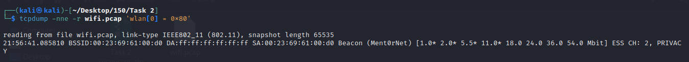

Verification with tshark (beacons `0x08` and probe responses `0x05`):
```bash
tshark -nn -r wifi.pcap -Y 'wlan.fc.type_subtype == 0x08 || wlan.fc.type_subtype == 0x05' \
       -T fields -e wlan.bssid -e wlan.ssid
```
```
00:23:69:61:00:d0   4d656e7430724e6574
```
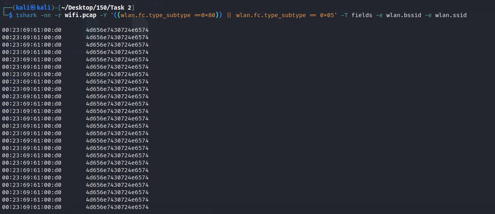

The SSID field is shown in hex: `4d 65 6e 74 30 72 4e 65 74` = **"Ment0rNet"**, confirming the tcpdump result.

| Answer | Value |
|---|---|
| BSSID (WAP MAC) | **00:23:69:61:00:d0** |
| SSID | **Ment0rNet** |
| Channel | 2 |
| Encryption | PRIVACY bit set (WEP/WPA) |
| Vendor (OUI 00:23:69) | Cisco-Linksys |

> Note: in the first attempt the tshark filter used `0x80` for beacons. In tshark, `wlan.fc.type_subtype` for a beacon is **0x08** (the `0x80` value is the raw frame-control byte used in the tcpdump filter). Both filters are shown correctly above.

---

# Lab 3 — Snort Alert Analysis (real, corrected)

## Alert 1 — `[1:2925:3] INFO web bug 0x0 gif attempt`
```
[**] [1:2925:3] INFO web bug 0x0 gif attempt [**]
[Classification: Misc activity] [Priority: 3]
05/18-07:43:44.430102 72.14.213.148:80 -> 192.168.1.170:56564
TCP TTL:63 … ***AP*** …
```
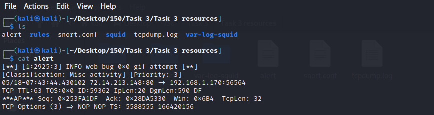

Rule:
```
alert tcp $EXTERNAL_NET $HTTP_PORTS -> $HOME_NET any (msg:"INFO web bug 0x0 gif attempt";
  flow:from_server,established; content:"Content-type|3A| image/gif"; nocase;
  content:"GIF"; distance:0; nocase; content:"|01 00 01 00|"; within:4; distance:3;
  content:","; distance:0; content:"|01 00 01 00|"; within:4; distance:4;
  classtype:misc-activity; sid:2925; rev:3;)
```
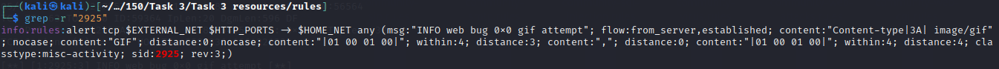

**What the rule matches:** an HTTP response from a web server to an internal client containing a GIF whose width and height are both 1 (`01 00 01 00`, little-endian). That is a **1×1 tracking pixel** ("web bug") used by analytics and advertising to record that a page or email was viewed.

**Assessment:** informational (Priority 3). The server 72.14.213.148 is in a Google range, consistent with analytics. It is a **privacy** concern, not an exploit or an attack on the client. No escalation; useful only for policy (e.g. blocking trackers).

## Alert 2 — `[1:100000137:1] COMMUNITY MISC BAD-SSL tcp detect`
```
[**] [1:100000137:1] COMMUNITY MISC BAD-SSL tcp detect [**]
[Classification: Misc activity] [Priority: 3]
05/18-07:43:51.389898 204.11.50.137:80 -> 192.168.1.170:48498
TCP … ***AP*** …
```
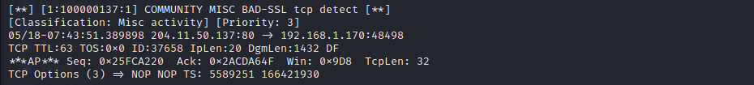

Rule:
```
alert tcp any any -> any !139 (msg:"COMMUNITY MISC BAD-SSL tcp detect";
  flow:stateless; content:"|00 0E|"; depth:4; offset:0;
  classtype:misc-activity; sid:100000137; rev:1;)
```
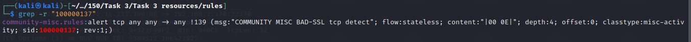

**What the rule matches:** any TCP packet on any port except 139, regardless of connection state, whose payload has the bytes `00 0E` somewhere in its **first four bytes**. It was written to catch a malformed SSL record, but nothing in it checks for SSL/TLS.

**Assessment:** this alert fired on **plain HTTP from port 80**, not on SSL. Two bytes in the first four positions occur by chance in ordinary data, so this is almost certainly a **false positive**. The rule says nothing about weak ciphers, misconfiguration or SSL stripping. Recommendation: **tune or disable** it (restrict to TLS ports and add `flow:established`), and review the packet payload before acting.

## Why these two alerts matter
| Alert | Real meaning | Action |
|---|---|---|
| 2925 web bug | Tracking pixel, privacy only | Log, no escalation |
| 100000137 BAD-SSL | Low-quality rule producing noise | Tune / disable; document as FP |

The lesson is that alert names can be misleading: an analyst must read the rule and the packet before deciding severity.

---

# Lab 4 — Malware PCAP Investigation

**Scenario:** Tom's laptop picked up malware while he used coffee-shop Wi-Fi. A capture `malware.pcap` was taken.

## Step 1 — Identify the host (real)
```bash
tcpdump -nn -e -r malware.pcap
```
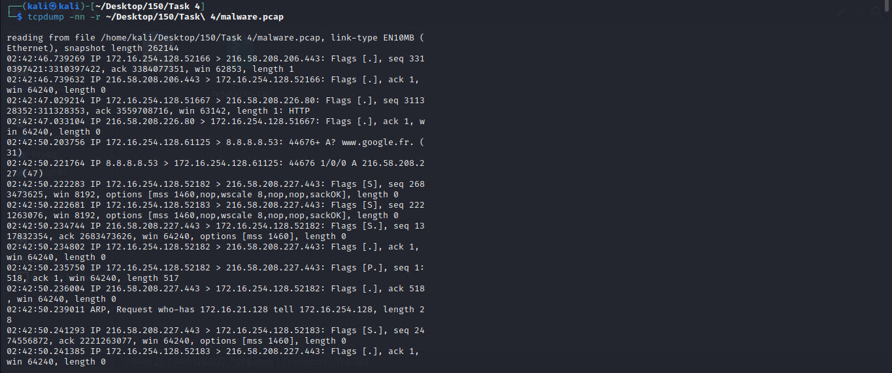
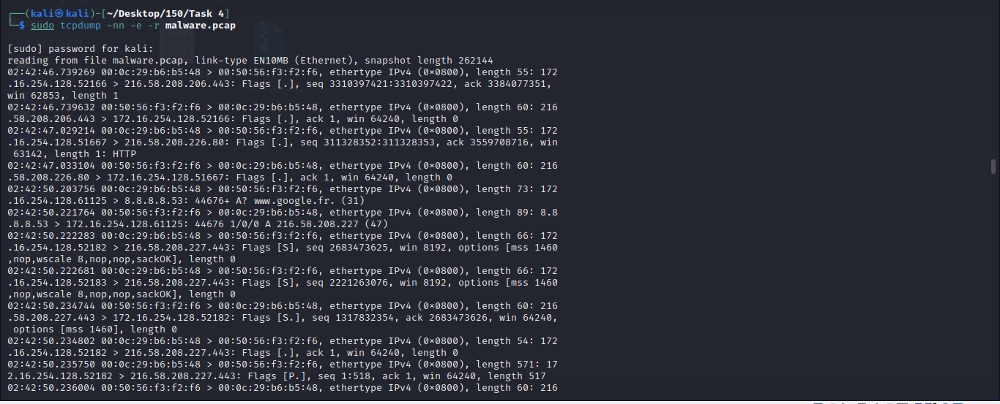

| Item | Value | Note |
|---|---|---|
| Laptop IP | **172.16.254.128** | Source of all outbound sessions |
| Laptop MAC | **00:0c:29:b6:b5:48** | OUI `00:0c:29` = **VMware** |
| Gateway MAC | 00:50:56:f3:f2:f6 | OUI `00:50:56` = **VMware** (NAT gateway) |
| DNS server | 8.8.8.8 (Google Public DNS) | |

**Finding:** both MAC addresses belong to VMware. "Tom's laptop" in this capture is a **virtual machine** behind VMware NAT, so the capture was made inside a lab, not on coffee-shop hardware. This matters for any claim about the physical network.

## Step 2 — Correct the C2 conclusion (real)
The first analysis identified `216.58.208.227:443` as a command-and-control server. The capture itself disproves this:

```
02:42:50.203756 IP 172.16.254.128.61125 > 8.8.8.8.53: 44676+ A? www.google.fr.
02:42:50.221764 IP 8.8.8.8.53 > 172.16.254.128.61125: 44676 1/0/0 A 216.58.208.227
02:42:50.222283 IP 172.16.254.128.52182 > 216.58.208.227.443: Flags [S] …
```
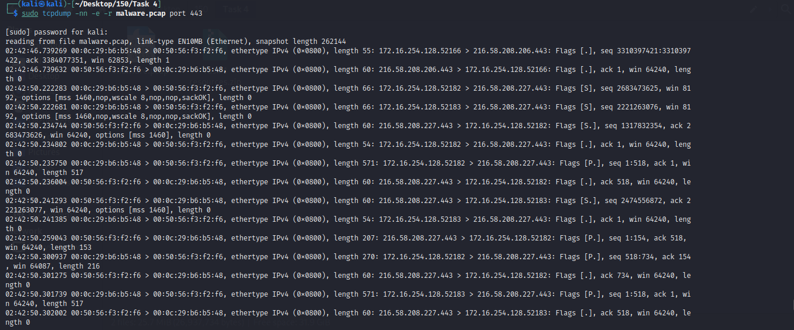

The laptop asked DNS for **www.google.fr**, received **216.58.208.227**, and immediately connected to it on 443. That is a normal visit to Google. Port 443 by itself is not evidence of C2; nearly all web traffic uses it. The other early flows (216.58.208.206, 216.58.208.226) are also Google ranges.

**Other observation:** `ARP, Request who-has 172.16.21.128 tell 172.16.254.128`. The laptop is asking for an address outside its own /24 on the local segment. This can indicate a misconfigured route, or software probing other hosts. Worth checking what generated it.

## Step 3 — Hunt for the real malicious traffic (Simulated Walkthrough)
> ⚠️ **Simulated data** below *(sim)*.

Method: exclude known-good destinations, then look at DNS names, unencrypted HTTP and timing.

```bash
# every DNS name the host resolved
tshark -r malware.pcap -Y 'dns.flags.response==0' -T fields -e frame.time -e dns.qry.name | sort -u
# HTTP requests (unencrypted)
tshark -r malware.pcap -Y http.request -T fields -e frame.time -e ip.dst -e http.host -e http.request.uri -e http.user_agent
# connection timing per destination (beaconing)
tshark -r malware.pcap -Y 'tcp.flags.syn==1 && tcp.flags.ack==0' -T fields -e frame.time_epoch -e ip.dst
# extract transferred files
tshark -r malware.pcap --export-objects http,./exported
```

**DNS queries** *(sim)*
| Time | Query | Answer | Assessment |
|---|---|---|---|
| 02:42:50 | www.google.fr | 216.58.208.227 | Normal |
| 02:43:12 | update-flash-player.example | 203.0.113.77 | Look-alike software update domain |
| 02:43:40 | k3x9-panel.example | 198.51.100.23 | Random-looking name, no website |

**HTTP requests** *(sim)*
| Time | Host | URI | User-Agent | Assessment |
|---|---|---|---|---|
| 02:43:13 | update-flash-player.example | /download/flashupdate.exe | Mozilla/5.0 (Windows NT 6.1) | Executable download over HTTP |
| 02:43:41 | k3x9-panel.example | /gate.php | (empty) | Typical bot "gate" check-in |

**Beaconing** *(sim)*: after 02:43:41 the host opens a TCP connection to 198.51.100.23:80 every **60 seconds ± 1 s**, each carrying a ~180-byte POST to `/gate.php`. Regular intervals with small, uniform payloads are the signature of an automated implant.

**Exported object** *(sim)*: `flashupdate.exe`, 412,672 bytes, SHA-256 `SIMULATED-SHA256-FLASHUPDATE`, PE32 executable, not signed. Hand over to [Project 18 — Malware Triage](../project-18-malware-triage/).

## Lab 4 — Timeline
| Time | Event | Source |
|---|---|---|
| 02:42:46 | Existing HTTPS/HTTP sessions to Google ranges | tcpdump (real) |
| 02:42:50 | DNS for www.google.fr → 216.58.208.227, HTTPS connection | tcpdump (real) |
| 02:42:50 | ARP request for 172.16.21.128 | tcpdump (real) |
| 02:43:12 | DNS for look-alike update domain | *(sim)* |
| 02:43:13 | `flashupdate.exe` downloaded over HTTP | *(sim)* |
| 02:43:41 | First check-in to `/gate.php` | *(sim)* |
| 02:44:41 → | Beacon every 60 s | *(sim)* |

---

## Problems Encountered
| Problem | What happened | Root cause | Fix | Lesson |
|---|---|---|---|---|
| "Files are corrupted" | nfdump skipped every block | Newer nfdump reading 1.5.x files | Use the 1.5.8 binary built from source | Read the error message literally before concluding corruption |
| Argus could not read `.ra` | `argus -r` returned "unknown packet file format" | `argus` is the sensor; `ra` is the reader | `ra -r file.ra` | Know which binary in a toolkit does what |
| Wrong rule explanation | Alert 1 described with Alert 2's rule logic | Copy/paste between sections | Explained each rule from its own content matches | Read the rule, not just the alert name |
| BAD-SSL treated as real SSL issue | Alert assumed to mean weak SSL | Trusted the message text | Checked the rule: 2 bytes, any port; fired on HTTP | Validate alerts against the packet |
| Google labelled as C2 | Port 443 connection treated as malicious | No DNS correlation | DNS shows the IP is www.google.fr | Resolve and enrich every IP before calling it malicious |
| VMware MACs not recognised | Host described as a physical laptop | OUIs not checked | `00:0c:29`, `00:50:56` = VMware | Look up OUIs |

## Findings Summary
| # | Finding | Evidence | Confidence |
|---|---|---|---|
| 1 | Lab 1 data is valid nfdump 1.5.x / Argus records; errors were tool-version and tool-choice issues | Error messages | High |
| 2 | SSH brute force with probable success against a DMZ host *(sim)* | nfdump / ra | *(sim)* |
| 3 | WAP BSSID 00:23:69:61:00:d0, SSID "Ment0rNet", channel 2, encrypted | tcpdump + tshark | High |
| 4 | Alert 2925 is a tracking pixel (privacy, informational) | Alert + rule | High |
| 5 | Alert 100000137 is a false positive from a weak rule | Alert on port 80 + rule logic | High |
| 6 | Captured "laptop" is a VMware VM; 216.58.208.227 is Google, not C2 | MAC OUIs, DNS answer | High |
| 7 | Malware downloaded from a look-alike update domain and beaconing every 60 s *(sim)* | DNS, HTTP, timing | *(sim)* |

## ATT&CK Mapping
- T1110.001 Brute Force: Password Guessing (Lab 1) *(sim)*
- T1189 Drive-by Compromise / T1204.002 User Execution (Lab 4) *(sim)*
- T1071.001 Web Protocols C2 and T1029 Scheduled Transfer / beaconing (Lab 4) *(sim)*

## IOCs *(simulated, fictional ranges)*
| Type | Value | Context |
|---|---|---|
| IPv4 | 203.0.113.45 | SSH brute-force source (Lab 1) |
| Domain / IP | update-flash-player.example / 203.0.113.77 | Malware download |
| Domain / IP | k3x9-panel.example / 198.51.100.23 | C2 gate |
| URI | /gate.php | Beacon endpoint |

## Deliverables
- [x] Lab 1 tool failure diagnosed
- [x] Lab 2 BSSID / SSID identified and verified
- [x] Lab 3 alerts and rules analysed, FP identified
- [x] Lab 4 host identified, C2 misattribution corrected
- [x] Lab 1 analysis and Lab 4 malicious traffic *(simulated)*
- [ ] Replace *(sim)* results with real output from nfdump 1.5.8, `ra` and tshark
- [ ] Final report in `report/`

## Key Learnings
1. Error messages usually say exactly what is wrong ("1.5.x block type no longer supported" means version mismatch, not corruption).
2. Never call an IP malicious before resolving it: DNS answers in the same capture often explain the traffic.
3. IDS alerts are hypotheses; the rule text and the packet decide whether they are real.
