# Project 16 — Super Timeline Analysis: "Lone Wolf" Case

**Status:** 🟡 Disk and memory analysis done with real evidence (Autopsy, Volatility 3) · merged timeline built from those results · remaining parsers (cloud sync DBs, cmdline/filescan, Plaso) shown as a simulated walkthrough (marked *(sim)*)
**Track:** DFIR

## Objective
Combine disk and memory evidence into one normalised timeline to establish what the suspect did, when, and why: motive, planning, where he stored his material, and what was happening when he was arrested.

## Scenario
Training scenario "Lone Wolf" (Digital Corpora, 2018). Jim Cloudy of Alexandria, VA, angry about gun-control coverage, wrote about his views and planned a "lone wolf" attack, copying his documents to several cloud services. After an argument with his brother Paul he destroyed his own laptop; Paul gave him an old **Dell Latitude E6430 ATG**. Paul later read the cloud documents and alerted police. Jim was arrested while chatting online, so RAM was captured from the running laptop.

**Investigative questions**
1. What shows motive and intent?
2. What planning took place, and when?
3. Which cloud services were used?
4. What external devices were connected?
5. What was running at the moment of seizure?

> The scenario is fictional. Planning artefacts are reported by **file name, location, timestamps and significance**; their operational content is not reproduced here.

## Environment
| Item | Value |
|---|---|
| Case ID | `CB-16-0001` |
| Tools | Autopsy 4.21.0, FTK Imager, Volatility 3 (2.26.2), Volatility 2.6.1 (pagefile attempt) |
| Autopsy display time zone | **Europe/London** (BST = UTC+1 from 25 Mar 2018) |
| Suspect's local time | US Eastern (EDT = UTC−4) |
| Reporting time zone | **UTC**, with EDT where it helps interpretation |

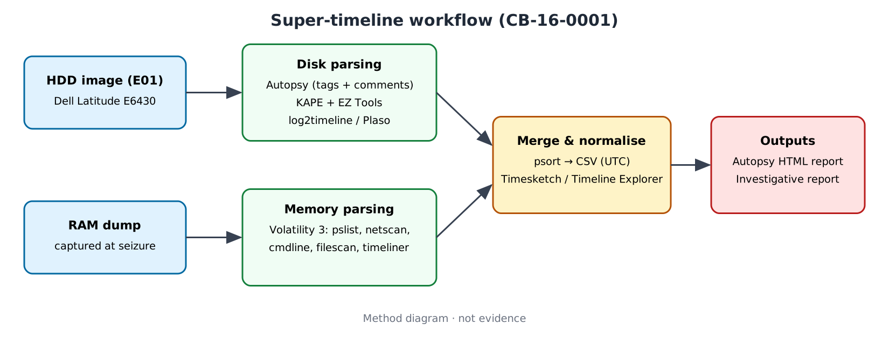

---

## Step 1 — Evidence and integrity
| Item | Value |
|---|---|
| Disk image | `LoneWolf.E01`, 512,110,190,592 bytes (≈ 512 GB), 512-byte sectors |
| MD5 | `7af48fa65519e84246b1729e5b68f140` |
| SHA-1 | `694e26624d1ea029eb50d793b198edf85be4b4fc` |
| Acquisition (E01 header) | Examiner Tom Moore, ADI 3.1.1.8, "Fri Apr 6 12:50:44 2018" |
| Memory image | `memdump.mem` |
| Ingest | 291,459 files, 41,699 artefacts |

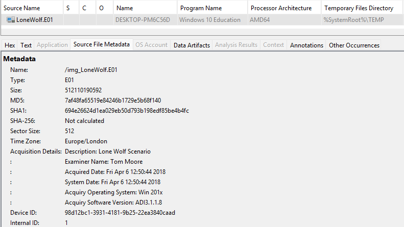
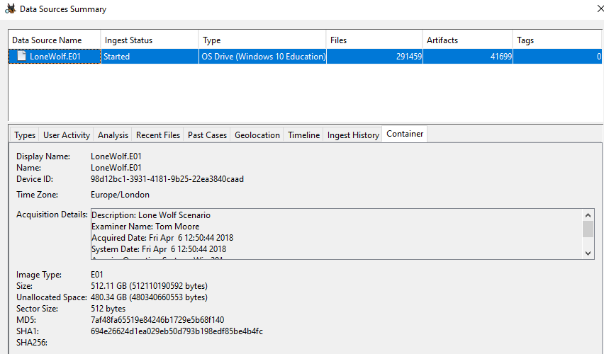

## Step 2 — System profile
| Property | Value |
|---|---|
| Computer name | **DESKTOP-PM6C56D** |
| OS | Windows 10 Education, AMD64 (build 16299 from memory) |
| Product ID | 00328-00089-23637-AA141 |
| User profile | **jcloudy** |
| Main volume | vol7, basic data partition, start sector 1,259,520 |

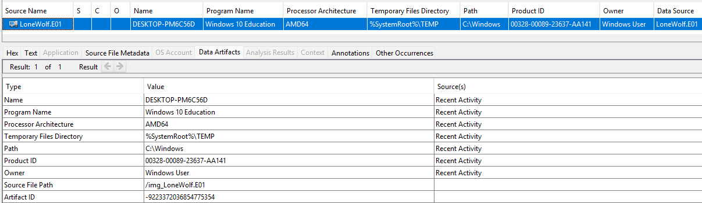
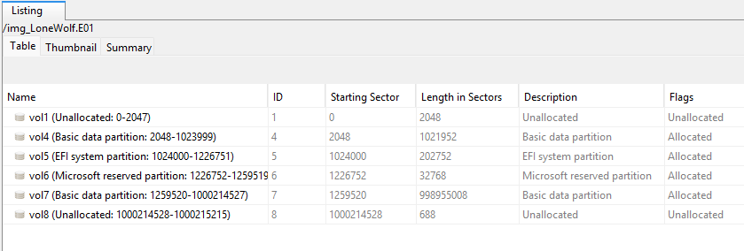

## Step 3 — Documents (motive, intent, planning)
| File | Location | Size | Key times (BST → UTC) | Significance |
|---|---|---|---|---|
| The Cloudy Manifesto.docx | Desktop; also Box Sync and Google Drive | 816,313 | Created 2018-04-02 02:35:27 BST → **01:35 UTC** (21:35 EDT, 1 Apr) | Statement of grievance and justification: **motive and intent** |
| Operation 2nd Hand Smoke.pptx | Box Sync/Desktop; also Google Drive | 4,408,968 | Modified 2018-04-04 06:11:27 BST; **Created 06:32:03 BST**; Accessed 2018-04-05 03:11:16 BST | Planning presentation: event details for **Sat 7 Apr 2018**, location imagery, route map and travel searches |
| Planning.docx | Box Sync/Desktop (allocated); Desktop (**deleted**) | 14,060 | 4 Apr 2018 | Planning checklist (target, supplies, escape, release of writings) |
| Cloudy thoughts (4apr).docx | Desktop | 12,547 | Internal metadata: created **2018-04-05 02:32 UTC**, modified 02:39 UTC (≈ 22:32 EDT, 4 Apr) | Personal reflections on the plan; author `jcloudy` |
| UKknifeBan.pdf | Desktop | 1,051,631 | Created 2018-04-05 06:51:41 BST | Saved news article on knife-control policy |
| AMEN.pdf, LeftUsesBoycotts.pdf | Desktop | 371,701 / 1,470,817 | 2018-04-06 ~04:55 BST | Saved opinion articles on gun control |

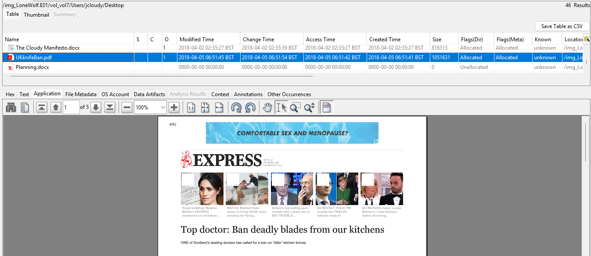
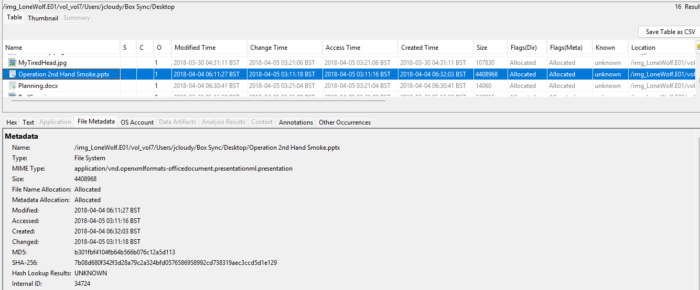
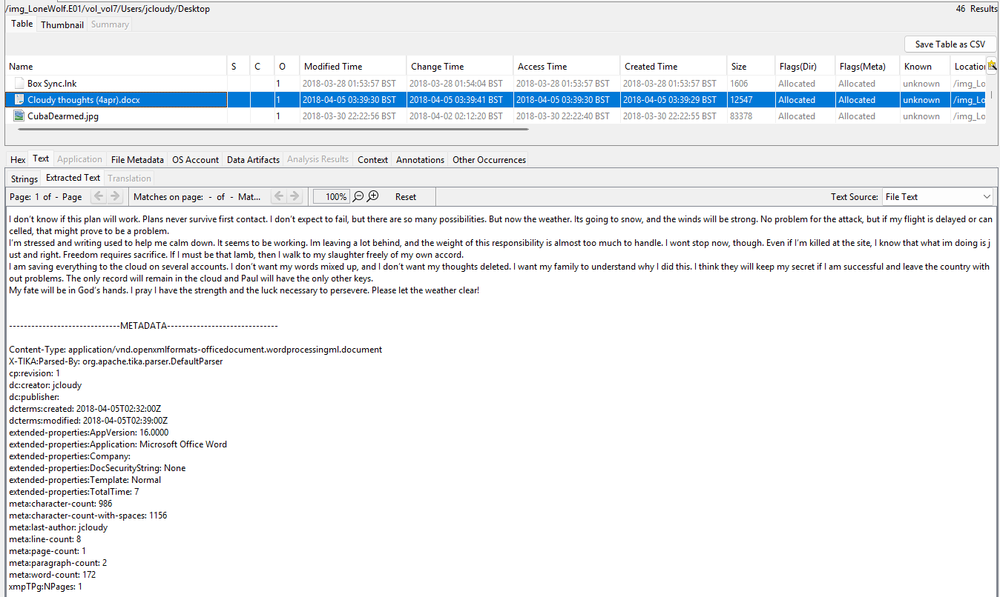

**Interpretation**
- **Copy into a sync folder:** the PPTX in Box Sync was *created* (06:32:03) **after** it was *last modified* (06:11:27). On NTFS, copying a file gives it a new Created time but keeps the original Modified time. The file was written elsewhere and then copied into the Box sync folder, matching the brief ("uploaded to a variety of cloud services").
- **Deleted original:** `Planning.docx` on the Desktop is **unallocated** (deleted) while a copy survives in Box Sync. The suspect removed the local copy but the synced copy remained.
- **Night-time activity:** document creation at ~21:30–01:30 EDT fits "spends odd hours on the computer".
- **Timeline of intent:** grievance (2 Apr) → planning files (4 Apr) → reflections (4–5 Apr) → event date (7 Apr).

## Step 4 — Cloud storage
| Service | Evidence |
|---|---|
| **Box** | `Box Sync` folder holding the planning files; `account.box.com` cookie |
| **Google Drive** | `Google Drive` folder holding the same PPTX and manifesto, plus `Brother Chat.gdoc` |
| **Dropbox** | `Dropbox.lnk`; `Dropbox.exe` running in memory |

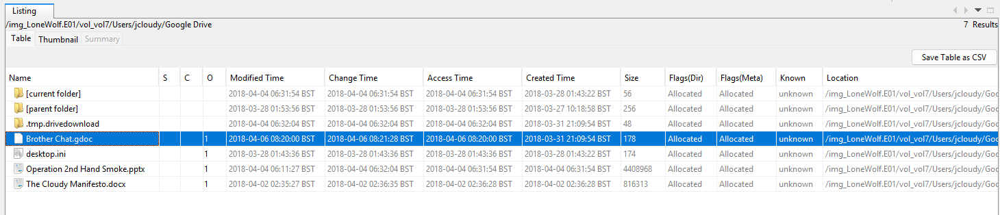
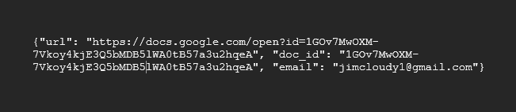

`Brother Chat.gdoc` is a 178-byte JSON **pointer**, not a document:
```json
{"url": "https://docs.google.com/open?id=1GOv7MwOXM-7Vkoy4kjE3Q5bMDB5lWA0tB57a3u2hqeA",
 "doc_id": "1GOv7MwOXM-7Vkoy4kjE3Q5bMDB5lWA0tB57a3u2hqeA", "email": "jimcloudy1@gmail.com"}
```
It proves the Google account (`jimcloudy1@gmail.com`) and the existence of a cloud document titled "Brother Chat". The content lives only in Google's cloud; a 404 when opening it is expected and the content would require a legal request to the provider.

## Step 5 — Downloaded images (origin)
Each saved image has a `Zone.Identifier` alternate data stream recording the **source URL** (e.g. pinimg.com, twimg.com, wallfocus.com, ctctcdn.com, memecdn.com). These prove the images were **downloaded from the internet** by the user rather than created on the machine, and show which sites he visited. The images themselves are political memes and slogans supporting the motive.


## Step 6 — Web activity
**Chrome searches (2018-03-31, BST)**
| Time (BST) | Search |
|---|---|
| 05:29:22 | molon labe (Facebook) |
| 05:36:31 – 05:37:14 | concealable tactical rifles |
| 05:37:19 | 9mm rifles |
| 05:42:08 | submachine guns |
| 05:42:23 – 05:43:13 | keltech / foldable kel tec |
| 05:44:13 – 05:44:24 | gunbroker / keltec 2000 site:gunbroker.com |
| 18:48:18 – 18:48:41 | gunstore near me / gun store near me |

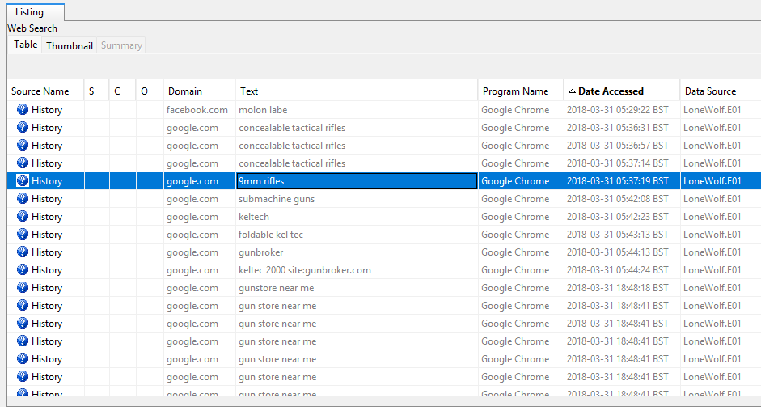

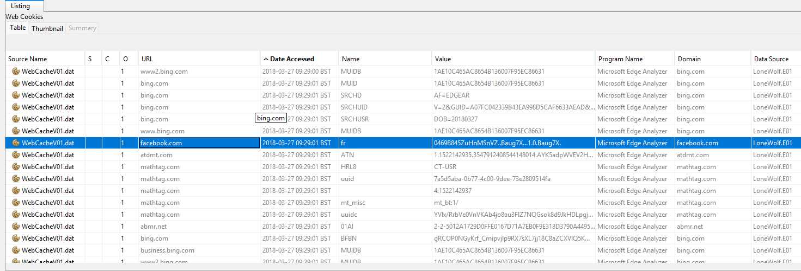

Other history: Twitter `#MolonLabe` hashtag pages (29 Mar), GunBroker listings (28 Mar), Bing, Facebook, Box, Dropbox. Edge WebCache cookies from 27 Mar.

**Interpretation:** a burst of weapon-acquisition searches at **~00:30 EDT** on 31 Mar, then local gun-store searches the same afternoon.

## Step 7 — USB devices
| Time (BST) | Device | Serial / ID |
|---|---|---|
| 2018-03-27 13:13:16 | SanDisk SDCZ80 Flash Drive | **AA010215170355310594** |
| 2018-03-27 22:45:44 | SanDisk SDCZ80 Flash Drive | **AA010603160707470215** |
| 2018-03-27 22:45:42–44 | Dell webcam, BCM20702A0 Bluetooth, Intel/root hubs | internal |

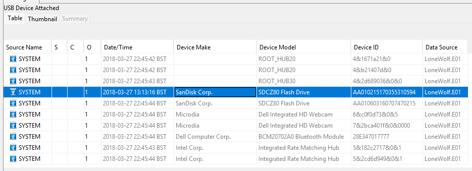

**Interpretation**
- These are **two different flash drives** (different serials), not one drive connected twice.
- The 22:45:4x entries appear together with the internal webcam, Bluetooth and hubs, within seconds of the system start time in memory (21:45:40 UTC = 22:45:40 BST). The second drive was **already plugged in at boot**.
- Neither drive was recovered; their serials are the identifiers to search for.

## Step 8 — Memory (Volatility 3)
```bash
python3 vol.py --single-location=$MEMORY_IMAGE windows.info
python3 vol.py --single-location=$MEMORY_IMAGE windows.pslist  > pslist.txt
python3 vol.py --single-location=$MEMORY_IMAGE windows.netscan > netscan.txt
python3 vol.py --single-location=$MEMORY_IMAGE windows.dlllist > dlllist.txt
```
| Item | Value |
|---|---|
| Capture time | **2018-04-06 12:42:32 UTC** (08:42:32 EDT) |
| OS | Windows 10 x64, build 16299, 4 processors |
| System start | 2018-03-27 21:45:40 UTC (uptime ≈ 9.6 days) |
| User processes | explorer.exe (6220), multiple chrome.exe, multiple Dropbox.exe |
| Local IP | 192.168.0.7 |
| Network | Chrome HTTPS sessions (e.g. to 54.239.16.35:443); spoolsv.exe listening on 49667 |
| DLLs | Standard Windows/application DLLs; no injection observed |

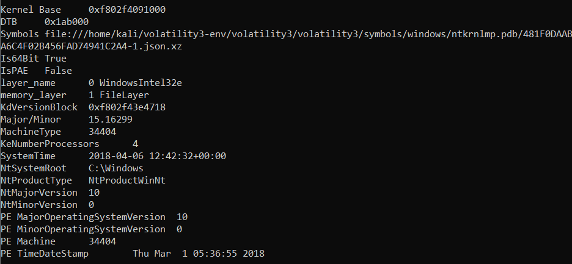
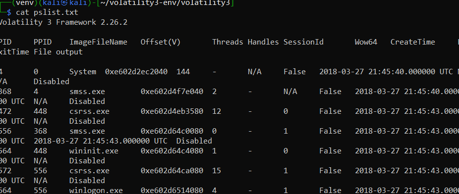
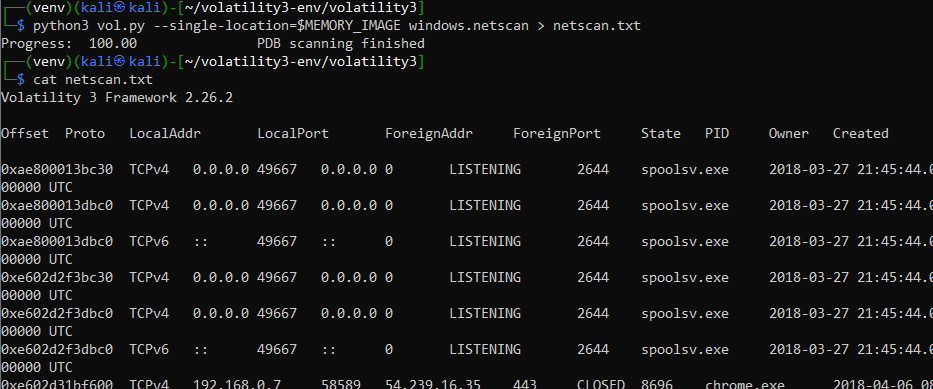
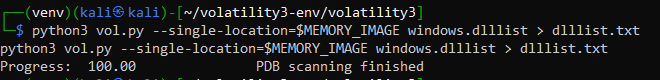

**Pagefile:** running Volatility 2 against `pagefile.sys` failed with *"No suitable address space mapping found"*. This is expected: a pagefile is not a memory image and cannot be analysed alone with process plugins. Use `strings` / YARA on the pagefile, or Volatility 3 with the pagefile layered onto the memory image.

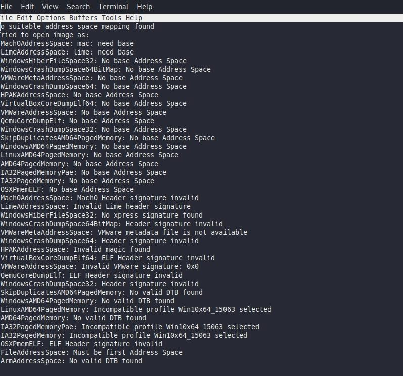

---

## Step 9 — Remaining parsers (Simulated Walkthrough)
> ⚠️ **Simulated data** below *(sim)*. Values are illustrative and do not come from the dataset.

```bash
python3 vol.py --single-location=$MEMORY_IMAGE windows.cmdline > cmdline.txt
python3 vol.py --single-location=$MEMORY_IMAGE windows.filescan | grep -i -E "box|dropbox|google drive" > cloud_files.txt
log2timeline.py --storage-file case.plaso LoneWolf.E01
psort.py -o l2tcsv -w disk_timeline.csv case.plaso "date > '2018-03-25'"
```
| Source | Result *(sim)* |
|---|---|
| Box Sync `sync.db` | Upload records for the manifesto and planning files with remote paths and upload times |
| Dropbox `filecache` / `config.dbx` | Linked account and synced file list |
| `windows.cmdline` | Chat client process with the conversation window open at capture |
| Recycle Bin (`$I`) | Deletion time of `Planning.docx` from the Desktop |

---

## Super Timeline (real events, UTC)
| UTC | EDT | Source | Event | Q |
|---|---|---|---|---|
| 2018-03-27 12:13:16 | 08:13 | SYSTEM\USBSTOR | SanDisk drive #1 connected | 4 |
| 2018-03-27 21:45:40 | 17:45 | Memory (pslist) | System boot (last boot before seizure) | 5 |
| 2018-03-27 21:45:44 | 17:45 | SYSTEM\USBSTOR | SanDisk drive #2 present at boot | 4 |
| 2018-03-28 | | Chrome history | GunBroker listings viewed | 2 |
| 2018-03-29 | | Chrome history | Twitter #MolonLabe pages | 1 |
| 2018-03-31 04:29–04:44 | 00:29–00:44 | Chrome searches | Rifle / submachine-gun / GunBroker searches | 2 |
| 2018-03-31 17:48 | 13:48 | Chrome searches | "gun store near me" | 2 |
| 2018-04-02 01:35:27 | 21:35 (1 Apr) | $MFT | Manifesto created on Desktop | 1 |
| 2018-04-04 05:11:27 | 01:11 | $MFT | Planning PPTX last modified | 2 |
| 2018-04-04 05:32:03 | 01:32 | $MFT | PPTX copied into Box Sync | 2, 3 |
| 2018-04-05 02:32–02:39 | 22:32 (4 Apr) | docProps | "Cloudy thoughts (4apr)" written | 1 |
| 2018-04-05 05:51:41 | 01:51 | $MFT | Knife-ban article saved | 1 |
| 2018-04-06 03:55 | 23:55 (5 Apr) | $MFT | AMEN.pdf, LeftUsesBoycotts.pdf saved | 1 |
| 2018-04-06 12:42:32 | 08:42 | Memory | RAM captured; Chrome and Dropbox running | 5 |
| 2018-04-07 | | PPTX content | Date of the planned event | 2 |

## Findings
| # | Finding | Evidence | Confidence |
|---|---|---|---|
| 1 | Manifesto and saved articles show grievance over gun control | Documents, downloads | High |
| 2 | Planning files created 3 days before the event date, mostly at night | $MFT, docProps | High |
| 3 | Planning files copied into Box Sync and Google Drive; Desktop original of Planning.docx deleted | Created > Modified, unallocated entry | High |
| 4 | Google account `jimcloudy1@gmail.com` linked to a cloud document "Brother Chat" | .gdoc pointer | High |
| 5 | Weapon-acquisition searches on 31 Mar | Chrome history | High |
| 6 | Two distinct SanDisk drives used; one present at the last boot | USBSTOR serials, boot time | High |
| 7 | At seizure: Chrome and Dropbox running, no malware or injection | Volatility 3 | High |

## Problems Encountered (corrections to the first report)
| Problem | Correction |
|---|---|
| Times reported in BST without saying so | Autopsy was set to Europe/London; all times normalised to UTC with EDT added |
| "One USB drive connected twice" | Two different serial numbers = two drives; the second entry coincides with boot |
| Pagefile "analysis" listed processes | The pagefile run failed; process data came from the memory image only |
| UKknifeBan.pdf shown with LeftUsesBoycotts.pdf metadata | Real values taken from the Desktop listing |
| Search terms listed without screenshots | Only searches visible in the evidence are reported |
| Copy-into-sync and deletion not noticed | Added from Created/Modified comparison and unallocated entry |
| Word "AI-generated content may be incorrect" captions left in figures | Removed; figures captioned by evidence name |
| Pages of interpretation per meme image | Summarised as one motive finding with download-origin evidence |

## Deliverables
- [x] Image hashes recorded
- [x] System and user profile
- [x] Documents, cloud, downloads, web, USB analysis
- [x] Memory analysis (info, pslist, netscan, dlllist)
- [x] Merged timeline from real artefacts
- [x] Sync-DB, cmdline/filescan and Plaso steps *(simulated)*
- [ ] Autopsy HTML report with categorised tags (`report/`)
- [ ] Investigative report (≤ 3,500 words)

## Key Learnings
1. Set or record the analysis time zone before reading a single timestamp.
2. Created-after-Modified is a reliable sign that a file was copied, which is how cloud-sync folders reveal what was uploaded.
3. USB serial numbers, not connection counts, identify devices.
4. Disk shows intent and preparation; memory shows what was happening at the moment of arrest.
