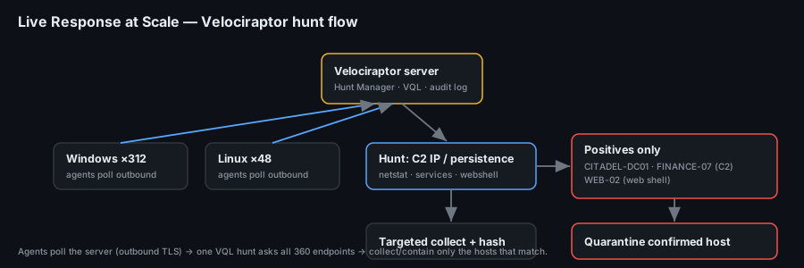

# Project 17 — Live Response at Scale (Playbook)

**Status:** 🟢 Incident-response **playbook / runbook** for fleet-wide live response with **Velociraptor**. The VQL is real and runnable; the hunt results shown are a simulated walkthrough (marked *(sim)*) that you replace with output from a real deployment.
**Track:** DFIR

## Objective
Give a responder a **step-by-step playbook** to answer one urgent question across a whole estate — *"is this IOC on any of our endpoints, right now?"* — **without imaging a single machine**. Deploy Velociraptor, hunt the fleet for IOCs / persistence / suspicious processes, pull targeted artefacts from the hosts that light up, quarantine a confirmed host, and document every VQL query used.

## When you reach for this
You found an IOC in another investigation (a C2 IP, a web-shell hash, a rogue service name) and need to know **its spread** before deciding scope. Imaging 500 machines takes weeks; a Velociraptor **hunt** answers in minutes because it asks every endpoint the same question and only collects from the ones that match.



## The IOCs we're hunting (carried from other projects)
This playbook reuses confirmed IOCs from earlier Code-Blue cases so the hunt is concrete:

| IOC | Type | Source project |
|---|---|---|
| `194.61.24.102` | C2 / external IP | [P11](../project-11-windows-disk-forensics/) / [P13](../project-13-event-log-investigation/) (Stolen Szechuan Sauce) |
| RDP brute force → new admin → service persistence | Behaviour | [P13](../project-13-event-log-investigation/) |
| Linux web shell `img_9931.php`, reverse-shell systemd unit | File / persistence | [P14](../project-14-linux-intrusion/) |

> "An IOC from another project must be checked on **every endpoint now**" — that's exactly what a hunt does.

## Environment
| Item | Value |
|---|---|
| Playbook ID | `CB-17-PLAYBOOK` |
| Server | Velociraptor server (self-signed or Let's Encrypt), GUI on :8889, frontend on :8000 |
| Clients | Windows + Linux endpoints running the Velociraptor agent |
| Access model | Clients poll the server (outbound TLS) — works through NAT, no inbound to endpoints |
| Time zone | Velociraptor stores timestamps in **UTC** |

---

## Stage 0 — Ground rules
- A hunt **touches every endpoint** — scope it tightly (label groups), cap concurrency, and set a client limit on the first run.
- Prefer **read/collect** artefacts first; keep anything that changes a host (quarantine, remediation) as a separate, deliberate step.
- Everything you run is VQL and is **logged server-side** — that log *is* your chain of custody. Export it.

## Stage 1 — Deploy server and clients
```bash
# Server: generate config, then run
velociraptor config generate -i            # interactive; sets datastore, GUI user, DNS/SSL
velociraptor --config server.config.yaml frontend -v

# Build a client MSI/deb from the client config and deploy via GPO/Intune/Ansible
velociraptor --config client.config.yaml package
```
Confirm clients are checking in:
```sql
-- GUI → Notebook / VQL
SELECT client_id, os_info.hostname, os_info.system, last_seen_at
FROM clients()
ORDER BY last_seen_at DESC
```
**Example *(sim)*** — 312 Windows + 48 Linux endpoints online.

## Stage 2 — Hunt for the network IOC (C2 IP)
Ask every host whether it has (or had) a connection to the C2.

**Live connections (Windows + Linux)**
```sql
SELECT Pid, Name, Family, Status, Laddr.IP, Raddr.IP AS RemoteIP, Raddr.Port
FROM netstat()
WHERE RemoteIP = "194.61.24.102"
```
Package it as a hunt over the whole fleet (GUI → Hunt Manager → `Generic.Client.Stats`/`Windows.Network.Netstat`, or a custom artefact). **Historical** evidence lives in logs/DNS cache, so also run:
```sql
-- Windows DNS client cache for the IOC / known-bad domains
SELECT * FROM Artifact.Windows.System.DNSCache() WHERE Name =~ "194.61.24.102"
```
**Example hunt result *(sim)***
| client | hostname | RemoteIP | proc |
|---|---|---|---|
| C.a1b2 | CITADEL-DC01 | 194.61.24.102 | iexplore.exe |
| C.f9e8 | FINANCE-07 | 194.61.24.102 | mstsc.exe |

→ Two hosts talked to the C2. CITADEL-DC01 is the known case; **FINANCE-07 is new** — the hunt just expanded the incident.

## Stage 3 — Hunt for persistence and suspicious processes
**Windows — rogue services / autoruns / scheduled tasks**
```sql
SELECT * FROM Artifact.Windows.Persistence.PermanentWMIEvents()
SELECT Name, PathName, StartMode FROM Artifact.Windows.System.Services()
  WHERE PathName =~ "(?i)\\\\Temp\\\\|powershell|[a-z]{8}\\.exe"
SELECT * FROM Artifact.Windows.System.TaskScheduler()
```
**Windows — suspicious processes (unsigned, odd parent, temp path)**
```sql
SELECT Pid, Ppid, Name, Exe, CommandLine, Username
FROM Artifact.Windows.System.Pslist()
WHERE Exe =~ "(?i)\\\\(Temp|ProgramData|Users\\\\Public)\\\\" OR CommandLine =~ "(?i)-enc |FromBase64"
```
**Linux — web shell + reverse-shell persistence (from P14)**
```sql
-- web shell in web-writable dirs
SELECT FullPath, Mtime, Size FROM glob(globs="/var/www/**/*.php")
  WHERE FullPath =~ "uploads|img_9931"
-- reverse-shell systemd units / cron
SELECT FullPath, Data FROM Artifact.Linux.Sys.Services() WHERE Data =~ "/dev/tcp/|bash -i"
SELECT * FROM Artifact.Linux.Sys.Crontab() WHERE Line =~ "curl|wget|bash"
```
**Example *(sim)***: FINANCE-07 has a service `netsvc` running from `C:\ProgramData\netsvc.exe`; one Linux host `WEB-02` has `/var/www/html/uploads/img_9931.php`.

## Stage 4 — Collect targeted artefacts from positive hosts
Only from the hosts that matched — targeted, fast, defensible.
```sql
-- Full triage pack from one host (KAPE-equivalent collection)
SELECT * FROM Artifact.Windows.KapeFiles.Targets(Device="C:", _SANS_Triage=TRUE)
-- Or specific artefacts:
SELECT * FROM Artifact.Windows.EventLogs.Evtx(path="...Security.evtx")
SELECT * FROM Artifact.Generic.Collectors.File(path="C:/ProgramData/netsvc.exe")   -- grab the binary
-- hash + VirusTotal lookup on the collected sample (offline-safe: hash only if no VT)
SELECT FullPath, Hash.SHA256 FROM hash(path="C:/ProgramData/netsvc.exe")
```
Collections land in the server's datastore with hashes — download for deeper analysis (feeds [P18 Malware Triage](../project-18-malware-triage/)).

## Stage 5 — Quarantine a confirmed host
Once a host is confirmed compromised, isolate it **from Velociraptor** (the agent keeps talking to the server, everything else is cut):
```sql
-- Windows host isolation
SELECT * FROM Artifact.Windows.Remediation.Quarantine(client_id="C.f9e8")
-- Linux host isolation
SELECT * FROM Artifact.Linux.Remediation.Quarantine(client_id="C.web02")
```
Record the time and operator. Un-quarantine is the same artefact with the policy removed — do it only after eradication.

## Stage 6 — Document the VQL (chain of custody)
Every query, who ran it, when, and the result count — exported from the server audit log. Reference copies in [`vql/`](vql/):
- `hunt-c2-netstat.vql` — fleet netstat for the C2 IP
- `hunt-windows-persistence.vql` — services / tasks / WMI autoruns
- `hunt-linux-webshell.vql` — web shell + reverse-shell unit + cron
- `collect-triage.vql` — targeted triage collection from a positive host

## Outputs
| Deliverable | Where |
|---|---|
| VQL queries | [`vql/`](vql/) |
| Hunt results *(sim)* | tables above |
| Newly-found host | FINANCE-07 (C2), WEB-02 (web shell) — *(sim)* |
| Isolated host | FINANCE-07 — *(sim)* |

## ATT&CK context
Live response is **detection & response**, not an attack technique. The hunts map to the adversary behaviours they find:
- T1071/T1571 C2 (netstat/DNS hunt) · T1543.003 Windows Service · T1053 Scheduled Task/Cron
- T1505.003 Web Shell · T1546 Event-triggered execution (WMI) · T1548/T1078 (context from P13/P14)
- Defensive: **D3-NTA / D3-HD** host/network hunting; isolation = containment control

## Deliverables
- [x] Velociraptor deploy steps (server + clients)
- [x] Fleet hunts for C2 IP, Windows persistence, Linux web shell
- [x] Targeted collection from positive hosts
- [x] Host quarantine procedure
- [x] VQL library + flow diagram
- [ ] Run on a real (lab) fleet and replace every *(sim)* result
- [ ] Final report in `report/`

## Key Learnings
1. **Hunt, don't image** — to answer "where else is this?" across an estate, a VQL hunt beats disk imaging by orders of magnitude.
2. **One IOC expands the incident**: hunting `194.61.24.102` across the fleet turned a one-host case into a two-host one (FINANCE-07).
3. **Collect only from positives** — targeted, hash-verified collections keep the response fast and the evidence defensible.
4. **Velociraptor can contain, not just observe** — the Quarantine artefact isolates a host while keeping the agent reachable.
5. **The VQL log is the chain of custody** — export it; a hunt you can't reproduce isn't evidence.
