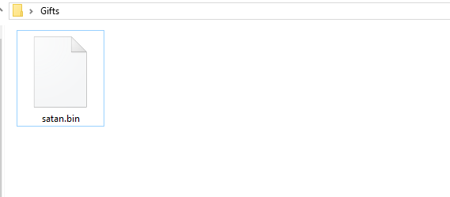
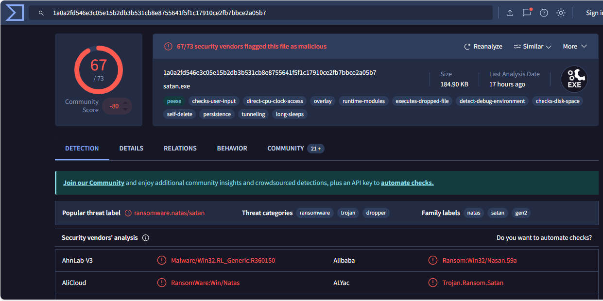
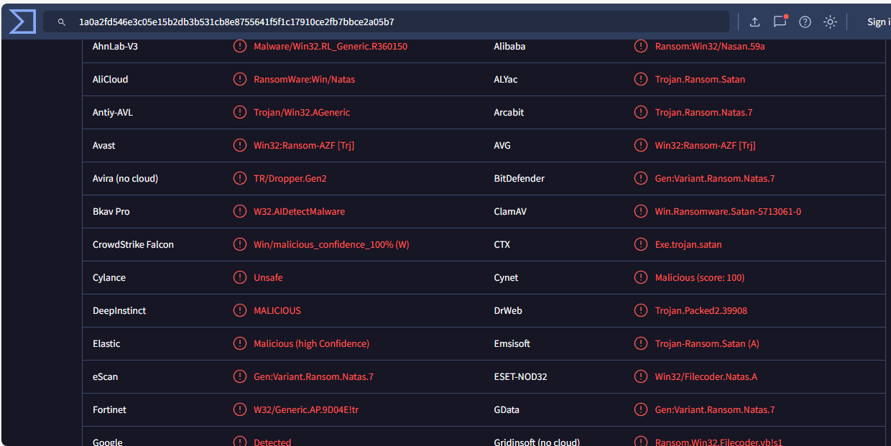

# Project 18 — Malware Triage

**Status:** 🟡 Hash-reputation triage of a ransomware sample done with real evidence · static analysis, sandboxed dynamic analysis, YARA and IOC extraction shown as a simulated walkthrough (marked *(sim)*)
**Track:** DFIR

## Objective
Triage a suspicious executable safely: identify it, decide whether it is malicious, describe what it does, and produce IOCs and a detection rule the SOC can use, without ever running it outside an isolated lab.

## Scenario
A file named `satan.bin` was found in a user's `Gifts` folder. The SOC needs to know what it is, how dangerous it is, and what to block.



## Safety rules
| Rule | Why |
|---|---|
| Look up the **hash** first; do not upload unknown files from a real case | Uploading shares the file (and possibly client data) with third parties |
| Keep live samples inside password-protected archives (`infected`) | Prevents accidental execution and AV deletion |
| Analyse only in an isolated VM with no network and a clean snapshot | Ransomware can encrypt shared folders and spread |
| Never commit samples to Git; record **hash + source** only | Repos are public |

> Lesson from the first attempt: the sample was downloaded from a public malware repository directly to the analyst's Windows host. It should have been fetched inside the analysis VM, or not downloaded at all, since a hash lookup answers the first question.

## Environment
| Item | Value |
|---|---|
| Case ID | `CB-18-0001` |
| Reputation | VirusTotal (hash lookup) |
| Static (planned) | REMnux: `file`, `exiftool`, `pefile`/`pecheck`, `capa`, `floss`, `diec` |
| Dynamic (planned) | FLARE VM (Windows 10, host-only network) with Procmon, Process Hacker, FakeNet-NG, Regshot |

---

## Step 1 — Identification and reputation (real)
```bash
sha256sum satan.bin
# 1a0a2fd546e3c05e15b2db3b531cb8e8755641f5f1c17910ce2fb7bbce2a05b7
```

| Field | Value |
|---|---|
| File name on VirusTotal | `satan.exe` |
| Size | 184.90 KB |
| Type | Win32 PE executable (`peexe`) |
| SHA-256 | `1a0a2fd546e3c05e15b2db3b531cb8e8755641f5f1c17910ce2fb7bbce2a05b7` |
| Detections | **67 / 73** engines |
| Community score | −80 |
| Popular threat label | `ransomware.natas/satan` |
| Threat categories | ransomware, trojan, dropper |
| Family labels | natas, satan, gen2 |



**Behaviour tags reported by VirusTotal sandboxes**
| Tag | Meaning for the analyst |
|---|---|
| detect-debug-environment, long-sleeps, direct-cpu-clock-access | **Anti-analysis**: checks for debuggers/sandboxes and delays execution to outlast automated sandboxes |
| executes-dropped-file, overlay | **Dropper**: carries extra data and runs a second file it writes to disk |
| persistence | Survives reboot (Run key, service or scheduled task) |
| self-delete | Removes its own executable after running, reducing disk evidence |
| checks-disk-space, checks-user-input | Environment checks before encrypting |
| tunneling | Network traffic through a tunnel / proxy |

**Selected vendor names**
| Vendor | Detection |
|---|---|
| AliCloud | RansomWare:Win/Natas |
| ALYac | Trojan.Ransom.Satan |
| Arcabit | Trojan.Ransom.Natas.7 |
| BitDefender | Gen:Variant.Ransom.Natas.7 |
| ClamAV | Win.Ransomware.Satan-5713061-0 |
| CrowdStrike Falcon | win/malicious_confidence_100% (W) |
| Elastic | Malicious (high confidence) |
| ESET-NOD32 | Win32/Filecoder.NatasA |
| Fortinet | W32/Generic.AP.9004E!tr |
| Avira | TR/Dropper.Gen2 |



**Verdict (real):** confirmed **malicious**. Near-unanimous detection, consistent family names (Satan / Natas, "Filecoder"), and ransomware + dropper categories identify it as a known ransomware strain. The hash alone is enough to block it.

> Background (public reporting, not observed in this lab): Satan was offered as **ransomware-as-a-service** from 2017, letting affiliates generate their own builds; later variants added propagation through known exploits. Verify details against current threat-intel sources before relying on them.

---

## Step 2 — Static analysis (Simulated Walkthrough)
> ⚠️ **Simulated data.** Step 1 is real. Steps 2–6 show the workflow I would follow inside REMnux / FLARE VM; values are **illustrative** and must not be used as IOCs.

```bash
file satan.bin
diec satan.bin                       # packer / compiler
pecheck satan.bin                    # headers, sections, entropy, imports
floss satan.bin > floss.txt          # static + decoded strings
capa satan.bin > capa.txt            # capabilities mapped to ATT&CK
```
| Check | Result *(sim)* |
|---|---|
| Compiler / packer | Packed (UPX-like); high-entropy section |
| Sections | `.text` entropy 7.8 → packed code |
| Imports (after unpacking) | `CryptAcquireContext`, `CryptGenKey`, `FindFirstFileW`, `MoveFileExW`, `ShellExecuteW` |
| Strings | Ransom-note file name, file-extension list, a `vssadmin` command line |
| capa | "encrypt data using RSA/AES", "enumerate files recursively", "delete volume shadow copies", "self delete" |

## Step 3 — Dynamic analysis in isolation (Simulated Walkthrough)
| Observation *(sim)* | Tool | Meaning |
|---|---|---|
| Drops a second executable in `%TEMP%` and launches it | Procmon, Process Hacker | Matches `executes-dropped-file` |
| Runs `vssadmin delete shadows /all /quiet` | Procmon (process create) | Prevents recovery from shadow copies |
| Adds a `Run` key value | Regshot | Persistence |
| Renames user files with a new extension and writes a ransom note to each folder | Procmon (file ops) | Encryption |
| DNS request to a `.onion`-proxy style domain | FakeNet-NG | C2 / key exchange attempt |
| Original executable deleted | Procmon | `self-delete` |

## Step 4 — YARA rule (illustrative template)
Saved in [`queries/satan_triage.yar`](queries/satan_triage.yar). The string values are **placeholders** to be replaced with strings confirmed by `floss` on the sample.
```yara
rule Ransomware_Satan_Triage_Template
{
  meta:
    description = "Triage template for Satan/Natas ransomware - replace placeholders with verified strings"
    sha256      = "1a0a2fd546e3c05e15b2db3b531cb8e8755641f5f1c17910ce2fb7bbce2a05b7"
    status      = "template - not validated"
  strings:
    $note   = "PLACEHOLDER_RANSOM_NOTE_NAME" ascii wide
    $ext    = "PLACEHOLDER_ENCRYPTED_EXTENSION" ascii wide
    $vss    = "vssadmin delete shadows" ascii wide nocase
    $crypt1 = "CryptGenKey" ascii
  condition:
    uint16(0) == 0x5A4D and filesize < 1MB and 2 of them
}
```
Validate before use: no false positives on a clean Windows folder (`yara -r rule.yar C:\Windows\System32`), true positive on the sample.

## Step 5 — IOCs
| Type | Value | Status |
|---|---|---|
| SHA-256 | `1a0a2fd546e3c05e15b2db3b531cb8e8755641f5f1c17910ce2fb7bbce2a05b7` | **Real** |
| File name | `satan.exe` / `satan.bin` | **Real** |
| Dropped file, registry value, domain | from dynamic analysis | *(sim)* |

## Step 6 — Detection and response
| Control | Action |
|---|---|
| EDR / AV | Block hash; alert on process tree "unknown exe → vssadmin delete shadows" |
| SIEM (see [Project 05](../../A-soc-siem/project-05-detection-engineering-sigma/)) | Sigma rule for `vssadmin.exe` with `delete shadows` |
| Backups | Offline / immutable backups; shadow-copy deletion alert is the last warning before encryption |
| IR | Isolate host, collect memory before reboot ([Project 12](../project-12-windows-memory-forensics/)), follow ransomware playbook ([Project 28](../../D-incident-response/project-28-ransomware-ir/)) |

## ATT&CK Mapping
| Technique | Source |
|---|---|
| T1486 Data Encrypted for Impact | VirusTotal category (real) |
| T1497 Virtualization/Sandbox Evasion | `detect-debug-environment`, `long-sleeps` (real tags) |
| T1070.004 Indicator Removal: File Deletion | `self-delete` (real tag) |
| T1547.001 Registry Run Keys | `persistence` (real tag; mechanism *(sim)*) |
| T1490 Inhibit System Recovery | shadow-copy deletion *(sim)* |

## Problems Encountered
| Problem | Fix | Lesson |
|---|---|---|
| Live sample downloaded to the host | Hash lookup first; samples only inside the analysis VM | Treat every sample as live |
| Report linked the public download URL | Removed; record hash and repository name only | Don't publish paths to live malware |
| Triage stopped at "VirusTotal says malicious" | Added behaviour-tag interpretation, ATT&CK and detection steps | Reputation is the start of triage, not the end |

## Deliverables
- [x] Hash, identification and reputation
- [x] Behaviour-tag interpretation and verdict
- [x] ATT&CK mapping and response actions
- [x] Static, dynamic, YARA and IOC workflow *(simulated)*
- [ ] Run Steps 2–3 in REMnux / FLARE VM and replace *(sim)* values
- [ ] Validate the YARA rule

## Key Learnings
1. A hash lookup is the safest first step and often enough to block.
2. Sandbox behaviour tags translate directly into ATT&CK techniques and detections.
3. Shadow-copy deletion is the most reliable early warning of ransomware.
