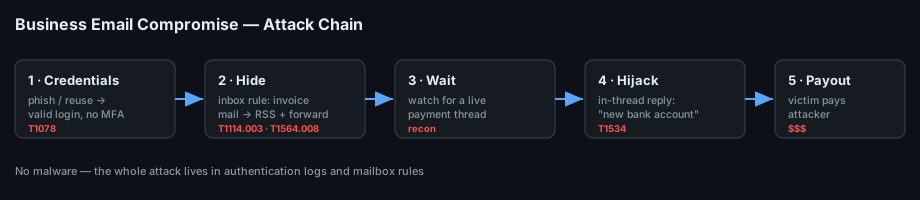

# Project 20 — Business Email Compromise (Playbook)

**Status:** 🟢 Incident-response **playbook / runbook** for a compromised mailbox used to commit invoice fraud. No seized mailbox here; the queries are real and runnable, and the example findings are a simulated walkthrough (marked *(sim)*) that you replace with output from a real case.
**Track:** Cybercrime Investigation

## Objective
Give a responder a **step-by-step playbook** for a BEC / invoice-fraud case: confirm the mailbox compromise, find the malicious logins, uncover the hidden forwarding and inbox rules that let the attacker operate unseen, reconstruct the hijacked payment thread, scope the blast radius, contain the account, and produce a timeline + impact report.

## How to use this document
A **runbook**, not a case report. Each stage carries:
- **Goal** — the question you're answering.
- **Where to look** — the log/source, for both a self-hosted server (Zimbra/Carbonio/Postfix) and cloud (Microsoft 365 / Google Workspace).
- **Queries** — copy-paste ready.
- **Example *(sim)*** — an illustrative finding so you can see the shape of the answer.

## What BEC actually is
No malware required. The attacker gets **valid credentials** (phishing or reuse), signs in as the user, quietly sets a **forwarding rule** or **inbox rule** to hide replies, waits for a real invoice/payment thread, then **hijacks it** — replying from the real mailbox (or a look-alike domain) with new "updated" bank details. The victim pays the attacker. The whole attack lives in **authentication logs and mailbox rules**, which is where this playbook hunts.



## Scenario (reference case for the examples)
Finance at *Northwind Traders* paid a genuine vendor invoice to a **new bank account** supplied in a reply on an existing thread. The vendor never changed banks. Investigation shows the vendor's (or an internal) mailbox was accessed from an unfamiliar IP, an **inbox rule** moved the vendor's real replies to RSS/Archive, and the attacker replied in-thread with fraudulent account details.

> Fictional scenario. Documentation ranges (RFC 5737 IPs, `.example` domains) are used throughout so the playbook carries no real-looking indicators.

## Environment
| Item | Value |
|---|---|
| Playbook ID | `CB-20-PLAYBOOK` |
| Mail platforms | Microsoft 365 / Exchange Online, Google Workspace, **and** self-hosted Zimbra/Carbonio/Postfix |
| Sources | Unified Audit Log (M365), Admin audit + Login audit (Workspace), `audit.log`/`mailbox.log` (Zimbra/Carbonio), Postfix `maillog`, SIEM |
| Time zone | Keep everything in **UTC**; note each user's local offset for the report |

---

## Stage 0 — Intake and scope (do this first)
**Goal:** freeze the facts before evidence rolls off.

- Capture the **fraud facts**: which invoice, amount, the "new" account number, the exact message that carried it (save the **full headers** / `.eml`).
- Identify the **victim mailbox(es)** — the one that sent the bad reply and any finance recipient.
- **Do not** delete the suspicious rule or reset the password yet if you can still collect — but if funds are moving, containment (Stage 6) wins over evidence. Note the time you change anything.
- Start a **recall / bank-fraud** track in parallel: time matters more for money recovery than for forensics.

```text
Record now:  invoice #, amount, beneficiary account, sending address,
             received time (UTC), and SHA-256 of the saved .eml
```

## Stage 1 — Preserve the message and read the headers
**Goal:** prove whether the fraudulent reply came from the **real mailbox** (account takeover) or a **look-alike domain** (spoof/impersonation) — they lead to different investigations.

```bash
# From the saved .eml, pull the trail
grep -iE "^(From|Reply-To|Return-Path|Received|Authentication-Results|Message-ID):" fraud.eml
```
**What to look for:**
- `Authentication-Results:` — SPF/DKIM/DMARC `pass` **only proves the sending domain controls the server**, not that the message is honest. A `pass` from the *real* domain = likely account takeover. A `pass` from a *different* domain (`northwind-traders.example` vs `northwlnd-traders.example`) = look-alike impersonation.
- `Reply-To:` differing from `From:` — classic redirect of the victim's reply to attacker-controlled inbox.
- `Received:` chain — the originating IP and whether it matches the vendor's usual infrastructure.

**Example *(sim)***
```
From: accounts@northwind-traders.example        <- real domain
Reply-To: accounts@northwind-traders.example
Received: from [203.0.113.88]  (unfamiliar IP, not vendor's mail host)
Authentication-Results: dkim=pass header.d=northwind-traders.example
```
→ DKIM passes for the **real** domain from an **unfamiliar IP** → account takeover, not spoofing. Pivot to Stage 2.

## Stage 2 — Find the malicious sign-ins
**Goal:** when did the attacker get in, from where, and how (was MFA bypassed)?

**Microsoft 365 (Unified Audit Log / Entra sign-ins)**
```powershell
Search-UnifiedAuditLog -StartDate (Get-Date).AddDays(-30) -EndDate (Get-Date) `
  -Operations UserLoggedIn,MailItemsAccessed -UserIds victim@northwind-traders.example |
  Select CreationDate,ClientIP,Operations | Sort CreationDate
# Entra: Sign-in logs → filter user → look at IP, location, "Status", "Conditional Access", "Client app"
```
**Google Workspace**
```text
Admin console → Reporting → Audit → Login:  filter the user,
columns = time, IP, event (login_success / login_challenge), is_suspicious
```
**Zimbra / Carbonio (self-hosted)**
```bash
# Successful web/IMAP auth with source IP
grep -E "oip=|ip=" /opt/zimbra/log/audit.log | grep victim@ | grep -i success
zmprov gaa | while read u; do :; done   # (account enumeration helper)
grep "victim@" /var/log/maillog | grep -iE "sasl|login"
```
**What to look for:** a sign-in from a new country/ASN, a **legacy/IMAP** client (common MFA-bypass path), impossible travel, or a token-replay sign-in with no interactive MFA.

**Example *(sim)***
| Time (UTC) | IP | Location | Client | Result |
|---|---|---|---|---|
| 2025-10-01 03:12 | 203.0.113.88 | (unfamiliar) | IMAP / legacy | Success, no MFA |
| 2025-10-01 03:14 | 203.0.113.88 | (unfamiliar) | OWA | MailItemsAccessed |

→ Compromise at **2025-10-01 03:12 UTC** via legacy auth from `203.0.113.88`.

## Stage 3 — Find the hidden rules (the heart of BEC)
**Goal:** find the forwarding / inbox rule that let the attacker operate silently. **This is the single most important stage.**

**Microsoft 365**
```powershell
# Inbox rules per mailbox (look for Delete/MoveToFolder RSS/Archive, or ForwardTo external)
Get-InboxRule -Mailbox victim@northwind-traders.example | Format-List Name,Enabled,From,MoveToFolder,ForwardTo,DeleteMessage,RedirectTo
# Mailbox-level forwarding
Get-Mailbox victim@... | Select ForwardingSmtpAddress,DeliverToMailboxAndForward
# Audit log for rule creation
Search-UnifiedAuditLog -Operations New-InboxRule,Set-InboxRule,Set-Mailbox -UserIds victim@...
```
**Google Workspace**
```text
Admin → user → Gmail settings:  Filters, Forwarding (check for auto-forward to external),
Delegation.   Audit → "email forwarding" / filter-created events.
```
**Zimbra / Carbonio**
```bash
# Server-side filter rules and forwarding for the account
zmprov ga victim@domain zimbraMailSieveScript zimbraPrefMailForwardingAddress \
  zimbraPrefMailLocalDeliveryDisabled
```
**What to look for:** a rule named a single character or " " (blank), that **moves messages containing "invoice/payment/bank/wire"** to RSS Feeds / Archive / Deleted and/or **forwards externally** — so the victim never sees the vendor's real replies.

**Example *(sim)***
```
Name:            .
Enabled:         True
From:            {contains "invoice","payment","bank details"}
MoveToFolder:    RSS Feeds
ForwardTo:       collector@mail-archive.example
```
→ Rule `.` created 2025-10-01 03:20 UTC hides finance replies and forwards them out. (**T1114.003**, **T1564.008**)

## Stage 4 — Reconstruct the fraudulent thread
**Goal:** show exactly what the victim saw vs. what was real.

- Pull the **full thread** by `Conversation-ID` / `References` / `In-Reply-To` from both mailboxes.
- Line up: original genuine invoice → attacker's in-thread reply with the **new account** → victim's payment confirmation.
- Diff the **bank details** between the genuine vendor message and the fraudulent reply.
- Note any **auto-moved** genuine replies recovered from RSS/Archive (Stage 3) — these prove the victim was blinded.

**Example *(sim)***
| Time (UTC) | Message | Account quoted |
|---|---|---|
| 2025-09-28 | Vendor → Finance: genuine invoice #4471 | ACME Bank ••••2231 |
| 2025-10-01 03:40 | "Vendor" reply (from compromised mbox): *"our bank changed"* | New Bank ••••9087 |
| 2025-10-01 09:05 | Finance → Vendor: *"payment sent"* (moved to RSS by the rule) | — |

## Stage 5 — Scope the blast radius
**Goal:** make sure this is the only compromised account and nothing else was touched.

```powershell
# Any other mailboxes with new external forwarding?
Get-Mailbox -ResultSize Unlimited | ? {$_.ForwardingSmtpAddress -ne $null} |
  Select PrimarySmtpAddress,ForwardingSmtpAddress
# All rule changes tenant-wide in the window
Search-UnifiedAuditLog -StartDate 2025-09-30 -EndDate 2025-10-03 -Operations New-InboxRule,Set-InboxRule
```
Check: the attacker IP against **all** users' sign-ins; any **consent grants** to OAuth apps (token persistence); any password resets or MFA-method changes the attacker made.

## Stage 6 — Containment & eradication
**Goal:** cut the attacker off and stop the bleeding. (If money is in flight, this can jump ahead of Stage 2–5.)

- [ ] **Reset the password** and **revoke all sessions/tokens** (`Revoke-AzureADUserAllRefreshToken` / sign-out everywhere / `zmprov` session purge).
- [ ] **Re-enforce MFA**; disable **legacy/IMAP** auth for the account (and tenant-wide if possible).
- [ ] **Delete the malicious rule(s)** and any external forwarding — *after* they're documented.
- [ ] Remove any attacker **OAuth app consents**, mail delegates, and recovery-info changes.
- [ ] Notify the **real vendor** out-of-band (phone) and **Finance** — freeze/recall the payment, contact the bank's fraud desk immediately.
- [ ] Reset credentials anywhere the password may have been reused.

## Stage 7 — Timeline, IOCs & report
**Correlated timeline *(sim)***
| Time (UTC) | Source | Event |
|---|---|---|
| 2025-10-01 03:12 | Sign-in log | Login from 203.0.113.88 via legacy IMAP, no MFA |
| 2025-10-01 03:20 | Audit (New-InboxRule) | Rule `.` created — hides + forwards finance mail |
| 2025-10-01 03:40 | Mailbox | Fraudulent in-thread reply with new bank account |
| 2025-10-01 09:05 | Mailbox | Finance confirms payment (reply auto-moved to RSS) |
| 2025-10-02 | Finance | Vendor calls about non-payment → fraud discovered |

**IOCs**
| Type | Value *(sim)* | Note |
|---|---|---|
| IPv4 | `203.0.113.88` | Attacker sign-in / send source |
| Email | `collector@mail-archive.example` | External forwarding target |
| Rule | Inbox rule named `.` moving invoice/payment mail | Eradicate |
| Account | Fraudulent beneficiary New Bank ••••9087 | For bank recall |

## Detection rules
Saved in [`queries/`](queries/):
- `m365-new-external-forward.kql` (Sentinel/KQL) — `New-InboxRule`/`Set-Mailbox` that forwards or redirects to an **external** address.
- `m365-suspicious-signin.kql` (Sentinel/KQL) — sign-in from a new country/ASN **or** legacy auth client followed by a mailbox rule change by the same user within 1h.
- `bec-rule-keywords.sigma.yml` (Sigma) — inbox-rule creation whose condition contains invoice/payment/bank/wire keywords and moves to RSS/Archive/Deleted.

## ATT&CK Mapping
- **T1078** Valid Accounts — stolen credentials, no malware
- **T1114.003** Email Collection: Email Forwarding Rule
- **T1564.008** Hide Artifacts: Email Hiding Rules
- **T1098.002 / T1098.005** Account Manipulation — delegate / MFA changes (if present)
- **T1534** Internal Spearphishing — if the attacker pivots to other staff in-thread

## Prevention / hardening (report recommendations)
- Disable **legacy authentication** (IMAP/POP/SMTP-basic); enforce MFA for all, phishing-resistant for finance.
- **Alert on any new external forwarding** rule and on inbox rules that move mail to RSS/Archive.
- Require **out-of-band verification** (known phone number) for **any** bank-detail change on an invoice — the one control that defeats BEC even after a mailbox falls.
- Enable mailbox auditing / Unified Audit Log and ship it to the SIEM; add external-sender banners.

## Deliverables
- [x] End-to-end BEC playbook (intake → headers → sign-ins → rules → thread → scope → contain → report)
- [x] Platform-specific queries (M365, Google Workspace, Zimbra/Carbonio, Postfix)
- [x] BEC attack-chain diagram
- [x] KQL + Sigma detection rules
- [ ] Run against a real tenant's audit export and replace every *(sim)* value
- [ ] Final report in `report/`

## Key Learnings
1. BEC is an **identity** incident, not a malware one — the evidence is in auth logs and mailbox rules, not on an endpoint.
2. SPF/DKIM/DMARC `pass` only proves domain control; a pass from the **real** domain points to account takeover, a pass from a **look-alike** points to impersonation.
3. The hidden **inbox/forwarding rule** is the signature of BEC — find it, document it, then remove it.
4. Containment is **reset + revoke tokens + kill legacy auth**; a password reset alone leaves live sessions and OAuth tokens working.
5. The only control that stops the fraud even after compromise is **out-of-band verification of bank-detail changes**.
