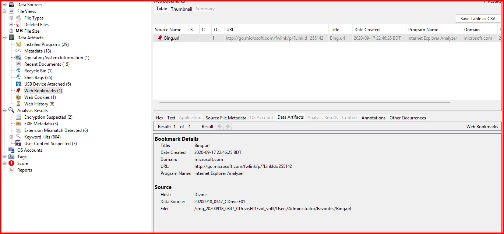
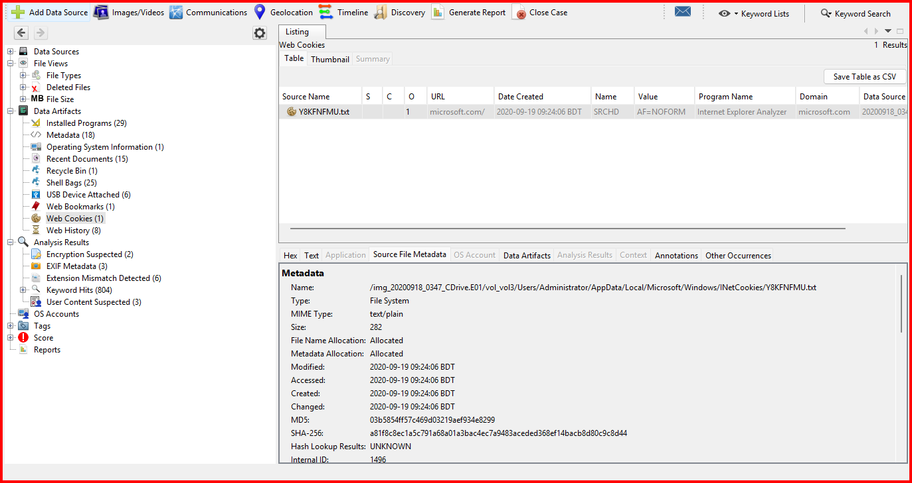
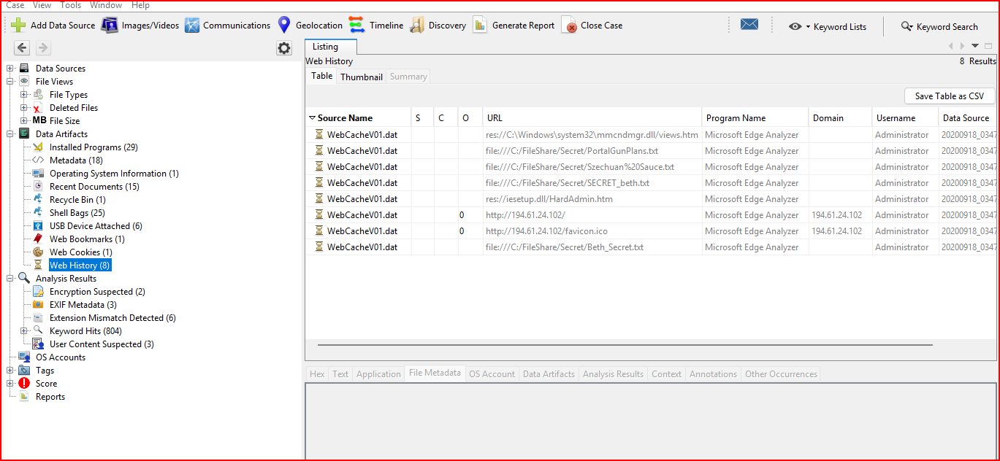
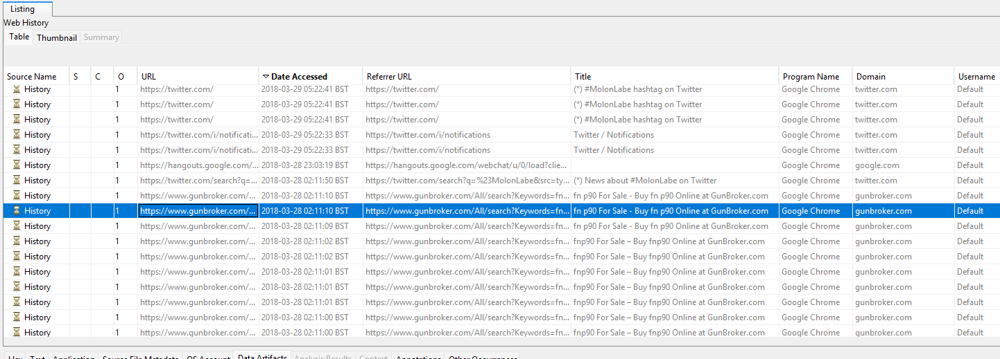
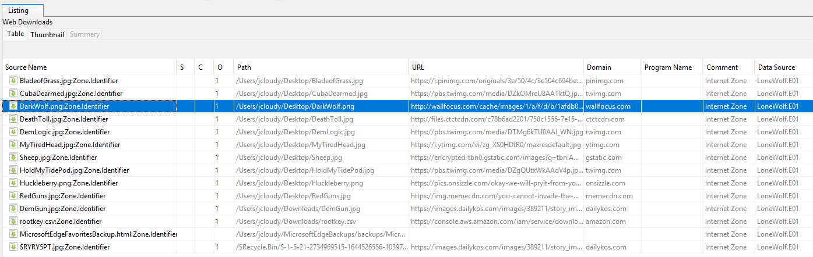

# Project 21 — Browser & Messaging Artifacts

**Status:** 🟡 Two cases analysed with real evidence (web history, cookies, downloads, bookmarks) · browser-DB parsing with dedicated tools shown as a simulated walkthrough (marked *(sim)*)
**Track:** Cybercrime Investigation

## Objective
Use browser artefacts (history, cookies, downloads, bookmarks, cached pages) to establish **what a user did online, when, and with what intent**, and show that these artefacts can prove or disprove a claim about a user's activity.

## Cases
| Case | System | What the browser evidence shows |
|---|---|---|
| A — Stolen Szechuan Sauce | Windows Server 2012 R2 DC (Internet Explorer / WebCache) | A domain controller's browser reached an external IP and opened confidential files |
| B — Lone Wolf | Windows 10 laptop (Chrome + Edge) | A user researched weapons and used cloud storage before a planned event |

> Both are public training datasets (DFIR Madness; Digital Corpora). All times normalised to **UTC**.

---

# Case A — Stolen Szechuan Sauce (Internet Explorer on a DC)

Internet Explorer / Edge store history, cookies and cached pages in **`WebCacheV01.dat`** (an ESE database) under `AppData\Local\Microsoft\Windows\WebCache`. Autopsy parses it into Web History, Web Cookies and Web Bookmarks.






| Artefact | Value | Significance |
|---|---|---|
| Bookmark | `Bing.url` (microsoft.com) | Default IE favourite, created at profile setup; no investigative value |
| Cookie | `Y8KFNFMU.txt`, microsoft.com/Bing SRCHD | Default Bing cookie |
| **Web history** | `http://194.61.24.102/` and `/favicon.ico` | **The DC's browser connected to a bare external IP over plain HTTP** — highly unusual for a server; a classic tool-download pattern |
| Web history | `file:///C:/FileShare/Secret/PortalGunPlans.txt`, `…/Szechuan%20Sauce.txt`, `…/SECRET_beth.txt`, `…/Beth_Secret.txt` | **Confidential files opened through the browser** |
| Web history | `res://iesetup.dll/HardAdmin.htm`, `res://…mmcndmgr.dll/views.htm` | IE Enhanced Security and MMC pages (normal on a server) |

**Findings (Case A)**
1. A domain controller should never browse to a raw external IP. `194.61.24.102` is the strongest lead in the case and is the IOC to block.
2. The `file:///` entries prove the sensitive files in `C:\FileShare\Secret` were not only copied (shown by LNK/ShellBags in [Project 11](../project-11-windows-disk-forensics/)) but also **viewed in the browser**.
3. Default bookmark and cookie are noise; separating them from real activity is part of the analysis.

---

# Case B — Lone Wolf (Chrome + Edge on a laptop)

Chrome stores history, downloads and cookies in SQLite databases (`History`, `Cookies`) under `AppData\Local\Google\Chrome\User Data\Default`. Autopsy and Hindsight parse them.

## Web searches (Chrome, 31 Mar 2018)



| Time (UTC approx) | Search / site |
|---|---|
| 31 Mar 00:29 | molon labe (Facebook) |
| 31 Mar 00:36–00:37 | concealable tactical rifles |
| 31 Mar 00:37 | 9mm rifles |
| 31 Mar 00:42 | submachine guns / keltec |
| 31 Mar 00:44 | gunbroker / keltec 2000 site:gunbroker.com |
| 31 Mar 13:48 | gun store near me |
| 28–29 Mar | GunBroker listings, Twitter #MolonLabe |

## Cookies and cloud sessions


Edge WebCache cookies from 27 Mar for bing.com, facebook.com, and **account.box.com** (Box cloud storage), consistent with the documents being uploaded to the cloud.

## Downloads (with source URLs)


Each saved image carries a `Zone.Identifier` alternate data stream recording where it was downloaded from:

| File | Downloaded from |
|---|---|
| BladeofGrass.jpg | pinimg.com |
| CubaDearmed.jpg | twimg.com |
| RedGuns.jpg | memecdn.com |
| Huckleberry.png | onsizzle.com |
| DeathToll.jpg | ctctcdn.com |

**Findings (Case B)**
1. A concentrated burst of weapon-acquisition searches at ~00:30 local, then local gun-store searches the same afternoon.
2. `Zone.Identifier` proves the ideological images were **downloaded from the internet by this user**, and names the sites.
3. Box cookies corroborate the cloud-upload activity found on disk ([Project 16](../project-16-super-timeline/)).

---

## Step — Parse browser DBs directly (Simulated Walkthrough)
> ⚠️ **Simulated data.** The two cases above are from my own analysis. This section shows the dedicated-tool workflow; values are illustrative.

```bash
# Chrome (SQLite)
sqlite3 History "SELECT datetime(last_visit_time/1000000-11644473600,'unixepoch'), url \
  FROM urls ORDER BY last_visit_time DESC;"
sqlite3 History "SELECT datetime(start_time/1000000-11644473600,'unixepoch'), target_path, tab_url \
  FROM downloads;"
# IE/Edge WebCache (ESE)
# ESEDatabaseView / Hindsight -> WebCacheV01.dat
hindsight.py -i "WebCache" -o lonewolf_browser
```
| Query *(sim)* | Result |
|---|---|
| First/last visit to 194.61.24.102 | exact timestamps for the Case A timeline |
| Chrome download table | file, source URL, received bytes, time |
| Cookie last-access | session activity window |

---

## Problems Encountered
| Problem | Fix | Lesson |
|---|---|---|
| "No URLs in web history" (first report, Case A) | Opened the WebCache artefact; found the external IP and file:// entries | Open every artefact before concluding "nothing found" |
| Default bookmark/cookie cited as activity | Separated profile-creation defaults from real browsing | Know what a fresh profile contains |
| Download origin not checked | Read `Zone.Identifier` ADS | Downloads carry their source URL in an ADS |
| Times left in local zone | Normalised to UTC | Always state the zone |

## Findings Summary
| # | Finding | Case | Confidence |
|---|---|---|---|
| 1 | DC browser connected to external IP 194.61.24.102 over HTTP | A | High |
| 2 | Secret files opened via `file:///` in the browser | A | High |
| 3 | Weapon and gun-store searches on 31 Mar | B | High |
| 4 | Ideological images downloaded from named sites | B | High |
| 5 | Box cloud session cookies present | B | Medium |

## ATT&CK
- T1105 Ingress Tool Transfer — Case A external-IP browse
- T1217 Browser Information Discovery (data source examined)
- T1567.002 Exfiltration to Cloud Storage — Case B Box usage

## IOCs
| Type | Value | Case |
|---|---|---|
| IPv4 | 194.61.24.102 | A |
| Domain | account.box.com (session) | B |

## Deliverables
- [x] Case A WebCache history, cookies, bookmarks
- [x] Case B Chrome searches, cookies, downloads with Zone.Identifier
- [x] Browser-DB parsing workflow *(simulated)*
- [ ] Run Hindsight / sqlite on the images and replace *(sim)* rows
- [ ] Final report in `report/`

## Key Learnings
1. IE/Edge keep everything in `WebCacheV01.dat` (ESE); Chrome uses SQLite `History`/`Cookies` — different tools, same questions.
2. `Zone.Identifier` ADS records where a downloaded file came from.
3. Browser artefacts prove intent and corroborate disk evidence: a `file:///` visit, a search, or a cloud cookie can make or break a claim about what a user did.
