# Project 22 — Mobile Forensics: Android Acquisition & Artefacts

**Status:** 🟡 Lab setup, ADB logical acquisition and artefact location done with real evidence · app-data and media analysis shown as a simulated walkthrough (marked *(sim)*)
**Track:** Cybercrime Investigation

## Objective
Build a controlled Android test device, acquire data from it over ADB in a forensically sound way, and learn where Android stores user data and system configuration so an examiner can locate relevant evidence on a real case.

> This is a **lab exercise on a test device the analyst owns and controls**. Mobile acquisition on a real case requires legal authority, and the techniques here are for learning artefact locations and acquisition workflow, not for defeating security on someone else's device.

## Environment
| Item | Value |
|---|---|
| Case ID | `CB-22-0001` |
| Emulator | Genymotion Desktop 3.7.0 (free, personal use) |
| Virtual device | Google Pixel 2, **Android 5.0 (Lollipop)**, x86, 1080×1920 / 420 dpi, root access on |
| Resources | 4 CPU, 4096 MB RAM, bridged network |
| Host | Windows + Android Debug Bridge (platform-tools) |

---

## Step 1 — Build the test device (real)
Genymotion was installed and a Pixel 2 / Android 5.0 image created, with **bridged networking** so ADB can reach it over the LAN.

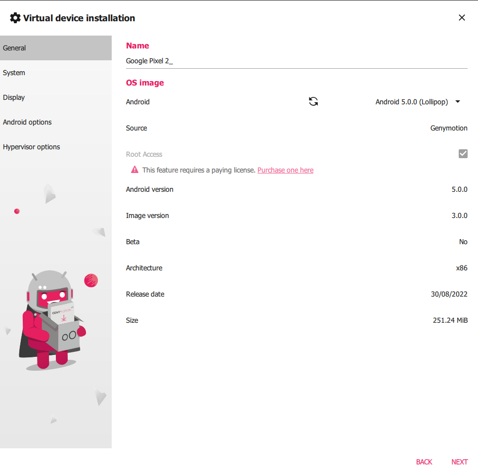
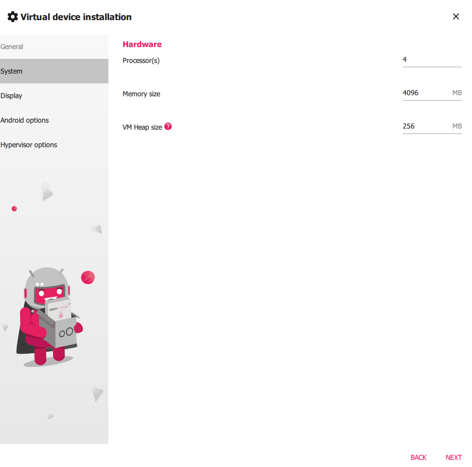
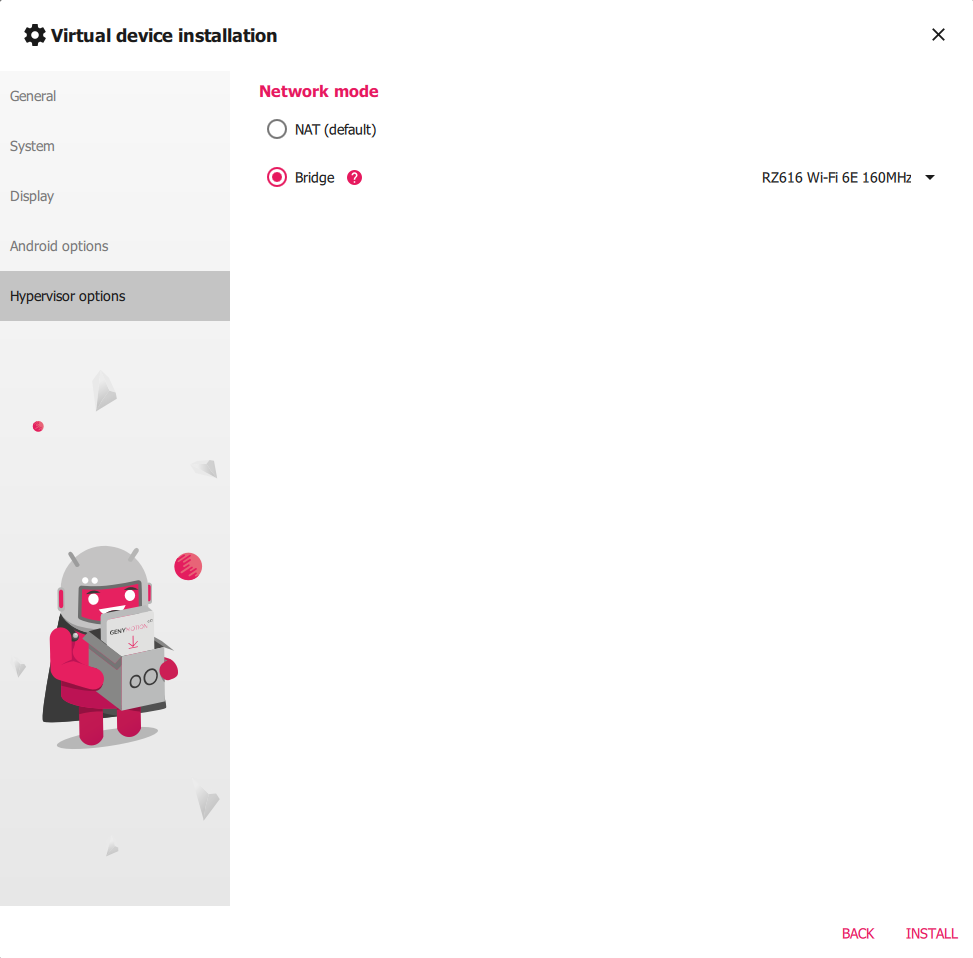
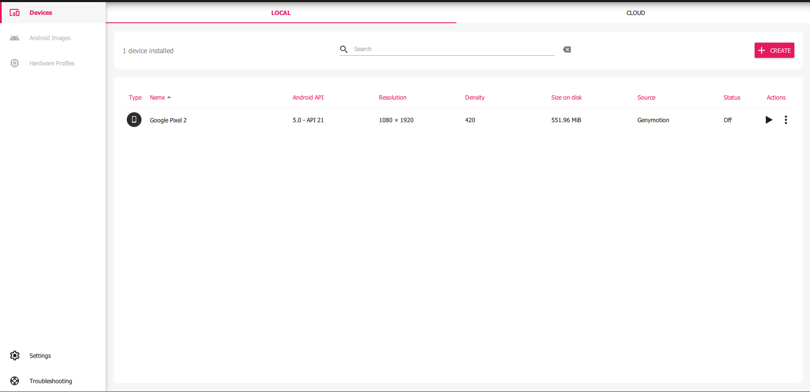
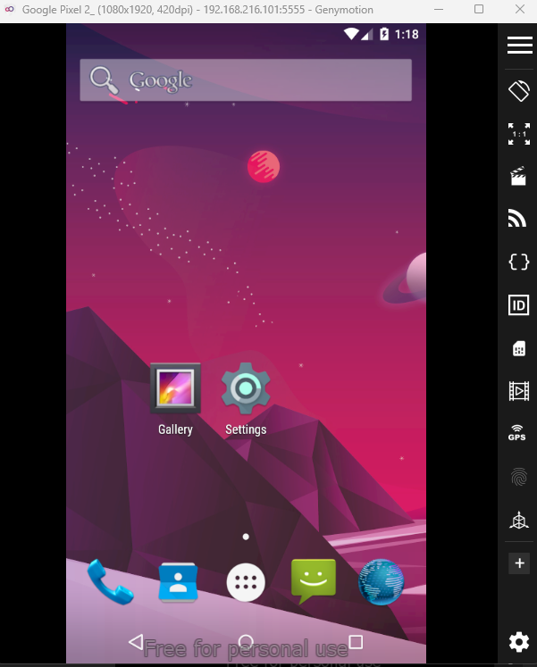

A screen-lock **password was set** on the device so the lab has a known lock configuration to study (Settings → Security → Screen lock → Password).

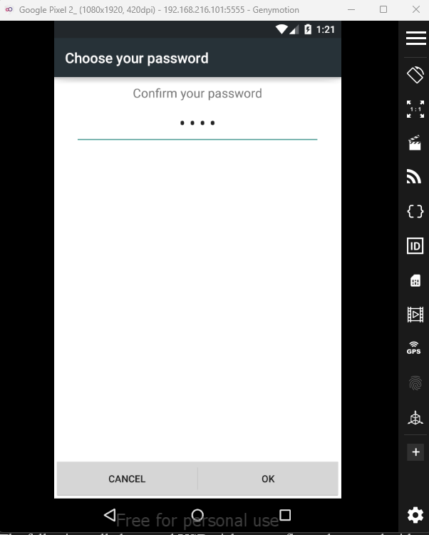

## Step 2 — Connect ADB (real)
`adb` was added to the path and connected to the device's IP. `adb devices` confirms the connection.

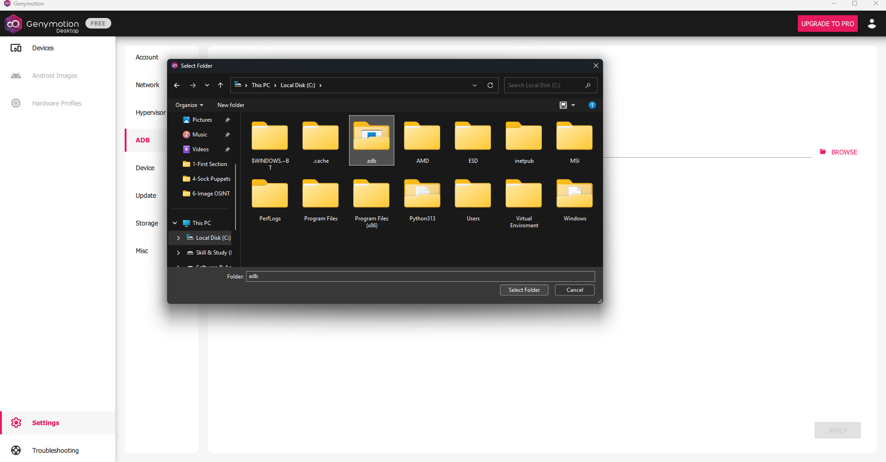
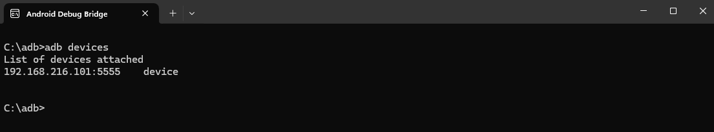

```
C:\adb>adb devices
List of devices attached
192.168.216.101:5555    device
```

## Step 3 — Logical acquisition of user storage (real)
```
C:\adb>adb shell ls /sdcard/
Alarms  Android  DCIM  Download  Movies  Music  Notifications  Pictures  Podcasts  Ringtones
```
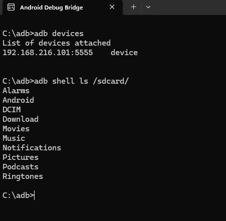
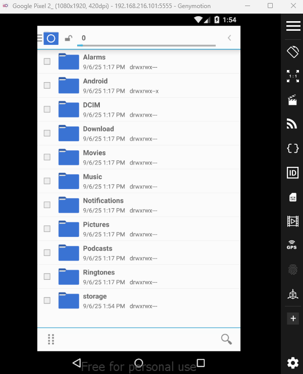

These are the standard user-data folders. On a real case, `DCIM`, `Download`, `Pictures` and app folders under `Android/data` hold most user-generated evidence. Each folder of interest is pulled with `adb pull` and hashed on arrival.

## Step 4 — System configuration directory (real)
With root on the test device, `/data/system/` is readable. It holds the device's configuration and account files.

```
C:\adb>adb shell ls /data/system
appops.xml            device_policies.xml   locksettings.db       packages.xml
batterystats.bin      entropy.dat           locksettings.db-shm   password.key
called_pre_boots.dat  gesture.key           locksettings.db-wal   recent_images
...                   packages.list         recent_tasks          users
```
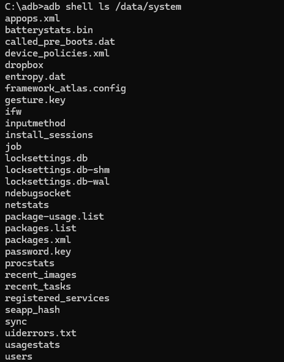

| File | What it holds (forensic value) |
|---|---|
| `packages.xml` / `packages.list` | Installed apps, versions, install source, permissions |
| `users/` | User profiles on the device |
| `device_policies.xml` | Managed/MDM policy, if any |
| `recent_tasks` / `recent_images` | Thumbnails and metadata of recently used apps |
| `appops.xml` | Per-app permission usage |
| `locksettings.db`, `gesture.key`, `password.key` | Screen-lock **configuration** (see Step 5) |

## Step 5 — Lock-screen configuration (real, lab device)
On this Android 5 test device the screen-lock secret is **not stored in plain text**. Setting a password creates `password.key`, which contains a non-reversible cryptographic hash of the chosen secret (combined with a device-specific salt kept in `locksettings.db`). `gesture.key` plays the same role for pattern locks.

```
C:\adb>adb pull /data/system/password.key C:\Users\...\Desktop\
/data/system/password.key: 1 file pulled, 0 skipped. (72 bytes in 0.002s)
```
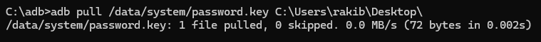
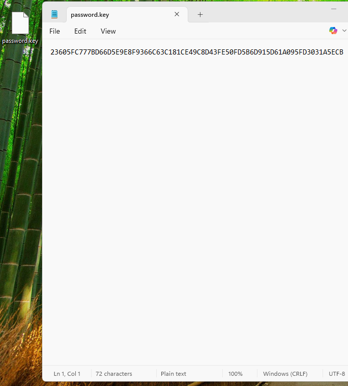

**Observation:** the file is exactly **72 hex characters** = a 40-char SHA-1 hash followed by a 32-char MD5 hash of the same value (the Android 5 format). It contains **no plain-text password** and cannot be reversed to reveal it.

| Field | From the lab file |
|---|---|
| Length | 72 hex chars |
| First 40 | SHA-1 component |
| Last 32 | MD5 component |
| Salt location | `locksettings.db` → `locksettings` table, key `lockscreen.password_salt` |

**Forensic point:** the presence and format of `password.key` tells the examiner the device uses a **password** lock (a `gesture.key` would mean a pattern). The file records *that* a lock is set and its type; it does not expose the secret. Recovering the actual passcode is only attempted under legal authority with dedicated tooling, and is out of scope for this learning lab, which stops at identifying and documenting the artefact.

> This per-file hashing applies to **Android 5**. Modern Android (6+/file-based encryption, Gatekeeper/Weaver in secure hardware) stores the credential very differently, which is one reason newer devices are much harder to acquire.

---

## Step 6 — App-data and media analysis (Simulated Walkthrough)
> ⚠️ **Simulated data.** Steps 1–5 are from my own lab device. Step 6 shows how a populated device would be analysed; values are **illustrative**.

For a real case, use a purpose-built parser rather than reading files by hand:
```bash
# Full logical collection, then parse with ALEAPP
adb pull /sdcard ./collection/sdcard
adb pull /data/data ./collection/appdata      # needs root
python3 aleapp.py -t fs -i ./collection -o ./report
```
| Artefact (ALEAPP) | Evidence *(sim)* |
|---|---|
| Call logs / SMS (`mmssms.db`) | Contacts and message timeline |
| Chat apps (`/data/data/<pkg>/databases/*.db`) | Conversations, attachments |
| Browser history | Sites visited |
| Location (`cache.wifi`, app GPS) | Place history |
| Media + EXIF (`DCIM`) | Photos with timestamps and GPS |
| Accounts (`accounts.db`) | Signed-in accounts |

Script: [`scripts/collect.sh`](scripts/collect.sh).

---

## Problems Encountered
| Problem | Fix | Lesson |
|---|---|---|
| Report stopped at "found a hash" | Explained the file format and what it does and does not prove | An artefact's forensic meaning matters more than the raw value |
| Password set as "1234" in one place, "abcd" in another | Keep lab parameters consistent | Document the exact test configuration |
| Emulator state not snapshotted | Snapshot before and after each action | Reproducibility |
| No hashes on pulled files | Hash every file on acquisition | Logical pulls still need integrity records |

## Findings (lab)
| # | Finding | Confidence |
|---|---|---|
| 1 | Pixel 2 / Android 5 test device acquired logically over ADB | High |
| 2 | `/sdcard` holds standard user-data folders | High |
| 3 | `/data/system/password.key` is 72 hex chars (SHA-1 + MD5), no plain text | High |
| 4 | Lock type (password vs pattern) is identifiable from which key file exists | High |

## ATT&CK / scope note
This is defensive/forensic acquisition, not an attack technique. The relevant ATT&CK context for mobile cases is T1409 (Stored Application Data) as the data source examined.

## Deliverables
- [x] Lab device build (Genymotion)
- [x] ADB connection and logical acquisition
- [x] `/data/system` artefact map
- [x] Lock-configuration artefact identified and documented
- [x] App-data/media parsing workflow *(simulated)*
- [ ] Analyse a populated public Android image (e.g. Josh Hickman's Android reference image) with ALEAPP and replace *(sim)* rows
- [ ] Final report in `report/`

## Key Learnings
1. ADB over a bridged network gives a quick logical acquisition of a rooted test device; hash every file pulled.
2. `/data/system` is the map of a device: installed apps, users, policies, recent activity and lock type.
3. The screen-lock secret is stored as a one-way hash with a salt, not in clear text, and modern Android protects it in secure hardware.
4. A parser like ALEAPP turns a raw collection into a structured, court-ready report.
