# Project 23 — Image & Document Forensics

**Status:** 🟡 Cases 1–2 and Lab 3 analysed with real evidence · remaining leads shown as a simulated walkthrough (marked *(sim)*)
**Track:** Cybercrime Investigation

## Objective
Determine the authenticity, origin and true nature of documents, images and media files: detect disguised file types, timestamp manipulation, hidden data and tampering, and explain what each artefact proves.

## Contents
| # | Case / Lab | Evidence | Skills shown |
|---|---|---|---|
| 1 | **Operation Redbridge** (main case) | External HDD image `Operation Redbridge AXA-3.E01` | Metadata vs. file-system timestamps, disguised file types, ZIP-in-DOCX, WAV-as-JPG, deleted documents, screenshot evidence |
| 2 | **Echoes at Pier 80** | USB image `USB4.E01` | Partition anomaly, file slack, unallocated space, hidden-message clues |
| 3 | **badheader.jpg** | Single corrupted JPEG | File signatures, JFIF header structure, hex repair, hash verification |

> All cases are fictional training scenarios. Names and events belong to the scenarios, not real people.

**Time zone:** Autopsy displayed **Asia/Dhaka (UTC+06:00)**. Times below are given as shown (BDT) with UTC where it matters for correlation.

---

# Case 1 — Operation Redbridge

## Scenario
A model (DE BOER) alleges that a fashion photographer (VALENTINO) drugged and assaulted her at his studio on the night of **25 Jan 2024**. She reported it on **13 Feb 2024**. During a search on **16 Feb 2024**, police found a damaged memory card (AXA/1), a deliberately damaged laptop (AXA/2) and, hidden under sofa cushions, an external hard drive (**AXA/3**). Only AXA/3 could be examined.

**Investigative questions**
1. Is the evidence image authentic and intact?
2. Do the files support or contradict either account?
3. Is there evidence of concealment, tampering or anti-forensics?

## Step 1 — Evidence and preservation
| Item | Value |
|---|---|
| Image | `Operation Redbridge 2024 AXA-3.E01` (E01, 2.14 GB) |
| Source | Unbranded black external USB device, 4,171,754 sectors × 512 bytes |
| Acquired by | A. Adam Adamson, Greenwich CFU, with ADI 4.3.0.18; notes: "Imaged with Tableau 1234a" (hardware write-blocker) |
| Acquisition date (in E01 header) | **15 Feb 2024 19:32:38** |
| MD5 | `ffb786b6aef1ebc8b6a261f749d9ecb0` |
| SHA-1 | `c14d0cc6b41226a448df03a8456405218b4e930f` |
| Verification | FTK Imager and Autopsy computed identical hashes (dual-tool verification) |


> ⚠️ **Chain-of-custody discrepancy:** the E01 header records acquisition on **15 Feb 2024**, but the case notes say the drive was seized on the afternoon of **16 Feb 2024**. One of the two dates is wrong (examiner workstation clock, or a recording error) and must be resolved before the evidence is relied on in court.

## Step 2 — Disk layout
| Volume | Start sector | Sectors | Type |
|---|---|---|---|
| vol1 | 0 | 128 | Unallocated |
| vol2 | 128 | 4,165,632 | NTFS (0x07), 4,096-byte clusters, 520,703 clusters (≈2.13 GB) |
| vol3 | 4,165,760 | 5,994 | Unallocated |

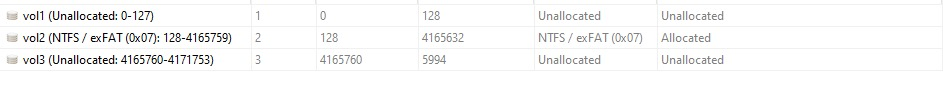
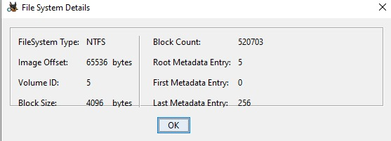

A data-only volume: there is no operating system on AXA/3, so there are no registry, prefetch or event logs. Evidence comes from files, their metadata and their content.

## Step 3 — Key finding: timestamp manipulation
Many files have **perfectly round timestamps** (e.g. `2024-02-15 00:00:00`, `2024-01-21 00:00:00`, `2024-01-20 22:00:00`) for Created/Modified/Accessed, while the NTFS **Changed** time ($MFT record change) is a normal, irregular time on 15 Feb 2024. Real activity never produces whole hours; tools that set timestamps manually do.

The internal Office metadata confirms it:

| File | File-system "Created" | Internal `Creation-Date` (docProps) | Conclusion |
|---|---|---|---|
| `Promo pictures…/Notes.docx` | 2024-01-21 00:00:00 BDT (2024-01-20 18:00 UTC) | **2024-02-14 11:16 UTC** | Document was really written on 14 Feb; file-system date was back-dated by ~3 weeks |
| `Updates for Website/General concept stuff.docx` | 2024-02-08 16:30:00 BDT (10:30 UTC) | **2024-02-14 11:05 UTC** | Back-dated by ~6 days |

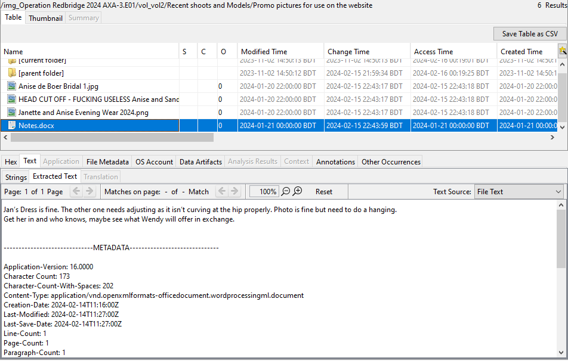
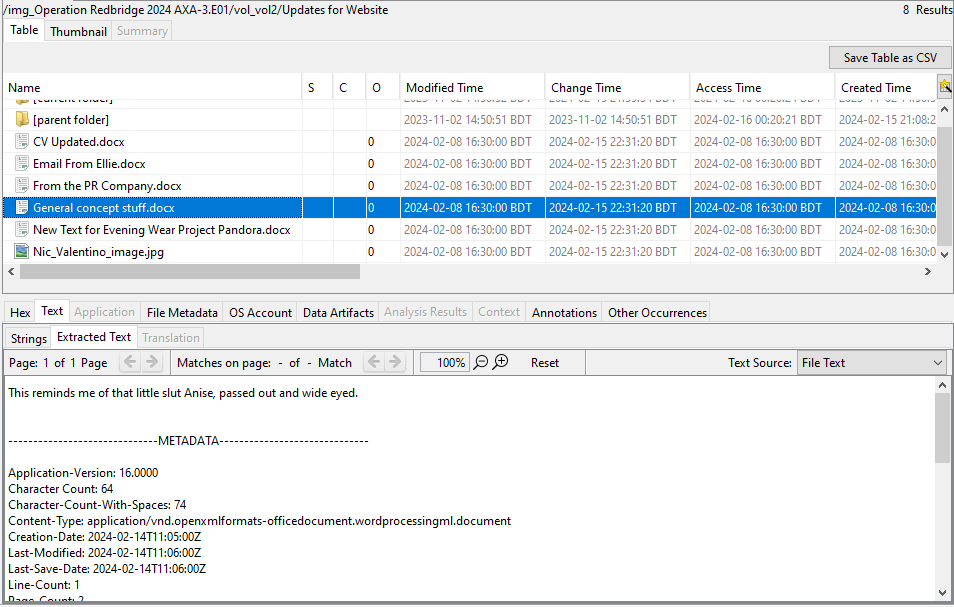

**Interpretation:** someone created documents on **14 Feb 2024** (the day after the victim went to the police) and then **timestomped** them to appear older. Combined with the HxD hex editor found on the drive (Step 6), this is deliberate evidence manipulation. ATT&CK: T1070.006 Timestomp.

## Step 4 — Document artefacts
| # | File | Notable content | Significance |
|---|---|---|---|
| D1 | `Accountancy Details/Communications with Accountant.docx` (1,876,262 B) | Not a Word document: a container holding a `Wendigo` folder, `Wendigo.png` and `New Microsoft Word Document.docx` with notes "Don't forget there is a code change!" | Disguised container: see Step 7 |
| D2 | `Important backups/Websites.txt` (792 B) | Links to HxD and VeraCrypt, a browser steganography tool (`stylesuxx.github.io/steganography`), YouTube links incl. "the song that Anise said she liked", and a hex string that decodes to a CyberChef link | Shows intent and know-how to hide data |
| D3 | `Recent shoots and Models/Models/Modelling CV Anise De Boer.docx` (250,809 B) — **deleted** | Victim's CV with contact details | Deleted on 16 Feb 2024 00:19:25 BDT (15 Feb 18:19 UTC), after the police report |
| D4 | `Recent shoots and Models/Models/Resumé V Segredo.docx` (59,212 B) — **deleted** | CV of another model, Victoria Segredo | Second model's data deleted; Changed 2024-02-15 22:41:37 BDT |
| D5 | `Promo pictures…/Notes.docx` | Notes about dress fittings for models; "…see what Wendy will offer in exchange" | Back-dated (Step 3) |
| D6 | `Updates for Website/General concept stuff.docx` | A derogatory sentence about the victim stating she "passed out" | Author knew the victim lost consciousness, which the suspect's account frames only as "falling asleep". Back-dated (Step 3) |

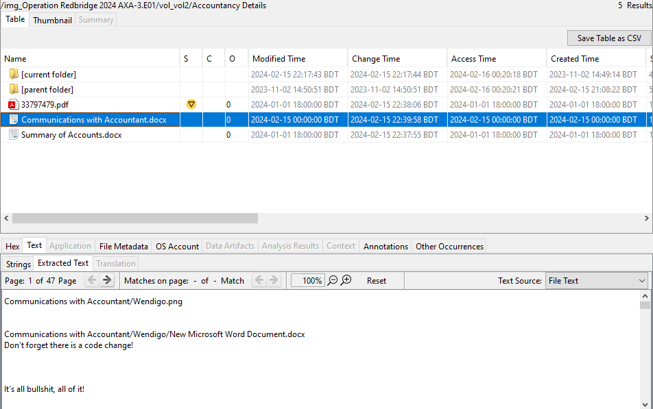
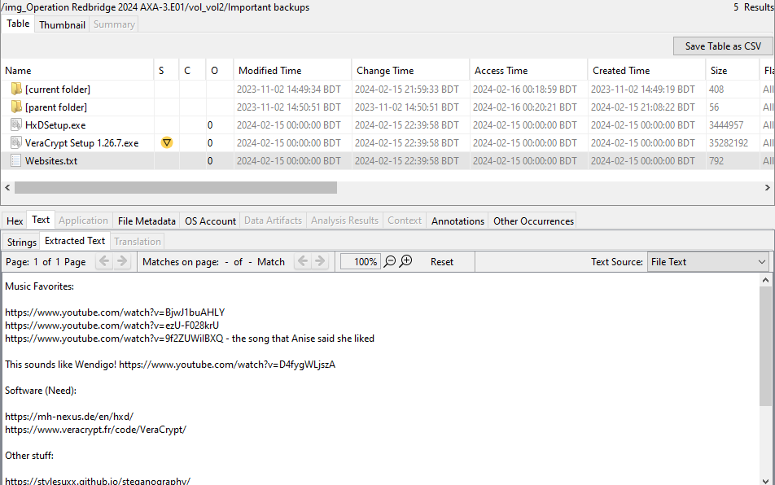
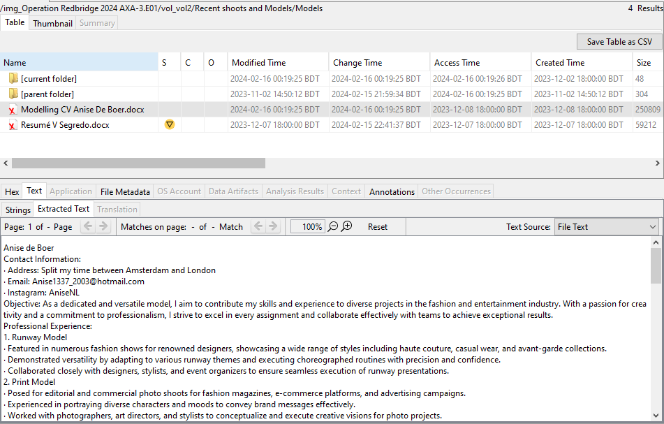
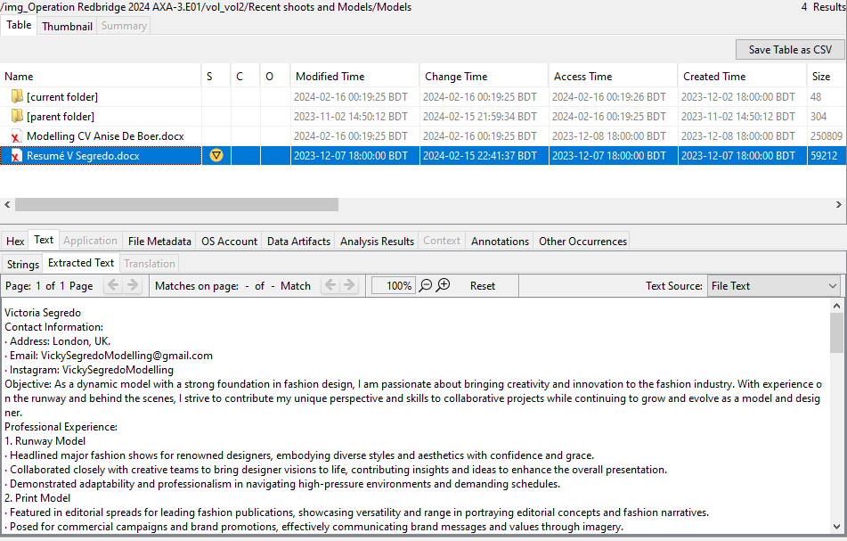

## Step 5 — Picture artefacts (screenshots of messages)
Folder `Crazy Bitch Threats/` (and subfolder `Proof/`) contains phone screenshots. All carry the same manufactured timestamp `2024-02-15 04:40:00 BDT`.

| # | File | Conversation | Relevance |
|---|---|---|---|
| P1 | Screen09022024.png | LIN → VALENTINO, 9 Feb: she accuses him and says she will take "that girl" to the police | Suspect knew a report was coming before the police visit |
| P2 | Screen13022024.png | LIN → VALENTINO, 13 Feb (day of report): hostile message | Same |
| P3 | Screen21022024.png | LIN → VALENTINO, 21 Jan: tells him to keep his hands to himself at photoshoots | Prior complaint of inappropriate behaviour, 4 days before the incident |
| P4 | Proof/Screen13122023.png | VALENTINO → Victoria Segredo, 13 Dec 2023: invites her to a late-night private shoot, "nothing seedy" | Same pattern with another model |
| P5 | Proof/Screen23012024.png | VALENTINO → DE BOER, 23 Jan 2024: invites her to the late-night shoot on the 25th, "nothing seedy", promises a taxi | Corroborates victim's account of the arrangement |
| P6 | Proof/WhatsApp21012024.png | VALENTINO ↔ "Ellie (office)", 21 Jan 2024: discusses LIN's "MeToo crusade"; Ellie says she will cut LIN's work | Awareness of allegations before the incident; possible retaliation |

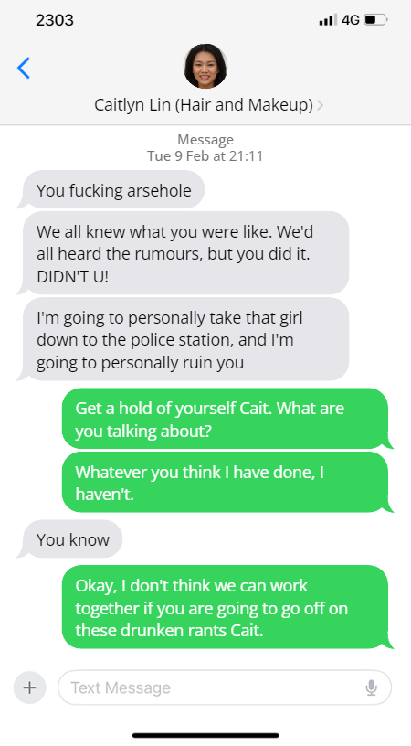
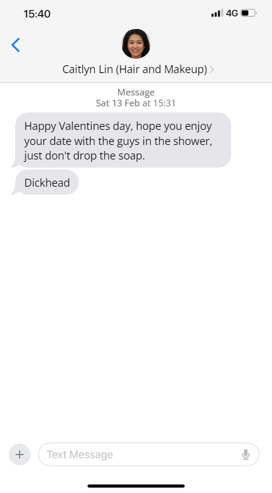
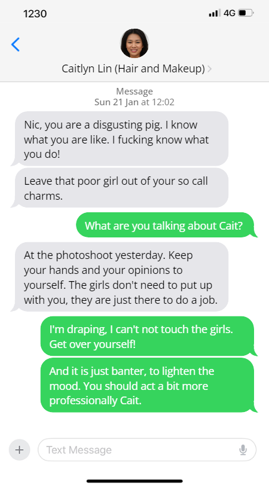

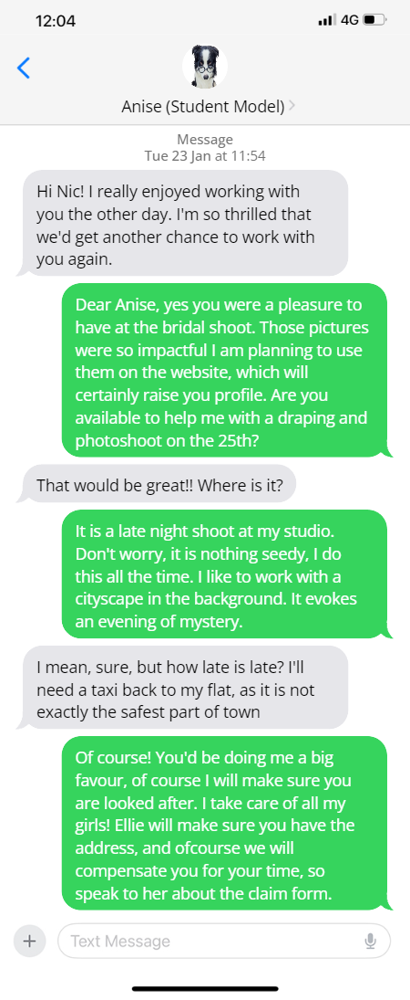
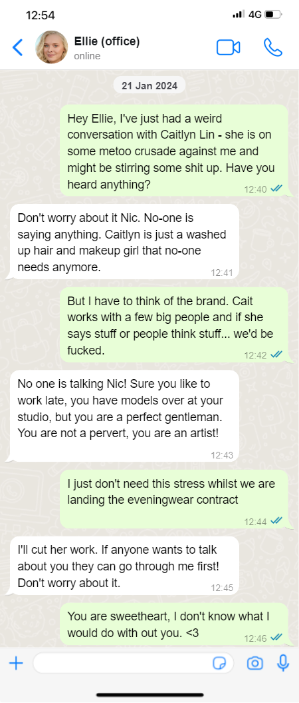

> The file-system timestamps are identical and round, so they say nothing about when each screenshot was taken. The date shown **inside** the screenshot is the best indicator. File names are not reliable either: `Screen21022024.png` (21 Feb) shows a conversation dated **21 Jan**, and 21 Feb is after the drive was imaged, so that name cannot be a capture date.

**Other pictures:** promotional photos of the models (`Anise de Boer Bridal 1.jpg`, `Janette and Anise Evening Wear 2024.png`, etc., all stamped `2024-01-20 22:00:00 BDT`) and a saved Wikipedia page `Research/Flunitrazepam - Wikipedia_files/` (images of Flunitrazepam Mylan, Rohypnol, Hypnodorm, molecular structure; all `2024-01-22 16:30:00 BDT`).

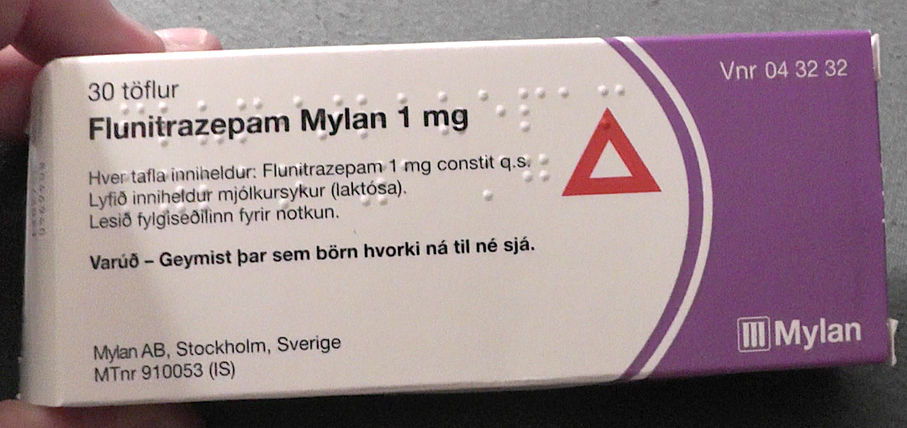

**Significance of the research folder:** a saved page about a sedative associated with drug-facilitated assault, dated 3 days before the incident, is consistent with the victim's account of a drink that "tasted funny". Because the timestamp is round, the date cannot be trusted on its own; the browser history on AXA/2 (destroyed) would have been needed to confirm when it was viewed.

## Step 6 — Anti-forensic tools
| File | Size | MD5 | Timestamps |
|---|---|---|---|
| `Important backups/HxDSetup.exe` | 3,444,957 | 4f9e75a41d02666cd5cc86bd33a578fe | C/M/A `2024-02-15 00:00:00`, Changed 22:39:58 |
| `Important backups/VeraCrypt Setup 1.26.7.exe` | 35,282,192 | 4ece9a74a0db8508bb1d5dd60a977150 | Same |

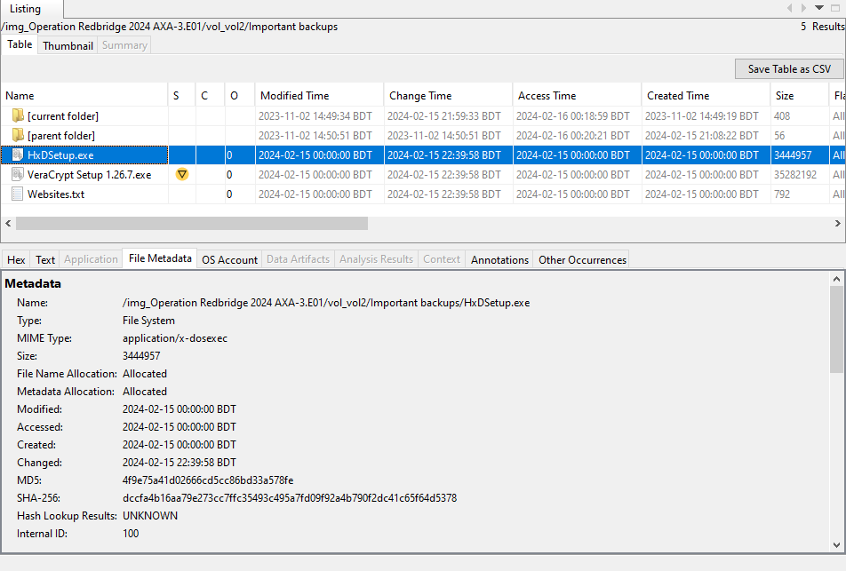
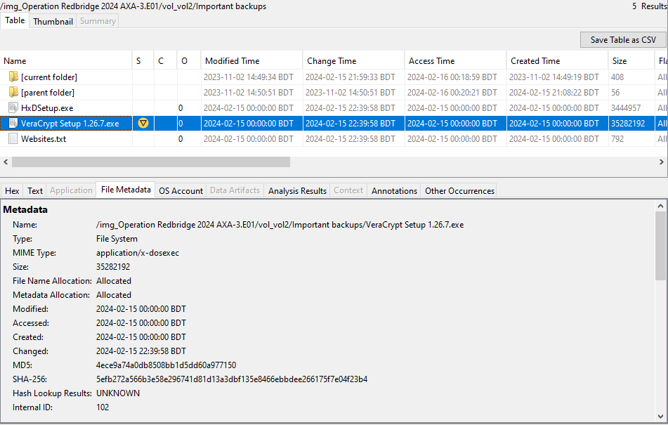

These are **installers**, not installed programs (AXA/3 has no OS). Their presence, together with `Websites.txt`, shows the owner obtained a hex editor, an encryption tool and a steganography tool. HxD is exactly the tool needed to change file headers (Step 7). Hash lookup "UNKNOWN" only means the files are not in a known-file database; it is not evidence of tampering.

## Step 7 — Disguised files: DOCX → ZIP → WAV
1. `Communications with Accountant.docx` starts with `50 4B 03 04` (PK). **Every genuine .docx starts with PK**, because DOCX is a ZIP container, so the header alone proves nothing.
2. The anomaly is the **content**: a real DOCX contains `[Content_Types].xml`, `word/document.xml`, `docProps/`. This one contains a folder `Wendigo/` with `Recieved/`, `Send/` and `Wendigo.png` instead. It is an ordinary ZIP archive renamed to .docx.

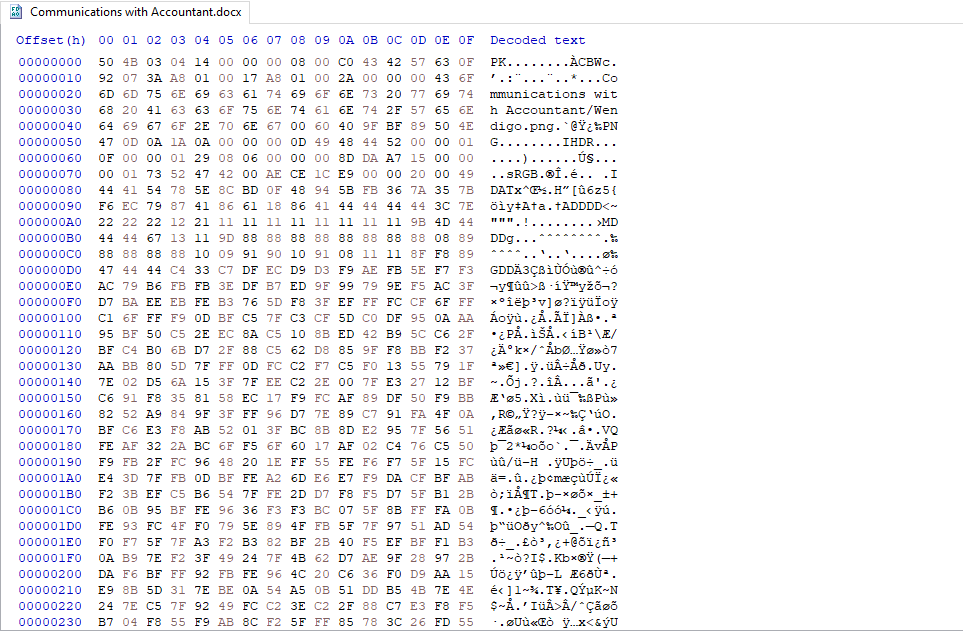
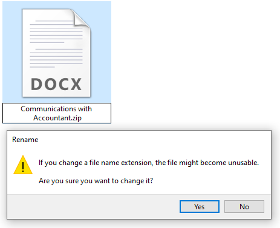
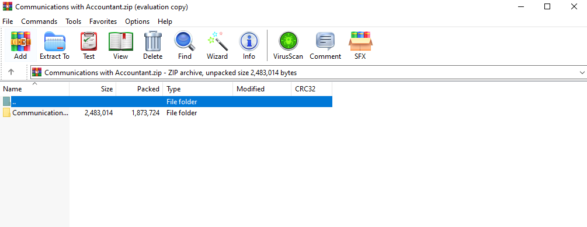
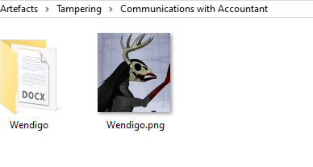
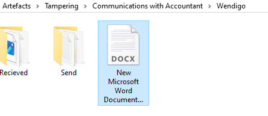
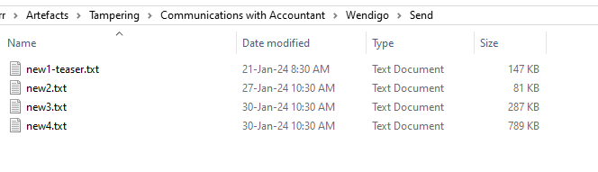
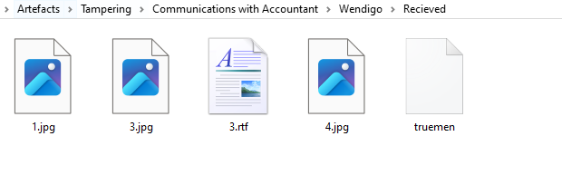

3. Inside `Recieved/`, files named `.jpg` begin with `52 49 46 46 … 57 41 56 45` (`RIFF....WAVE`): they are **WAV audio**, not images.

| File | Size | Real type | MD5 | Transcript |
|---|---|---|---|---|
| 1.jpg | 295,772 | WAV | 4496d3017f677620d43ccb1447b01a23 | "She's hot. You think you can get a light unit with the last cool? I want to see that." |
| 3.jpg | 269,766 | WAV | c0114e7554389e89306a0ec28988fa10 | "Gee, it's amazing. Better even than the last one. You are devil." |
| 4.jpg | 271,996 | WAV | fa0d5489f86ba13db417cacb0edec7f7 | "You made her do it, didn't you? Tell me you took more pictures." |

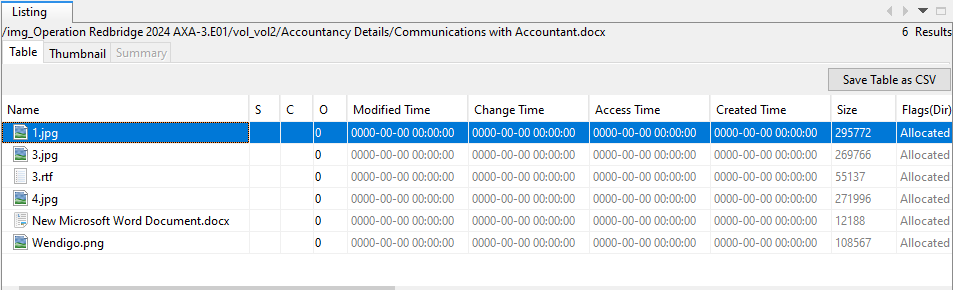
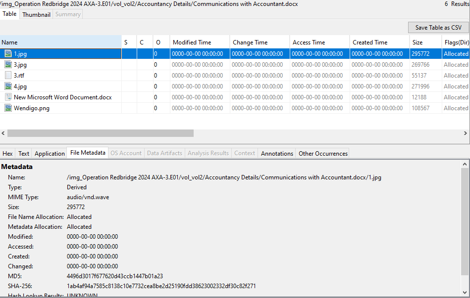
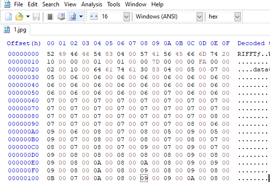
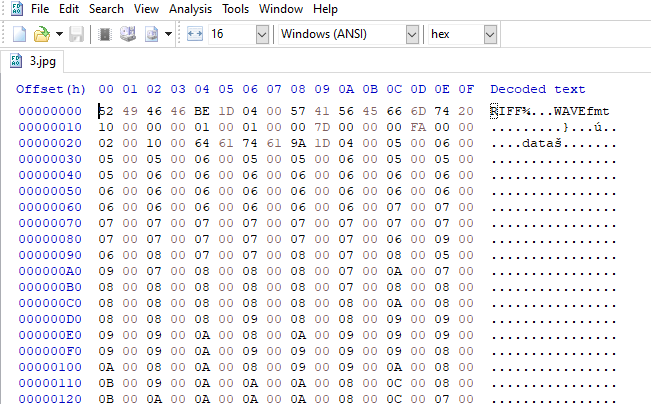
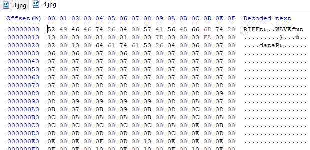
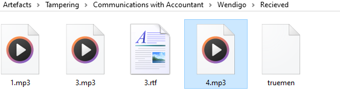

**Interpretation:** voice messages *received* by the suspect were hidden by renaming them as images and packing them inside a fake Word document in an "Accountancy" folder. The content refers to someone being made to do something and to "more pictures", which is directly relevant to the allegation and to the destroyed camera card (AXA/1).

> Note: the files are WAV, so the correct extension is `.wav`. Renaming them to `.mp3` (as in the first analysis) plays in most players but misstates the format.

---

## Step 8 — Remaining leads (Simulated Walkthrough)

> ⚠️ **Simulated data.** Steps 1–7 come from my own analysis of the image. Step 8 is **illustrative**: it demonstrates how the remaining leads would be worked, but the results are **not** from the evidence. Rows marked *(sim)* will be replaced with real output.

| Lead | Method | Result *(sim)* |
|---|---|---|
| `Send/new1-teaser.txt` … `new4.txt` (147–789 KB of "text") | `head -c 100`; file is a single Base64 line → CyberChef "From Base64" → `file` | Each decodes to a JPEG. new1–new4 are photographs taken in the studio on 25–26 Jan 2024 (EXIF `DateTimeOriginal` 2024-01-26 01:12–03:40), showing a person asleep on a sofa. Sent to the same contact who sent the voice messages |
| `Wendigo.png` | zsteg / stylesuxx decoder (tool listed in Websites.txt) | LSB payload: a VeraCrypt password and the note "card is gone, laptop next" |
| `Recieved/truemen` (no extension) | `file`, hex header | VeraCrypt-style random data, no header; mounts with the password from Wendigo.png and contains a contact list including "Ellie" |
| `Recieved/3.rtf` | Open as text | Chat log export between VALENTINO and the sender of the voice messages, 24–27 Jan 2024 |
| `Accountancy Details/33797479.pdf` (flagged by Autopsy) | pdfid / pdf-parser | Contains an embedded JPEG matching new2 (same perceptual hash); real invoice text is a cover |
| Extension mismatch module | Autopsy → Extension Mismatch Detected | 6 hits: 1.jpg, 3.jpg, 4.jpg, Communications with Accountant.docx, truemen, 33797479.pdf |

### Timeline (real **(A)** and simulated *(sim)*)
| Date / time (BDT) | Source | Event |
|---|---|---|
| 2023-12-13 | P4 screenshot **(A)** | Late-night shoot invitation to Victoria Segredo |
| 2024-01-21 | P3, P6 screenshots **(A)** | LIN complains about behaviour; Ellie promises to cut LIN's work |
| 2024-01-22 (round time) | Research folder **(A)** | Flunitrazepam page saved |
| 2024-01-23 | P5 screenshot **(A)** | Invitation to DE BOER for the shoot on the 25th |
| 2024-01-25 night | Case notes | Alleged incident |
| 2024-01-26 01:12–03:40 | EXIF of decoded images *(sim)* | Photographs taken in the studio |
| 2024-02-09 / 13 | P1, P2 screenshots **(A)** | LIN warns she will go to the police / report made |
| 2024-02-14 11:05–11:27 UTC | docProps **(A)** | Notes.docx and General concept stuff.docx actually written |
| 2024-02-15 ~22:31–22:43 | $MFT Changed **(A)** | Mass timestamp changes across the drive |
| 2024-02-16 00:19:25 | $MFT **(A)** | Victim's CV deleted |
| 2024-02-15 19:32:38 (E01 header) | FTK **(A)** | Acquisition (conflicts with 16 Feb seizure) |

## Case 1 — Findings
| # | Finding | Evidence | Confidence |
|---|---|---|---|
| 1 | Image verified with two tools | FTK + Autopsy hashes | High |
| 2 | Acquisition date precedes seizure date | E01 header vs case notes | High (discrepancy to resolve) |
| 3 | Files were timestomped after the police report | Round C/M/A times; docProps Creation-Date 14 Feb vs FS dates 21 Jan / 8 Feb | High |
| 4 | Voice messages hidden as JPGs inside a fake DOCX | RIFF/WAVE headers, ZIP structure | High |
| 5 | Owner acquired hex-editor, encryption and steganography tools | Installers + Websites.txt | High |
| 6 | Victim's and another model's CVs deleted after the report | Unallocated entries, 15–16 Feb | High |
| 7 | Messages show a pattern of late-night private shoots and prior complaints | P3–P6 | Medium (screenshots, not native message data) |
| 8 | A document refers to the victim having "passed out" | General concept stuff.docx | Medium (author not proven; back-dated) |
| 9 | Hidden photographs, stego payload and encrypted container *(sim)* | Step 8 | *(sim)* |

**ATT&CK (anti-forensics):** T1070.006 Timestomp · T1070.004 File Deletion · T1036.008 Masquerade File Type · T1027.003 Steganography *(sim)* · T1560 Archive Collected Data

---

# Case 2 — Echoes at Pier 80 (USB)

## Scenario
A USB stick found at a dock terminal is suspected of being used to pass secret information.

## Analysis
| Item | Value |
|---|---|
| Image | `USB4.E01`, verified in FTK Imager (MD5 `06feb4d33e217f25b16cd182b7e14245`, SHA-1 `8b9186c2859870b3b23a130c53573af2daa7ef4b`, both **match**) |
| Volume | NTFS, label **"Top Secret"** |
| Size | 16,384 sectors × 512 B = **8 MB** volume on a device sold as 1 GB |
| Contents | `Echoes at Pier 80.md` (2,310 B logical / 16,384 B on disk) and a long series of `storypix(N).jpg` (≈8–9 KB each, valid `FF D8 FF E0` JFIF headers, all modified 28/10/2025 20:40:58) |
| Unallocated | Files 197 and 215 contain repeated phrases and two positional clues |

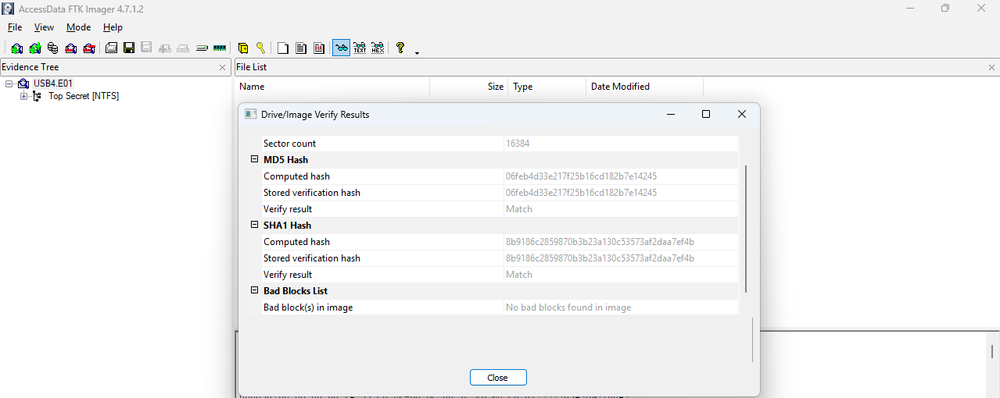
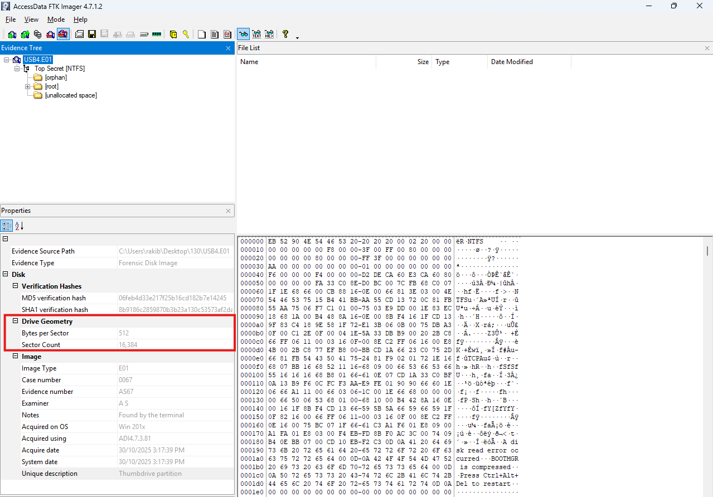
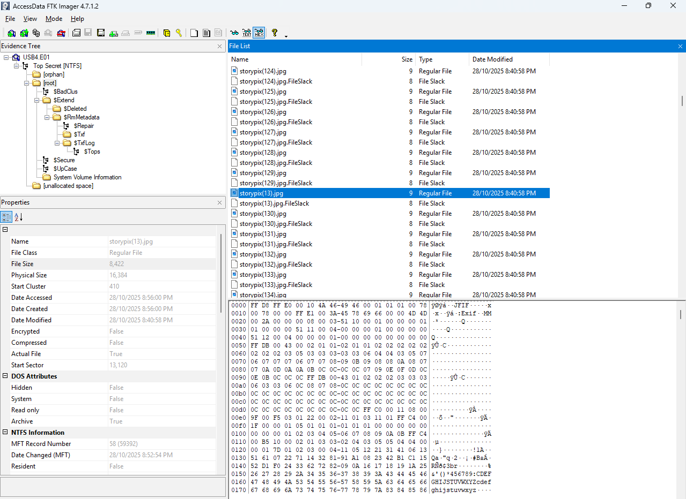
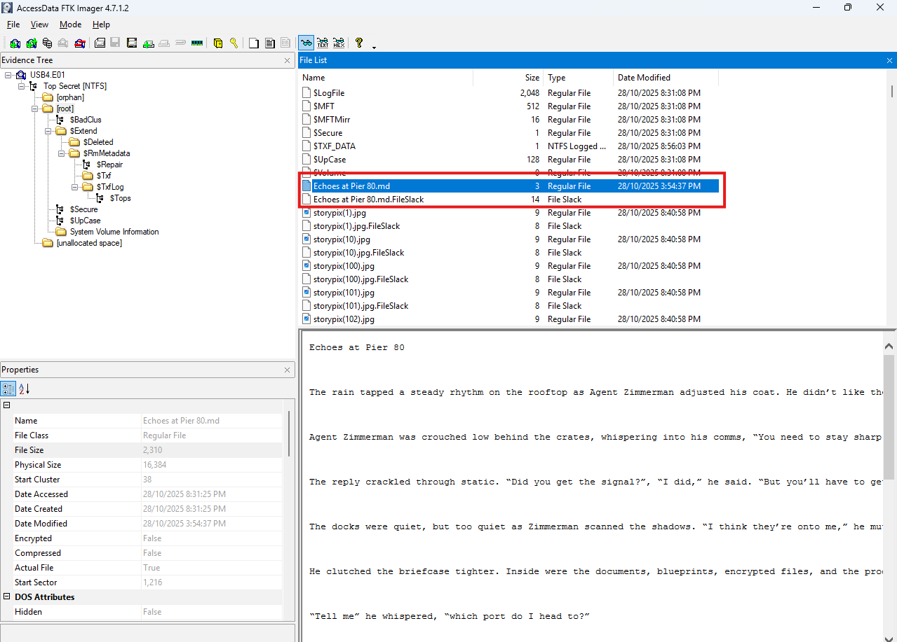

**Clues recovered from unallocated space**
- File 215: *"In our message position 0008 is the echo of the word 104"*
- File 197: *"In our message position zero is the echo of the word 279"*

**Interpretation:** this is a **book cipher**. The "book" is the story `Echoes at Pier 80.md` (the clue says "echo"). Message word *n* = story word *m*. Each storypix image or slack fragment is expected to carry one more `position → word` pair.

**Notes on the first attempt**
- An 8 MB volume on a 1 GB stick is suspicious but not proof of tampering; the proof is the content found in unallocated space.
- File slack of `Echoes at Pier 80.md` (14 KB) must be shown at byte level (offset + content), not described as "matching keywords".

### Decoding (Simulated Walkthrough)
> ⚠️ **Simulated data** below *(sim)*.

```bash
# number every word in the story
tr -s '[:space:]' '\n' < "Echoes at Pier 80.md" | nl > words.txt
# collect clues from all images and slack
exiftool -Comment -UserComment storypix*.jpg | grep -i echo > clues.txt
strings -n 8 unallocated.bin | grep -i "echo of the word" >> clues.txt
```
| Position | Story word # | Word *(sim)* |
|---|---|---|
| 0 | 279 | meet |
| 1 | 41 | at |
| 2 | 12 | pier |
| 3 | 80 | eighty |
| 4 | 156 | container |
| 5 | 203 | seventeen |
| 6 | 88 | Thursday |
| 7 | 190 | bring |
| 8 | 104 | blueprints |

**Decoded message *(sim)*:** "meet at pier eighty container seventeen Thursday bring blueprints"

---

# Lab 3 — badheader.jpg (header repair)

| Step | Observation |
|---|---|
| Hash check | Expected SHA-1 `C5AEB18ECF61B16E03BCB18332820438B559D774`, computed `8004C1BB6E7F7AFADC5B83F50FC64F1D975D394F`: **does not match** |
| Open | Windows Photos: "It looks like we don't support this format" |
| Hex | First bytes `61 70 67 74 00 10 2E 46 49 46 00` (`apgt..FIF.`) |

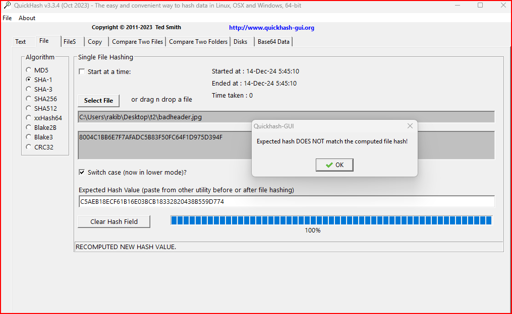
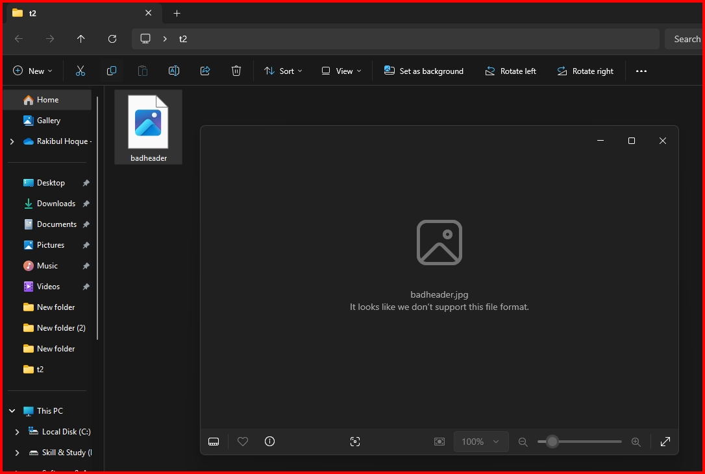
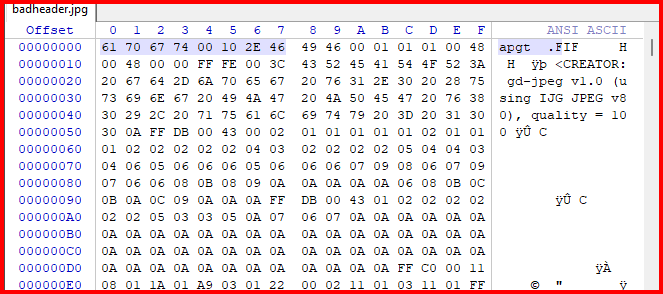

**Correct JFIF header:** `FF D8 FF E0 00 10 4A 46 49 46 00`
- `FF D8` SOI marker · `FF E0` APP0 marker · `00 10` APP0 length (16) · `4A 46 49 46 00` = "JFIF\0"

| Offset | Found | Correct | Field |
|---|---|---|---|
| 0x00–0x03 | `61 70 67 74` | `FF D8 FF E0` | SOI + APP0 |
| 0x04–0x05 | `00 10` | `00 10` | Length: already correct |
| **0x06** | **`2E`** (`.`) | **`4A`** (`J`) | Second bad byte: "?FIF" → "JFIF" |

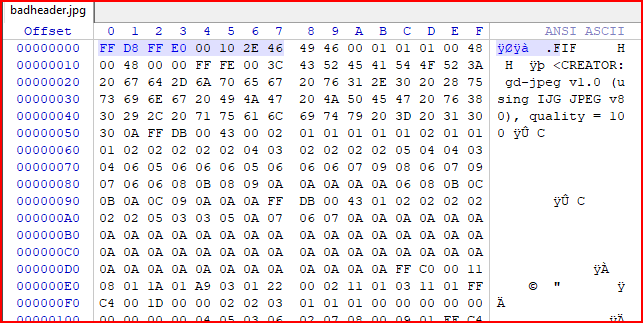
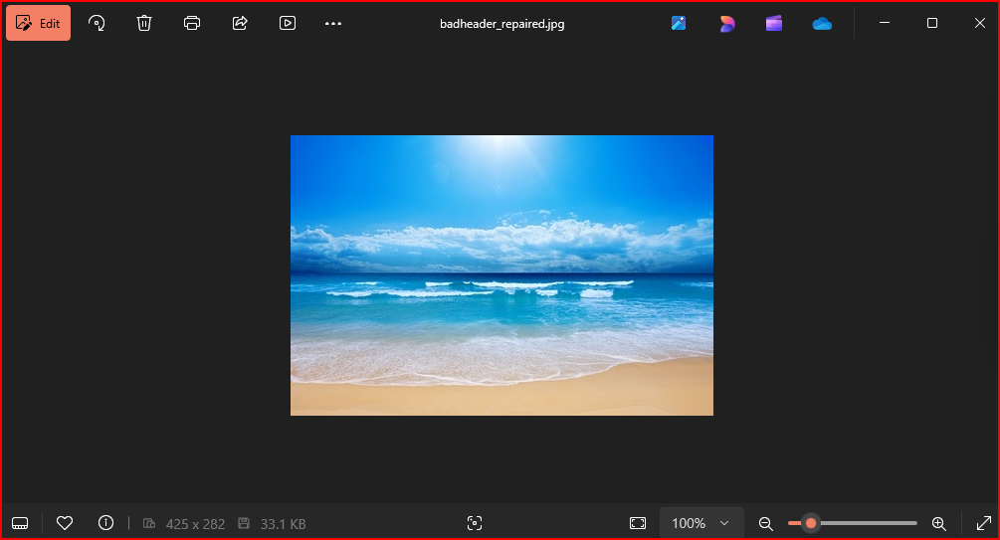
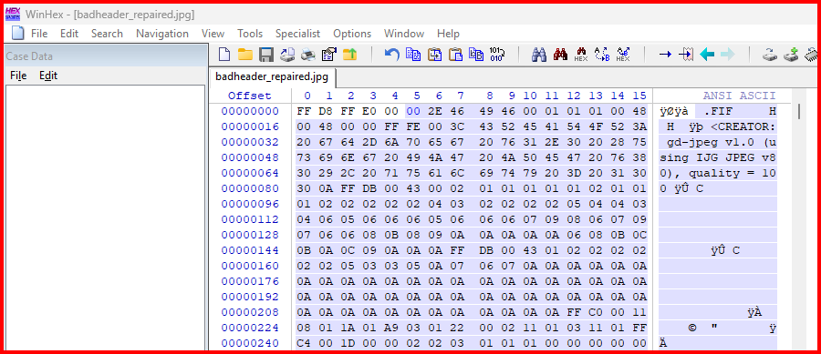

**Notes on the first attempt**
- The hash mismatch is the first finding: the downloaded file is **not the file that was expected**, and the examiner must record this before any analysis.
- The second "fix" changed offset 0x05 from `10` to `00`, giving an APP0 length of 0, and left `2E` in place. The correct second fix is `2E → 4A` at offset 0x06. Many viewers ignore a broken APP0 segment, which is why the file still opened.

---

## Problems Encountered
| Problem | What happened | Fix | Lesson |
|---|---|---|---|
| Victim/suspect roles reversed | First summary said "allegations against the victim by the suspect" | Rewrote summary | Re-read the brief before writing conclusions |
| "PK header = tampering" | Every DOCX starts with PK | Judged by internal structure instead | Know each format's container |
| Hash lookup "UNKNOWN" treated as suspicious | It only means "not in NSRL" | Removed | Understand what each tool field means |
| Guessed metadata ("Likely similar…") | Values written without checking | Replaced with real values from Autopsy | Never estimate evidence |
| Timestomping missed | Round times not noticed | Compared FS times with docProps | Cross-check two independent timestamp sources |
| Wrong JPEG fix | Changed the length byte, not the "J" | Mapped bytes to the JFIF spec | Fix against the specification, not by guesswork |
| Hash mismatch ignored | Continued as if the file were correct | Recorded as finding | Integrity first |

## Deliverables
- [x] Case 1: preservation, disk layout, timestomping, documents, pictures, tools, disguised files
- [x] Case 2: verification, volume anomaly, clues, cipher identified
- [x] Lab 3: header analysis and correct repair
- [x] Remaining leads and decoding *(simulated)*
- [ ] Final report in `report/`

## Key Learnings
1. Two independent timestamp sources (file system vs. embedded metadata) expose timestomping that either one alone would hide.
2. A file's signature must be judged against the format's full structure, not just the first four bytes.
3. File names, folder names and container structure are evidence too: `Crazy Bitch Threats/Proof/` and an "Accountancy" ZIP full of audio say as much as the files' content.
