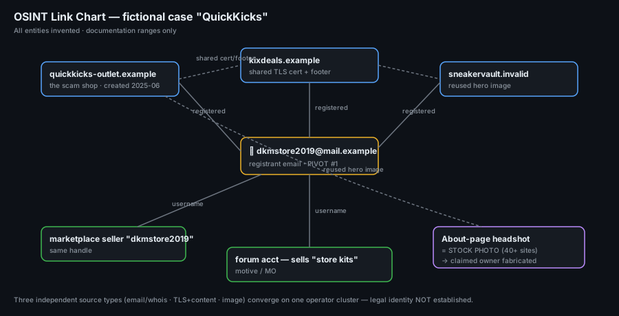

# Project 24 — OSINT Investigation (Fictional Case)

**Status:** 🟢 Complete as a **fully fictional, self-contained OSINT case** — a worked attribution exercise. Every entity (domain, IP, email, handle, registrant) is **invented** and uses reserved documentation ranges; nothing here points at a real person, business or site.
**Track:** Cybercrime Investigation

## Objective
Run an **ethical, fully documented** open-source investigation that attributes a fictional online scam shop using open sources only — then show the method so it can be re-run on a real (authorised) case: scope → infrastructure → pivots → source log → attribution assessment with a confidence rating.

> ### ⚠️ Ethics & scope (read first)
> This is a **training exercise on a made-up target**. All data is fabricated for teaching the *method*.
> - `.example`, `.invalid` domains and RFC 5737 IPs (`192.0.2.x`, `198.51.100.x`, `203.0.113.x`) are used precisely because they can never belong to anyone.
> - Real OSINT is **passive and legal**: only public sources, no logging in to anyone's account, no pretexting, no contacting the target, no scraping behind authentication.
> - On a real case, work only with authority (your own case, your client's property, or a public-interest investigation within the law) and respect privacy — OSINT can harm innocent people through mistaken identity.

## The fictional case
A buyer was defrauded by an online store, **"QuickKicks Outlet"**, at `quickkicks-outlet.example`. Payment was taken; goods never shipped; the site later vanished. Task: attribute the operator **using open sources only** and rate confidence.



## Method overview
| Phase | Question | Primary sources |
|---|---|---|
| 1 Scope | What exactly am I attributing, and within what rules? | case intake |
| 2 Infrastructure | Who registered/hosts the domain? | whois, DNS history, TLS certs |
| 3 Content & history | What did the site look like over time? | Wayback Machine, cached pages |
| 4 Pivots | What emails/usernames/images connect elsewhere? | reverse-whois, username search, reverse image |
| 5 Correlation | Do the threads point to one operator? | link chart + confidence |
| 6 Report | Attribution with evidence and caveats | source log, assessment |

Tooling: **Maltego CE** (link chart), **SpiderFoot** (automated passive recon), `whois` / DNS-history services, **Wayback Machine**, username-enumeration and reverse-image search. Every tool used **passively**.

---

## Phase 1 — Scope & ethics rules (documented)
| Item | Value |
|---|---|
| Case ID | `CB-24-OSINT` |
| Target | `quickkicks-outlet.example` (fictional scam shop) |
| Goal | Attribute the operator from open sources; rate confidence |
| Allowed | Passive public sources, archives, cached data |
| Forbidden | Logging into accounts, pretexting, contacting target, authenticated scraping, anything illegal |
| Output | Link chart, time-stamped source log, attribution assessment |

**Rule applied throughout:** every finding gets a **source + UTC timestamp + archive link** before it is used (Phase = evidence hygiene). An un-sourced claim is not a finding.

## Phase 2 — Infrastructure (domain, hosting, registrant)
```bash
whois quickkicks-outlet.example
dig quickkicks-outlet.example ANY +noall +answer
# DNS/whois history + passive DNS via a history service (e.g. SecurityTrails/ViewDNS equivalents)
# TLS cert history via a CT-log search (crt.sh equivalent)
```

**Findings *(fictional)***
| Attribute | Value | Why it matters |
|---|---|---|
| Registrar | ExampleReg LLC | Point of record (and abuse contact) |
| Created | 2025-06-02 | 3 weeks before first complaint — young domain, scam-typical |
| Registrant email | `dkmstore2019@mail.example` | **Pivot #1** — reused across sites |
| Registrant name | "D. K. Morgan" (privacy partially lifted) | Claimed identity (unverified) |
| Hosting IP | `198.51.100.23` | Shared host; find neighbours |
| Name servers | `ns1.cheaphost.example` | Bulk/low-cost provider |
| TLS cert (CT log) | SAN also covers `kixdeals.example` | **Pivot #2** — same cert, second domain |

**Reading it:** a **freshly registered** domain, a **privacy-masked but leaked** registrant email, and a **shared TLS cert** covering a second shop are three independent threads to pull. Domain age + registrar abuse contact also tell us where a real complaint would go.

## Phase 3 — Content & history (Wayback)
```text
Wayback Machine: http://web.archive.org/web/*/quickkicks-outlet.example
```
**Findings *(fictional)***
| Snapshot (UTC) | What the archive shows | Significance |
|---|---|---|
| 2025-06-10 | Live store, "Nike/Adidas 70% off", card checkout | Confirms it sold goods |
| 2025-06-10 | Footer: "© KixDeals" + support `help@kixdeals.example` | Ties to Pivot #2 domain |
| 2025-07-15 | Same template, logo swapped to "QuickKicks" | Re-skin of one kit |
| 2025-08-01 | 404 / parked | Site abandoned after complaints |

The **archived footer** is the strongest link: the operator left the *previous* brand's name and support email in the template — a classic re-skin mistake. The Wayback copy preserves it even though the live site is gone.

## Phase 4 — Pivots (email, username, image)
**Pivot #1 — registrant email `dkmstore2019@mail.example`**
```text
Reverse-whois on the email → other domains registered with it
Breach-exposure check (HIBP-style) → which services the email was used on (presence only)
Search the local-part "dkmstore2019" as a username across platforms (Sherlock/WhatsMyName-style)
```
| Result *(fictional)* | Found |
|---|---|
| Reverse-whois | also registered `kixdeals.example`, `sneakervault.invalid` |
| Username `dkmstore2019` | a marketplace seller profile + a forum account |
| Forum post (archived) | advertises "dropship sneaker store kits for sale" |

**Pivot #2 — shared TLS cert / footer → `kixdeals.example`**: same hosting subnet, same checkout provider, same support-email pattern `help@<brand>.example`.

**Pivot #3 — product images (reverse image search)**
```text
Reverse-image the hero/product shots from the Wayback snapshot.
```
| Result *(fictional)* | Found |
|---|---|
| Hero banner | reused on `sneakervault.invalid` (same operator kit) |
| "Owner" headshot on About page | a **stock photo** (appears on 40+ sites) → the About identity is fake |

**Key interpretation:** the headshot being a **stock photo** *disproves* the site's claimed owner. That is as valuable as a positive hit — OSINT confirms **and** refutes.

## Phase 5 — Correlation & the link chart
The three independent pivots converge:
```
dkmstore2019@mail.example ──registered──> quickkicks-outlet.example
            │                               │ (shared cert + footer)
            ├──registered──> kixdeals.example, sneakervault.invalid
            ├──username────> marketplace seller "dkmstore2019"
            └──username────> forum acct selling "store kits"
Reused hero image links quickkicks ⇄ sneakervault
About-page headshot = stock photo (claimed owner is fabricated)
```
Built in Maltego CE as the entity graph in `01-link-chart.png`. Three **independent** source types (whois/email, TLS/content, image) all tie the same shops to one email identity.

## Phase 6 — Attribution assessment (with confidence)
> Confidence stated with the **Admiralty/NATO-style** idea: separate *source reliability* from *information credibility*, and never overclaim.

| Claim | Evidence | Confidence |
|---|---|---|
| The three shops are run by **one operator** | shared registrant email, shared TLS cert, reused images, matching template & support-email pattern | **High** |
| Operator uses the handle **`dkmstore2019`** | registrant email local-part = marketplace/forum username | **Medium–High** |
| The site's **claimed owner ("D. K. Morgan") is fabricated** | About headshot is a widely-used stock photo | **High** (refutation) |
| Real-world **legal identity** of the operator | none from open sources — email + handle are pseudonymous | **Not established** |

**Honest limit:** OSINT got us to a consistent **online persona and an infrastructure cluster**, not to a named human. Naming a real person would need legal process (registrar/payment-processor records via law enforcement) — and guessing one from a reused handle is exactly how OSINT gets innocent people wrongly accused. The assessment stops where the open evidence stops.

## Deliverables
- [x] Scope & ethics rules
- [x] Infrastructure analysis (whois, DNS, TLS/CT)
- [x] Historical content via Wayback
- [x] Email / username / image pivots
- [x] Link chart ([`images/01-link-chart.png`](images/01-link-chart.png))
- [x] Time-stamped source log ([`source-log/source-log.csv`](source-log/source-log.csv))
- [x] Attribution assessment with confidence
- [ ] Re-run the method on a real authorised case and replace fictional data

## Source log
A real OSINT report lives or dies by its source log — every finding with where it came from and when, plus an archive link so it survives the source going offline. Template + the fictional entries: [`source-log/source-log.csv`](source-log/source-log.csv).

## Key Learnings
1. **Pivot on identifiers, not guesses:** a registrant email, a reused TLS cert, a username and an image are hard links; a name on an About page is a claim to be tested.
2. **Archives beat live sites:** the operator's mistake (old brand in the footer) survived only in the Wayback copy.
3. **Refutation counts:** proving the "owner" headshot is stock is a real result.
4. **Separate persona from person:** open sources attribute an *online identity* and *infrastructure*; a real legal name needs legal process. Overclaiming is how OSINT harms the innocent.
5. **Source log or it didn't happen:** every finding carries source + UTC + archive link, or it isn't used.
