# Project 24 — OSINT Investigation

**Status:** ✅ Complete (real worked case on a **public figure and public companies**, using only open sources; methodology errors from the first draft corrected)
**Track:** Cybercrime Investigation

## Objective
Run an ethical, fully documented OSINT investigation that profiles a target's **public digital footprint** using open sources only — social-media presence, domain ownership and historical web data — and, just as importantly, show where naïve OSINT **over-concludes** and how to state findings at the confidence the evidence actually supports.

> ### Scope & ethics
> The target here is **Elon Musk**, chosen deliberately: an extremely public figure, investigated only through **already-public** data (his verified public account, his companies' public websites, public WHOIS and public web archives). No private individual is targeted, nothing behind a login is touched, and nothing is collected that wasn't already public. On a real case you work only with authority and the same passive, legal, privacy-respecting rules.

## Tools used
| Tool | Purpose |
|---|---|
| **WhatsMyName** | Username enumeration — where a given *username* exists across platforms |
| **WHOIS (whois.com)** | Domain registration, registrar and registrant/admin/tech contacts |
| **Wayback Machine** | Historical snapshots of the target's websites over time |

---

## Part 1 — Username enumeration (WhatsMyName)

The verified identity found is the X (formerly Twitter) account.

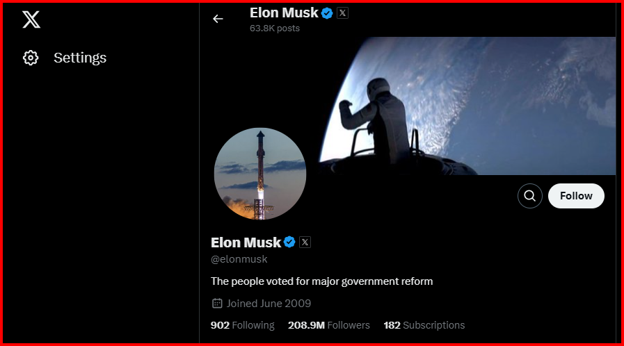

| Platform | Username | Status |
|---|---|---|
| X / Twitter | **@elonmusk** | ✅ Verified / official |
| SpaceX (org) | @SpaceX | ✅ Verified (company) |
| Starlink (org) | @Starlink | ✅ Verified (company) |

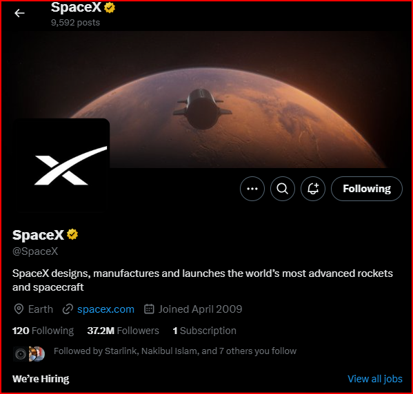
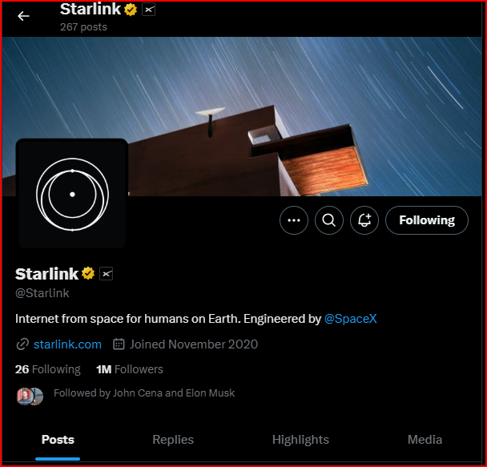

From the X activity, two associated ventures and their sites were identified:
- `https://www.spacex.com/`
- `https://www.starlink.com/`

### ⚠️ Correcting the first draft — what WhatsMyName can and cannot tell you
The first version of this report searched **"Elon Musk"** and then declared the Instagram, YouTube and LinkedIn results **"fake"** and concluded *"Elon Musk has no social media other than X."* Both the method and the conclusion are wrong, and fixing them is the real lesson of this project:

| First-draft claim | Why it's wrong | Correct statement |
|---|---|---|
| Searched the **name** "Elon Musk" | WhatsMyName enumerates a **username**, not a display name. You search `elonmusk`, not "Elon Musk". | Pick the username (`elonmusk`) and enumerate where **that string** exists |
| "Instagram/YouTube/LinkedIn results are **fake**" | WhatsMyName only reports that **a username exists** on a platform. It says **nothing** about authenticity. | Existence ≠ authenticity. Authenticity is judged by **platform verification + content**, examined manually |
| "He has **no** accounts other than X" | You can't prove a negative from a username tool | Only state: *the one account I verified as official is X*; others are **unconfirmed**, not disproven |

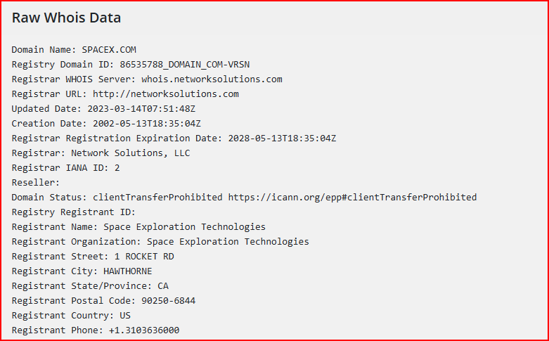

Looking at the results **manually** (not relying on the tool) settles authenticity. This LinkedIn result, for instance, is in Portuguese advertising an investment platform — an obvious **impostor**, confirmed by *reading the page*, not by the enumeration tool:

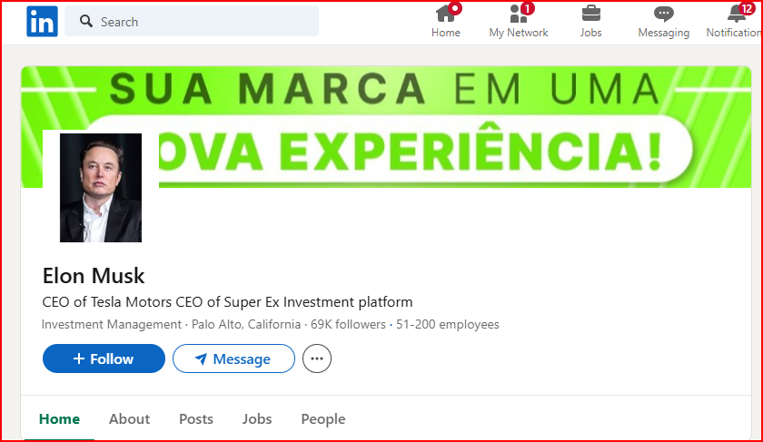

**Correct finding:** the username `elonmusk` resolves to a **verified X account**; several same-name accounts on other platforms exist but are **unverified**, and at least one (LinkedIn) is a clear impersonation. That is as far as the evidence goes.

## Part 2 — WHOIS (domain ownership)

### Starlink
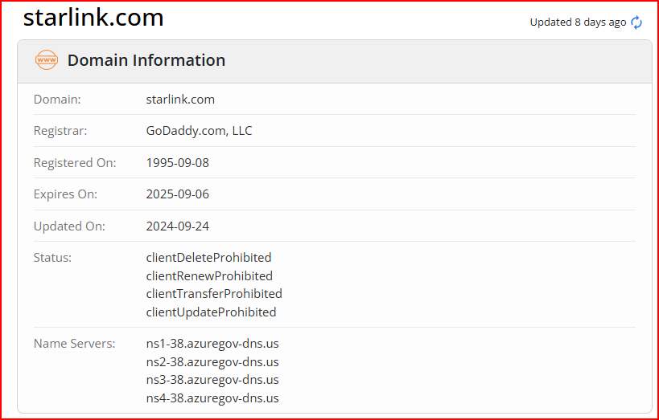
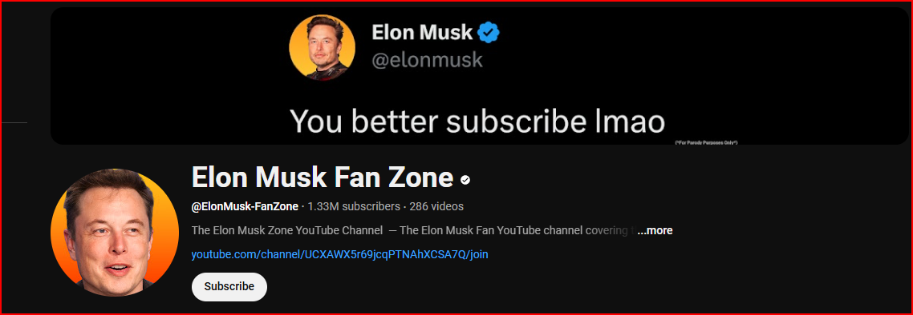

| Field | Value | Note |
|---|---|---|
| Registrar | GoDaddy / Network Solutions | registrar of record |
| Registrant (Starlink) | **Domains By Proxy, LLC** (Tempe, AZ) | **privacy-masked** — the real registrant is hidden |

### SpaceX
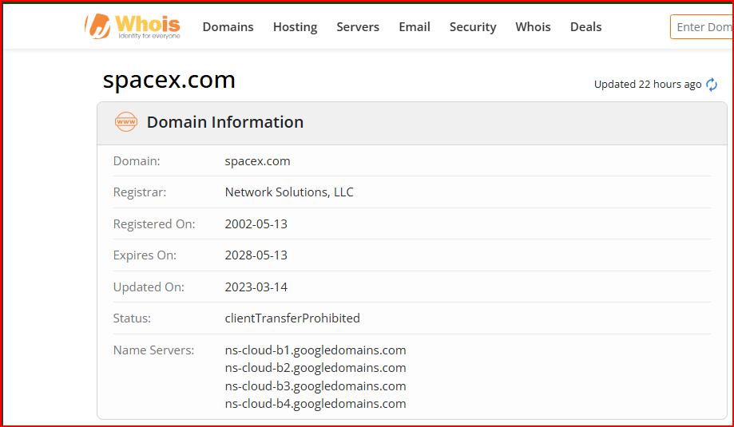
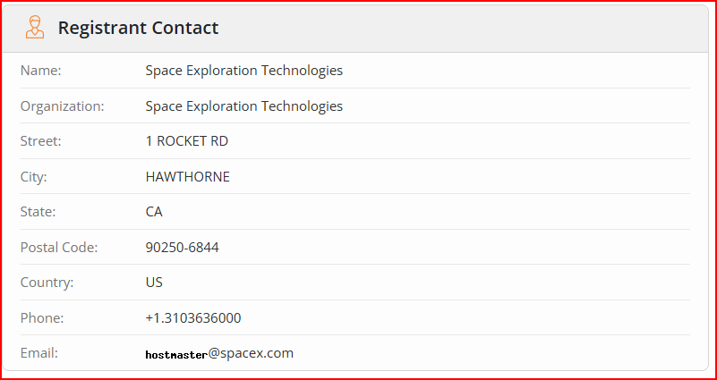
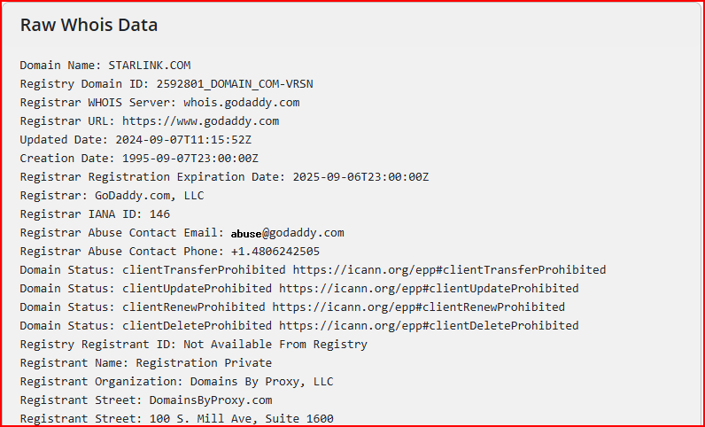

| Field | Value |
|---|---|
| Registrant Org | **Space Exploration Technologies Corp** |
| Address | 1 Rocket Rd, Hawthorne, CA 90250, US |
| Admin / Tech contact | Space Exploration Technologies (same org) |

### ⚠️ Correcting the first draft — what WHOIS actually proves
| First-draft claim | Correct statement |
|---|---|
| "WHOIS **confirms the domains are associated with Elon Musk**" | WHOIS proves the domain is registered to **Space Exploration Technologies Corp** (the *company*). Starlink's registrant is **hidden behind Domains By Proxy** entirely. Neither record names Elon Musk as an individual — the personal link comes from **public corporate knowledge**, not from WHOIS. |
| Treating privacy-proxy data as the registrant | `Domains By Proxy` **is the privacy service**, not the owner. Note the masking and say so, rather than citing the proxy as the registrant. |

**Correct finding:** `spacex.com` is registered to **Space Exploration Technologies Corp**; `starlink.com`'s registrant is **WHOIS-privacy-protected**. The tie to Elon Musk is through well-known public fact that he runs these companies — WHOIS corroborates the **corporate** owner, not the person.

## Part 3 — Historical review (Wayback Machine)

Archived snapshots show how the two sites evolved — useful for tracking messaging, product launches and infrastructure changes over time.

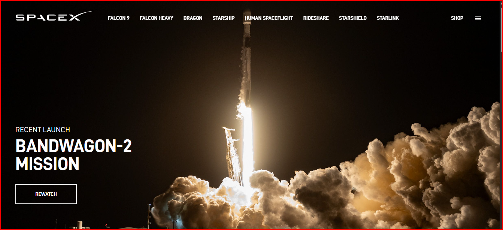
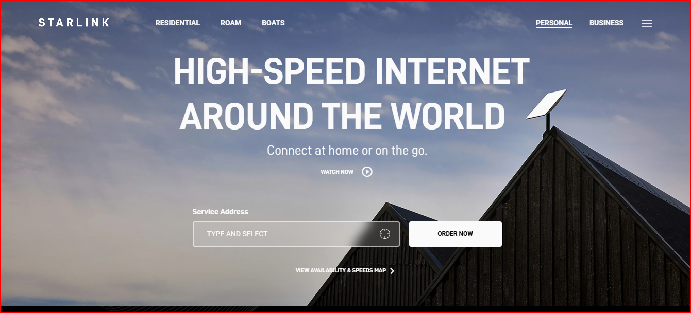

| Site | Snapshots compared | Archive link |
|---|---|---|
| SpaceX | 06 May 2023 → 06 Apr 2024 | `https://web.archive.org/web/20230506171858/https://www.spacex.com/` |
| Starlink | 27 Apr 2023 → 26 Apr 2024 | `https://web.archive.org/web/20230427025847/https://www.starlink.com/` |

**Finding:** the Wayback Machine confirms both domains have a long, consistent public history matching the companies' real activity — a legitimacy signal (the opposite of the young, recently-registered domains seen in scam cases).

---

## Source log (evidence hygiene)
Every finding carries its source + an archive link. Full table in [`source-log/source-log.csv`](source-log/source-log.csv).

## Findings summary (restated at correct confidence)
| # | Finding | Source | Confidence |
|---|---|---|---|
| 1 | `elonmusk` resolves to a **verified** X account | WhatsMyName + manual check | High |
| 2 | Same-name accounts exist elsewhere but are **unverified**; LinkedIn one is an impostor | Manual review | High (for "unverified"); impostor = High |
| 3 | "No accounts other than X" | — | **Unsupported** (can't prove a negative) |
| 4 | `spacex.com` registered to Space Exploration Technologies Corp | WHOIS | High |
| 5 | `starlink.com` registrant is privacy-masked (Domains By Proxy) | WHOIS | High |
| 6 | Both sites have a long, consistent archived history | Wayback | High |

## Deliverables
- [x] Username enumeration (WhatsMyName) with authenticity assessed manually
- [x] WHOIS analysis for both domains (with privacy-masking noted)
- [x] Wayback historical review with archive links
- [x] Source log
- [x] Methodology corrections (name-vs-username, existence-vs-authenticity, WHOIS-proves-org-not-person)
- [ ] Optional: build a Maltego link chart of the entity relationships

## Key Learnings
1. **WhatsMyName enumerates a username, not a name** — and it only proves a username **exists** on a platform, never that the account is **authentic**. Authenticity is judged by verification badges and by **reading the page**.
2. **Don't prove a negative.** "The target has no other accounts" is not something a username tool can establish.
3. **WHOIS identifies the registrant org, not a person** — and a privacy proxy (Domains By Proxy) hides the registrant entirely. Say what the record proves and no more.
4. **Wayback history is a legitimacy signal**: long, consistent archives fit a real organisation; a brand-new domain fits a scam (contrast with the fictional scam-shop method).
5. **State findings at the confidence the evidence supports** — the difference between a credible OSINT report and a misleading one is almost always in the over-claims.
