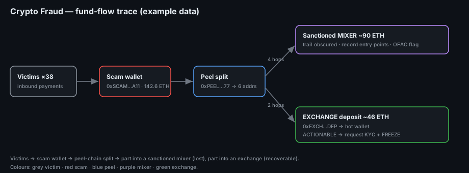

# Project 25 — Cryptocurrency Fraud Tracing (Playbook)

**Status:** 🟢 Incident-response **playbook / runbook** for tracing stolen funds on a public blockchain. The method and tools are real and the queries runnable; the addresses and amounts shown are a simulated walkthrough (marked *(sim)*) using **example** values — swap in a real publicly-reported scam address to re-run it.
**Track:** Cybercrime Investigation

## Objective
Give an investigator a **step-by-step playbook** to follow stolen cryptocurrency from a reported scam wallet to wherever it lands: trace inbound (victim) and outbound (laundering) flows, recognise exchange deposits, mixers and bridges, visualise the money trail, and write findings that say **exactly what to request from an exchange** to attach a real-world identity — because the blockchain never contains names.

## The one idea that makes this work
Public blockchains (Bitcoin, Ethereum) are a **permanent, open ledger**: every transaction is visible to anyone, forever. You don't need a warrant to *trace* — only to *de-anonymise*. Tracing is free and passive; the names sit at the **exchanges** (the on/off-ramps between crypto and bank accounts), which release them only to law enforcement with legal process. This playbook does the tracing and then hands law enforcement a precise ask.



> ### Scope & ethics
> All addresses and amounts below are **examples** (clearly marked *(sim)*). On a real case, start only from a **publicly reported** scam address (e.g. a report on Chainabuse / a police bulletin / a victim who shares their own TXIDs), trace only public ledger data, and **never** accuse an individual — tracing attributes *addresses and clusters*, and a real name requires exchange records obtained lawfully.

## Tools
| Tool | Purpose |
|---|---|
| **Block explorers** (Etherscan, Blockchain.com, Blockstream, Mempool.space) | Look up any address/transaction; see balances, counterparties, timestamps |
| **Breadcrumbs / graph tools** (Breadcrumbs.app, or Maltego crypto transforms) | Visualise multi-hop fund flows |
| Address-label sources (Chainabuse, OFAC SDN list, exchange hot-wallet lists) | Tell a mixer/exchange/sanctioned address from a personal one |
| Scripting (Python + a chain API) | Pull transaction lists at scale for the transaction table |

---

## Stage 0 — Intake
**Goal:** pin down what you're tracing and in what asset.

```text
Record now:  scam/beneficiary address · chain (BTC/ETH/…) · asset (native/token) ·
             victim TXIDs (with amounts + UTC time) · amount reported stolen ·
             source of the address (report link + date)
```
Identify the **chain** first — the whole method differs between Bitcoin's UTXO model and Ethereum's account model (see Stage 3).

## Stage 1 — Confirm the scam address and its profile
Open the address in a block explorer and read its shape.

```text
Etherscan:        https://etherscan.io/address/<addr>
Blockstream/BTC:  https://blockstream.info/address/<addr>
```
**What to look for:** total received, number of inbound txns (many small = many victims), first/last activity, current balance (still holding vs already moved).

**Example *(sim)***
| Field | Value *(sim)* |
|---|---|
| Address | `0xSCAM…A11` (ETH) |
| Total received | 142.6 ETH across 38 inbound txns |
| First seen | 2025-09-02 |
| Current balance | 0.4 ETH (funds already moved out) |

→ 38 inbound = ~38 victims; near-zero balance = the operator has already pushed funds onward. Trace **outbound** next.

## Stage 2 — Trace inbound (victims) and outbound (laundering)
**Inbound** — confirm victim payments and size the fraud:
```text
Explorer → address → "Transactions" (inbound) → export CSV
```
**Outbound** — follow the money hop by hop:
```python
# Pull the full txn list via a chain API (example: Etherscan API) and separate in/out
import requests
addr = "0xSCAM...A11"
r = requests.get("https://api.etherscan.io/api",
    params={"module":"account","action":"txlist","address":addr,
            "sort":"asc","apikey":"YOURKEY"}).json()
for t in r["result"]:
    direction = "IN " if t["to"].lower()==addr.lower() else "OUT"
    print(direction, int(t["value"])/1e18, "ETH", t["hash"][:12], t["to"][:12])
```
**Technique that matters — Bitcoin co-spend clustering:** on BTC, when one transaction spends several inputs together, those input addresses are almost always controlled by **one entity** (the common-input-ownership heuristic). That's how you expand one address into the operator's **cluster**. Ethereum is simpler — follow the account directly, but watch for funds split across fresh accounts to break the trail (**peel chains**).

**Example outbound trail *(sim)***
| Hop | From → To | Amount | Note |
|---|---|---|---|
| 1 | `0xSCAM…A11` → `0xPEEL…77` | 140 ETH | moved out in one sweep |
| 2 | `0xPEEL…77` → 6 fresh addrs | ~23 ETH each | **peel chain** — split to obscure |
| 3 | 4 of those → `0xMIX…TC` | ~90 ETH total | into a **mixer** (Tornado-style) |
| 3 | 2 of those → `0xEXCH…DEP` | ~46 ETH | into an **exchange deposit address** |

## Stage 3 — Identify where funds landed (exchange / mixer / bridge)
This is the decisive classification — it decides whether the money is **recoverable** (exchange) or **obscured** (mixer/bridge).

| Destination type | How you recognise it | What it means |
|---|---|---|
| **Exchange deposit** | Address labelled as an exchange hot wallet; funds forwarded to a known exchange cluster shortly after | **Best lead** — the exchange holds KYC on the depositor. Request records. |
| **Mixer / tumbler** | Known mixer contract (labelled; e.g. Tornado Cash pools), uniform denominations, sanctioned (OFAC) | Trail is deliberately broken; note the entry amount/time for possible demixing by specialists |
| **Bridge** | Funds sent to a cross-chain bridge contract, then appear on another chain | Continue the trace **on the destination chain** |
| **Personal wallet / hold** | No label, just holds | Monitor; set an alert for the next move |

Label sources: the explorer's own tags, Chainabuse, exchange-published hot-wallet lists, and the **OFAC SDN** crypto list for sanctioned mixers.

**Example *(sim)***: 46 ETH reached a deposit address that forwards to **a major exchange's** hot wallet → **actionable**. 90 ETH went into a **sanctioned mixer** → flag, record entry points, hand to specialists.

## Stage 4 — Visualise the flow
Build the graph in Breadcrumbs (or Maltego) so the trail is legible to non-technical readers (courts, clients):
- Nodes = addresses (colour by type: victim / scam / peel / mixer / exchange).
- Edges = transactions (label with amount + date).
- Collapse clusters so the story is "victims → scam wallet → split → exchange + mixer", not 400 raw hops.

Diagram: [`images/01-fund-flow.png`](images/01-fund-flow.png). Transaction table: [`data/transactions.csv`](data/transactions.csv).

## Stage 5 — Findings & the exchange request (the payoff)
A trace is only useful if it ends in an **actionable ask**. For each exchange deposit found, the investigator/LE should request (with legal process):

```text
To: <Exchange> Compliance / Law Enforcement Response Team
Re: Deposit address 0xEXCH...DEP — suspected fraud proceeds

Please provide, for the account associated with deposit address 0xEXCH...DEP:
  • Account holder KYC (name, DOB, address, ID documents)
  • Registration email, phone, and IP + device logs
  • Deposit/withdrawal history around 2025-10-01 (±7 days)
  • Any linked accounts / same-KYC accounts
  • Current balance and a request to FREEZE pending legal order
Reference TXIDs: <hashes>.  Chain: Ethereum.  UTC timestamps attached.
```
Speed matters: exchanges can **freeze** funds that are still on-platform, so the freeze request goes **first**, in parallel with the formal records request.

## Deliverables
- [x] Intake + address-profile method
- [x] Inbound/outbound tracing (explorer + API script)
- [x] Classification of exchange / mixer / bridge destinations
- [x] Fund-flow diagram + transaction table
- [x] Exchange-request template (what to ask for and the freeze step)
- [ ] Re-run on a real publicly-reported scam address and replace every *(sim)* value

## Key Learnings
1. **Tracing is open; names are at the exchanges.** The ledger is public — the investigation ends by asking a KYC'd on/off-ramp for the identity, with legal process.
2. **Co-spend clustering (BTC) and peel chains (ETH)** are the two patterns that turn one address into an operator's whole footprint — or that the operator uses to try to lose you.
3. **Classify the destination** — exchange (recoverable), mixer/bridge (obscured). That classification decides the entire response.
4. **Freeze first.** Funds still on an exchange can be frozen; every hour the trail cools.
5. **Attribute addresses, not people.** A cluster is not a person until KYC records say so — overclaiming here is both wrong and dangerous.
