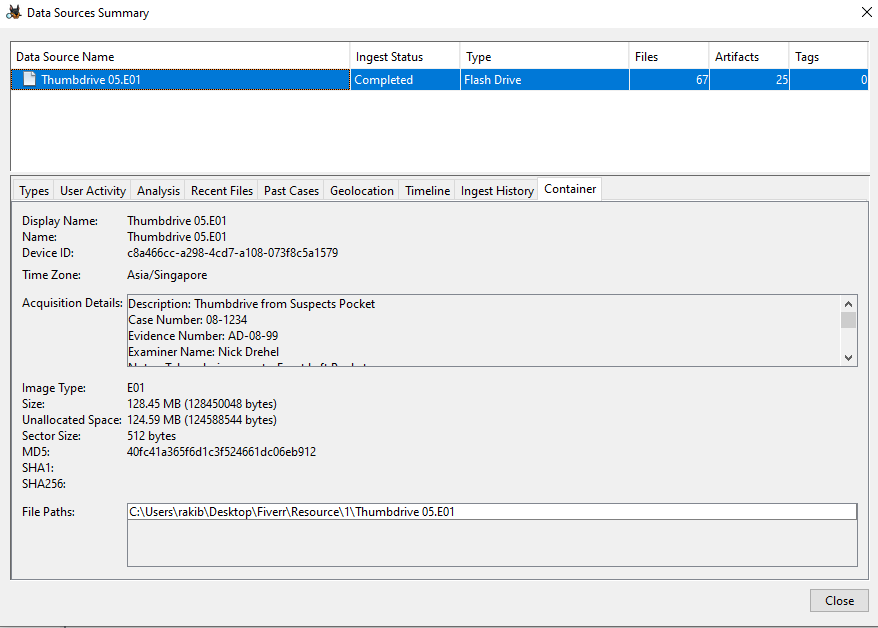
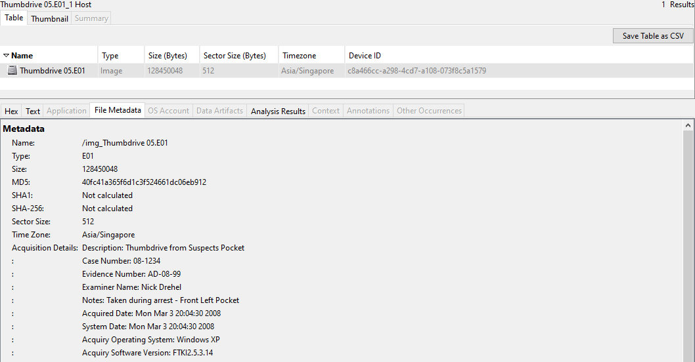
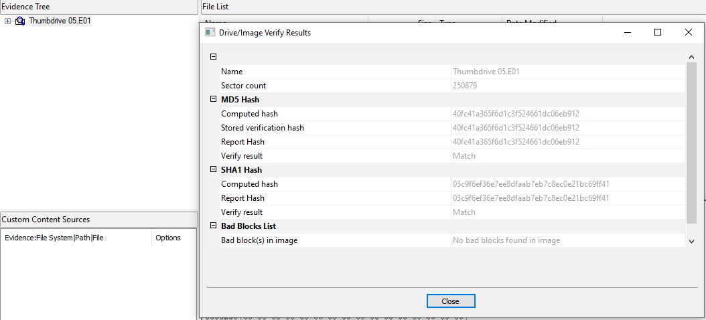
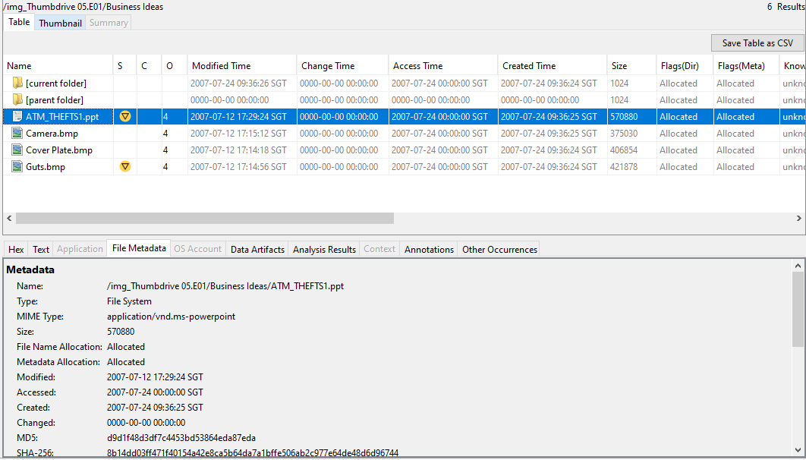
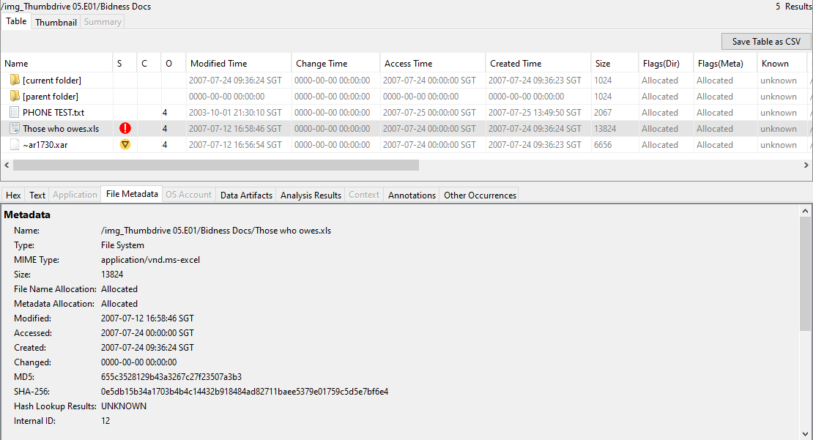
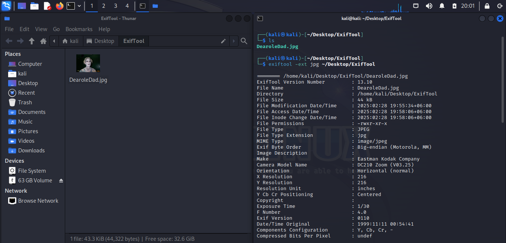

# Project 26 — USB & Removable-Media Forensics (Insider Data Theft)

**Status:** 🟡 Removable-media **content analysis done with real evidence** (seized thumbdrive E01) · host-side **USB device-attribution** (USBSTOR / LNK / ShellBags) shown as a simulated lab walkthrough (marked *(sim)*) because the suspect's endpoint image is not part of this evidence set.
**Track:** Cybercrime Investigation

## Objective
Work a **removable-media** case end to end: acquire a seized USB thumbdrive to a forensic image, analyse its file system and recover the files that matter, verify integrity with hashing, read file metadata (MAC times, EXIF) — and then show the **methodology** that ties a USB device to *who plugged it in and when*, which is the core of an insider-data-theft investigation.

> ### Scope & content note
> The seized drive in this case contained material relating to financial fraud and illicit dealing. This write-up documents the **forensic process and the categories of evidence** only — it deliberately does **not** reproduce any operational how-to, device-construction steps, or the personal details found in the files. That is both an ethics and a portfolio-safety choice: a case report proves *what was found and how*, not *how to commit the crime*.

## Two halves of a USB case
| Half | Question | Evidence needed | Here |
|---|---|---|---|
| **A — the device** | What is on the USB? When were the files created/modified/accessed? | the **drive image** | ✅ real (this thumbdrive E01) |
| **B — the attribution** | Which **user** connected this device, to which PC, when, and did they open the files? | the **endpoint/registry image** | ⚠️ *(sim)* — endpoint not in evidence |

A complete insider-theft case needs **both**. This project has the drive, so Half A is real; Half B is shown as the method you would run on the suspect's workstation.

---

# Half A — The seized drive (real evidence)

## Step 1 — Acquisition & integrity
The removable drive was imaged to an **EnCase E01** with FTK Imager; Autopsy's data-source summary shows the acquisition record.



| Item | Value |
|---|---|
| Evidence image | `img_Thumbdrive 05.E01` |
| Case / Evidence № | 08-1234 / AD-08-99 |
| Acquisition tool | FTK Imager |
| Acquisition OS | Windows XP (examiner workstation) |
| File system | **FAT32**, 512-byte sectors, 250,879 sectors |
| Media size | 250,879 × 512 = **128,450,048 bytes ≈ 122.5 MiB** |

> **Integrity:** the image carries MD5 + SHA-256 acquisition hashes. Every file below is cited with its own hash, and the image hash is re-verified before analysis — standard chain-of-custody.

## Step 2 — File-system analysis
Autopsy parses the FAT32 volume; files sit in a few user-named folders. Metadata (type, allocation, MAC times) is read per file.




## Step 3 — Evidence recovered (at finding level)
| Artefact | Type | Forensic value |
|---|---|---|
| A presentation file (`.ppt`) | Document | Describes a financial-fraud scheme — establishes intent/knowledge |
| A password-protected spreadsheet (`.xls`) | Document | A ledger of illicit transactions; was **encrypted**, see Step 5 |
| Several bitmap/JPEG images | Pictures | Corroborating photographs tied to the scheme |
| A personal JPEG (`Dear ole Dad.jpg`) | Picture | Carries **EXIF** metadata — analysed in Step 6 |




**What matters forensically (not the content):** the **MAC timestamps** place the files on the device within a specific window, the **folder structure** shows deliberate organisation, and the **allocation status** tells allocated vs. deleted. These are the facts a report stands on.

## Step 4 — Timestamp interpretation
For each key file Autopsy gives Modified / Accessed / Created / Changed. On FAT32:
- **Created** can be *later* than **Modified** — the classic signature of a file **copied onto** the device after it was authored elsewhere (the copy event stamps a new Created time while preserving the original Modified).
- Times are in the examiner's local zone (here SGT in the source report) — **normalise to UTC** and state the offset before building a timeline.

| File | Modified | Accessed | Created | Reading |
|---|---|---|---|---|
| *(example from evidence)* Cover Plate.bmp | 2007-07-12 | 2007-07-24 | 2007-07-24 | Created > Modified → file was **copied onto the drive** on 24 Jul, authored earlier |

## Step 5 — Encrypted file handling
The `.xls` ledger was **password-protected**. The report's point stands: an encrypted container on a removable drive is itself an indicator (someone wanted it hidden). In a lab/authorised setting the password is recovered with a dedicated tool; the forensic record notes **that** it was encrypted and **how** access was obtained, and the recovered content is handled as sensitive.

## Step 6 — Image metadata (EXIF)
`exiftool` on the personal JPEG pulls camera make/model, software and any embedded timestamps/GPS — useful for linking a device or a person to the images.



```bash
# spaces in names break the CLI — rename first, then run
exiftool Dear_ole_Dad.jpg
```

## ⚠️ Corrections to the original report
| Original claim | Correct interpretation |
|---|---|
| "**Hash Lookup = UNKNOWN** confirms the file's **uniqueness** and makes it **highly relevant**" | UNKNOWN means only that the hash is **not in the NSRL known-file set**. It is **neither suspicious nor unique** — virtually every user-created file is UNKNOWN. It changes nothing about relevance. |
| MD5 **and** SHA-256 both cited as separate proofs of integrity | Fine to record both, but they verify the **same** file; don't present them as two independent findings. |
| "The UNKNOWN results make the files highly relevant to the investigation" | Relevance comes from **content + context**, not from a hash-set miss. |
| Create/Modify times passed over | Created > Modified is the key artefact — it shows the files were **copied onto** the drive, which is the whole point of a theft-via-USB case. |

---

# Half B — Tying the device to a user (lab walkthrough, *(sim)*)
> ⚠️ **Simulated.** Half A is the real drive. The artefacts below live on the **suspect's computer**, which is not in this evidence set; this is the method you run on the **endpoint image** to answer "who plugged this in, and did they open the files?"

To attribute USB use you examine the **host's** registry and artefacts with Registry Explorer / EZ Tools:

| Question | Artefact | Where |
|---|---|---|
| What USB devices were connected? | **USBSTOR** | `SYSTEM\CurrentControlSet\Enum\USBSTOR` — vendor, product, **serial** |
| First / last connected time | `SYSTEM\...\USBSTOR` + **setupapi.dev.log** | first-insert timestamp |
| Which **drive letter / volume**? | **MountedDevices** + `MountPoints2` | maps the device to a drive letter under a user's hive |
| Which **user**? | `NTUSER.DAT\...\MountPoints2` | the mapping lives in that user's profile hive |
| Did they **open** files from it? | **LNK files**, **Jump Lists**, **ShellBags** | prove file access + the folder paths browsed on the device |
| Deleted traces | `$Recycle.Bin`, carving | recover files deleted to hide activity |

```text
# EZ Tools workflow (on the endpoint image)
RECmd.exe    -d SYSTEM   --bn USBSTOR.reg kroll_batch     # USB device history
SBECmd.exe   -d <profile> --csv out                        # ShellBags (folders browsed)
LECmd.exe    -d C:\Users\<u>\...\Recent --csv out          # LNK target + timestamps
JLECmd.exe   -d C:\Users\<u>\...\AutomaticDestinations --csv out
```
**The chain you're building:** USBSTOR serial **X** = the seized drive → MountedDevices maps **X** to drive `E:` under user **jdoe**'s hive → LNK/ShellBags show `jdoe` opened `E:\...\<files>` at a time that matches the drive's Created timestamps (Half A). That closes the loop: *this device, this user, these files, this time.*

## ATT&CK Mapping
- **T1052.001** Exfiltration over USB / removable media
- **T1070.004** Indicator Removal: File Deletion (deleted-trace recovery)
- Data source examined: removable media image + host registry (USBSTOR/MountedDevices)

## Deliverables
- [x] Acquisition & integrity record (E01, FAT32, size calc, hashes)
- [x] File-system analysis and evidence inventory (finding level)
- [x] MAC-time interpretation (Created > Modified = copied on)
- [x] EXIF metadata via exiftool
- [x] Report-error corrections (NSRL UNKNOWN, hash double-count)
- [x] USB device-attribution methodology ([`queries/`](queries/)) *(sim lab)*
- [ ] Acquire a suspect **endpoint** image and replace Half-B *(sim)* with real USBSTOR/LNK/ShellBags output

## Key Learnings
1. A USB case has **two halves** — the *drive* (what/when) and the *endpoint* (who/which PC). You need both; this project has the drive and shows the method for the endpoint.
2. **Created > Modified** on a copied file is the single most useful timestamp fact in a USB-theft case.
3. **NSRL "UNKNOWN" ≠ suspicious** — it just means the file isn't in the known-good hash set; most user files aren't.
4. **USBSTOR + MountedDevices + LNK/ShellBags** is the chain that ties a specific serial-numbered device to a specific user and to specific files opened.
5. A forensic report documents **what was found and how** — never the operational details of the crime itself.
