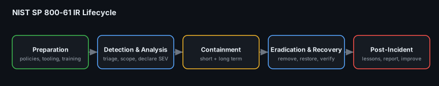
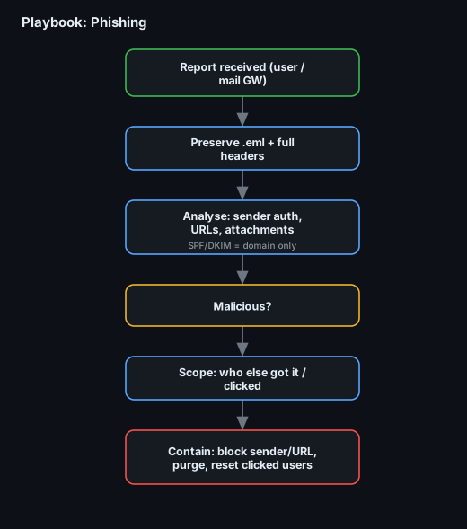
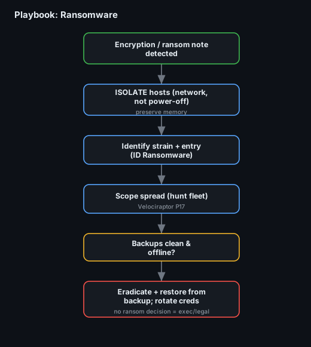
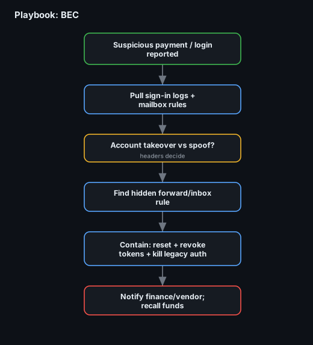
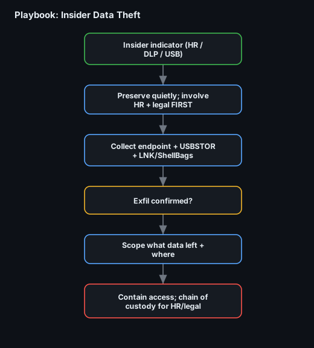

# Project 27 — Incident Response Plan & Playbooks

**Status:** 🟢 Complete — a self-contained IR program: the plan (roles, severity, comms, escalation) + 5 operational playbooks with flowcharts + a tabletop exercise report. Built to **NIST SP 800-61**.
**Track:** Incident Response

## Objective
Give an organisation that has **no documented IR process** everything the SOC needs to run an incident consistently: *who* does *what*, *when* to escalate, *how* to communicate, and a step-by-step playbook (with a flowchart) for each of the five incident types this portfolio actually investigates. The playbooks are not theory — each one points at the Code-Blue project that works that incident for real.



---

# Part 1 — The IR Plan

## 1.1 Purpose & scope
This plan governs how the company detects, responds to, and recovers from cybersecurity incidents across all IT assets, users and cloud services. It follows the four-phase **NIST SP 800-61** lifecycle: **Preparation → Detection & Analysis → Containment, Eradication & Recovery → Post-Incident Activity**.

## 1.2 Roles & responsibilities
| Role | Who | Responsibility |
|---|---|---|
| **Incident Commander (IC)** | Senior SOC lead / IR manager | Owns the incident end to end; declares severity; the single decision-maker |
| **Triage / Tier-1 analyst** | SOC analyst | First assessment, enrichment, declares or dismisses |
| **Investigation / Tier-2–3** | DFIR analyst | Scoping, forensics, containment actions |
| **Comms lead** | Designated manager | Internal + external messaging; the only one who speaks for the incident |
| **Legal / Compliance** | Legal counsel | Regulatory/breach-notification duties, evidence handling, privilege |
| **HR** | HR partner | Required for any **insider** case before investigation begins |
| **Executive sponsor** | CISO / CTO | Business decisions (ransom, shutdown, disclosure), resourcing |
| **IT / System owners** | Infra, app teams | Execute containment/recovery on their systems |

> **One IC per incident.** Everyone else feeds the IC; the IC decides. This is what stops a chaotic response.

## 1.3 Severity matrix
| Sev | Definition | Examples | Response time | Escalation |
|---|---|---|---|---|
| **SEV-1** | Critical — material business impact / active widespread damage | Ransomware spreading, mass data exfiltration, DC compromise | **Immediate**, 24/7 | IC + exec sponsor + legal **now** |
| **SEV-2** | High — confirmed compromise, contained scope | Single BEC takeover, one ransomwared host, confirmed web shell | ≤ 1 hour | IC + relevant owners |
| **SEV-3** | Medium — suspicious, not yet confirmed | Phishing click, one risky sign-in, isolated malware alert | ≤ 4 hours (business) | Tier-2 |
| **SEV-4** | Low — informational / policy | Spam, blocked attempt, single failed-login burst | Next business day | Tier-1 |

## 1.4 Communication plan
- **Channels:** a dedicated incident bridge/war-room channel per incident; **out-of-band** (phone/Signal) if email/IdP may be compromised.
- **Cadence:** IC posts a status update every 30 min (SEV-1), 2 h (SEV-2), daily (SEV-3).
- **Who speaks:** only the **Comms lead** externally; no one else confirms details to vendors, press or customers.
- **Record:** a running incident timeline (UTC) is kept from minute one — it becomes the report and the chain of custody.

## 1.5 Escalation flow
```
Tier-1 triage ──declare?──► Tier-2 investigate ──confirmed + SEV-1/2?──► Incident Commander
      │ (SEV-4 close)              │ (SEV-3 handle)         │
      └───────────────────────────┘                        ├─► Exec sponsor (business calls)
                                                            ├─► Legal (notification/privilege)
                                                            └─► HR (insider only, FIRST)
```

## 1.6 Evidence & chain of custody
Every incident preserves evidence **before** remediation where time allows: images/triage packs hashed on collection, actions logged with operator + UTC time, originals untouched (work on copies). See [Project 01 — Evidence Acquisition](../project-01-evidence-acquisition-integrity/).

## 1.7 Tooling (preparation)
SIEM + detections (Wazuh/Splunk/Sentinel), EDR/live-response (Velociraptor — [P17](../project-17-velociraptor-live-response/)), case management (TheHive), threat intel (MISP), forensic toolkit (Autopsy, EZ Tools, Volatility). Detections are written and tuned **before** the incident, not during.

---

# Part 2 — The Playbooks

Each playbook is one page: **trigger → steps → decision points → done**, with a flowchart, mapped to the project that runs it for real.

| # | Playbook | Flowchart | Runs for real in |
|---|---|---|---|
| 1 | [Phishing](playbooks/phishing.md) |  | [P19 Email Phishing](../project-19-email-phishing-forensics/) |
| 2 | [Ransomware](playbooks/ransomware.md) |  | [P28 Ransomware IR](../project-28-ransomware-ir/) |
| 3 | [Business Email Compromise](playbooks/bec.md) |  | [P20 BEC](../project-20-business-email-compromise/) |
| 4 | [Insider Data Theft](playbooks/insider.md) |  | [P26 USB/Insider](../project-26-insider-data-theft/) |
| 5 | [Compromised Account](playbooks/compromised-account.md) |  | [P13 Event Logs](../project-13-event-log-investigation/) / [P17](../project-17-velociraptor-live-response/) |

The five flowcharts are previewed above; full step-by-step content is in [`playbooks/`](playbooks/).

---

# Part 3 — Tabletop Exercise
The plan is only real once it's been tested. A tabletop walks the team through a scenario with no live systems, to find the gaps **before** a real incident does.

Full write-up: [`tabletop/tabletop-report.md`](tabletop/tabletop-report.md) — scenario (a ransomware outbreak triggered by a phished credential), injects, decisions made, and **lessons learned** fed back into the plan.

## Deliverables
- [x] IR plan (roles, severity, comms, escalation, evidence, tooling)
- [x] 5 playbooks with flowcharts (phishing, ransomware, BEC, insider, compromised account)
- [x] IR lifecycle diagram
- [x] Tabletop exercise report with lessons learned
- [ ] Review cycle: re-run the tabletop quarterly and version the plan

## Key Learnings
1. **One Incident Commander** turns chaos into a response — every role feeds the IC, the IC decides.
2. A **severity matrix** removes the "how bad is this?" argument mid-incident — it's decided in advance.
3. **Out-of-band comms** matter: if the IdP or mail is compromised, your incident channel can't live there.
4. Playbooks are only credible when they map to **real capability** — each one here points at a project that actually works that incident.
5. **Insider cases start with HR + legal**, not with forensics — getting the order wrong can sink the case.
