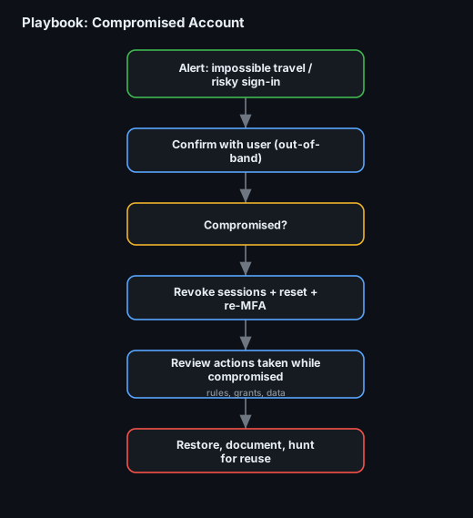

# Playbook 5 — Compromised Account

**Trigger:** impossible-travel / risky sign-in alert, MFA-fatigue report, or a user reporting odd activity.
**Default severity:** SEV-2 (SEV-3 while unconfirmed).

## Steps
1. **Confirm out-of-band** — contact the user by phone/known channel: was this you? (Not by email — the account may be read by the attacker.)
2. **Decide — compromised?** — correlate sign-in logs: new ASN/country, legacy-auth client, token replay, MFA method changes.
3. **Contain immediately** — **revoke all sessions/refresh tokens**, force password reset, re-enrol/verify MFA, disable legacy auth.
4. **Review attacker actions** — what did they do while in: mailbox rules, OAuth app consents, data accessed/downloaded, privilege changes, lateral movement (events 4624/4648 — see [P13](../../project-13-event-log-investigation/)).
5. **Scope reuse** — same password/token elsewhere? Hunt the source IP across the fleet ([P17](../../project-17-velociraptor-live-response/)).
6. **Recover & document** — restore settings the attacker changed, close, add detection for the sign-in pattern.

## Runs for real in
[Project 13 — Event Log Investigation](../../project-13-event-log-investigation/) · [Project 17 — Live Response](../../project-17-velociraptor-live-response/)
