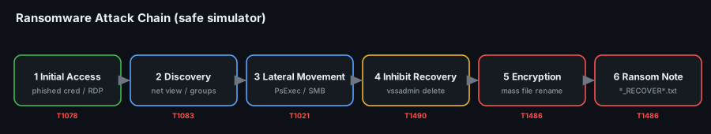
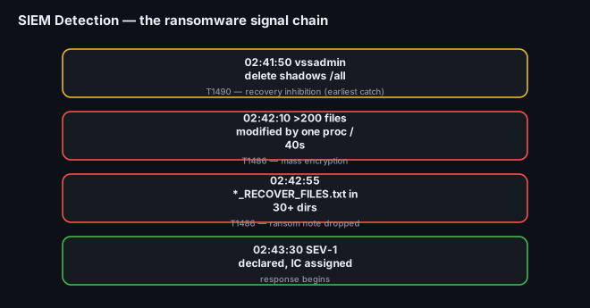
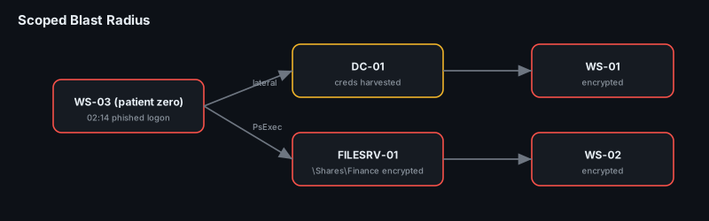

# Project 28 — Ransomware Incident Response

**Status:** 🟡 Full IR lifecycle run in a **lab with a safe ransomware simulator** (no real malware). The detections, VQL and commands are real; the attack is a controlled simulation and the specific timings/hosts are a lab walkthrough (marked *(sim)* where illustrative).
**Track:** Incident Response

## Objective
Run a ransomware incident end to end on a lab network: let a **safe simulator** carry out initial access → discovery → lateral movement → encryption, then **detect** it in the SIEM, **declare** and run the incident, **contain**, **scope** (patient zero + blast radius), **eradicate and recover from backups**, and write both an **executive** and a **technical** report. This is [Project 27's ransomware playbook](../project-27-ir-playbooks/playbooks/ransomware.md) executed for real.

> ### Safety
> No real ransomware is used. The "encryption" is done by a **benign simulator** (e.g. a harmless test tool that renames/XORs files it created in a sandboxed lab, or an open-source adversary-emulation action) on disposable lab VMs with snapshots. Nothing here is a weaponisable payload — the project is about **response**, not building malware.



## Lab environment
| Item | Value |
|---|---|
| Case ID | `CB-28-0001` |
| Domain | `lab.local` — 1 DC, 1 file server (FILESRV-01), 3 Windows 10 workstations |
| Defence | Wazuh/Splunk SIEM + Sysmon, Velociraptor agents, nightly **offline** backup |
| Simulator | Safe ransomware-simulation tool on snapshotted VMs |
| Time zone | UTC throughout |

---

## Phase 1 — Preparation (what was in place before)
- **Sysmon** deployed fleet-wide (process creation, network, file events) shipping to the SIEM.
- **Velociraptor** agents on every host (for the hunt in Phase 3).
- **Backups**: nightly, one copy **offline/immutable** — the single most important control for recovery.
- Detections for the ransomware TTPs **written in advance** (Phase 2 rules).

## Phase 2 — Detection & Analysis
The simulator's actions tripped three detections in sequence — the typical ransomware signal chain:

| Order | Signal | SIEM detection | ATT&CK |
|---|---|---|---|
| 1 | Shadow copies deleted | `vssadmin delete shadows` / `wmic shadowcopy delete` | **T1490** Inhibit System Recovery |
| 2 | Mass file modification | >200 files renamed/modified by one process in <1 min | **T1486** Data Encrypted for Impact |
| 3 | Ransom note dropped | new `*_README*.txt` / `.html` across many dirs | T1486 (note) |

**Declaration:** Tier-1 saw the `vssadmin` alert, pivoted to the mass-rename alert, and declared **SEV-1** per the [severity matrix](../project-27-ir-playbooks/). IC assigned.

**First analysis questions:**
- Which process is doing the encryption? (Sysmon Event ID 1 → the simulator binary + parent)
- How did it start? (parent chain → the initial-access vector)
- How many hosts show the same pattern?



## Phase 3 — Containment
Containment order recorded in the [containment log](data/containment-log.csv) — every action with operator + UTC.

1. **Isolate, don't power off** — network-contain the encrypting hosts via Velociraptor/EDR; preserve memory (keys may be resident).
```sql
-- Velociraptor: isolate confirmed hosts
SELECT * FROM Artifact.Windows.Remediation.Quarantine(client_id="C.ws03")
```
2. **Disable the compromised account** used for lateral movement (don't delete — preserve for forensics).
3. **Block** the C2 / staging IP at the firewall; disable the entry vector (e.g. external RDP).
4. **Hunt the fleet** for the same IOCs to find hosts not yet encrypting but already compromised:
```sql
-- processes that delete shadow copies OR mass-rename
SELECT * FROM Artifact.Windows.System.Pslist()
  WHERE CommandLine =~ "(?i)vssadmin.*delete|wmic.*shadowcopy.*delete"
```

## Phase 4 — Scoping (patient zero + blast radius)
Work backwards from the first encryption to the entry point.

| Question | How | Finding *(sim)* |
|---|---|---|
| **Patient zero?** | earliest Sysmon process-create for the simulator across hosts | WS-03, 02:14 UTC |
| **Initial access?** | parent process + auth logs on WS-03 | phished credential → interactive logon 4624 from an external IP |
| **Discovery?** | commands run post-foothold | `net view`, `net group "Domain Admins"` |
| **Lateral movement?** | 4648/4624 type 3 + service installs (7045) on other hosts | PsExec-style spread DC←WS-03→FILESRV-01 (**T1021**) |
| **Which data?** | file events on FILESRV-01 | the `\Shares\Finance` tree encrypted |
| **Spread total** | fleet hunt | 1 workstation (patient zero) + FILESRV-01 + 2 further WS |



## Phase 5 — Eradication & Recovery
1. **Eradicate** — remove the simulator binary, persistence and any dropped tools from all affected hosts; rotate **every** credential (assume domain-wide theft); reset `krbtgt` twice if DC was touched.
2. **Patch the entry vector** — the phished account's MFA re-enforced, legacy/RDP exposure closed.
3. **Recover** — restore encrypted shares from the **offline** backup; verify file integrity by hash; re-image patient zero and any uncertain host rather than clean in place.
4. **Validate** — confirm no re-encryption, detections quiet, backups re-tested.

> The decision **not to pay** (and ransom generally) is an **executive + legal** call, not the SOC's — documented and made outside this technical track.

## Phase 6 — Post-Incident
- **Incident timeline** (UTC): [`data/incident-timeline.csv`](data/incident-timeline.csv)
- **Executive report** (business impact, decisions, cost/lessons): [`reports/executive-report.md`](reports/executive-report.md)
- **Technical report** (TTPs, IOCs, evidence, detections): [`reports/technical-report.md`](reports/technical-report.md)
- Lessons fed back into the plan and detections.

## Detection rules
In [`queries/`](queries/):
- `vssadmin-delete-shadows.yml` (Sigma) — shadow-copy deletion (**T1490**)
- `mass-file-rename.yml` (Sigma) — one process modifying many files fast (**T1486**)
- `ransom-note-dropped.yml` (Sigma) — ransom-note filename pattern across directories

## IOCs *(sim)*
| Type | Value | Note |
|---|---|---|
| Account | `lab\jdoe` | phished, used for lateral movement |
| IPv4 | `203.0.113.55` | initial-access source (RFC 5737) |
| Behaviour | `vssadmin delete shadows /all /quiet` | recovery inhibition |
| File | `*_RECOVER_FILES.txt` | ransom note |

## ATT&CK Mapping
- **T1486** Data Encrypted for Impact · **T1490** Inhibit System Recovery
- **T1021** Remote Services (lateral movement) · T1078 Valid Accounts · T1059 Scripting
- T1083 File/Directory Discovery · T1562 Impair Defenses (if AV disabled)

## Deliverables
- [x] Safe-simulator attack chain (initial access → encryption)
- [x] SIEM detections for the ransomware TTPs
- [x] Containment log (timestamped) + Velociraptor isolation
- [x] Scoping: patient zero, lateral path, affected data
- [x] Recovery-from-backup procedure
- [x] Executive **and** technical reports
- [ ] Replace *(sim)* timings with a real simulator run's SIEM/VQL output

## Key Learnings
1. **The signal chain is `vssadmin delete` → mass file rename → ransom note** — catching the shadow-copy deletion buys the most time.
2. **Isolate, never power off** — keys and process context live in memory.
3. **Patient zero is found by working backwards** from the first encryption to the parent process and the auth log.
4. **Offline backups decide recovery** — without them, options collapse to pay (discouraged) or rebuild.
5. **Two reports, two audiences** — the exec needs impact + decisions + cost; the technical team needs TTPs, IOCs and detections.
