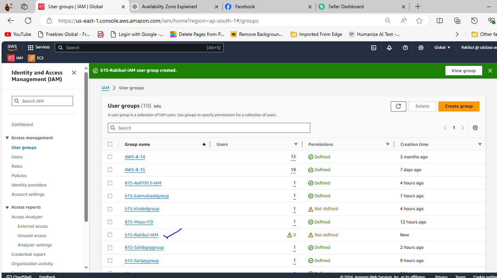
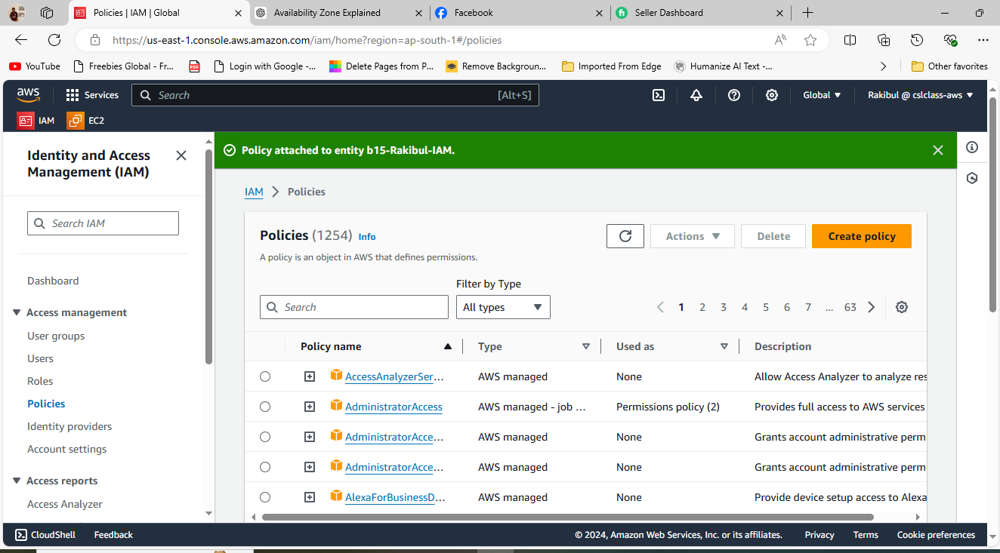
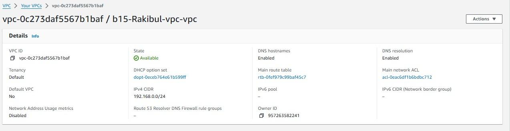
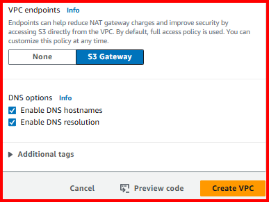
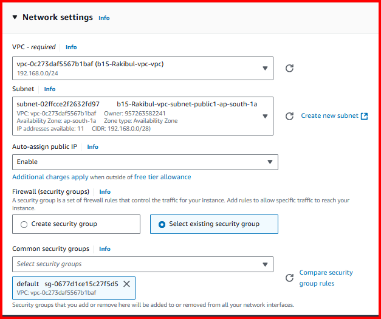
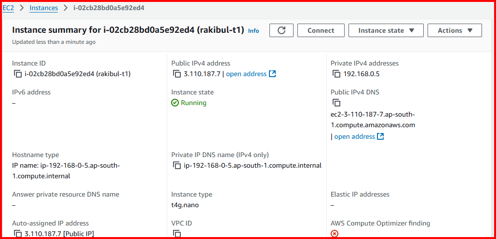

# Project 29 — Cloud Incident Response (AWS)

**Status:** 🟡 Investigated in a **real AWS environment I built** (IAM, custom VPC, EC2 — my own account, screenshots included) · the compromise itself (leaked key → privilege escalation → S3 exfiltration) is a controlled scenario, with the CloudTrail/GuardDuty findings shown as a simulated walkthrough (marked *(sim)*) you replace with a real run.
**Track:** Incident Response

## Objective
Investigate an **AWS account compromise** end to end: a leaked IAM access key is used from an unfamiliar location, the attacker escalates privilege and exfiltrates an S3 bucket. Detect it in **CloudTrail + GuardDuty**, trace every API call the key made, identify the escalation path and the exfiltration, **contain** the identity, scope the blast radius, remediate, and report — all mapped against the **real IAM / VPC / EC2 setup** of the target account.

> The investigation here is a **cloud**-native one: there's no disk to image. The evidence is **API call logs** (CloudTrail), threat detections (GuardDuty), and the account's **configuration state** (IAM, VPC, S3). That shift — from host artefacts to API logs — is the whole point of cloud IR.

## The target environment (real — my account)
The account under investigation is the one I built in the foundational labs. Knowing the environment is step one of any IR — you can't spot "abnormal" without "normal".

### Identities (IAM)



| Item | Value |
|---|---|
| IAM groups/users | multiple users across groups (console-managed) |
| Notable attached policy | **`AWSLambda_FullAccess`** (managed) — a **privilege-escalation surface** (see Phase 3) |
| Access type | long-lived **access keys** + console |

### Network (VPC)



| Item | Value |
|---|---|
| VPC | `b15-Rakibul-vpc` (`vpc-0c273daf5367b1baf`), CIDR `192.168.0.0/24` |
| Subnets | 2 public + 2 private across 2 AZs (ap-southeast-1) |
| **S3 Gateway endpoint** | present — lets instances reach S3 **privately**, which is also a **stealthy exfil path** (traffic doesn't traverse the internet gateway) |
| DNS | hostnames + resolution enabled |

### Compute (EC2)



| Item | Value |
|---|---|
| Instance | `rakibul-t1` (`i-02cb28bd0a5e92ed4`), Amazon Linux 2023, ap-southeast-1a |
| Access | key pair `b1-zz-key`, default security group |
| IPs | public + private (auto-assign public IP on) |

> **Why this matters for IR:** an EC2 instance with a role, reachable over SSH, sitting in a VPC that has an **S3 endpoint**, is exactly the kind of place an attacker lands and then pivots to S3. The compromise scenario below uses *this* topology.

---

## Phase 1 — Preparation (what must be on before an incident)
| Control | Purpose |
|---|---|
| **CloudTrail** (all regions, to a locked S3 bucket) | the API audit log — your primary evidence. Must be on **before** the incident |
| **GuardDuty** | managed threat detection (anomalous API, credential exfil, S3 findings) |
| **Config** | records resource configuration changes over time |
| **IAM Access Analyzer** | flags external/over-broad access |
| Billing/CloudWatch alarms | a cost spike is often the first sign of abuse (crypto-mining, data egress) |

## Phase 2 — Detection & Analysis
**The alert:** GuardDuty raises `UnauthorizedAccess:IAMUser/InstanceCredentialExfiltration` and `Discovery:S3/AnomalousBehavior` for key `AKIA…EXAMPLE`.

**First questions → answered from CloudTrail:**
```sql
-- Athena over CloudTrail logs: everything this key did
SELECT eventTime, eventName, sourceIPAddress, awsRegion, userAgent,
       requestParameters, errorCode
FROM cloudtrail_logs
WHERE useridentity.accesskeyid = 'AKIA...EXAMPLE'
ORDER BY eventTime;
```
**Example findings *(sim)***
| Time (UTC) | eventName | sourceIP | Meaning |
|---|---|---|---|
| 03:02 | `GetCallerIdentity` | 203.0.113.70 | attacker checks "who am I" (stolen-key tell) |
| 03:03 | `ListBuckets`, `ListAttachedUserPolicies` | 203.0.113.70 | discovery (T1087/T1526) |
| 03:08 | `CreateRole`, `AttachRolePolicy` (Admin) | 203.0.113.70 | **privilege escalation** |
| 03:12 | `GetObject` ×N on `s3://…-finance` | via VPC endpoint | **exfiltration** |

**Key tell:** the source IP (`203.0.113.70`) is not one the key ever used before, and `GetCallerIdentity` as the first call is the classic "I just got these creds" behaviour.

## Phase 3 — Scoping (what did the key touch, and how far)
Work the whole session from CloudTrail:
- **Identity used:** which IAM user the key belongs to (map `AKIA…` → user).
- **Privilege escalation path:** here the `AWSLambda_FullAccess` + `iam:CreateRole`/`PassRole` combination is a known escalation route — a Lambda-capable principal can create/assume a more-privileged role. Confirm from the `CreateRole`/`AttachRolePolicy`/`PassRole` calls.
- **Exfiltration:** which bucket, which objects, how much data (`GetObject` count + bytes; CloudTrail data events or S3 server-access logs). Note the **S3 VPC endpoint** path — egress that never hit the IGW.
- **Persistence attempts:** new users/keys (`CreateUser`, `CreateAccessKey`), new roles, console login profiles (`CreateLoginProfile`).


## Phase 4 — Containment & Eradication
Order matters — **kill the identity first**, preserve evidence, then clean up:
```bash
# 1) Disable the leaked key immediately (don't delete yet — preserve for forensics)
aws iam update-access-key --access-key-id AKIA...EXAMPLE --status Inactive --user-name <user>

# 2) Attach an explicit deny / revoke active sessions for the principal
aws iam put-user-policy --user-name <user> --policy-name QuarantineDenyAll \
  --policy-document file://deny-all.json

# 3) Remove attacker-created persistence
aws iam list-access-keys --user-name <user>          # find rogue keys
aws iam delete-role-policy ... ; aws iam delete-role --role-name <attacker-role>
aws iam delete-user --user-name <attacker-user>      # if one was created

# 4) Lock down the bucket; review the bucket policy/ACL for public exposure
aws s3api put-public-access-block --bucket <bucket> \
  --public-access-block-configuration BlockPublicAcls=true,IgnorePublicAcls=true,BlockPublicPolicy=true,RestrictPublicBuckets=true
```
Also: snapshot the EC2 instance (`i-02cb28bd0a5e92ed4`) if the key was stolen from it (IMDS/role creds), and move it to an **isolation security group**. `deny-all.json` is in [`queries/`](queries/).

## Phase 5 — Recovery & hardening
| Fix | Why |
|---|---|
| Rotate **all** access keys; move to **IAM roles / short-lived creds** | long-lived keys are the root cause |
| Enforce **MFA**; apply least privilege (drop `*FullAccess` managed policies) | shrink the escalation surface |
| Require **IMDSv2** on EC2 | stops the SSRF-style role-cred theft |
| Enable **S3 data events** in CloudTrail + server-access logs | object-level visibility for next time |
| GuardDuty + Access Analyzer + Config in **all** regions | detection coverage |

## Deliverables
- [x] Real environment mapped (IAM, VPC, EC2 — my account, with screenshots)
- [x] CloudTrail investigation query (Athena) + the API-call kill chain
- [x] Privilege-escalation path (Lambda/CreateRole) + S3 exfil (VPC endpoint) analysis
- [x] Containment commands (disable key, quarantine, remove persistence, lock bucket)
- [x] Hardening recommendations
- [x] [Executive](reports/executive-report.md) + [technical](reports/technical-report.md) reports
- [ ] Run against a real CloudTrail export (e.g. flaws.cloud / CloudGoat) and replace *(sim)* rows

## ATT&CK (Cloud matrix)
- **T1078.004** Valid Accounts: Cloud Accounts (leaked key)
- **T1580** Cloud Infrastructure Discovery · T1526 Cloud Service Discovery
- **T1098.001/003** Account Manipulation (CreateRole/AttachPolicy, add keys) — privilege escalation
- **T1537 / T1530** Data from / Transfer to Cloud Storage (S3 exfiltration)

## Key Learnings
1. **Cloud IR has no disk — the evidence is CloudTrail.** If it's not on before the incident, you're blind.
2. `GetCallerIdentity` from a new IP as a key's first call is a textbook **stolen-credential** signal.
3. **Over-broad managed policies** (`*FullAccess`) are the escalation surface — `AWSLambda_FullAccess` + `iam:CreateRole`/`PassRole` is a real privesc path.
4. An **S3 VPC endpoint** is great for security *and* a quiet exfil path — enable S3 data events so you can see object access.
5. **Disable the key first, delete later** — contain the identity immediately but preserve it for the investigation.
