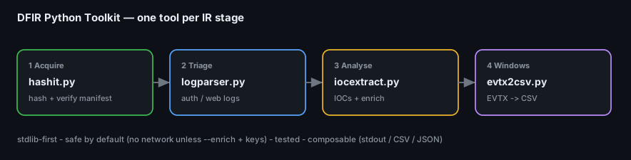

# Project 30 — DFIR Automation with Python (Toolkit Playbook)

**Status:** 🟢 Complete — four **working, tested** Python tools plus a playbook that says *when* to reach for each one during an investigation. Tools run on real input; a sample for each is in [`samples/`](samples/); tests pass.
**Track:** Incident Response / DFIR tooling

## Why this exists
Across the Code-Blue projects the same manual chores repeat: hash evidence, skim an auth/web log for the attacker, pull IOCs out of a report, and count the key Event IDs in an EVTX. This project turns those four chores into small, documented, testable command-line tools — and, more importantly, lays out **a broad playbook** for which tool to run at each stage of an incident.



## The toolkit at a glance
| Tool | One-liner | Used at this stage | Feeds project |
|---|---|---|---|
| [`hashit.py`](scripts/hashit.py) | hash & verify (MD5+SHA-256) with a manifest | **Acquisition** + before/after analysis | [P01](../project-01-evidence-acquisition-integrity/) |
| [`logparser.py`](scripts/logparser.py) | triage auth / web logs → who failed, who got in, what's odd | **Detection & triage** | [P13](../project-13-event-log-investigation/), [P14](../project-14-linux-intrusion/), [P15](../project-15-network-forensics/) |
| [`iocextract.py`](scripts/iocextract.py) | pull + de-fang + (optionally) enrich IOCs from any text | **Analysis / intel** | [P18](../project-18-malware-triage/), [P19](../project-19-email-phishing-forensics/), [P20](../project-20-business-email-compromise/) |
| [`evtx2csv.py`](scripts/evtx2csv.py) | summarize EVTX Event-ID counts + export CSV | **Windows investigation** | [P13](../project-13-event-log-investigation/), [P17](../project-17-velociraptor-live-response/) |

---

## The playbook — which tool, when

### Stage 1 · Acquire → **`hashit.py`**
The first action on any evidence is to hash it and write a manifest; the last action before you cite it is to re-verify.
```bash
# hash a whole evidence folder and record a manifest (chain of custody)
python3 scripts/hashit.py /evidence --manifest manifest.csv

# later: prove nothing changed
python3 scripts/hashit.py --verify manifest.csv /evidence
```
Output: `SHA256  MD5  size  path` per file; `--verify` prints `OK / CHANGED / MISSING` and exits non-zero if anything drifted — so it drops straight into a CI/triage check.

### Stage 2 · Triage the logs → **`logparser.py`**
Point it at an auth log or a web access log and get the three answers you always need first.
```bash
python3 scripts/logparser.py auth /var/log/auth.log      # brute force + successful-after-fail
python3 scripts/logparser.py web  access.log --top 15    # status mix, top paths, shell/injection hits
```
It flags the money finding automatically: a **source IP that failed many times then succeeded** (auth), and **requests carrying web-shell / traversal / injection markers** (web).

### Stage 3 · Extract & enrich IOCs → **`iocextract.py`**
Feed it a report, an email body, or a log; get clean, de-duplicated IOCs. De-fanged input (`hxxp://`, `1.2.3[.]4`) is re-fanged automatically; RFC1918 noise is dropped.
```bash
python3 scripts/iocextract.py report.txt --json iocs.json
# optional enrichment (only with API keys set):
VT_API_KEY=... ABUSEIPDB_API_KEY=... python3 scripts/iocextract.py report.txt --enrich
```
Enrichment adds an AbuseIPDB confidence score per IP and VirusTotal malicious/total per hash — but **only** if you opt in and provide keys, so the tool is safe to run offline.

### Stage 4 · Windows event logs → **`evtx2csv.py`**
Get a fast Event-ID census (the security-relevant IDs are flagged) then export to CSV for Timeline Explorer / Excel.
```bash
python3 scripts/evtx2csv.py Security.evtx --summary
python3 scripts/evtx2csv.py Security.evtx --only 4624,4625,4720,4732,7045 --csv security.csv
```
Requires `python-evtx` (`pip install python-evtx`); if it's missing the tool says so instead of crashing. The flagged IDs are exactly the ones the [Event Log project](../project-13-event-log-investigation/) hunts (4625→4624→4720/4732→7045/4648).

---

## Design principles (what makes these "good" tools)
1. **Stdlib-first** — `hashit`, `logparser` and `iocextract` need **no dependencies**; only `evtx2csv` needs one library, and it degrades gracefully.
2. **Safe by default** — no network calls unless you pass `--enrich` *and* set API keys. Nothing phones home.
3. **Composable** — every tool prints to stdout and/or writes CSV/JSON, so they pipe into each other and into the SIEM.
4. **Tested** — [`tests/test_tools.py`](tests/test_tools.py) checks known hash values and IOC extraction (incl. refang + RFC1918 drop).
5. **Documented** — each script has a docstring with examples; `-h` works on all of them.

## Try it (samples included)
```bash
python3 scripts/hashit.py    samples --manifest /tmp/m.csv
python3 scripts/logparser.py auth samples/auth.log
python3 scripts/logparser.py web  samples/access.log
python3 scripts/iocextract.py samples/report.txt
python3 tests/test_tools.py           # -> 3 PASS
```

## Deliverables
- [x] `hashit.py` — hash & verify with manifest (MD5/SHA-256)
- [x] `logparser.py` — auth + web log triage
- [x] `iocextract.py` — IOC extraction, de-fang, optional VT/AbuseIPDB enrichment
- [x] `evtx2csv.py` — EVTX summary + CSV export
- [x] Samples, tests, per-tool usage, and a stage-by-stage playbook
- [ ] Add: a PCAP summarizer and a timeline-merger as the toolkit grows

## Key Learnings
1. The best DFIR automation removes the **repetitive** work (hash, grep, extract, count) so the analyst spends time on judgment, not typing.
2. **Stdlib-first + opt-in network** makes a tool you can run on an evidence box without trust concerns.
3. A tool is only trustworthy with **tests** — a hash tool that's wrong is worse than none.
4. Small composable CLIs beat one monolith: each stage of the [IR lifecycle](../project-27-ir-playbooks/) gets the one tool it needs.
