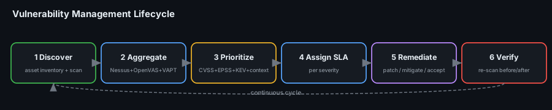
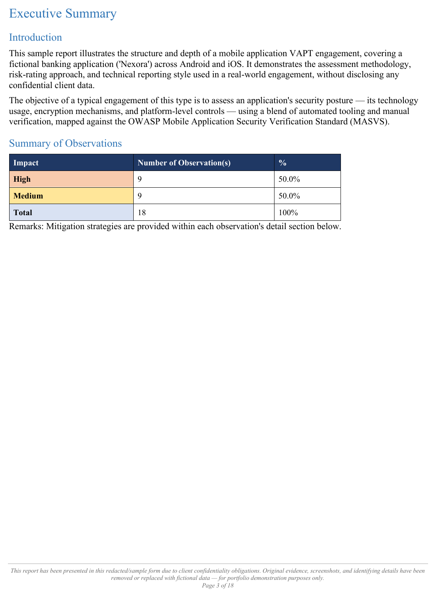
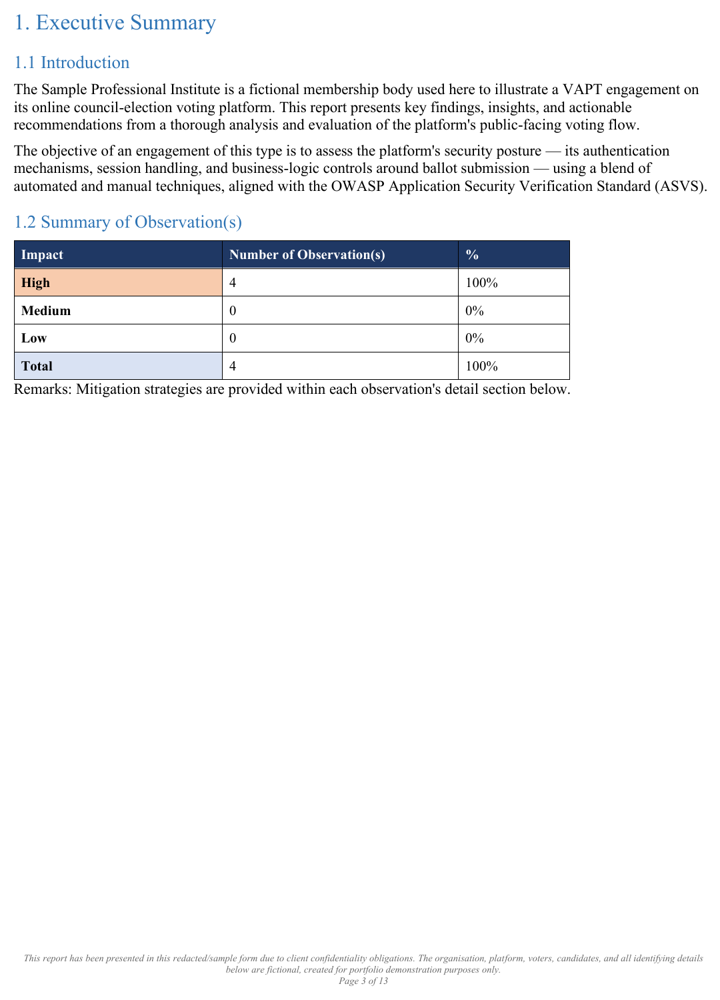
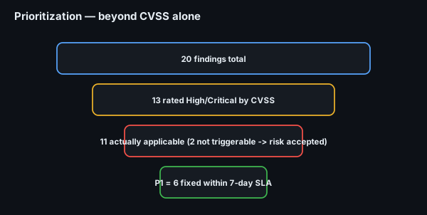
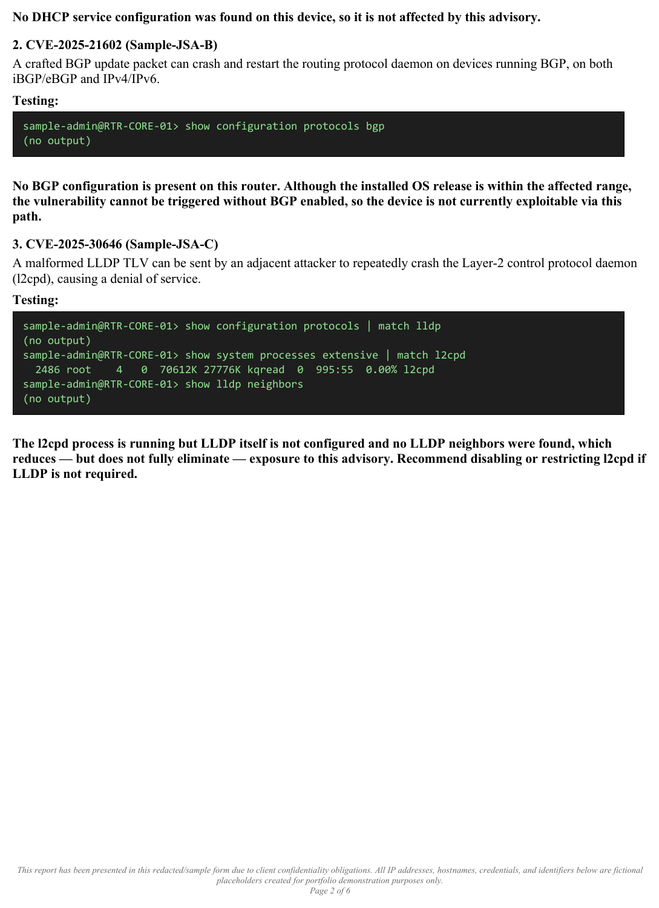
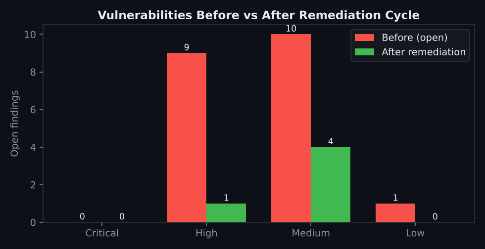

# Project 31 — Vulnerability Management

**Status:** ✅ Complete — a full vulnerability-management cycle run over **six real assessment engagements** (web, mobile, core-banking, two network-device sets, online voting). All findings are drawn from sanitized VAPT/audit reports (organisation names, IPs and identifiers fabricated for portfolio use); the program, register, prioritization and SLAs are the deliverable.
**Track:** Defensive Engineering

## Objective
Run vulnerability management as a **program**, not a one-off scan: build an asset inventory, aggregate findings from multiple sources (scanners **and** manual VAPT), **prioritize with CVSS + EPSS + CISA KEV + real-world applicability** (not CVSS alone), set per-severity SLAs, drive remediation, record **justified risk acceptances**, and prove the result with a **before/after** comparison.

## Why these inputs
Real VM teams don't invent findings — they **ingest** them from everything that tests the estate. This project uses six genuine assessment outputs as the feed:

| Asset | Engagement | What it contributes |
|---|---|---|
| Client web app | Web VAPT | Missing security headers, cookie flags, outdated components |
| Nexora mobile app (Android/iOS) | Mobile VAPT (OWASP **MASVS**) | 9 High + 9 Medium: debug cert, cleartext traffic, exported components |
| Core Banking System | Functional/config audit | Treasury risk-limit alerting gap |
| DC core router (Junos) | Network VAPT + CVE mapping | **CVE applicability triage** (the key VM lesson) |
| 4 more DC routers/switches | Network VAPT | Additional device-CVE exposure |
| Online voting platform | Web VAPT (OWASP **ASVS**) | 4 High: OTP reuse, OTP brute-force, multi-vote |

> All six are sanitized portfolio samples — names, IPs and identifiers are fabricated. The value here is the **management layer** that turns scattered findings into a governed program.

Severity summaries straight from two of the source engagements (real report pages):

---

## Phase 1 — Asset inventory
You can't manage what you haven't listed. Every asset with its owner, exposure and criticality: [`data/asset-inventory.csv`](data/asset-inventory.csv).

| asset | type | exposure | criticality |
|---|---|---|---|
| Client web app | Web | Internet-facing | High |
| Nexora mobile app | Mobile | App stores | High |
| Core Banking System | Banking | Internal | **Critical** |
| DC core routers/switches | Network (Junos) | External-facing | **Critical** |
| Online voting platform | Web | Internet-facing | **Critical** |

## Phase 2 — Aggregate findings
Scanner output (Nessus/OpenVAS/Wazuh vuln-detection) **plus** manual VAPT findings are normalised into one register: [`data/vuln-register.csv`](data/vuln-register.csv) — 20 findings across the six assets, each with source, CVSS, EPSS, KEV, applicability, priority, SLA and status.

> **Scanners find the known; VAPT finds the logic.** A scanner would never report "OTP codes are reusable" or "multiple votes from concurrent sessions" — those come from manual testing. A mature register holds both.

## Phase 3 — Prioritize (the heart of VM)
CVSS alone over-counts. Real priority = **CVSS severity × exploit likelihood (EPSS) × known-exploited (CISA KEV) × applicability in *this* environment.**

**The textbook example, straight from the network engagement:**
| CVE | CVSS | Why CVSS says "fix now" | Reality in this environment | Decision |
|---|---|---|---|---|
| CVE-2025-21602 (BGP RPD crash) | 7.5 High | OS release is in the affected range | **BGP is not configured** on the device → not triggerable | **Risk accepted** (monitored) |
| CVE-2025-30648 (DHCP crash) | 7.5 High | OS in range | **No DHCP role** on the device → not applicable | **Risk accepted** (monitored) |
| CVE-2025-30646 (l2cpd DoS) | 7.5 High | OS in range | **l2cpd is running** → genuinely exploitable | **P1 — mitigate** |

Three identically-scored "High" CVEs; only **one** is a real priority. Treating all three as critical would waste the team on two non-issues and is exactly the failure VM prioritization exists to prevent.

The actual applicability triage from the network engagement — each CVE tested against the live device config before it's rated:

**Priority scheme used**
| Priority | Criteria | SLA |
|---|---|---|
| **P1** | High/Critical **and** applicable (or KEV-listed, or high EPSS) | **7 days** |
| **P2** | Medium applicable, or High with partial mitigation | 30 days |
| **P3** | Low-impact Medium / hardening | 90 days |
| **P4 (accept)** | Not applicable / not triggerable in this environment | risk-accepted, monitored |

## Phase 4 — SLAs & assignment
Each finding gets an owner and a clock from the moment it enters the register. SLAs above are defined **in advance** so there's no per-finding argument. Status is tracked in the register (`Remediated / In progress / Open / Mitigated / Risk accepted`).

## Phase 5 — Remediate, mitigate or accept
- **Remediate** — e.g. voting OTP made single-use + rate-limited; mobile release re-signed with a production cert; web security headers + cookie flags added.
- **Mitigate** — l2cpd CVE: restrict/disable l2cpd pending the vendor fix.
- **Accept** — the two non-applicable Junos CVEs, **with written justification and a compensating control**: [`data/risk-acceptance-log.csv`](data/risk-acceptance-log.csv). A risk acceptance is a *decision with an owner and a review date*, not "we ignored it".

## Phase 6 — Verify (before / after)
Re-scan and re-test after the remediation window; the register's `status` column is the evidence an internal audit asks for.

| Severity | Before (open) | After cycle |
|---|---|---|
| High | 9 | 1 |
| Medium | 10 | 4 |
| Low | 1 | 0 |

The remaining open items are mid-SLA (P2/P3) or tracked risk acceptances — all accounted for, which is the actual goal: **not zero findings, but zero *unmanaged* findings.**

## Deliverables
- [x] [Asset inventory](data/asset-inventory.csv)
- [x] [Prioritized vulnerability register](data/vuln-register.csv) (CVSS + EPSS + KEV + applicability)
- [x] [Risk-acceptance log](data/risk-acceptance-log.csv) with justification + compensating controls
- [x] Before/after scan comparison
- [x] SLA scheme per priority
- [ ] Automate ingestion (scanner API → register) and SLA-breach alerting

## ATT&CK
- **T1190** Exploit Public-Facing Application — what the web/voting/network findings would enable
- **T1068** Exploitation for Privilege Escalation — mobile/device findings

## Key Learnings
1. **VM is a program, not a scan** — inventory → aggregate → prioritize → SLA → remediate → verify, on a repeating clock.
2. **Prioritize beyond CVSS** — EPSS, CISA KEV and **applicability** turned 13 "High" CVSS items into 11 real priorities; two identically-scored CVEs were correctly **accepted** because they weren't triggerable.
3. **Scanners + VAPT together** — the scanner finds known CVEs and misconfigs; manual testing finds the business-logic flaws (OTP reuse, multi-vote) a scanner never will.
4. **A risk acceptance is a decision, not neglect** — it has a justification, a compensating control, an approver and a review date.
5. **The goal is zero *unmanaged* findings**, each with a status and an owner — which is exactly what an internal audit wants to see.
