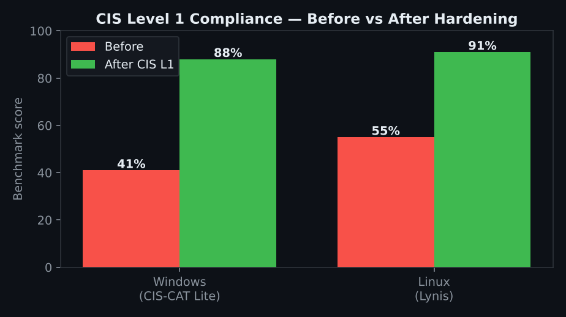
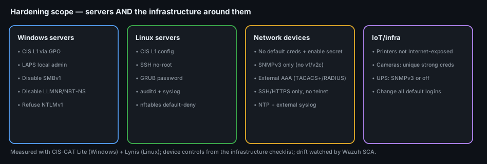

# Project 32 — System Hardening (CIS Benchmarks)

**Status:** 🟡 Hardening workflow, checklist, before/after scoring and exception register are complete; the compliance scores shown are a lab walkthrough (marked *(sim)*) you replace with your own CIS-CAT Lite / Lynis output.
**Track:** Defensive Engineering

## Objective
Take servers deployed with **default settings** and bring them to a **measurable baseline — CIS Level 1 — without breaking services**: score the baseline, apply the hardening, deploy LAPS, kill the legacy protocols attackers rely on, record every exception with a reason, prove the improvement with a re-score, and watch for drift. And because an estate is more than its servers, the same discipline is extended to the **network devices and infrastructure** around them.

## Scope — servers *and* the infrastructure around them
Most hardening projects stop at Windows/Linux. Real estates get breached through the **forgotten** boxes — a switch on default creds, a printer on the public internet, a camera with `admin/admin`. This project hardens both, using CIS for the servers and an infrastructure checklist for the network gear.

> Server controls follow the **CIS Benchmarks** (Level 1). The network-device controls are informed by a published infrastructure-hardening checklist (Astra Security's "Network Infrastructure Security Audit & VAPT Checklist") used here as a **reference** — the controls themselves (SNMPv3, external AAA, disable telnet, change default creds) are standard practice.

---

## Phase 1 — Baseline (measure before you touch anything)
You can't prove improvement without a starting number.
| System | Tool | Baseline *(sim)* |
|---|---|---|
| Windows Server 2022 (member) | **CIS-CAT Lite** (CIS L1 benchmark) | **41%** |
| Ubuntu 22.04 | **Lynis** (hardening index) | **55** |

Commands and where reports go: [`baselines/`](baselines/).

## Phase 2 — Apply CIS Level 1

### Windows (via GPO)
| Control | Setting | Why |
|---|---|---|
| Password policy | min length 14, complexity on, no reversible encryption | weak-credential defence |
| Account lockout | 10 attempts / 15 min | brute-force defence |
| **LLMNR** | *Turn Off Multicast Name Resolution* = Enabled | kills **T1557.001** poisoning |
| **NBT-NS** | NetBIOS over TCP/IP = Disabled | kills **T1557.001** poisoning |
| **NTLMv1/LM** | LAN Manager auth level = *Send NTLMv2 only, refuse LM & NTLM* | stops downgrade/relay |
| **SMBv1** | feature removed | removes WannaCry-class exposure |
| Logon banner | warning Message Text set | legal notice |
| Guest account | disabled; restrict network logon to Admins | anon access / lateral movement |
| Firewall | all profiles, block inbound by default | exposure |

### Linux
`pam_pwquality` + `login.defs` (length/expiry), `sshd_config` (`PermitRootLogin no`, Protocol 2, strong ciphers/MACs), **GRUB password**, disable telnet/rsh, **auditd** + central syslog, **nftables** default-deny.

### Windows LAPS
Deploy **LAPS** so every machine has a **unique, rotating** local-admin password — directly defeating **T1078.003** (local-account reuse) and pass-the-hash across identical local admins.

Full control list with CIS mapping and status: [`data/hardening-checklist.csv`](data/hardening-checklist.csv) (28 controls across Windows, Linux and network devices).

## Phase 3 — Disable the legacy protocols (the high-value wins)
| Protocol | Risk | Action |
|---|---|---|
| **SMBv1** | remote code execution (EternalBlue/WannaCry) | remove feature |
| **LLMNR / NBT-NS** | **Responder-style credential theft** (T1557.001) | disable both |
| **NTLMv1 / LM** | hash downgrade + relay | refuse, NTLMv2 only |
These four are consistently the biggest single improvement to a Windows estate's real-world security — cheap to disable, painful if left on.

## Phase 4 — Network-device & infrastructure hardening
From the infrastructure checklist, applied to routers/switches/firewalls and the easily-forgotten IoT gear:
- **No default credentials** anywhere; enable-secret + `service password-encryption` on IOS.
- **SNMPv3 with auth+encryption only** — disable v1/v2c (community strings = cleartext config theft).
- **External AAA** (TACACS+/RADIUS) instead of shared local accounts.
- **SSH + HTTPS only**, disable **telnet/HTTP/FTP**; move mgmt to non-standard ports; mgmt plane on a dedicated VLAN.
- **NTP + external syslog** for uniform time and off-box logs.
- **Printers/cameras/UPS:** not Internet-exposed, unique strong creds, SNMP off or v3.

## Phase 5 — Exceptions (what you couldn't harden, and why)
Hardening always hits something that breaks a service. The answer is a **documented exception with a compensating control**, not a silent skip: [`data/exception-register.csv`](data/exception-register.csv).
| Example | Why | Compensating control |
|---|---|---|
| SMBv1 left on LEGACY-FILESRV | one legacy scanner needs it | isolated VLAN + host firewall to the scanner IP only; replacement planned |
| Root-over-SSH on BUILD-02 | CI needs it | key-only + source-IP allowlist + session logging |

## Phase 6 — Re-score & monitor drift
| System | Before *(sim)* | After *(sim)* |
|---|---|---|
| Windows (CIS-CAT L1) | 41% | **88%** |
| Linux (Lynis index) | 55 | **91** |

Then **Wazuh SCA** runs the CIS policies continuously so a setting that drifts back (a GPO overwritten, a config changed) raises an alert — hardening is a state to *maintain*, not a one-time task.

## Deliverables
- [x] [Hardening checklist](data/hardening-checklist.csv) (Windows + Linux CIS L1 + network devices), CIS-mapped
- [x] Before/after compliance scores (CIS-CAT Lite + Lynis)
- [x] Hardening GPO export workflow + commands ([`baselines/`](baselines/))
- [x] [Exception register](data/exception-register.csv) with compensating controls
- [x] Legacy-protocol disablement (SMBv1, LLMNR, NBT-NS, NTLMv1)
- [x] Wazuh SCA drift monitoring
- [ ] Attach real CIS-CAT / Lynis reports and the GPO backup

## ATT&CK
- **T1557.001** LLMNR/NBT-NS Poisoning — defeated by disabling LLMNR + NBT-NS
- **T1078.003** Local Accounts — defeated by LAPS (unique rotating local-admin passwords)
- T1210 (SMBv1), T1550/T1557 (NTLM relay/downgrade) — reduced by the protocol removals

## Key Learnings
1. **Measure first.** A before-score (CIS-CAT/Lynis) is what turns "we hardened it" into "we went 41% → 88%".
2. **The four legacy protocols** (SMBv1, LLMNR, NBT-NS, NTLMv1) are the cheapest, highest-impact wins on a Windows network.
3. **LAPS** quietly kills local-admin password reuse — one of the most common lateral-movement paths.
4. **Harden the whole estate** — the switch, printer, camera and UPS on default creds are how attackers actually get in, not just the servers.
5. **An exception with a compensating control is hardening; a silent skip is a gap.** And drift monitoring (Wazuh SCA) keeps the baseline from eroding.
