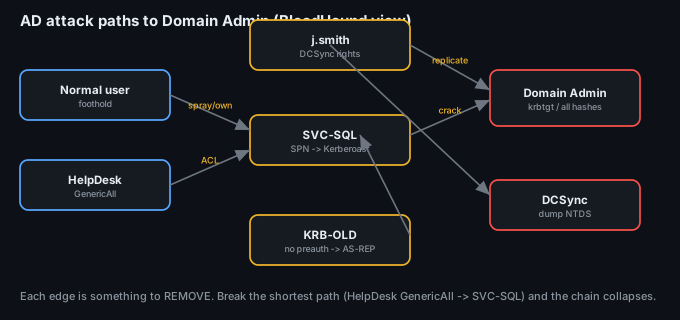
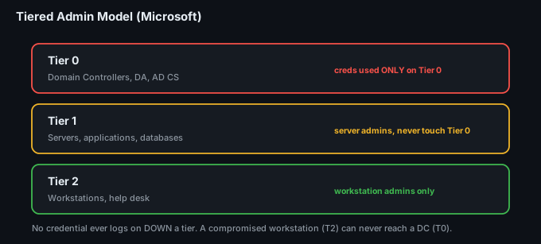
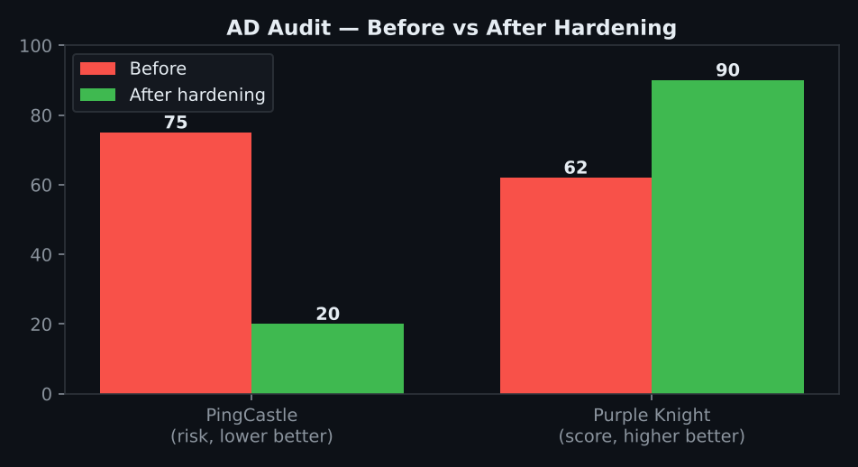

# Project 33 — Active Directory Security (Playbook)

**Status:** 🟢 Detailed **assess → harden → monitor** playbook for Active Directory, run on a lab domain. Tooling and detections are real and runnable; the audit scores and attack-path counts are a lab walkthrough (marked *(sim)*) you replace with your own PingCastle / Purple Knight / BloodHound output.
**Track:** Defensive Engineering

## Objective
Treat Active Directory the way real intruders do — as the **keys to the kingdom** — and defend it end to end: seed the misconfigurations almost every domain has, **audit** them (PingCastle, Purple Knight), **map the attack paths** (BloodHound, used defensively), **simulate** the four signature AD attacks, **detect** each one, then **harden** with a tiered-admin model and Protected Users and prove the improvement with a re-audit.

> Why AD is the whole game: once an attacker is on one domain-joined box, almost every intrusion becomes an **AD** problem — Kerberoast a service account, DCSync the domain, and it's over. Defending AD is defending everything.



## Lab environment
| Item | Value |
|---|---|
| Domain | `lab.local` (Windows Server 2022 DC + member server + 2 workstations) |
| Defence stack | Windows Security event logs → **Wazuh / Elastic** SIEM, Sysmon |
| Audit tools | **PingCastle**, **Purple Knight**, **BloodHound** (defensive) |
| Time zone | UTC |

---

## Phase 1 — Seed the common misconfigurations
To defend realistically, the lab is first made realistically *bad* — the issues real audits find again and again:
| Misconfiguration | Why it's dangerous | Enables |
|---|---|---|
| **SPN set on a privileged user** (e.g. a domain admin "service" account) | its password hash can be requested by any user and cracked offline | **Kerberoasting** |
| Account with **"Do not require Kerberos preauth"** | its AS-REP can be requested and cracked offline | **AS-REP roasting** |
| **Unconstrained / weak delegation** on a server | lets that server impersonate users to any service | delegation abuse |
| **Excessive Domain Admins** / nested admin groups | huge privileged blast radius; many paths to DA | lateral movement |
| A normal user with **DCSync rights** (Replicating Directory Changes) | can pull every password hash in the domain | **DCSync** |
| **Weak/old passwords**, no lockout tuning | spray a few passwords across all users | **Password spraying** |

## Phase 2 — Audit (measure the exposure)
Run the two standard AD audit tools and record the scores — this is the before-number.
```text
PingCastle:    PingCastle.exe --healthcheck --server lab.local     -> HTML + a risk score (0 best, 100 worst)
Purple Knight: run the GUI -> per-category score (Kerberoast, delegation, AD CS, etc.)
```
**Baseline *(sim)***
| Tool | Baseline | Worst categories |
|---|---|---|
| PingCastle | **Risk 75 / 100** | Privileged accounts, Kerberoast, delegation, stale objects |
| Purple Knight | **62%** | Kerberoasting exposure, DCSync rights, weak Kerberos |

Full findings: [`data/audit-findings.csv`](data/audit-findings.csv).

## Phase 3 — Map attack paths (BloodHound, defensively)
Collect with SharpHound (or the AzureHound/BloodHound CE collector), then **find and break the shortest paths to Domain Admin**:
```text
SharpHound.exe -c All -d lab.local
# In BloodHound, run the built-in queries:
#   "Shortest Paths to Domain Admins"
#   "Find Principals with DCSync Rights"
#   "Kerberoastable accounts"
#   "Find computers with unconstrained delegation"
```
**The defensive mindset:** every edge BloodHound draws is a step you can **remove**. Breaking the *shortest* path (e.g. revoking one over-broad ACL, removing one excess admin) collapses many attack chains at once.

**Example *(sim)***: 4 distinct paths to Domain Admins; the shortest is `HelpDesk → (GenericAll) → SVC-SQL (SPN) → Kerberoast → DA`. Remove the HelpDesk GenericAll ACL and reset SVC-SQL → that whole path is gone.

## Phase 4 — Simulate the four signature attacks (and watch what they emit)
Run each in the lab so you know **exactly what log it produces** — that's what the detections key on.

| Attack | How it's run (lab) | What it emits | ATT&CK |
|---|---|---|---|
| **Kerberoasting** | request a service ticket for the SPN account, crack offline | **4769** with **Ticket Encryption 0x17 (RC4)** for a user SPN | T1558.003 |
| **AS-REP roasting** | request AS-REP for a preauth-disabled account | **4768** with preauth not required | T1558.004 |
| **DCSync** | ask the DC to replicate a user's secrets | **4662** with the **replication GUIDs** (DS-Replication-Get-Changes) from a non-DC | T1003.006 |
| **Password spraying** | one/two passwords across many users | bursts of **4625** (and **4771** Kerberos pre-auth fail) across many TargetUserNames from one source | T1110.003 |

## Phase 5 — Build the detections
Each attack has a crisp signature. Sigma rules in [`queries/`](queries/):
- `kerberoast-4769-rc4.yml` — 4769, TicketEncryptionType `0x17`, ServiceName not `krbtgt`/not a machine account
- `asrep-roast-4768.yml` — 4768 with PreAuthType `0` (preauth not required)
- `dcsync-4662.yml` — 4662 with the DS-Replication-Get-Changes GUIDs from a **non-DC** account
- `password-spray-4625.yml` — N distinct TargetUserNames failing from one IP within a short window (plus 4771)

```text
Kerberoast GUID-free signature:  EventID=4769 AND TicketEncryptionType=0x17 AND ServiceName!=krbtgt
DCSync signature:                EventID=4662 AND Properties contains 1131f6aa-9c07-11d1-f79f-00c04fc2dcd2
                                                              (and 1131f6ad-...) by a non-DC principal
```

## Phase 6 — Harden and re-audit
Fix the roots, not just the symptoms:
| Control | What it stops |
|---|---|
| **Tiered admin model** (Tier 0/1/2) — DA creds only ever used on DCs | collapses lateral-movement paths; a workstation compromise can't reach Tier 0 |
| **Protected Users** group + **Authentication Policies** | no NTLM/RC4/delegation for your admins; kills many roasting/relay paths |
| **Group Managed Service Accounts (gMSA)** instead of SPN-on-user | 120-char machine-managed passwords → Kerberoasting is futile |
| Remove **DCSync rights** from non-DCs; audit `Replicating Directory Changes` ACLs | stops domain-wide hash theft |
| Fix delegation (constrained/RBCD, no unconstrained); enforce **AES**, disable RC4 | removes delegation abuse + RC4 roasting |
| Trim Domain Admins; **LAPS** for local admins; lockout + fine-grained password policy | shrinks privileged blast radius; defeats spraying |



**Re-audit *(sim)***


| Tool | Before | After |
|---|---|---|
| PingCastle (risk, lower=better) | 75 | **20** |
| Purple Knight (score, higher=better) | 62% | **90%** |

## Deliverables
- [x] Seeded-misconfiguration list ([`data/audit-findings.csv`](data/audit-findings.csv))
- [x] PingCastle + Purple Knight before/after scores
- [x] BloodHound attack-path findings and the edges removed
- [x] The four attacks mapped to the exact events they emit
- [x] Detection rules (4769 RC4, 4768 no-preauth, 4662 replication, 4625/4771 spray)
- [x] Tiered-admin + Protected Users + gMSA hardening plan
- [ ] Attach real PingCastle/Purple Knight HTML and BloodHound JSON

## ATT&CK Mapping
- **T1558.003** Kerberoasting · **T1558.004** AS-REP Roasting
- **T1003.006** DCSync · **T1110.003** Password Spraying
- T1484 Domain Policy Modification · T1207 Rogue DC (hardening context)

## Key Learnings
1. **AD is the keys to the kingdom** — most intrusions become an AD problem the moment the attacker lands.
2. **Audit gives you a number** (PingCastle/Purple Knight) so hardening is provable: 75 → 20.
3. **BloodHound is a defensive tool** — every edge is something to remove; break the *shortest* path and many chains fall.
4. **Each attack has an exact event signature** — 4769 RC4 (Kerberoast), 4662 replication (DCSync), 4625/4771 bursts (spray) — so each is detectable if you know what it emits.
5. **The durable fixes are structural** — tiered admin, Protected Users, gMSA — not one-off setting tweaks.
