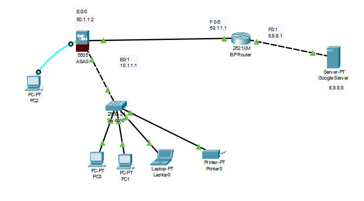
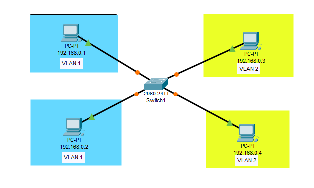
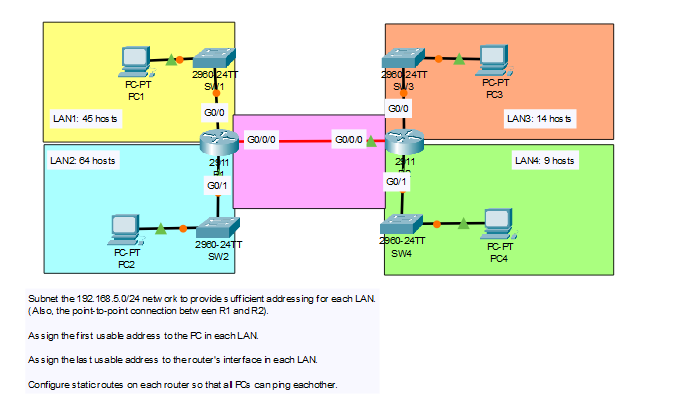
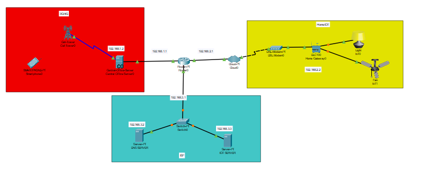
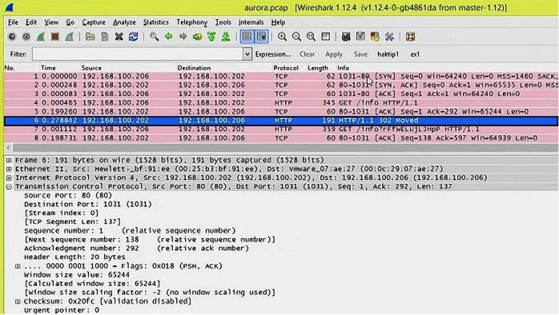

# Project 34 — Network Defense: Firewall, Segmentation & IDS/IPS

**Status:** 🟡 Part A (firewall, VLAN, VLSM and IoT segmentation designs in Cisco Packet Tracer) real · Part B (ASA policy, Suricata IPS, attack testing) shown as a simulated walkthrough (marked *(sim)*)
**Track:** Defensive Engineering & Hardening

## Objective
Design and verify layered network defenses: a perimeter firewall, segmentation (VLANs and VLSM subnetting), isolation of IoT devices, and an inline IPS, then prove each control works with attack and reachability tests.

## Environment
| Item | Value |
|---|---|
| Case ID | `CB-34-0001` |
| Design lab | Cisco Packet Tracer (ASA 5505, 2911/ISR routers, 2960 switches, IoT devices) |
| Test lab (Part B) | pfSense + Suricata, Kali attacker VM |
| Addressing | Private lab ranges; external/attacker addresses in Part B use RFC 5737 documentation ranges |

---

# Part A — Designs (real)

## Lab 1 — Perimeter firewall (Cisco ASA)


| Device | Interface | Address | Role |
|---|---|---|---|
| ASA 5505 | E0/1 (inside) | 10.1.1.1 | Gateway for the internal LAN |
| ASA 5505 | E0/0 (outside) | 50.1.1.2 | Link to ISP |
| ISP router (2621XM) | F0/0 / F0/1 | 50.1.1.1 / 8.8.8.1 | Upstream |
| "Google" server | — | 8.8.8.8 | Simulated internet service |
| Inside hosts | — | 10.1.1.0/24 | PC0, PC1, Laptop0, Printer0 |
| PC2 | Console | — | Out-of-band management of the ASA |

**Design notes**
- Inside (security-level 100) and outside (security-level 0): by default the ASA allows inside → outside and blocks unsolicited outside → inside.
- Management over a **console cable** keeps admin access off the data network.
- The printer sits on the same flat /24 as user PCs; in a production design it should be in its own VLAN (see Lab 2) because printers are a common pivot point.

## Lab 2 — VLAN segmentation


| Host | IP | VLAN |
|---|---|---|
| PC A | 192.168.0.1 | VLAN 1 |
| PC B | 192.168.0.2 | VLAN 1 |
| PC C | 192.168.0.3 | VLAN 2 |
| PC D | 192.168.0.4 | VLAN 2 |

**What it demonstrates:** all four PCs share one switch and one IP subnet, yet VLAN 1 and VLAN 2 hosts cannot reach each other because they are in separate layer-2 broadcast domains. Ping 192.168.0.1 → .2 succeeds; .1 → .3 fails.

**Security notes**
- Using the same IP subnet across two VLANs proves layer-2 isolation, but in production each VLAN gets its own subnet and inter-VLAN traffic is routed **through a firewall** so it can be filtered and logged.
- Avoid leaving user ports in **VLAN 1** (the default/native VLAN); it is the usual target of VLAN-hopping attacks.

## Lab 3 — VLSM subnetting with static routing


**Task:** subnet `192.168.5.0/24` for four LANs and the R1–R2 link; first usable address to the PC, last usable to the router; static routes so all PCs can ping each other.

Allocate largest first:

| Segment | Hosts needed | Prefix | Network | Usable range | PC (first) | Router (last) |
|---|---|---|---|---|---|---|
| LAN2 (R1 G0/1) | 64 | /25 | 192.168.5.0 | .1 – .126 | .1 | .126 |
| LAN1 (R1 G0/0) | 45 | /26 | 192.168.5.128 | .129 – .190 | .129 | .190 |
| LAN3 (R2 G0/0) | 14 | /28 | 192.168.5.192 | .193 – .206 | .193 | .206 |
| LAN4 (R2 G0/1) | 9 | /28 | 192.168.5.208 | .209 – .222 | .209 | .222 |
| R1–R2 (G0/0/0) | 2 | /30 | 192.168.5.224 | .225 – .226 | R1 .225 | R2 .226 |

Remaining free: `192.168.5.228 – .255`.

> LAN2 needs 64 hosts. A /26 gives only 62 usable addresses, so /25 is required. LAN3 needs exactly 14, which a /28 provides.

Static routes:
```
R1(config)# ip route 192.168.5.192 255.255.255.240 192.168.5.226
R1(config)# ip route 192.168.5.208 255.255.255.240 192.168.5.226
R2(config)# ip route 192.168.5.0   255.255.255.128 192.168.5.225
R2(config)# ip route 192.168.5.128 255.255.255.192 192.168.5.225
```
Saved in [`configs/vlsm-static-routes.txt`](configs/vlsm-static-routes.txt).

**Security relevance:** right-sized subnets keep broadcast domains small and make firewall rules precise (a /28 for a 9-host server segment is far easier to protect than a shared /24).

## Lab 4 — IoT and service segmentation


| Zone | Network | Contents |
|---|---|---|
| Mobile (3G/4G) | 192.168.1.0/24 | Cell tower, central office server (.2), smartphone |
| Home IoT | 192.168.2.0/24 | DSL modem, home gateway (.2), smart light, smart fan |
| ISP services | 192.168.3.0/24 | DNS server (.2), IoT server (.3) |
| Core | Router0 | .1 in each zone |

**What it demonstrates:** IoT devices are reached through their own gateway and network, and managed from a central IoT server, so a smartphone or compromised IoT device does not share a broadcast domain with servers.

**Gap to fix in Part B:** Router0 routes freely between all three zones. Nothing stops a compromised smart device from scanning the DNS or IoT server. An ACL or firewall policy is needed: IoT → IoT server only, on the required ports.

---

# Part B — Policy, IPS and Testing (Simulated Walkthrough)

> ⚠️ **Simulated data.** Part A comes from my own Packet Tracer labs. Part B shows the configuration and tests I would run next; outputs are **illustrative**, not captured from a device. Rows marked *(sim)* will be replaced with real output.

## Step 5 — ASA access policy
```
object network INSIDE-LAN
 subnet 10.1.1.0 255.255.255.0
 nat (inside,outside) dynamic interface
!
access-list OUTSIDE-IN extended deny ip any any log
access-group OUTSIDE-IN in interface outside
!
policy-map global_policy
 class inspection_default
  inspect dns
  inspect http
  inspect icmp
```
Saved in [`configs/asa-policy.txt`](configs/asa-policy.txt).

| Test | Expected | Result *(sim)* |
|---|---|---|
| PC0 → 8.8.8.8 (HTTP) | Allowed, NAT to 50.1.1.2 | ✅ Allowed |
| PC0 → 8.8.8.8 (ping, with `inspect icmp`) | Allowed | ✅ Allowed |
| ISP router → 10.1.1.10 (any) | Denied and logged | ✅ Denied, `%ASA-4-106023` logged |

## Step 6 — IoT zone ACL on Router0
```
ip access-list extended IOT-IN
 permit tcp 192.168.2.0 0.0.0.255 host 192.168.3.3 eq 1883
 permit udp 192.168.2.0 0.0.0.255 host 192.168.3.2 eq 53
 deny   ip  192.168.2.0 0.0.0.255 any log
 permit ip  any any
interface <IoT-facing interface>
 ip access-group IOT-IN in
```

## Step 7 — Reachability matrix *(sim)*
| From \ To | Mobile 192.168.1.0 | IoT 192.168.2.0 | IoT server .3.3 | DNS .3.2 | Internet |
|---|---|---|---|---|---|
| Mobile | — | ❌ | ✅ (app port) | ✅ | ✅ |
| IoT devices | ❌ | — | ✅ (1883 only) | ✅ (53 only) | ❌ |
| Servers | ❌ | ✅ (mgmt) | — | ✅ | ✅ |

## Step 8 — Inline IPS (pfSense + Suricata) *(sim)*
| Setting | Value |
|---|---|
| Interface | WAN, inline (Netmap) mode |
| Rules | ET Open, Snort GPLv2 community |
| Blocking | Drop on matching rules; auto-block offender 15 min |

Attack tests from Kali (attacker IP `203.0.113.66`):
| Test | Command | Alert *(sim)* | Action |
|---|---|---|---|
| SYN port scan | `nmap -sS -T4 <WAN>` | ET SCAN Possible Nmap User-Agent / ET SCAN NMAP -sS | Blocked after 3 s |
| SSH brute force | `hydra -l admin -P rockyou.txt ssh://<DMZ>` | ET SCAN Potential SSH Scan | Source blocked |
| SQL injection to DMZ web | `curl "http://<DMZ>/?id=1' OR '1'='1"` | ET WEB_SERVER SQL Injection | Dropped |
| Known-bad C2 domain | `nslookup <test domain>.example` | ET DNS Query to known malware domain (test rule) | Logged |

## Step 9 — Rule tuning log *(sim)*
| SID | Problem | Change | Reason |
|---|---|---|---|
| 2013504 | Fires on Windows Update over HTTP | Suppress for update-server ranges | False positive |
| 100000137 | `BAD-SSL` fires on plain HTTP (see [Project 15](../../B-dfir/project-15-network-forensics/)) | Disabled | Rule matches 2 bytes on any port |
| 2210050 | Stream-event noise | Threshold 1 per source per 60 s | Volume |

---

## Related material from the same report
| Item | Where it belongs |
|---|---|
| VirusTotal analysis of the **Satan** ransomware sample (67/73 detections) | [Project 18 — Malware Triage](../../B-dfir/project-18-malware-triage/) (screenshots supplied separately) |
| Wireshark capture `aurora.pcap` | [Project 15 — Network Forensics](../../B-dfir/project-15-network-forensics/) — see note below |
| Essay on AI-based IDS and Zero Trust | Background reading only; summarised in Key Learnings |

**Note on `aurora.pcap`:** the first report described this capture as a man-in-the-middle attack. It actually shows `192.168.100.206` requesting `GET /info` from `192.168.100.202`, receiving a **302 redirect** to `/info?rFfWELUjLJHpP`, and requesting that random-looking URL. This redirect-to-random-path pattern is characteristic of an **exploit server delivering a browser exploit** (the capture name matches the "Operation Aurora" Internet Explorer exploit, CVE-2010-0249). There is no interception between two parties, so it is not MitM.



## Problems Encountered
| Problem | What happened | Fix | Lesson |
|---|---|---|---|
| Theory-heavy first report | Most content described threat types and AI concepts | Kept the hands-on labs; moved theory to learnings | Portfolios are judged on what you built and tested |
| Mislabelled capture | Exploit-delivery pcap described as MitM | Read the HTTP flow | Name attacks from evidence, not from the file's position in the report |
| Same subnet across VLANs | Shows L2 isolation but no routed policy | Added per-VLAN subnets and firewall routing in design notes | Segmentation must be enforced at L3 too |
| Flat IoT routing | Router0 allowed any-to-any | ACL in Step 6 | Segments without policy are only diagrams |
| Live malware downloaded to workstation | Sample fetched from a public repo for a VirusTotal check | Use **hash lookups** instead of downloading; analyse samples only in an isolated VM | Don't handle live malware outside a sandbox |

## Findings
| # | Finding | Confidence |
|---|---|---|
| 1 | ASA design correctly separates inside/outside and uses out-of-band management | High |
| 2 | VLANs isolate hosts at layer 2 | High |
| 3 | VLSM plan fits all segments in /24 with 28 addresses spare | High |
| 4 | IoT, mobile and server zones are routed but not filtered: lateral movement possible | High |
| 5 | Inline IPS blocks scans, brute force and SQLi *(sim)* | *(sim)* |

## ATT&CK (defended techniques)
- T1046 Network Service Discovery (scan blocking)
- T1110 Brute Force (IPS + lockout)
- T1190 Exploit Public-Facing Application (IPS web rules)
- T1021 / lateral movement (segmentation and ACLs)

## Deliverables
- [x] ASA perimeter design
- [x] VLAN lab
- [x] VLSM addressing plan and static routes
- [x] IoT segmentation design and gap analysis
- [x] ASA policy, ACLs, IPS tests and tuning *(simulated)*
- [ ] Packet Tracer `.pkt` files in `configs/`
- [ ] Real pfSense/Suricata screenshots
- [ ] Final report in `report/`

## Key Learnings
1. Segmentation is only as strong as the policy between segments.
2. Size subnets to the need (VLSM) so firewall rules can be exact.
3. Signature IDS catches known attacks; anomaly/ML-based IDS can catch new behaviour but needs good baselines and still produces false positives. Zero Trust removes implicit trust inside the network, so every request is authenticated, authorised and logged.
