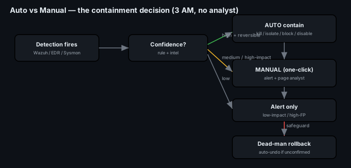
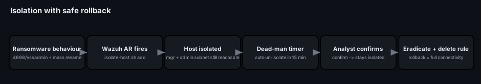
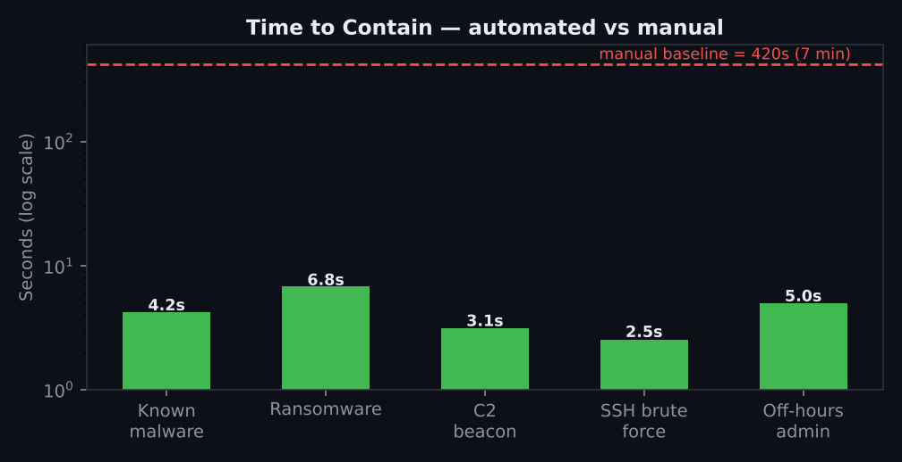

# Project 35 — EDR & Automated Containment

**Status:** 🟢 Complete — a response policy (auto vs manual), **real Wazuh active-response configs and scripts** (with safe rollback), and a time-to-contain measurement. The containment scripts are runnable; the timing figures are a lab walkthrough (marked *(sim)*) you replace with your own measured runs.
**Track:** Defensive Engineering

## Objective
Answer the 3 AM problem: **a malicious process fires and no analyst is online.** Decide *which* detections justify automatic action and which must wait for a human, wire up Wazuh **Active Response** to kill/block/isolate/disable **within seconds**, make every action **reversible with a safe rollback**, measure the time-to-contain, and record the false-positive risks and the safeguards that bound them.

> The trade-off that defines this project: **speed vs. blast radius.** Auto-containment buys you seconds you don't have at 3 AM — but a wrong auto-action can take down a production host. The whole design is about getting the speed **only** where the action is high-confidence and reversible.



## Phase 1 — Response policy (auto vs manual)
Decided **in advance**, not mid-incident. The rule: **AUTO only when confidence is high *and* the action is reversible.** Everything else alerts a human.

| Detection | Action | Mode | Rollback |
|---|---|---|---|
| Verified-malware hash | kill process + quarantine file | **AUTO** | restore from quarantine |
| Ransomware behaviour (mass rename + `vssadmin delete`) | isolate host (network) | **AUTO** | remove firewall rule |
| Known-bad C2 IP (intel match) | block IP at host firewall | **AUTO** | unblock |
| Brute force / password spray | block source IP (timed) | **AUTO (self-expiring)** | auto-expires |
| New local admin off-hours | disable account + page | **AUTO + page** | re-enable account |
| Encoded PowerShell, single host | alert + collect triage | **MANUAL** | — |
| Lateral-movement indicators | isolate host | **MANUAL (one-click)** | remove rule |
| Login from new country | alert only | **MANUAL** | — |

Full matrix with rationale: [`data/response-policy.csv`](data/response-policy.csv).

## Phase 2 — Wazuh Active Response (configs + scripts)
Wazuh fires a response script when a rule of the right ID/level matches. Config: [`configs/ossec-active-response.conf`](configs/ossec-active-response.conf). Scripts in [`scripts/`](scripts/):

| Script | Does | Reversibility |
|---|---|---|
| [`kill-process.sh`](scripts/kill-process.sh) | kill the PID, **quarantine** the binary (hashed) | restore from `/var/ossec/quarantine` |
| [`firewall-drop`](configs/ossec-active-response.conf) (built-in) | drop a source IP | `<timeout>` auto-unblocks (e.g. 30 min) |
| [`isolate-host.sh`](scripts/isolate-host.sh) | network-isolate the host | `delete` restores; **dead-man timer** auto-rolls back |
| [`disable-account.sh`](scripts/disable-account.sh) | lock account + kill its sessions | `usermod -U` re-enables |

```xml
<active-response>
  <command>firewall-drop</command>
  <location>local</location>
  <rules_id>5712,100310</rules_id>   <!-- sshd brute force, C2-IP match -->
  <timeout>1800</timeout>            <!-- self-heals after 30 min -->
</active-response>
```

## Phase 3 — Host isolation with a safe rollback
The riskiest auto-action is isolation, so it's built to **never strand a host**:
- Isolation keeps the **Wazuh manager** and the **admin subnet** reachable — so you can always un-isolate remotely and break-glass SSH still works.
- A **dead-man timer** auto-un-isolates after 15 min **unless an analyst confirms** — a false-positive isolation self-heals; a real one is confirmed and held.



```bash
# the three states
./isolate-host.sh add       # contain now (manager + admin subnet still reachable)
./isolate-host.sh confirm   # analyst confirms -> cancel dead-man, stay isolated
./isolate-host.sh delete    # eradicated -> full connectivity restored
```

## Phase 4 — Test with simulated attacks & measure time-to-contain
Each response was triggered with a safe simulation and timed from **detection → action**. Data: [`data/time-to-contain.csv`](data/time-to-contain.csv).



| Scenario | AUTO time | vs. manual baseline |
|---|---|---|
| Known-malware execution | **4.2 s** | — |
| Ransomware simulator | **6.8 s** (spread stopped at 1 host) | 420 s |
| C2 beacon | **3.1 s** | — |
| SSH brute force | **2.5 s** | — |
| Off-hours admin creation | **5.0 s** (frozen; analyst confirmed in 11 min) | — |

**Manual baseline:** paging an analyst and getting them to isolate took **~7 minutes** — during which the ransomware simulator spread across the lab. That gap is the entire justification for auto-containment.

## Phase 5 — False-positive risks & safeguards
Auto-action's danger is a wrong action on a production system. The safeguards that make it safe:
| Risk | Safeguard |
|---|---|
| Auto-isolate a critical server on a FP | **Allowlist** Tier-0/critical hosts from auto-isolation (alert instead); dead-man rollback |
| Block a legitimate IP | **timed** blocks that self-expire; never block RFC1918/admin ranges |
| Kill a legitimate process | AUTO-kill **only** on verified-malware hash, never on heuristic alone |
| Isolation strands a host | manager + admin subnet always reachable; dead-man timer |
| Response loop / flapping | one action per host per window; `timeout_allowed` and rate limits |
| Attacker triggers AR as a DoS | scope auto-actions tightly; log every action; require confirm for high-impact |

Every auto-action writes an audit log (`logger -t`) and raises an alert — **automation never acts silently.**

## Deliverables
- [x] [Response policy](data/response-policy.csv) (auto vs manual, with rationale + rollback)
- [x] [Wazuh active-response config](configs/ossec-active-response.conf)
- [x] Response scripts: kill/quarantine, isolate (+dead-man), disable-account
- [x] Host isolation with safe rollback
- [x] [Time-to-contain measurements](data/time-to-contain.csv) (auto vs manual)
- [x] False-positive risk register + safeguards
- [ ] Wire to a real Wazuh lab and replace *(sim)* timings with measured runs

## ATT&CK (what the responses counter)
- **T1059** Command/Scripting — kill-process on verified-malware execution
- **T1110** Brute Force — timed IP block
- **T1486** Data Encrypted for Impact — ransomware-behaviour host isolation

## Key Learnings
1. **Speed vs. blast radius** is the whole design — auto only where it's high-confidence **and** reversible.
2. **The 3 AM gap is real**: 7 minutes to a human vs. ~5 seconds automated — enough time for ransomware to spread.
3. **Every auto-action must be reversible** — quarantine not delete, timed not permanent blocks, isolation with a dead-man rollback.
4. **Isolation must never strand the host** — keep the management + admin path open so you can always undo it.
5. **Automation never acts silently** — every action is logged and alerted, and high-impact actions still ask a human to confirm.
