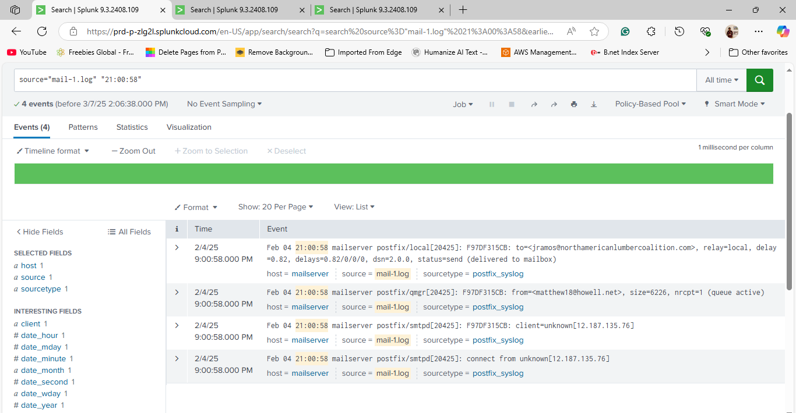
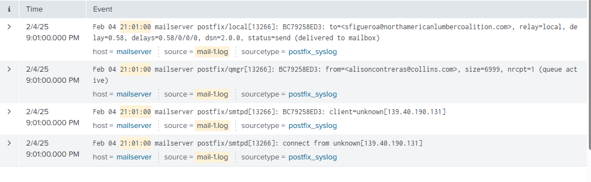
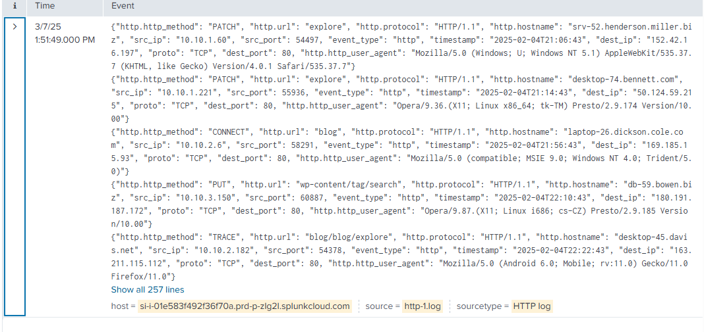

# Project 36 — Splunk SOC

**Status:** 🟡 Part A (log onboarding and event review in Splunk Cloud) done with real screenshots · Part B (parsing fix, SPL detections, dashboard, alerts) shown as a simulated walkthrough (marked *(sim)*)
**Track:** Defensive Engineering & Hardening

## Objective
Onboard mail-server and HTTP proxy logs into Splunk, reconstruct activity, find the suspicious behaviour hidden in normal traffic, and turn it into reusable SPL detections, alerts and a SOC dashboard.

## Scenario
A SOC analyst receives two log files from a small organisation covering **4–10 Feb 2025**:
- `mail-1.log` — Postfix syslog from the mail server
- `http-1.log` — JSON HTTP/proxy events from internal hosts (10.10.0.0/22) to the internet

The task is to find anything worth escalating.

> The dataset is synthetic training data (generated names, domains and IPs). It contains no real people or organisations.

## Environment
| Item | Value |
|---|---|
| Case ID | `CB-36-0001` |
| Platform | Splunk Cloud Platform 9.3.2408 (trial stack) |
| Sources | `mail-1.log` (sourcetype `postfix_syslog`), `http-1.log` (sourcetype `HTTP log`, custom) |
| Index | `main` |
| Time zone | Event timestamps as written in the logs (no offset recorded) |

---

# Part A — Real Analysis

## Step 1 — Mail log onboarding and message reconstruction
`mail-1.log` parsed correctly with the built-in `postfix_syslog` sourcetype: one event per line, timestamp extracted from the syslog header.

```spl
source="mail-1.log" "21:00:58"
```



Postfix writes **four lines per delivered message**, linked by the queue ID:

| Time | Queue ID | smtpd: connect / client | qmgr: from | local: to | Status |
|---|---|---|---|---|---|
| Feb 04 21:00:58 | F97DF315CB | `unknown[12.187.135.76]` | matthew18@howell.net (6,226 B) | jramos@northamericanlumbercoalition.com | sent, delivered to mailbox |
| Feb 04 21:01:00 | BC79258ED3 | `unknown[139.40.190.131]` | alisoncontreras@collins.com (6,999 B) | sfigueroa@northamericanlumbercoalition.com | sent, delivered to mailbox |

**Interpretation**
- `unknown[IP]` means the sending IP had **no reverse-DNS (PTR) record**. It is not by itself malicious, but legitimate mail servers almost always have PTR records, so it is a weak spam/phishing indicator.
- Two external senders delivered to two different internal users two seconds apart. Worth correlating with any HTTP activity from those users' machines afterwards.

## Step 2 — HTTP log onboarding problem


`http-1.log` was ingested **as a single event containing 257 lines**, timestamped with the **upload time (07 Mar 2025 13:51:49)** instead of each record's own `timestamp` field.

**Consequences**
- Searches by time, `stats`, `timechart` and alerts on HTTP data are all wrong: Splunk sees one event, not 257.
- Each request's real time (`2025-02-04T21:06:43` …) is only text inside the event.

**Root cause:** the custom sourcetype had no line-breaking or timestamp rules, so Splunk merged the JSON lines. The fix is in Part B, Step 5.

## Step 3 — Manual review of HTTP events
Until parsing was fixed, the 257 records were read manually. Every record has the same structure:

```json
{"http.http_method": "PATCH", "http.url": "explore", "http.protocol": "HTTP/1.1",
 "http.hostname": "srv-52.henderson.miller.biz", "src_ip": "10.10.1.60", "src_port": 54497,
 "event_type": "http", "timestamp": "2025-02-04T21:06:43", "dest_ip": "152.42.16.197",
 "proto": "TCP", "dest_port": 80,
 "http.http_user_agent": "Mozilla/5.0 (Windows; U; Windows NT 5.1) AppleWebKit/535.37.7 ..."}
```

Selected events from the review:

| Time | Host (src_ip) | Method | Destination |
|---|---|---|---|
| 02-04 21:06:43 | srv-52 (10.10.1.60) | PATCH | 152.42.16.197 |
| 02-04 21:14:43 | desktop-74 (10.10.1.221) | PATCH | 50.124.59.215 |
| 02-04 21:56:43 | laptop-26 (10.10.2.6) | CONNECT | 169.185.15.93 |
| 02-04 22:10:43 | db-59 (10.10.3.150) | PUT | 180.191.187.172 |
| 02-07 16:12:43 | desktop-93 (10.10.1.32) | TRACE | 152.99.131.9 |
| **02-08 23:24–23:30** | **web-37 (10.10.0.42)** | **PUT, DELETE, TRACE, PATCH, POST, GET, HEAD** | **207.177.204.236** |
| 02-09 10:41:43 | desktop-98 (10.10.1.112) | CONNECT | 208.152.159.154 |
| 02-10 01:35:43 | email-97 (10.10.1.107) | OPTIONS | 169.168.106.156 |

## Step 4 — Findings from the review

### Finding 1 — HTTP method enumeration from a web server (priority)
`web-37` (10.10.0.42) sent **seven different HTTP methods to the same external IP, exactly one minute apart**:

| 23:24:43 | 23:25:43 | 23:26:43 | 23:27:43 | 23:28:43 | 23:29:43 | 23:30:43 |
|---|---|---|---|---|---|---|
| PUT | DELETE | TRACE | PATCH | POST | GET | HEAD |

A server cycling through every method at a fixed interval is not browsing: it is automated **method enumeration** (testing which verbs a target accepts, e.g. to find writable resources), or a compromised server being used as a scanning point. A web server should not initiate outbound traffic like this at all. **Escalate:** isolate or investigate web-37 and block 207.177.204.236.

### Finding 2 — Unusual methods leaving the network
`PATCH`, `PUT`, `DELETE`, `TRACE`, `CONNECT` and `OPTIONS` are rare for normal outbound browsing (mostly GET/POST). Several internal hosts, including **database servers** (`db-59`, `db-32`, `db-92`), send them to internet IPs over plain HTTP (port 80). Servers making outbound write requests to the internet should be explained by their owners.

### Finding 3 — Hostname / IP inconsistencies
- `desktop-44…` appears as **10.10.0.72** (02-06 02:55) and **10.10.2.215** (02-06 14:56)
- `srv-61…` appears as **10.10.1.117** (02-07 03:15) and **10.10.1.102** (02-07 03:19), four minutes apart

A server changing IP within minutes suggests DHCP churn, a spoofed hostname field, or two machines claiming the same name. Check against DHCP and DNS logs.

### Finding 4 — Implausible user agents
Records include agents such as Windows NT 4.0 / MSIE 9.0, Windows NT 5.1 and Opera 9.x on servers. Real servers do not run these browsers; random or outdated user agents are typical of scripts and scanners that fake their identity.

### Finding 5 — Mail from hosts without reverse DNS
See Step 1. Low severity on its own.

---

# Part B — Fix, Detections and Dashboard (Simulated Walkthrough)

> ⚠️ **Simulated data.** Part A comes from my own Splunk session. Part B shows the configuration and SPL I would use next; the result tables are **illustrative**, not output from the dataset. Rows marked *(sim)* will be replaced with real output.

## Step 5 — Fix HTTP log parsing
`props.conf` for the custom sourcetype (Settings → Source types → Advanced):

```ini
[http_json]
SHOULD_LINEMERGE = false
LINE_BREAKER = ([\r\n]+)
KV_MODE = json
TIME_PREFIX = "timestamp":\s*"
TIME_FORMAT = %Y-%m-%dT%H:%M:%S
MAX_TIMESTAMP_LOOKAHEAD = 25
TRUNCATE = 10000
```

Re-upload `http-1.log` with sourcetype `http_json`, then verify:
```spl
index=main sourcetype=http_json | stats count min(_time) as first max(_time) as last
| convert ctime(first) ctime(last)
```
| count | first | last |
|---|---|---|
| 257 *(sim)* | 02/04/2025 21:06:43 *(sim)* | 02/10/2025 16:51:43 *(sim)* |

## Step 6 — Field aliases (CIM-style)
```ini
[http_json]
FIELDALIAS-cim = "http.http_method" AS http_method  "http.hostname" AS src_host  "http.http_user_agent" AS http_user_agent  "http.url" AS uri_path
```

## Step 7 — SPL detections
Saved in [`queries/`](queries/).

**D1 — Method enumeration (≥5 distinct methods from one source to one destination within 1 hour)**
```spl
index=main sourcetype=http_json
| bin _time span=1h
| stats dc(http_method) as methods values(http_method) as list count by _time src_ip src_host dest_ip
| where methods>=5
| sort - methods
```
| _time | src_host | src_ip | dest_ip | methods | list |
|---|---|---|---|---|---|
| 2025-02-08 23:00 | web-37.blake.simmons.info | 10.10.0.42 | 207.177.204.236 | 7 | DELETE GET HEAD PATCH POST PUT TRACE *(sim)* |

**D2 — Outbound write/diagnostic methods from servers**
```spl
index=main sourcetype=http_json http_method IN ("PUT","PATCH","DELETE","TRACE","CONNECT","OPTIONS")
| eval role=case(match(src_host,"^db-"),"database", match(src_host,"^(srv|web)-"),"server", match(src_host,"^email-"),"mail", true(),"workstation")
| stats count values(http_method) as methods dc(dest_ip) as dests by role src_host
| sort - count
```
| role | src_host | count | methods | dests |
|---|---|---|---|---|
| server | web-37 | 4 | DELETE PATCH PUT TRACE | 1 |
| database | db-59 | 3 *(sim)* | PATCH PUT *(sim)* | 3 *(sim)* |

**D3 — Hostname seen with multiple IPs**
```spl
index=main sourcetype=http_json
| stats dc(src_ip) as ips values(src_ip) as ip_list by src_host
| where ips>1
```
| src_host | ips | ip_list |
|---|---|---|
| desktop-44.cunningham.mcmillan-mendoza.com | 2 | 10.10.0.72 10.10.2.215 |
| srv-61.kim.johnson.biz | 2 | 10.10.1.102 10.10.1.117 |

**D4 — Rare user agents**
```spl
index=main sourcetype=http_json
| rare limit=20 http_user_agent
| where count<=2
```

**D5 — Inbound mail from hosts without reverse DNS**
```spl
index=main sourcetype=postfix_syslog "client=unknown["
| rex "client=unknown\[(?<sender_ip>[\d\.]+)\]"
| stats count by sender_ip
```

**D6 — Correlate mail recipients with later outbound web activity** *(sim)*
```spl
index=main sourcetype=postfix_syslog "postfix/local" status=sent
| rex "to=<(?<rcpt>[^>]+)>"
| join type=left rcpt [ | inputlookup user_to_host.csv ]
| join type=inner src_host [ search index=main sourcetype=http_json earliest=-24h ]
| table _time rcpt src_host http_method dest_ip
```

## Step 8 — Alerts *(sim)*
| Alert | Search | Schedule | Trigger | Action |
|---|---|---|---|---|
| HTTP method enumeration | D1 | Every 15 min, last 60 min | count > 0 | Notable / email SOC |
| Server outbound write methods | D2 filtered to server roles | Hourly | count > 0 | Ticket |
| Hostname IP conflict | D3 | Daily | count > 0 | Report to IT |

## Step 9 — SOC dashboard *(sim)*
| Panel | SPL (summary) | Visual |
|---|---|---|
| Requests by method over time | `timechart span=1h count by http_method` | Stacked column |
| Top internal talkers | `top limit=10 src_host` | Bar |
| Top external destinations | `top limit=10 dest_ip` | Table |
| Enumeration hits | D1 | Single value + table |
| Mail deliveries | `sourcetype=postfix_syslog status=sent | timechart count` | Line |

## Step 10 — Escalation note *(sim)*
> **To:** IR team · **Severity:** High · **Host:** web-37 (10.10.0.42)
> On 2025-02-08 between 23:24:43 and 23:30:43, web-37 sent seven different HTTP methods to 207.177.204.236 at one-minute intervals. A web server should not initiate this traffic. Recommend isolating web-37, collecting memory and web logs, and blocking 207.177.204.236 at the firewall.

---

## Problems Encountered
| Problem | What happened | Root cause | Fix | Lesson |
|---|---|---|---|---|
| HTTP log merged into one event | 257 records shown as 1 event, timestamped at upload time | No line-breaking or timestamp rules for a custom JSON sourcetype | `props.conf` with `LINE_BREAKER`, `KV_MODE=json`, `TIME_PREFIX` (Step 5) | Validate event count and time range right after onboarding |
| First report listed events without verdicts | Each line described what an HTTP method does | No hypothesis about what "bad" looks like | Grouped events by source, destination and pattern | A SOC report answers "so what?" for every event |
| Searches typed by hand per timestamp | `"21:00:58"` searches one at a time | Exploration without SPL aggregation | `stats`, `bin`, `dc()` queries (Step 7) | Aggregate first, drill down second |

## Findings Summary
| # | Finding | Evidence | Severity | Confidence |
|---|---|---|---|---|
| 1 | web-37 performed HTTP method enumeration against 207.177.204.236 | http-1.log, 02-08 23:24–23:30 | High | High |
| 2 | Servers (incl. databases) send PUT/PATCH/DELETE to internet IPs over HTTP | http-1.log | Medium | Medium |
| 3 | Two hostnames appear with two IPs each within minutes | http-1.log | Low | High |
| 4 | Outdated / random user agents on servers | http-1.log | Low | Medium |
| 5 | Inbound mail from senders without PTR records | mail-1.log | Low | High |
| 6 | HTTP data unusable for time-based analysis until re-parsed | Splunk ingestion | Process | High |

## ATT&CK Mapping
- T1595.002 Active Scanning: Vulnerability Scanning — method enumeration from web-37
- T1071.001 Application Layer Protocol: Web Protocols — outbound HTTP from servers
- T1036 Masquerading — fake / outdated user agents

## IOCs
| Type | Value | Context |
|---|---|---|
| IPv4 | 207.177.204.236 | Target of method enumeration from web-37 |
| Host | web-37.blake.simmons.info / 10.10.0.42 | Internal source to investigate |

## Deliverables
- [x] Mail log onboarding and message reconstruction
- [x] HTTP log onboarding issue identified
- [x] Manual review and findings
- [x] props.conf fix *(simulated result)*
- [x] SPL detection library *(simulated results)*
- [x] Alerts and dashboard design *(simulated)*
- [ ] Screenshots of re-parsed data, detections and dashboard
- [ ] Final report in `report/`

## Key Learnings
1. Check event counts and timestamps immediately after onboarding; a parsing mistake silently breaks every later search.
2. Look for **patterns across events** (same source, same destination, fixed interval), not individual lines.
3. Context matters: the same PUT request means something different from a laptop than from a web or database server.
