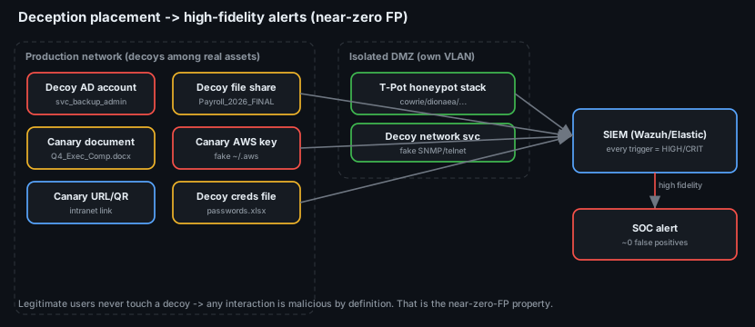
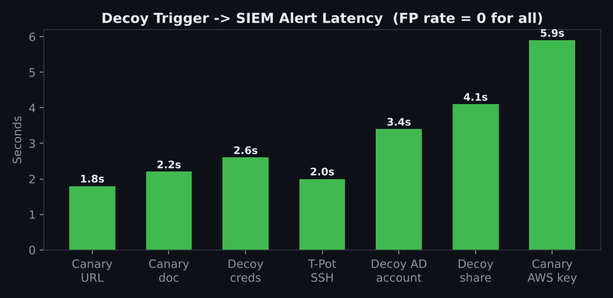

# Project 37 — Deception & Honeypots

**Status:** 🟡 Deception design, decoy inventory, detection rules and placement map are complete; the alert-latency figures and T-Pot capture are a lab walkthrough (marked *(sim)*) you replace with your own runs.
**Track:** Defensive Engineering

## Objective
Give the SOC **high-fidelity alerts with near-zero false positives** by planting decoys that **no legitimate user or process ever touches** — so *any* interaction is, by definition, malicious. Deploy T-Pot for internet-facing attack telemetry, scatter Canarytokens (documents, AWS keys, URLs) in realistic spots, stand up a decoy privileged AD account and a decoy file share, route every trigger to the SIEM as **high severity**, then trigger each from an attacker VM and measure the alert latency.

> The one idea: a normal detection rule drowns in false positives because real users do suspicious-looking things all day. A **decoy has no legitimate use** — the false-positive rate isn't "low", it's **structurally zero**. That flips the SOC's signal-to-noise problem on its head.



## Lab environment
| Item | Value |
|---|---|
| Case ID | `CB-37-0001` |
| Prod network | Windows AD domain `lab.local` (decoys live *among* real assets) |
| DMZ | Isolated VLAN running **T-Pot** (cowrie, dionaea, heralding, honeytrap, ddospot…) |
| Tokens | **Canarytokens** (self-hosted or canarytokens.org) |
| SIEM | **Wazuh / Elastic** — all decoy triggers routed as HIGH/CRITICAL |

---

## Phase 1 — Deploy T-Pot (internet-facing attack telemetry)
T-Pot runs a stack of honeypot sensors in an **isolated** segment and ships events to Elastic. It answers "who is knocking, and how" without risking a real asset.
```bash
# On an isolated DMZ VM (Debian), standard T-Pot install:
git clone https://github.com/telekom-security/tpotce && cd tpotce
./install.sh                     # choose the STANDARD edition
# Sensors come up (cowrie SSH/Telnet, dionaea SMB/HTTP, heralding, etc.)
```
> **Isolation is mandatory** — a honeypot is *meant* to be attacked, so it must never reach production. Own VLAN, egress-filtered.

## Phase 2 — Place Canarytokens (the bait)
Tokens that fire a callback the instant they're used. Placement is everything — they must sit where an attacker *looks*, not where a user *works*:
| Token | Realistic placement |
|---|---|
| Canary **document** (`Q4_Exec_Compensation.docx`) | inside the decoy share + a couple of executives' Documents |
| Canary **AWS key** (fake `~/.aws/credentials`) | developer workstations + an internal wiki page |
| Canary **URL / QR** (`/internal-vpn-setup`) | an intranet page + a pinned chat message |
| Decoy **creds file** (`passwords.xlsx`, fake creds) | a shared drive + a desktop |

Full list with placement and routing: [`data/decoy-inventory.csv`](data/decoy-inventory.csv).

## Phase 3 — Decoy AD account + decoy file share
- **Decoy privileged account** `svc_backup_admin` — named to look like a juicy service admin, placed near the Domain-Admins-adjacent groups, but with **no real rights**. Any auth attempt, Kerberos request or enumeration against it = alert. It's also a **Kerberoast tripwire** (a 4769 for it means someone is roasting).
- **Decoy file share** `\\FILESRV\Payroll_2026_FINAL` — indexed and realistically named, with a **SACL audit** so a single file open raises **4663**.

## Phase 4 — Route every trigger to the SIEM (high severity)
Detection rules in [`queries/`](queries/):
- `decoy-account-trigger.yml` — any 4625/4624/4768/4769/4771 for `svc_backup_admin` → **Critical**
- `decoy-file-access.yml` — 4663 on the decoy share / canary docs → **High**
- `canarytoken-callback.yml` — Canary webhook (`doc_opened` / `aws_key_used` / `url_visited`) → **High**

```yaml
# the whole point, in one rule condition:
selection:
  EventID: [4625, 4624, 4768, 4769, 4771]
  TargetUserName: 'svc_backup_admin'   # a decoy -> any hit is malicious
condition: selection
level: critical
```

## Phase 5 — Trigger each decoy & measure alert latency
From the attacker VM, each decoy was tripped and the **detection → SIEM alert** time measured. Data: [`data/alert-latency.csv`](data/alert-latency.csv).



| Decoy | Trigger | Latency *(sim)* | FP rate |
|---|---|---|---|
| Canary URL | visited the link | **1.8 s** | 0 |
| Canary document | opened the .docx | **2.2 s** | 0 |
| Decoy creds file | opened passwords.xlsx | **2.6 s** | 0 |
| T-Pot SSH | brute force (cowrie) | **2.0 s** | 0 |
| Decoy AD account | auth attempt | **3.4 s** | 0 |
| Decoy file share | opened a file | **4.1 s** | 0 |
| Canary AWS key | used the fake key | **5.9 s** | 0 |

**Every FP rate is 0** — that's the result that matters. These are alerts you can safely auto-respond to ([Project 35](../project-35-edr-automated-containment/)) because they're never wrong.

## Phase 6 — Honeypot attack summary (what T-Pot saw)
Summary of real-world attacker behaviour captured on the sensors: [`data/tpot-attack-summary.csv`](data/tpot-attack-summary.csv).
| Sensor | Observed |
|---|---|
| cowrie (SSH/Telnet) | brute force → `wget` malware, cryptominer install attempts |
| dionaea (SMB/HTTP) | EternalBlue-style SMB probes, payload drops (samples hashed) |
| heralding | default-cred spray (`admin/admin`, `root/root`) |
| ddospot | NTP/DNS/SSDP amplification probes |

This is free, real threat intel — IOCs and TTPs to feed detections elsewhere in the program.

## Deliverables
- [x] [Decoy inventory + placement map](data/decoy-inventory.csv)
- [x] Detection rules (decoy account, decoy file, canarytoken) → SIEM high-severity
- [x] [Alert-latency table](data/alert-latency.csv) (all FP = 0)
- [x] [T-Pot attack summary](data/tpot-attack-summary.csv)
- [x] Placement map + latency chart
- [ ] Stand up a real T-Pot + Canary and replace *(sim)* latencies

## ATT&CK (what the decoys catch)
- **T1083** File and Directory Discovery — decoy share / canary docs
- **T1087** Account Discovery — decoy AD account enumeration
- **T1552** Unsecured Credentials — canary AWS key / decoy creds file
- T1558.003 Kerberoasting — a 4769 for the decoy account is a roasting tripwire

## Key Learnings
1. **A decoy's false-positive rate is structurally zero** — nothing legitimate touches it, so every hit is a real alert.
2. **Placement is the whole skill** — tokens must sit where attackers *look* (shares, creds files, wikis), not where users *work*.
3. **Deception catches attackers *early*** — the moment they do discovery (T1083/T1087), before they reach anything real.
4. **Honeypot alerts are safe to auto-respond to** — their zero-FP property pairs perfectly with automated containment.
5. **T-Pot is free threat intel** — real brute-force sources, malware samples and TTPs, captured without risking production.
