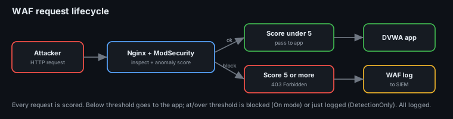
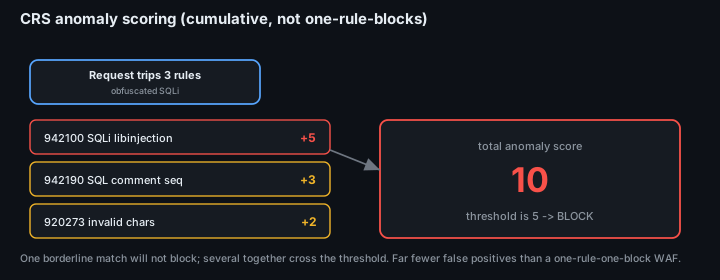
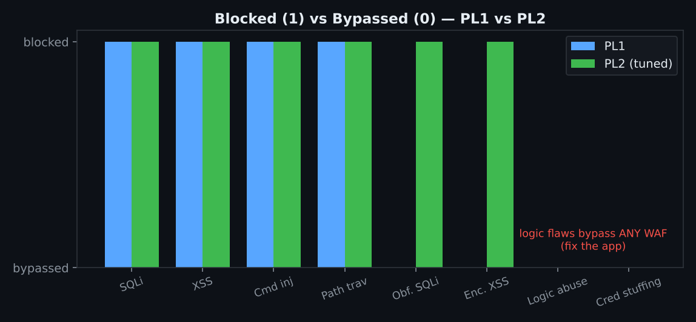

# Project 38 — Web Application Firewall (ModSecurity + OWASP CRS)

**Status:** 🟢 Complete as a **descriptive, learn-by-reading playbook**. Every step has the real command/config, an explanation of *why*, and what you should see. The attack results are from a lab run (marked *(sim)* where a specific count is illustrative); the configs are runnable as-is.
**Track:** Defensive Engineering

> ### Read this like a tutorial
> This project is written so someone new to WAFs can follow it top to bottom and end up with a working, tuned ModSecurity in front of a vulnerable app — and actually understand each decision. Concepts are explained the first time they appear.

---

## 0. What a WAF is (and what it is *not*)

A **Web Application Firewall** sits **in front of** your web app, reads every HTTP request (and response), and blocks the ones that look like attacks — SQL injection, XSS, command injection, path traversal, and so on. It operates at **Layer 7** (the HTTP layer), which a normal network firewall never sees.

```
  Attacker ──HTTP──▶  [ Nginx + ModSecurity (WAF) ]  ──▶  [ DVWA  vulnerable app ]
                          │  inspects every request
                          │  scores it, blocks if too malicious
                          ▼
                       WAF logs ──▶ SIEM
```

Two mental models:
- **Negative security model** (what CRS uses): "block things that *look* like known attacks." Flexible, needs tuning.
- **Positive security model**: "allow only an explicit whitelist of known-good input." Stronger but brittle; rarely practical for a whole app.

**A WAF is not a patch.** It's **defence in depth** — a shield that buys time for a vulnerable app that *cannot be fixed quickly* (our scenario). A determined attacker can sometimes bypass it, which is exactly why Phase 6 measures *what got through*.



---

## 1. Lab setup — vulnerable app behind Nginx + ModSecurity

**Goal:** stand up DVWA (Damn Vulnerable Web App) behind an Nginx reverse proxy that runs ModSecurity v3 with the OWASP Core Rule Set.

The quickest reproducible way is Docker:
```bash
# A ready-made image bundles Nginx + ModSecurity v3 + OWASP CRS.
docker run -d --name waf -p 8080:8080 \
  -e BACKEND=http://dvwa:80 \
  -e MODSEC_RULE_ENGINE=DetectionOnly \
  owasp/modsecurity-crs:nginx

# DVWA as the protected backend
docker run -d --name dvwa --network container:waf vulnerables/web-dvwa
```
Now `http://localhost:8080` reaches DVWA **through the WAF**. From scratch (no Docker) the same pieces are: Nginx with the `ModSecurity-nginx` connector, `libmodsecurity3`, and the CRS rules — config in [`configs/`](configs/).

**Key files**
| File | Purpose |
|---|---|
| [`configs/modsecurity.conf`](configs/modsecurity.conf) | the engine's main settings (on/off, body access, logging) |
| [`configs/crs-setup.conf`](configs/crs-setup.conf) | CRS settings — **paranoia level**, **anomaly thresholds** |
| [`configs/nginx-waf.conf`](configs/nginx-waf.conf) | Nginx server block that loads ModSecurity and proxies to DVWA |

---

## 2. Turn ModSecurity on — in **DetectionOnly** first

**Never** switch a new WAF straight to blocking in front of a real app — you'll block legitimate traffic on day one. Start in **DetectionOnly**: it evaluates every rule and *logs* what it *would* have blocked, but lets everything through.

```apache
# modsecurity.conf
SecRuleEngine DetectionOnly     # <-- log only, do not block (yet)
SecRequestBodyAccess On         # inspect POST bodies (needed for form-based SQLi/XSS)
SecAuditEngine RelevantOnly     # write an audit log entry for anything that matches
SecAuditLog /var/log/modsec_audit.log
```

### How CRS decides: **anomaly scoring** (the concept to understand)
CRS does **not** block on a single rule by default. Instead:
1. Each matching rule adds points to an **anomaly score** (critical rule = 5, error = 4, warning = 3, notice = 2).
2. At the end of each phase, if the total score ≥ the **inbound threshold** (default **5**), the request is actioned.
3. In DetectionOnly it's only logged; in blocking mode it's denied (403).

This is why a single borderline match won't block, but a request that trips several rules will — it's **cumulative**, which keeps false positives down.

```apache
# crs-setup.conf
SecAction "id:900110,phase:1,pass,nolog,\
  setvar:tx.inbound_anomaly_score_threshold=5,\
  setvar:tx.outbound_anomaly_score_threshold=4"
```

---

## 3. Run the four classic attacks and watch the logs

Now attack DVWA through the WAF and read what ModSecurity logs. For each class: the payload, the CRS rule family that catches it, and the log line you'll see.

### 3a. SQL Injection (SQLi)
```bash
curl "http://localhost:8080/vulnerabilities/sqli/?id=1' OR '1'='1&Submit=Submit"
```
- **CRS catches it:** rule family **942xxx** (SQL injection).
- **Log:** `Matched "Operator ... SQL Injection Attack Detected via libinjection" ... [id "942100"] ... [tag "attack-sqli"]`
- **Why:** CRS uses `libinjection` (a SQL/XSS tokenizer), not just regex, so `' OR '1'='1` is recognised as SQL syntax, not text.

### 3b. Cross-Site Scripting (XSS)
```bash
curl "http://localhost:8080/vulnerabilities/xss_r/?name=<script>alert(1)</script>"
```
- **CRS catches it:** rule family **941xxx** (XSS).
- **Log:** `[id "941100"] ... "XSS Attack Detected via libinjection" ... [tag "attack-xss"]`

### 3c. Command Injection
```bash
curl "http://localhost:8080/vulnerabilities/exec/" --data "ip=127.0.0.1;cat /etc/passwd&Submit=Submit"
```
- **CRS catches it:** rule family **932xxx** (RCE / OS command injection).
- **Log:** `[id "932160"] ... "Remote Command Execution: Unix Shell Code Found" ... [tag "attack-rce"]`
- **Why:** `;cat /etc/passwd` matches known shell-command patterns.

### 3d. Path / Directory Traversal
```bash
curl "http://localhost:8080/vulnerabilities/fi/?page=../../../../etc/passwd"
```
- **CRS catches it:** rule family **930xxx** (LFI / path traversal).
- **Log:** `[id "930110"] ... "Path Traversal Attack (/../)" ... [tag "attack-lfi"]`

> Read the audit log as you go: `tail -f /var/log/modsec_audit.log`. Each entry shows the request, every rule that matched, and the running anomaly score. **This is the skill** — learning to read a WAF log and tell a real attack from a false positive.

All attacks map to **T1190 — Exploit Public-Facing Application**.

---

## 4. Paranoia levels & tuning (where the real work is)

### Paranoia Level (PL) — the sensitivity dial
CRS has four **paranoia levels**. Higher = more rules fire = catches more, but more false positives.
| PL | Catches | False positives | Use when |
|---|---|---|---|
| **PL1** (default) | common, clear attacks | very few | most sites, start here |
| **PL2** | more evasions | some | after tuning PL1 |
| **PL3** | aggressive | many | high-value apps, well-tuned |
| **PL4** | everything suspicious | lots | locked-down, expert-tuned only |

```apache
# crs-setup.conf — raise sensitivity one level at a time, tuning between each
SecAction "id:900000,phase:1,pass,nolog,setvar:tx.paranoia_level=1"
```

### Tuning: killing false positives **without** opening holes
Run your app's *normal* traffic through it and watch for legit requests that get flagged. Then exclude **narrowly** — never disable a whole rule family:
```apache
# Remove ONE noisy rule globally (last resort):
SecRuleRemoveById 942100

# Better: remove a rule only for the one URI that trips it:
SecRule REQUEST_URI "@beginsWith /app/report" \
  "id:1001,phase:1,pass,nolog,ctl:ruleRemoveById=942100"

# Best: exclude a specific PARAMETER on a specific URI (surgical):
SecRule REQUEST_URI "@beginsWith /app/search" \
  "id:1002,phase:2,pass,nolog,ctl:ruleRemoveTargetById=942100;ARGS:q"
```
Every change is recorded in the **tuning log** ([`data/waf-tuning-log.csv`](data/waf-tuning-log.csv)) with the reason — so the config is auditable and you never wonder later "why is this rule off?".



---

## 5. Switch to **blocking** (only after tuning)

Once DetectionOnly is quiet on legitimate traffic, flip the engine on:
```apache
# modsecurity.conf
SecRuleEngine On               # now requests over threshold get a 403
```
Re-run the Phase 3 attacks — they now return **403 Forbidden** instead of reaching DVWA. Re-run your legitimate traffic — it should pass untouched. If something legit breaks, go back to Phase 4 and tune; **don't** lower the whole engine.

---

## 6. Forward WAF logs to the SIEM & alert

The WAF is only useful if someone sees the blocks. Ship the audit log to the SIEM:
```xml
<!-- Wazuh agent on the WAF host: watch the ModSec audit log -->
<localfile>
  <log_format>json</log_format>          <!-- SecAuditLogFormat JSON -->
  <location>/var/log/modsec_audit.log</location>
</localfile>
```
Set `SecAuditLogFormat JSON` so the SIEM parses fields cleanly. Then build alerts/dashboard panels on:
- blocks per source IP (find the scanner/attacker),
- top rule IDs firing (what they're trying),
- anomaly-score distribution (tune threshold),
- DetectionOnly vs blocked over time.

Dashboard panel spec: [`data/siem-dashboard-panels.csv`](data/siem-dashboard-panels.csv).

---

## 7. Results — blocked vs bypassed (the honest part)

A good WAF project shows **what got through**, not just the wins. Lab results: [`data/blocked-vs-bypassed.csv`](data/blocked-vs-bypassed.csv).



| Attack | PL1 | PL2 (tuned) | Why |
|---|---|---|---|
| Basic SQLi (`' OR '1'='1`) | ✅ blocked | ✅ | clear libinjection hit |
| XSS (`<script>`) | ✅ blocked | ✅ | libinjection |
| Command injection (`;cat /etc/passwd`) | ✅ blocked | ✅ | 932xxx shell patterns |
| Path traversal (`../../`) | ✅ blocked | ✅ | 930xxx |
| **Heavily-obfuscated SQLi** (comment/case evasion) | ⚠️ **bypassed** | ✅ blocked | needed **PL2** to catch the evasion |
| **App-logic abuse** (valid input, wrong business logic) | ❌ **bypassed** | ❌ | a WAF can't see business logic — **this is why a WAF isn't a patch** |

**The lesson:** PL1 catches the obvious; evasions need a higher paranoia level (and tuning); and **logic flaws pass straight through** — the app still has to be fixed. The WAF bought time and raised the bar, which is exactly its job.

---

## Deliverables
- [x] Vulnerable app behind Nginx + ModSecurity + OWASP CRS ([`configs/`](configs/))
- [x] DetectionOnly → tuned → blocking walkthrough with real commands
- [x] The four attack classes: payload → CRS rule → log line explained
- [x] Paranoia levels + anomaly scoring explained; surgical exclusion examples
- [x] [WAF tuning log](data/waf-tuning-log.csv)
- [x] [Blocked vs bypassed table](data/blocked-vs-bypassed.csv) with reasons
- [x] SIEM forwarding + [dashboard panel spec](data/siem-dashboard-panels.csv)
- [ ] Attach your own `modsec_audit.log` excerpts and SIEM screenshots

## ATT&CK
- **T1190** Exploit Public-Facing Application — every attack class here is an instance of it

## Key Learnings
1. **A WAF reads Layer 7** — it sees SQLi/XSS/RCE that a network firewall never can.
2. **Always start DetectionOnly, then tune, then block** — flipping straight to blocking breaks legitimate traffic.
3. **CRS uses cumulative anomaly scoring**, not one-rule-blocks — which is why it has far fewer false positives than naive regex WAFs.
4. **Tune surgically** — exclude a parameter on a URI, never a whole rule family; log every change with a reason.
5. **A WAF is defence in depth, not a patch** — it stops the obvious and raises the bar on evasions, but business-logic flaws still need fixing in the app.
